# 📘 System Design for Data Engineers — Master Reference

> **Compiled from:** *Fundamentals of Data Engineering* (Joe Reis & Matt Housley), *Designing Data-Intensive Applications* (Martin Kleppmann), and *System Design For Data Engineers* (Abhishek Kumar).

---

## 📑 Table of Contents & Chapter Navigation

| # | Chapter | Key Topics |
|---|---------|------------|
| 1 | [Foundations of Data Engineering System Design](#chapter-1-foundations-of-data-engineering-system-design) | Data Engineering Lifecycle, Architecture Principles, Undercurrents, Trade-offs |
| 2 | [Data Storage Systems & Data Modeling](#chapter-2-data-storage-systems--data-modeling) | OLTP vs OLAP, Data Warehouses, Data Lakes, Lakehouse, Storage Formats, Dimensional Modeling |
| 3 | [Data Ingestion & Integration Patterns](#chapter-3-data-ingestion--integration-patterns) | Batch vs Streaming Ingestion, CDC, ELT/ETL, APIs, Message Queues |
| 4 | [Batch & Stream Processing](#chapter-4-batch--stream-processing) | MapReduce, Spark, Flink, Kafka Streams, Windowing, Exactly-Once Semantics |
| 5 | [Data Pipeline Orchestration](#chapter-5-data-pipeline-orchestration) | Airflow, Dagster, Prefect, DAG Design, Idempotency, Retry Strategies |
| 6 | [Data Quality, Governance & Security](#chapter-6-data-quality-governance--security) | Data Contracts, Great Expectations, Lineage, Catalog, RBAC, Encryption |
| 7 | [Scalability, Reliability & Performance](#chapter-7-scalability-reliability--performance) | CAP Theorem, Partitioning, Replication, Caching, Back-pressure, SLAs |
| 8 | [Real-World Case Studies & Interview Questions](#chapter-8-real-world-case-studies--interview-questions) | End-to-end designs, FAANG-style interview questions, Evaluation rubrics |

---

## 🏗️ How to Use This Guide

```
Start Here ──► Ch1 (Foundations) ──► Ch2 (Storage) ──► Ch3 (Ingestion)
                                                           │
                   Ch8 (Interviews) ◄── Ch7 (Scale) ◄── Ch4 (Processing)
                                                           │
                                       Ch6 (Governance) ◄── Ch5 (Orchestration)
```

### Reading Paths

| Goal | Recommended Path |
|------|-----------------|
| **Full mastery** | Ch1 → Ch2 → Ch3 → Ch4 → Ch5 → Ch6 → Ch7 → Ch8 |
| **Interview prep (2 weeks)** | Ch1 → Ch7 → Ch2 → Ch4 → Ch8 |
| **Quick system design review** | Ch1 → Ch7 → Ch8 |
| **Deep dive: Storage** | Ch2 → Ch7 (partitioning/replication sections) |
| **Deep dive: Streaming** | Ch3 (CDC section) → Ch4 (stream processing) → Ch5 |

---

## 🔑 Key Concepts Quick Reference

### The Data Engineering Lifecycle (Joe Reis)

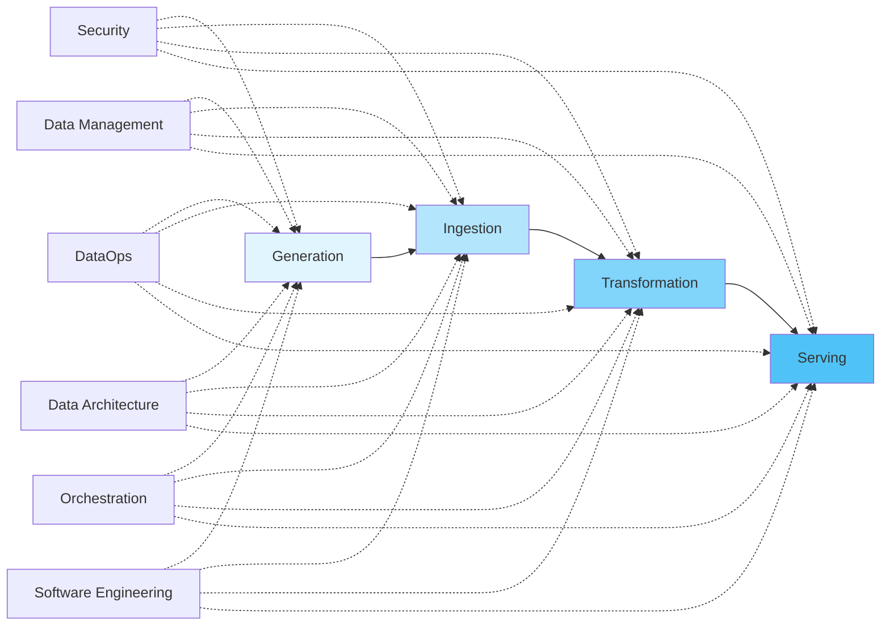

### Three Pillars of Data Systems (Kleppmann)

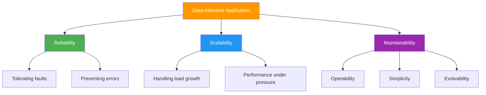

---

## 📖 Source Book Summaries

### 1. Fundamentals of Data Engineering (Reis & Housley)
- **Focus:** Practical, lifecycle-centric view of data engineering
- **Key contribution:** The Data Engineering Lifecycle framework, Undercurrents concept
- **Best for:** Understanding the "what" and "why" of each stage

### 2. Designing Data-Intensive Applications (Kleppmann)
- **Focus:** Deep CS fundamentals — distributed systems, storage engines, consistency
- **Key contribution:** Rigorous treatment of replication, partitioning, transactions, stream processing
- **Best for:** Understanding the "how" at a systems level

### 3. System Design For Data Engineers (Abhishek Kumar)
- **Focus:** Interview-ready system design patterns for DE
- **Key contribution:** Real-world case studies, framework for answering interview questions
- **Best for:** Structuring your answers and end-to-end design thinking

---

# Chapter 1: Foundations of Data Engineering System Design

> **Sources:** Fundamentals of Data Engineering (Ch 1-3), DDIA (Ch 1), System Design for DE (Ch 1-2)


---

## 1.1 What is Data Engineering?

**Definition (Reis & Housley):**
> *Data engineering is the development, implementation, and maintenance of systems and processes that take in raw data and produce high-quality, consistent information that supports downstream use cases such as analysis and machine learning.*

### Data Engineer's Role in the Ecosystem

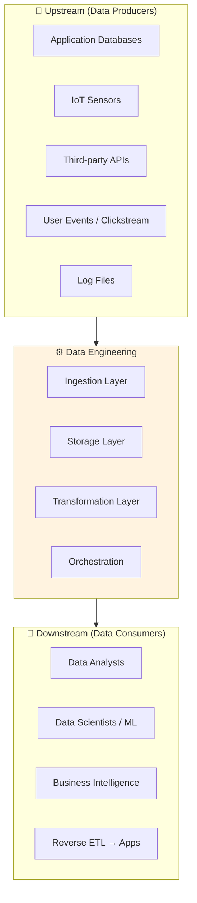

### Data Engineer vs Related Roles

| Dimension | Data Engineer | Software Engineer | Data Scientist | Analytics Engineer |
|-----------|--------------|-------------------|----------------|-------------------|
| **Primary focus** | Data pipelines & infrastructure | Application logic | Models & experiments | Data transformation & BI |
| **Key tools** | Spark, Airflow, Kafka, SQL | REST APIs, microservices | Python, R, Jupyter | dbt, SQL, Looker |
| **Output** | Reliable data systems | Working software | Insights & models | Clean data models |
| **Data interaction** | Move, store, transform at scale | Generate & consume | Analyze & model | Model & document |

---

## 1.2 The Data Engineering Lifecycle

This is the **central framework** from Reis & Housley. Every system design should map to these stages.

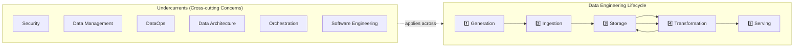

### Stage 1: Generation

**What happens:** Data is created at source systems — databases, APIs, IoT devices, applications.

**Key considerations:**
- **Schema:** Is the schema well-defined (relational DB) or schema-less (NoSQL, logs)?
- **Volume & velocity:** How much data? How frequently generated?
- **Data format:** Structured (SQL), semi-structured (JSON, Avro), unstructured (images, video)?
- **Ownership:** Who owns the source system? What SLAs do they offer?

**Example source systems:**

| Source Type | Example | Format | Velocity |
|-------------|---------|--------|----------|
| OLTP Database | PostgreSQL orders table | Structured (rows) | Medium |
| Event stream | Clickstream from web app | Semi-structured (JSON) | High |
| Third-party API | Stripe payments API | Semi-structured (JSON) | Low-Medium |
| File drop | CSV from vendor SFTP | Structured (CSV) | Low (daily batch) |
| IoT sensors | Temperature readings | Structured (time-series) | Very High |

### Stage 2: Ingestion

**What happens:** Data moves from source systems into the data engineering ecosystem.

**Key patterns:**

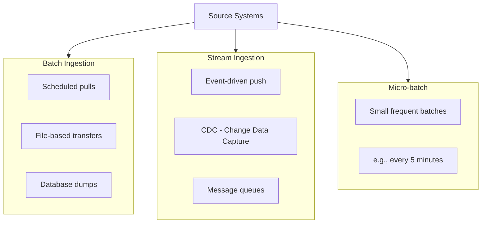

**Batch vs Streaming Decision Matrix:**

| Factor | Choose Batch | Choose Streaming |
|--------|-------------|-----------------|
| Latency requirement | Hours/daily acceptable | Seconds/minutes needed |
| Data volume per event | Large bulk loads | Small individual events |
| Complexity tolerance | Lower | Higher |
| Cost | Generally cheaper | More expensive infra |
| Use case | Reporting, analytics | Fraud detection, real-time dashboards |

### Stage 3: Storage

**What happens:** Data is persisted for processing and serving.

**Key storage abstractions:**

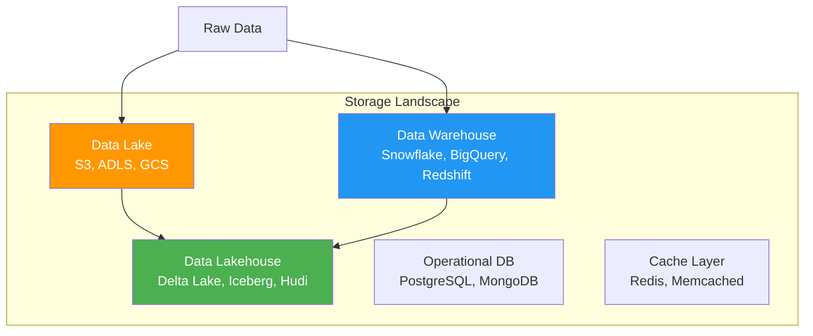

> **Deep dive in [Chapter 2](#chapter-2-data-storage-systems--data-modeling)**

### Stage 4: Transformation

**What happens:** Raw data is cleaned, enriched, aggregated, and modeled for downstream use.

**Transformation patterns:**

| Pattern | Description | Tool Examples |
|---------|-------------|---------------|
| **ELT** | Extract → Load (raw) → Transform in warehouse | dbt + Snowflake |
| **ETL** | Extract → Transform before loading → Load clean data | Spark, Informatica |
| **EtLT** | Light transform → Load → Heavy transform | Fivetran + dbt |

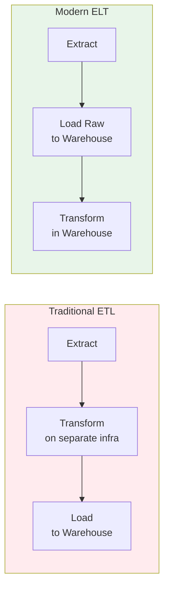

### Stage 5: Serving

**What happens:** Transformed data is made available to consumers.

**Serving patterns:**
- **Analytics/BI:** Dashboards (Tableau, Power BI, Looker)
- **Machine Learning:** Feature stores, training datasets
- **Reverse ETL:** Push data back to operational systems (Salesforce, Marketo)
- **Data APIs:** Expose data via REST/GraphQL endpoints
- **Data Sharing:** Cross-organization data products

---

## 1.3 The Undercurrents (Cross-cutting Concerns)

These six concerns apply **across all lifecycle stages** — they are not stages themselves but pervasive requirements.

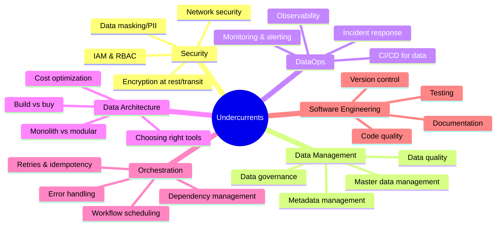

### Security Undercurrent — Key Principles

| Principle | Description | Example |
|-----------|-------------|---------|
| **Least privilege** | Grant minimum necessary access | Read-only roles for analysts |
| **Defense in depth** | Multiple security layers | VPC + IAM + encryption + audit logs |
| **Encryption** | Protect data at rest and in transit | AES-256 at rest, TLS in transit |
| **Audit logging** | Track who accessed what and when | CloudTrail, audit tables |
| **Data classification** | Label data by sensitivity | PII, PHI, public, internal |

### DataOps Undercurrent

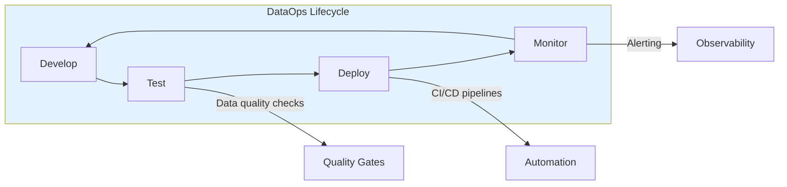

---

## 1.4 Architecture Principles for Data Systems

### Kleppmann's Three Core Properties

From *DDIA Chapter 1* — every data system must balance:

#### 1. Reliability
> *The system continues to work correctly even when things go wrong.*

**Types of faults:**
- **Hardware faults:** Disk failure, power outage, network partition
- **Software faults:** Bugs, resource exhaustion, cascading failures
- **Human faults:** Configuration errors, bad deployments

**Strategies:**
```
Hardware faults   → Redundancy (RAID, multi-AZ, replicas)
Software faults   → Testing, monitoring, graceful degradation
Human faults      → Good abstractions, sandboxing, rollback capability
```

#### 2. Scalability
> *The system can handle growth in data volume, traffic, or complexity.*

**Key concepts:**

| Concept | Definition | Example |
|---------|-----------|---------|
| **Load parameters** | Numbers that describe current load | Requests/sec, write/read ratio, data size |
| **Vertical scaling** | Bigger machine | 64 → 256 GB RAM |
| **Horizontal scaling** | More machines | 1 → 10 nodes |
| **Elasticity** | Auto-scale with load | Kubernetes HPA, Spark dynamic allocation |

**Describing performance:**
- **Throughput:** Records processed per second (batch systems)
- **Latency vs Response time:** Latency = waiting time; Response time = total time including processing
- **Percentiles:** p50 (median), p95, p99 — more useful than averages

```
Example:
 If p99 response time = 1.5s
 → 99% of requests complete within 1.5 seconds
 → 1% of requests take longer (tail latency)
 
 Why percentiles matter:
 → Averages hide outliers
 → High percentiles affect your most valuable users (Amazon found every 100ms of latency = 1% revenue loss)
```

#### 3. Maintainability
> *Different people can work on the system productively over time.*

Three design principles:
- **Operability:** Easy for ops teams to monitor and manage
- **Simplicity:** Remove accidental complexity (use good abstractions)
- **Evolvability:** Easy to make changes (schema evolution, modular design)

---

## 1.5 Good Architecture Principles (Reis & Housley)

### Principle 1: Choose Common Components Wisely

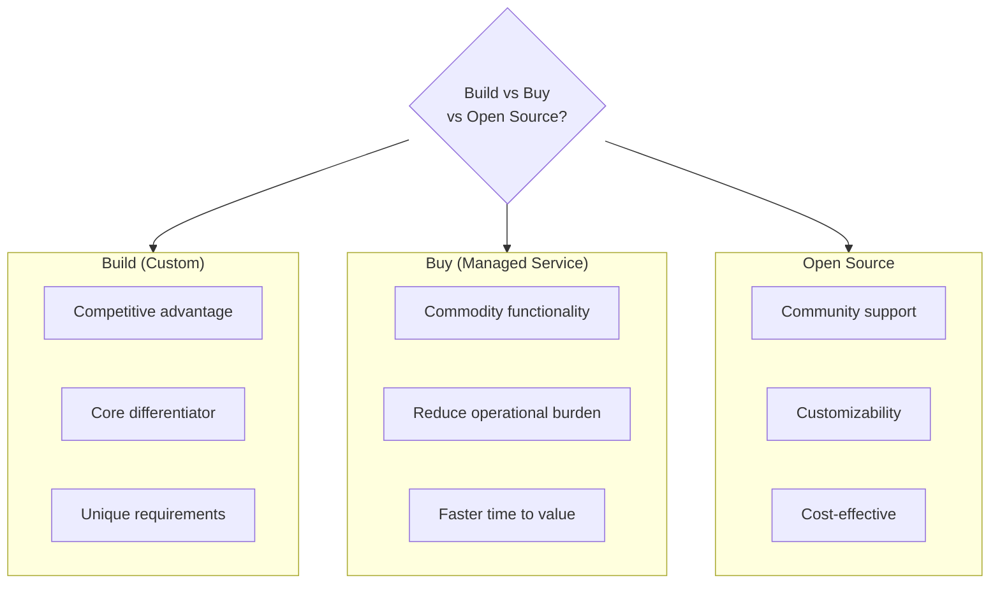

### Principle 2: Plan for Failure

**Design for failure at every layer:**

| Layer | Failure Mode | Mitigation |
|-------|-------------|------------|
| Network | Partition, latency spike | Retry with backoff, circuit breakers |
| Storage | Disk failure, corruption | Replication, checksums, backups |
| Compute | Node crash, OOM | Auto-restart, resource limits, health checks |
| Application | Bug, bad data | Input validation, dead-letter queues, idempotency |
| Human | Misconfiguration | IaC, code review, staging environments |

### Principle 3: Architect for Scalability

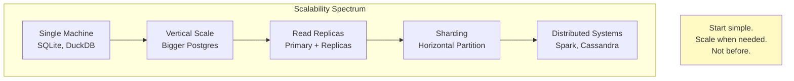

### Principle 4: Loose Coupling

**Tightly coupled vs Loosely coupled:**

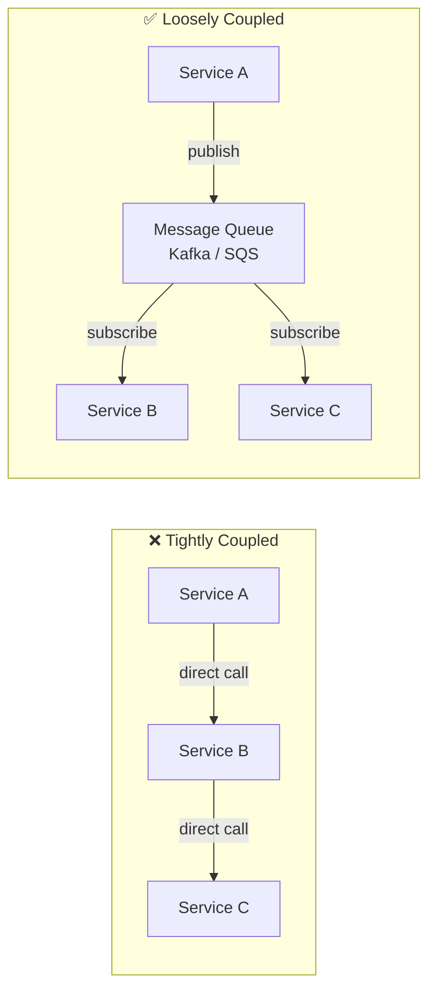

**Benefits of loose coupling:**
- Services can fail independently
- Easy to add new consumers
- Enables schema evolution
- Better testability

### Principle 5: Make Reversible Decisions

> *"Prefer two-way door decisions over one-way doors."* — Jeff Bezos

| One-way door (hard to reverse) | Two-way door (easy to reverse) |
|-------------------------------|-------------------------------|
| Choosing a cloud provider | Choosing a file format |
| Selecting a data warehouse | Adding a new pipeline |
| Committing to on-prem hardware | Trying a new orchestration tool |

---

## 1.6 Data Architecture Patterns

### Lambda Architecture

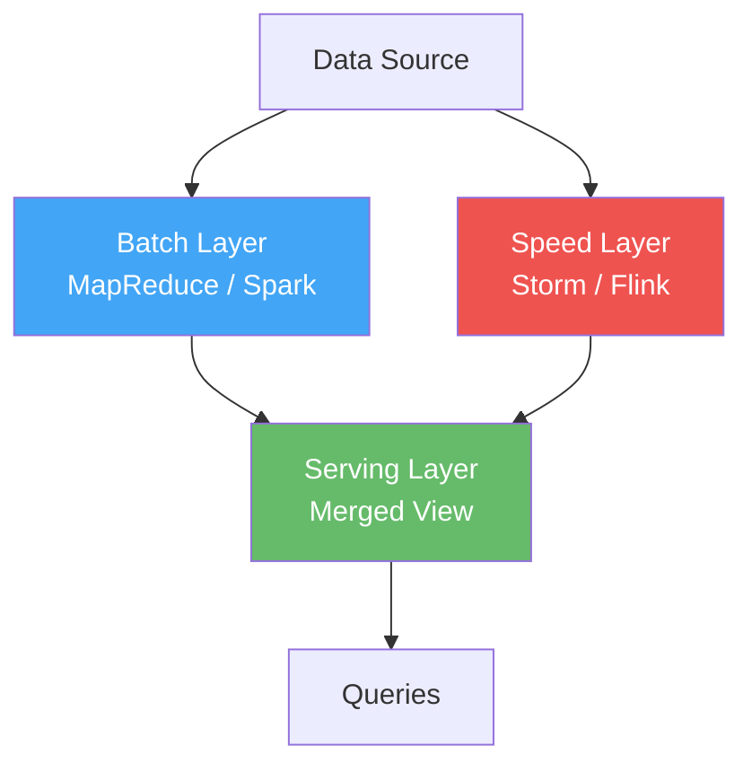

**Pros:** Handles both batch accuracy and real-time speed
**Cons:** Maintaining two codebases (batch + stream), complexity of merging

### Kappa Architecture

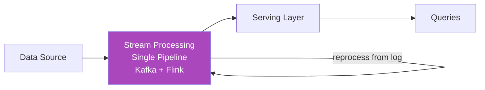

**Pros:** Single codebase, simpler operations
**Cons:** Reprocessing from log can be expensive, not all problems fit streaming

### Lambda vs Kappa Comparison

| Aspect | Lambda | Kappa |
|--------|--------|-------|
| Codebases | Two (batch + stream) | One (stream only) |
| Complexity | Higher | Lower |
| Reprocessing | Native in batch layer | Replay from log |
| Accuracy | Batch provides "truth" | Must ensure stream correctness |
| Use case | Complex analytics + real-time | Event-sourced systems |

### Data Mesh Architecture

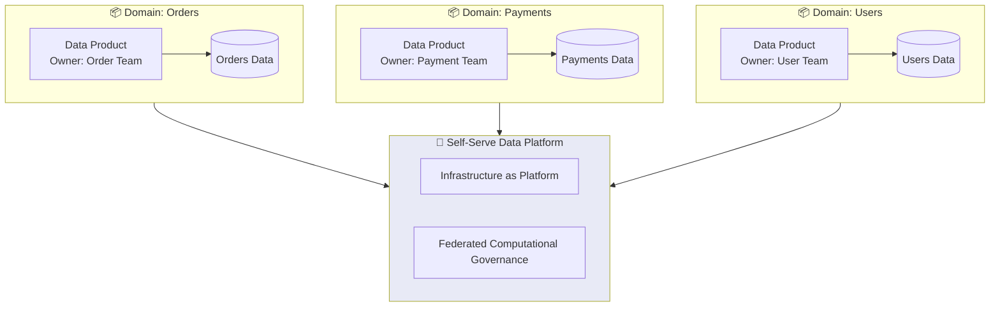

**Four principles of Data Mesh (Zhamak Dehghani):**
1. **Domain ownership:** Each domain owns its data end-to-end
2. **Data as a product:** Treat data with product-thinking (SLAs, documentation, discoverability)
3. **Self-serve data platform:** Reduce friction for domain teams
4. **Federated computational governance:** Standards enforced by automation, not gatekeeping

---

## 1.7 Choosing the Right Technology

### Technology Selection Framework

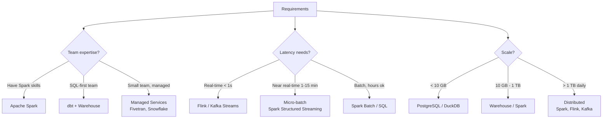

### The Technology Radar for Data Engineering

| Category | Mature / Adopt | Growing / Trial | Emerging / Assess |
|----------|---------------|-----------------|-------------------|
| **Batch Processing** | Spark, SQL | dbt, DuckDB | Polars |
| **Stream Processing** | Kafka, Flink | Kafka Streams | RisingWave, Materialize |
| **Orchestration** | Airflow | Dagster, Prefect | Kestra, Hamilton |
| **Storage Format** | Parquet, Avro | Delta Lake, Iceberg | Hudi, Lance |
| **Warehouse** | Snowflake, BigQuery | Databricks SQL | DuckDB, ClickHouse |
| **Data Quality** | Great Expectations | Soda, dbt tests | Monte Carlo, Gable |
| **Integration** | Fivetran | Airbyte, dlt | Sling, Meltano |

---

## 1.8 Thinking in Trade-offs

### Key Trade-offs in Data Engineering

Every design decision involves trade-offs. Here are the fundamental ones:

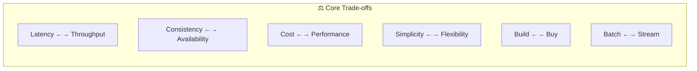

| Trade-off | Left side wins when... | Right side wins when... |
|-----------|----------------------|----------------------|
| **Latency vs Throughput** | Real-time fraud detection | Nightly data warehouse refresh |
| **Consistency vs Availability** | Financial transactions | Social media feed |
| **Cost vs Performance** | Startup with limited budget | Revenue-critical SLA |
| **Simplicity vs Flexibility** | Small team, clear requirements | Complex, evolving use cases |
| **Build vs Buy** | Core competitive advantage | Commodity infrastructure |

---

## 1.9 Cross / Interview Questions

### Conceptual Questions

**Q1: What is the difference between a Data Engineer and a Data Architect?**
> A Data Engineer builds and maintains data pipelines and infrastructure. A Data Architect designs the overall data strategy, defines standards, and selects technologies. Think of it as: Architect designs the blueprint; Engineer builds the house.

**Q2: Explain the Data Engineering Lifecycle.**
> Generation → Ingestion → Storage → Transformation → Serving, with undercurrents (Security, Data Management, DataOps, Architecture, Orchestration, Software Engineering) cutting across all stages.

**Q3: When would you choose Lambda over Kappa architecture?**
> Lambda when you need both batch-accurate historical analysis and real-time speed layer, and you have resources to maintain two codebases. Kappa when the entire pipeline can be modeled as streaming and you want operational simplicity.

**Q4: What does "plan for failure" mean in practice?**
> Design every component assuming it will fail: use retries with exponential backoff, dead-letter queues for bad messages, idempotent operations, data replication, automated alerting, and rollback procedures.

**Q5: How do you decide between batch and streaming ingestion?**
> Consider: (1) Latency requirements — if minutes matter, stream; if hours/days are fine, batch. (2) Source system capabilities — does it support CDC or event emission? (3) Cost — streaming infra is more expensive. (4) Complexity tolerance — streaming adds operational complexity. (5) Downstream needs — does the consumer need real-time data?

### Scenario-based Questions

**Q6: Your company is a startup with 3 data engineers. You need to build a data platform from scratch. What would you choose and why?**
> Start simple: Managed services (e.g., Fivetran for ingestion, Snowflake for warehouse, dbt for transformation, Airflow on Astronomer for orchestration). Avoid building custom infra. Prioritize time-to-value over perfect architecture. Use ELT pattern since the warehouse can handle transformations.

**Q7: You're evaluating whether to adopt Data Mesh. What factors would you consider?**
> (1) Organization size — Data Mesh suits large orgs with distinct domains. (2) Current pain points — Is the central data team a bottleneck? (3) Domain maturity — Can domains own their data end-to-end? (4) Platform readiness — Is there a self-serve platform? (5) Cultural readiness — Are teams willing to take ownership? For small companies, a centralized approach is usually better.

---

## 1.10 Key Takeaways

```
✅ Data engineering is about building reliable systems that produce high-quality data
✅ The lifecycle (Generation → Ingestion → Storage → Transformation → Serving) is the central framework
✅ Undercurrents (Security, DataOps, etc.) are equally important as the lifecycle stages
✅ Every design is a set of trade-offs — there are no universally "best" solutions
✅ Reliability, Scalability, and Maintainability are the three pillars (Kleppmann)
✅ Start simple, scale when needed — avoid premature optimization
✅ Loose coupling + reversible decisions = adaptable architecture
```

---

# Chapter 2: Data Storage Systems & Data Modeling

> **Sources:** Fundamentals of Data Engineering (Ch 6-8), DDIA (Ch 2-3, 5-6), System Design for DE (Ch 3-4)


---

## 2.1 Storage Abstractions Overview

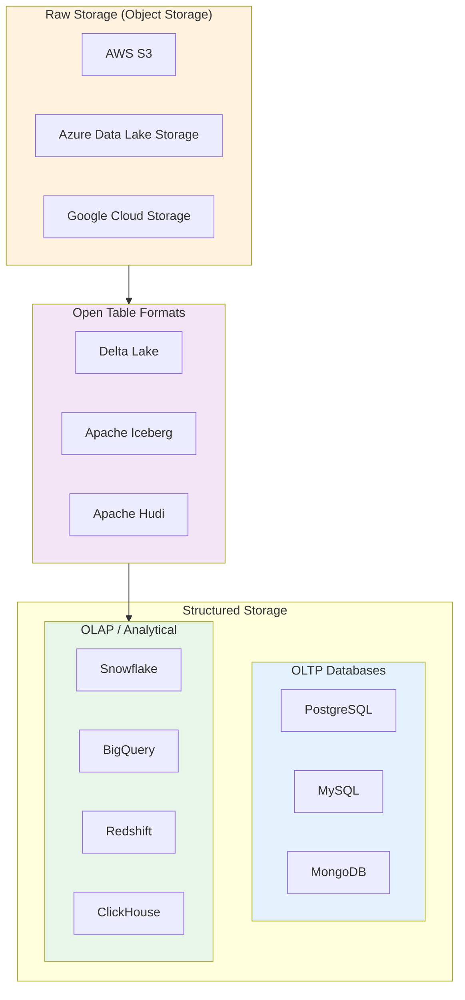

---

## 2.2 OLTP vs OLAP Systems

### Fundamental Differences

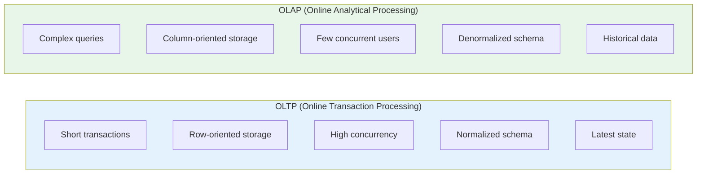

| Property | OLTP | OLAP |
|----------|------|------|
| **Primary use** | Serve application requests | Analyze business data |
| **Read pattern** | Small number of records by key | Aggregate over many records |
| **Write pattern** | Random-access, low-latency | Bulk import or event stream |
| **Users** | End users via web apps | Analysts, data scientists |
| **Data size** | GB to low TB | TB to PB |
| **Schema** | Highly normalized (3NF) | Star/Snowflake schema |
| **Storage layout** | Row-oriented | Column-oriented |
| **Examples** | PostgreSQL, MySQL, Oracle | Snowflake, BigQuery, Redshift |
| **Bottleneck** | Disk seek time | Disk bandwidth (scan throughput) |

### Row-Oriented vs Column-Oriented Storage (Kleppmann Ch 3)

```
Row-oriented (OLTP):
┌────────────────────────────────────────────┐
│ Row 1: id=1, name="Alice", age=30, city="NY"  │
│ Row 2: id=2, name="Bob",   age=25, city="SF"  │
│ Row 3: id=3, name="Carol", age=35, city="LA"  │
└────────────────────────────────────────────┘
→ Great for: SELECT * FROM users WHERE id = 1
→ Reads entire row at once

Column-oriented (OLAP):
┌─────────────┬─────────────────────┬──────────────┬─────────────────┐
│ id: 1,2,3   │ name: Alice,Bob,Carol│ age: 30,25,35│ city: NY,SF,LA  │
└─────────────┴─────────────────────┴──────────────┴─────────────────┘
→ Great for: SELECT AVG(age) FROM users
→ Only reads the "age" column, skips everything else
→ Better compression (similar values together)
```

**Why column-oriented is better for analytics:**
1. **Only reads needed columns** — Query on 4 of 100 columns? Only scan 4% of data
2. **Better compression** — Similar values compress well (dictionary encoding, run-length encoding, bitmap encoding)
3. **Vectorized processing** — CPU can process chunks of same-type data using SIMD instructions
4. **Sort order optimization** — Sorted columns enable range scans and better compression

### Column Compression Techniques (Kleppmann)

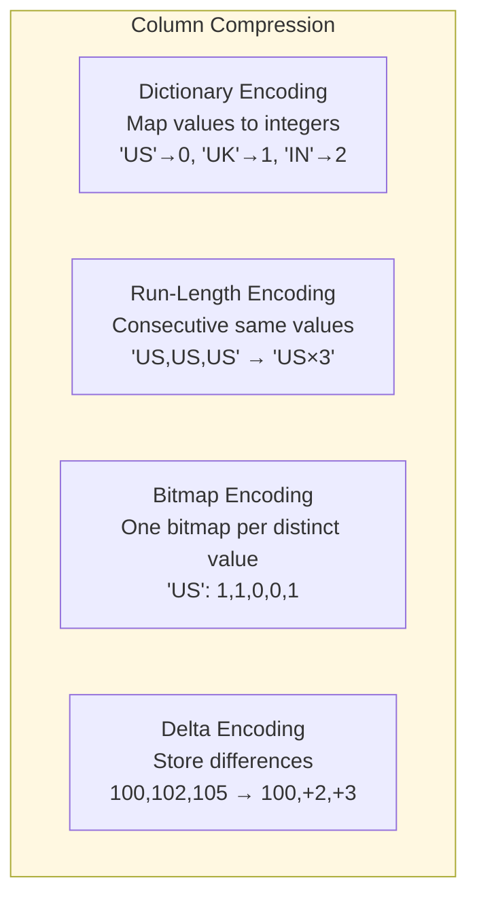

---

## 2.3 Data Warehouse Architecture

### Traditional Data Warehouse (Kimball vs Inmon)

```mermaid
flowchart LR
   subgraph Kimball ["Kimball: Bottom-Up"]
       direction TB
       K1["Source Systems"]
       K2["ETL Process"]
       K3["Dimensional Data Marts<br/>(Star Schemas)"]
       K4["Enterprise DW<br/>(Bus Architecture)"]
       K1 --> K2 --> K3 --> K4
   end
   
   subgraph Inmon ["Inmon: Top-Down"]
       direction TB
       I1["Source Systems"]
       I2["ETL Process"]
       I3["Enterprise DW<br/>(3NF Normalized)"]
       I4["Departmental<br/>Data Marts"]
       I1 --> I2 --> I3 --> I4
   end
   
   style Kimball fill:#e8f5e9
   style Inmon fill:#e3f2fd
```

| Aspect | Kimball (Bottom-Up) | Inmon (Top-Down) |
|--------|-------------------|-----------------|
| **Approach** | Build data marts first, integrate later | Build centralized DW first, then marts |
| **Schema** | Dimensional (Star/Snowflake) | Normalized (3NF) |
| **Speed to value** | Faster — one mart at a time | Slower — need full model upfront |
| **Complexity** | Simpler per mart | Complex centralized model |
| **Redundancy** | Some data duplication across marts | Minimal redundancy |
| **Best for** | Agile teams, BI-focused | Large enterprises, regulatory needs |

### Modern Cloud Data Warehouse Architecture

```mermaid
flowchart TB
   subgraph Sources ["Data Sources"]
       S1[Databases]
       S2[APIs]
       S3[Files]
       S4[Events]
   end
   
   subgraph Ingestion ["Ingestion Layer"]
       FT[Fivetran / Airbyte]
       CDC[Debezium CDC]
       KAFKA[Kafka]
   end
   
   subgraph Storage_Compute ["Separation of Storage & Compute"]
       subgraph Storage ["☁️ Storage (Cheap, Durable)"]
           OBJ[(Object Storage<br/>S3 / ADLS / GCS)]
       end
       subgraph Compute ["⚡ Compute (Elastic, On-demand)"]
           WH1[Warehouse Cluster 1<br/>ETL Workload]
           WH2[Warehouse Cluster 2<br/>BI Queries]
           WH3[Warehouse Cluster 3<br/>Data Science]
       end
   end
   
   subgraph Serving ["Serving Layer"]
       BI[Tableau / Looker]
       ML[ML Platform]
       API[Data APIs]
   end
   
   Sources --> Ingestion --> Storage
   Storage --> Compute --> Serving
   
   style Storage fill:#fff3e0
   style Compute fill:#e8eaf6
```

**Key principle:** **Separation of storage and compute** — This is the defining innovation of modern warehouses (Snowflake, BigQuery, Databricks). You can scale compute independently of storage.

### Snowflake Architecture Deep Dive

```mermaid
flowchart TB
   subgraph Cloud ["Cloud Services Layer"]
       AUTH[Authentication]
       META[Metadata Manager]
       OPT[Query Optimizer]
       SEC[Security]
   end
   
   subgraph Compute ["Virtual Warehouses (Compute)"]
       VW1["XS Warehouse<br/>BI Dashboards"]
       VW2["M Warehouse<br/>ETL Jobs"]
       VW3["XL Warehouse<br/>Data Science"]
   end
   
   subgraph Storage ["Centralized Storage"]
       MICRO["Micro-partitions<br/>(Columnar, Compressed)"]
   end
   
   Cloud --> Compute --> Storage
   
   style Cloud fill:#bbdefb
   style Compute fill:#c8e6c9
   style Storage fill:#fff9c4
```

**Snowflake Key Concepts:**
- **Micro-partitions:** 50-500MB compressed, columnar, immutable files
- **Clustering keys:** Control how data is co-located in micro-partitions
- **Zero-copy cloning:** Create copies without duplicating data
- **Time travel:** Query historical data (up to 90 days)
- **Virtual warehouses:** Independent compute clusters (XS to 6XL)

---

## 2.4 Data Lake

### What is a Data Lake?

> *A data lake is a centralized repository that stores data in its raw, native format — structured, semi-structured, and unstructured — at any scale.*

```mermaid
flowchart TB
   subgraph DataLake ["Data Lake Zones"]
       direction LR
       RAW["🟥 Raw / Landing Zone<br/>Untouched source data<br/>Format: as-is"]
       CLEAN["🟨 Cleaned / Curated Zone<br/>Validated, deduplicated<br/>Format: Parquet"]
       ENRICHED["🟩 Enriched / Consumption Zone<br/>Business-ready, aggregated<br/>Format: Parquet/Delta"]
   end
   
   SOURCE[Source Data] --> RAW --> CLEAN --> ENRICHED --> CONSUMERS[Consumers]
   
   style RAW fill:#ffcdd2
   style CLEAN fill:#fff9c4
   style ENRICHED fill:#c8e6c9
```

### Data Lake vs Data Warehouse

| Property | Data Lake | Data Warehouse |
|----------|-----------|---------------|
| **Data format** | Raw (any format) | Processed (structured) |
| **Schema** | Schema-on-read | Schema-on-write |
| **Data types** | All (structured, semi, unstructured) | Structured only |
| **Users** | Data scientists, engineers | Business analysts |
| **Cost** | Cheap storage (object storage) | Expensive compute |
| **Processing** | Spark, Presto, Hive | SQL-native |
| **Governance** | Historically weak | Strong |
| **Risk** | Data swamp if unmanaged | Rigid, slow to evolve |

### The Data Swamp Problem

```mermaid
flowchart LR
   DL[Data Lake] -->|No governance| DS[Data Swamp]
   
   DS --> P1["❌ No metadata"]
   DS --> P2["❌ No data quality"]
   DS --> P3["❌ No ownership"]
   DS --> P4["❌ Stale, unused data"]
   DS --> P5["❌ No discoverability"]
   
   DL -->|With governance| DP[Data Platform]
   DP --> G1["✅ Cataloged"]
   DP --> G2["✅ Quality checks"]
   DP --> G3["✅ Clear ownership"]
   DP --> G4["✅ Lifecycle policies"]
   DP --> G5["✅ Self-service"]
```

---

## 2.5 Data Lakehouse

### The Best of Both Worlds

```mermaid
flowchart TB
   subgraph Evolution ["Storage Evolution"]
       direction LR
       DW["Data Warehouse<br/>✅ ACID, Schema<br/>❌ Expensive, Structured only"]
       DL["Data Lake<br/>✅ Cheap, All formats<br/>❌ No ACID, Data swamp"]
       LH["Data Lakehouse<br/>✅ ACID + Cheap storage<br/>✅ All formats + Schema enforcement"]
   end
   
   DW --> LH
   DL --> LH
   
   style LH fill:#4caf50,color:#fff
```

### Open Table Formats Comparison

| Feature | Delta Lake | Apache Iceberg | Apache Hudi |
|---------|-----------|----------------|-------------|
| **Created by** | Databricks | Netflix | Uber |
| **ACID transactions** | ✅ | ✅ | ✅ |
| **Time travel** | ✅ | ✅ | ✅ |
| **Schema evolution** | ✅ | ✅ (best) | ✅ |
| **Partition evolution** | ❌ (fixed) | ✅ (hidden partitions) | ❌ |
| **Storage format** | Parquet | Parquet, ORC, Avro | Parquet, HFile |
| **Merge-on-read** | ✅ | ✅ | ✅ (primary design) |
| **Copy-on-write** | ✅ (default) | ✅ | ✅ |
| **Engine support** | Spark, Flink, Presto, Trino | Spark, Flink, Presto, Trino | Spark, Flink, Presto |
| **Ecosystem** | Databricks-centric | Vendor-neutral | Uber-originated |
| **Catalog** | Unity Catalog | REST Catalog, HMS, Polaris | HMS |

### How Delta Lake Works

```mermaid
flowchart TB
   subgraph DeltaTable ["Delta Table"]
       direction TB
       TL["Transaction Log<br/>(_delta_log/)<br/>JSON commit files"]
       subgraph DataFiles ["Data Files (Parquet)"]
           P1["part-00000.parquet"]
           P2["part-00001.parquet"]
           P3["part-00002.parquet"]
       end
   end
   
   TL -->|"tracks which files<br/>are active"| DataFiles
   
   subgraph Operations ["Operations"]
       W["Write"] -->|"adds new parquet +<br/>new commit entry"| TL
       D["Delete"] -->|"marks files as removed<br/>in commit entry"| TL
       U["Update"] -->|"delete old + add new<br/>files atomically"| TL
   end
   
   style TL fill:#bbdefb
   style DataFiles fill:#c8e6c9
```

**Key Delta Lake Concepts:**
- **Transaction log:** `_delta_log/` directory with JSON files recording every change
- **Optimistic concurrency:** Multiple writers can write; conflicts resolved at commit time
- **VACUUM:** Physically remove old files no longer referenced by any active version
- **Z-ORDER:** Multi-dimensional clustering for better data skipping
- **OPTIMIZE:** Compacts small files into larger ones

### How Apache Iceberg Works

```mermaid
flowchart TB
   subgraph Catalog ["Catalog (REST/HMS/Polaris)"]
       CAT["Points to current<br/>metadata file"]
   end
   
   subgraph Metadata ["Metadata Layer"]
       MF["Metadata File<br/>(JSON)"]
       ML["Manifest List<br/>(Avro)"]
       M1["Manifest 1<br/>(Avro)"]
       M2["Manifest 2<br/>(Avro)"]
   end
   
   subgraph Data ["Data Layer"]
       D1["data-001.parquet"]
       D2["data-002.parquet"]
       D3["data-003.parquet"]
       D4["data-004.parquet"]
   end
   
   CAT --> MF --> ML
   ML --> M1 --> D1 & D2
   ML --> M2 --> D3 & D4
   
   style Catalog fill:#e1bee7
   style Metadata fill:#bbdefb
   style Data fill:#c8e6c9
```

**Iceberg Advantages:**
- **Hidden partitioning:** Partition spec is metadata, not directory structure. Users don't need to know partition columns
- **Partition evolution:** Change partitioning scheme without rewriting data
- **Schema evolution:** Add, drop, rename, reorder columns safely
- **Snapshot isolation:** Readers and writers don't interfere

---

## 2.6 File Formats for Data Engineering

### Comparison Table

| Format | Type | Compression | Schema | Splittable | Use Case |
|--------|------|-------------|--------|-----------|----------|
| **CSV** | Row | None/gzip | None | Yes (uncompressed) | Simple exchange, legacy |
| **JSON** | Row | None/gzip | Self-describing | Yes (JSON Lines) | APIs, logs, semi-structured |
| **Avro** | Row | Snappy, Deflate | Embedded | Yes | Kafka, schema evolution |
| **Parquet** | Columnar | Snappy, ZSTD, gzip | Embedded | Yes | Analytics, data lake |
| **ORC** | Columnar | ZLIB, Snappy, LZO | Embedded | Yes | Hive ecosystem |
| **Arrow** | Columnar (in-memory) | None | Embedded | N/A | Inter-process data exchange |

### When to Use What

```mermaid
flowchart TB
   Q{What's your use case?}
   Q -->|"Analytics / OLAP queries"| PARQUET["Use Parquet<br/>Best compression + column pruning"]
   Q -->|"Message serialization<br/>(Kafka, events)"| AVRO["Use Avro<br/>Row-based, schema evolution"]
   Q -->|"Hive ecosystem"| ORC["Use ORC<br/>Optimized for Hive"]
   Q -->|"In-memory processing<br/>between engines"| ARROW["Use Arrow<br/>Zero-copy, columnar in-memory"]
   Q -->|"Simple data exchange"| CSV["Use CSV/JSON<br/>Human-readable, universal"]
   
   style PARQUET fill:#4caf50,color:#fff
   style AVRO fill:#2196f3,color:#fff
```

### Parquet Deep Dive

```
Parquet File Structure:
┌──────────────────────────────────┐
│          Row Group 1              │
│  ┌────────┬────────┬────────┐    │
│  │Col A   │Col B   │Col C   │    │
│  │Chunk   │Chunk   │Chunk   │    │
│  │(pages) │(pages) │(pages) │    │
│  └────────┴────────┴────────┘    │
├──────────────────────────────────┤
│          Row Group 2              │
│  ┌────────┬────────┬────────┐    │
│  │Col A   │Col B   │Col C   │    │
│  │Chunk   │Chunk   │Chunk   │    │
│  └────────┴────────┴────────┘    │
├──────────────────────────────────┤
│           Footer                  │
│  (Schema, Row Group metadata,    │
│   Column chunk offsets,          │
│   Min/Max statistics)            │
└──────────────────────────────────┘
```

**Why Parquet is king for analytics:**
1. **Column pruning:** Only read columns you need
2. **Predicate pushdown:** Use footer min/max stats to skip row groups
3. **Excellent compression:** Similar data in columns compresses well
4. **Nested data support:** Dremel encoding for complex types
5. **Ecosystem support:** Spark, Hive, Presto, DuckDB, Pandas, Polars

---

## 2.7 Data Modeling for Analytics

### Star Schema (Kimball)

```mermaid
erDiagram
   FACT_SALES {
       int sale_id PK
       int date_key FK
       int product_key FK
       int store_key FK
       int customer_key FK
       decimal quantity
       decimal revenue
       decimal discount
   }
   
   DIM_DATE {
       int date_key PK
       date full_date
       int year
       int quarter
       int month
       string day_of_week
       boolean is_holiday
   }
   
   DIM_PRODUCT {
       int product_key PK
       string product_name
       string category
       string brand
       decimal unit_price
   }
   
   DIM_STORE {
       int store_key PK
       string store_name
       string city
       string state
       string region
   }
   
   DIM_CUSTOMER {
       int customer_key PK
       string customer_name
       string segment
       string tier
   }
   
   FACT_SALES ||--o{ DIM_DATE : "date_key"
   FACT_SALES ||--o{ DIM_PRODUCT : "product_key"
   FACT_SALES ||--o{ DIM_STORE : "store_key"
   FACT_SALES ||--o{ DIM_CUSTOMER : "customer_key"
```

**Star Schema Principles:**
- **Fact table:** Contains measurable, quantitative data (metrics/measures)
- **Dimension tables:** Contain descriptive attributes (who, what, when, where)
- **Surrogate keys:** Use integer keys (not natural keys) in dimensions
- **Grain:** The most atomic level of data in the fact table (one row = one sale)

### Snowflake Schema

```mermaid
erDiagram
   FACT_SALES {
       int sale_id PK
       int product_key FK
       decimal revenue
   }
   
   DIM_PRODUCT {
       int product_key PK
       string product_name
       int category_key FK
   }
   
   DIM_CATEGORY {
       int category_key PK
       string category_name
       int department_key FK
   }
   
   DIM_DEPARTMENT {
       int department_key PK
       string department_name
   }
   
   FACT_SALES ||--o{ DIM_PRODUCT : "product_key"
   DIM_PRODUCT ||--o{ DIM_CATEGORY : "category_key"
   DIM_CATEGORY ||--o{ DIM_DEPARTMENT : "department_key"
```

| Aspect | Star Schema | Snowflake Schema |
|--------|------------|-----------------|
| **Normalization** | Denormalized dimensions | Normalized dimensions |
| **Query complexity** | Simpler (fewer joins) | More joins needed |
| **Query performance** | Faster | Slower (more joins) |
| **Storage** | More redundancy | Less redundancy |
| **Maintenance** | Easier | Harder |
| **When to use** | Most analytics (default choice) | Very large dimensions, strict normalization needs |

### Slowly Changing Dimensions (SCD)

```mermaid
flowchart TB
   SCD{SCD Types}
   SCD --> T0["Type 0: Retain Original<br/>Never update dimension<br/>e.g., Original credit score"]
   SCD --> T1["Type 1: Overwrite<br/>Replace old value<br/>e.g., Fix typo in name"]
   SCD --> T2["Type 2: Add New Row<br/>Track history with<br/>effective dates<br/>e.g., Address changes"]
   SCD --> T3["Type 3: Add New Column<br/>Previous + Current value<br/>e.g., Previous/Current region"]
   SCD --> T6["Type 6: Hybrid (1+2+3)<br/>Combines approaches"]
   
   style T2 fill:#4caf50,color:#fff
```

**SCD Type 2 Example:**

| customer_key | customer_id | name | city | effective_from | effective_to | is_current |
|-------------|------------|------|------|---------------|-------------|-----------|
| 1001 | C100 | Alice | New York | 2023-01-01 | 2024-03-15 | N |
| 1002 | C100 | Alice | San Francisco | 2024-03-15 | 9999-12-31 | Y |

> Alice moved from New York to San Francisco. Both records are kept — enabling historical analysis.

### Data Vault Modeling

```mermaid
erDiagram
   HUB_CUSTOMER {
       string hub_customer_hk PK
       string customer_bk
       datetime load_date
       string record_source
   }
   
   HUB_ORDER {
       string hub_order_hk PK
       string order_bk
       datetime load_date
       string record_source
   }
   
   LINK_CUSTOMER_ORDER {
       string link_co_hk PK
       string hub_customer_hk FK
       string hub_order_hk FK
       datetime load_date
       string record_source
   }
   
   SAT_CUSTOMER {
       string hub_customer_hk FK
       datetime load_date PK
       string name
       string email
       string city
       string hash_diff
       string record_source
   }
   
   SAT_ORDER {
       string hub_order_hk FK
       datetime load_date PK
       decimal amount
       string status
       string hash_diff
       string record_source
   }
   
   HUB_CUSTOMER ||--o{ LINK_CUSTOMER_ORDER : ""
   HUB_ORDER ||--o{ LINK_CUSTOMER_ORDER : ""
   HUB_CUSTOMER ||--o{ SAT_CUSTOMER : ""
   HUB_ORDER ||--o{ SAT_ORDER : ""
```

**Data Vault Components:**
- **Hub:** Business keys (unique identifiers) — e.g., customer ID, order ID
- **Link:** Relationships between hubs — e.g., customer-order relationship
- **Satellite:** Descriptive attributes with full history — e.g., customer details over time

| Aspect | Star Schema | Data Vault |
|--------|------------|-----------|
| **Purpose** | Reporting/BI | Raw data integration |
| **Agility** | Schema changes are expensive | Easily add new sources |
| **History** | SCD (Types 1-6) | Full history by default |
| **Auditability** | Limited | Full audit trail |
| **Complexity** | Simple | More complex (3 entity types) |
| **Best layer** | Presentation/Serving | Raw/Integration layer |

### One Big Table (OBT) Pattern

```mermaid
flowchart LR
   subgraph Sources ["Multiple Sources"]
       T1[Users]
       T2[Orders]
       T3[Products]
       T4[Payments]
   end
   
   JOIN["Wide Join"] 
   
   subgraph OBT ["One Big Table"]
       OBT1["user_id, user_name, user_segment,<br/>order_id, order_date, order_amount,<br/>product_name, product_category,<br/>payment_method, payment_status"]
   end
   
   Sources --> JOIN --> OBT
   
   style OBT fill:#fff9c4
```

**When to use OBT:**
- Simple reporting needs with few consumers
- When query performance matters more than storage cost
- For ML feature tables
- BI tools that perform better with fewer joins

**When NOT to use:**
- When data is highly normalized and changes frequently
- When storage cost is a concern
- When multiple teams need different granularities

---

## 2.8 Storage Engines (Kleppmann Ch 3)

### Log-Structured Storage Engines

```mermaid
flowchart TB
   subgraph LSM ["LSM-Tree (Log-Structured Merge-Tree)"]
       direction TB
       MEM["Memtable<br/>(In-memory sorted tree)"]
       L0["Level 0 SSTable"]
       L1["Level 1 SSTable"]
       L2["Level 2 SSTable<br/>(larger, fewer files)"]
       
       MEM -->|"flush when full"| L0
       L0 -->|"compaction"| L1
       L1 -->|"compaction"| L2
   end
   
   WRITE["Write"] -->|"always sequential"| MEM
   READ["Read"] -->|"check memtable first,<br/>then L0, L1, L2"| MEM
   
   style MEM fill:#ffcdd2
   style L0 fill:#fff9c4
   style L1 fill:#c8e6c9
   style L2 fill:#bbdefb
```

**LSM-Tree characteristics:**
- **Write-optimized:** All writes go to memtable (sequential I/O)
- **Read overhead:** May need to check multiple levels
- **Bloom filters:** Probabilistic data structure to skip SSTables that don't contain a key
- **Compaction strategies:** Size-tiered (good for write-heavy) vs Leveled (good for read-heavy)
- **Used by:** Cassandra, HBase, RocksDB, LevelDB

### B-Tree Storage Engines

```mermaid
flowchart TB
   ROOT["Root Page<br/>ref|100|ref|300|ref"]
   
   L1A["Page<br/>ref|50|ref|80|ref"]
   L1B["Page<br/>ref|150|ref|200|ref"]
   L1C["Page<br/>ref|350|ref|400|ref"]
   
   LEAF1["Leaf: 30,40,50"]
   LEAF2["Leaf: 80,90"]
   LEAF3["Leaf: 100,120"]
   LEAF4["Leaf: 150,180"]
   
   ROOT --> L1A & L1B & L1C
   L1A --> LEAF1 & LEAF2
   L1B --> LEAF3 & LEAF4
   
   style ROOT fill:#ef5350,color:#fff
   style L1A fill:#ff9800
   style L1B fill:#ff9800
   style L1C fill:#ff9800
   style LEAF1 fill:#4caf50,color:#fff
   style LEAF2 fill:#4caf50,color:#fff
   style LEAF3 fill:#4caf50,color:#fff
   style LEAF4 fill:#4caf50,color:#fff
```

**B-Tree characteristics:**
- **Read-optimized:** O(log n) lookups via tree traversal
- **In-place updates:** Modify data where it lives on disk
- **Write-ahead log (WAL):** For crash recovery
- **Used by:** PostgreSQL, MySQL, Oracle, SQL Server

### LSM-Tree vs B-Tree

| Property | LSM-Tree | B-Tree |
|----------|---------|--------|
| **Write performance** | ✅ Excellent (sequential I/O) | ⚠️ Good (random I/O) |
| **Read performance** | ⚠️ May check multiple files | ✅ Direct path via tree |
| **Write amplification** | Compaction rewrites data | WAL + page writes |
| **Space amplification** | During compaction | Fragmentation, reserved space |
| **Compression** | Better (periodic compaction) | Worse (page-level) |
| **Predictable latency** | ❌ Compaction can cause spikes | ✅ More predictable |
| **Use case** | Write-heavy workloads | Read-heavy, transactional |

---

## 2.9 Partitioning & Bucketing

### Partitioning (Kleppmann Ch 6)

```mermaid
flowchart TB
   subgraph Partitioned ["Partitioned Table: sales"]
       direction LR
       subgraph P1 ["Partition: year=2023"]
           F1["data files for 2023"]
       end
       subgraph P2 ["Partition: year=2024"]
           F2["data files for 2024"]
       end
       subgraph P3 ["Partition: year=2025"]
           F3["data files for 2025"]
       end
   end
   
   Q["SELECT * FROM sales<br/>WHERE year = 2024"]
   Q -->|"Only scans"| P2
   
   style P2 fill:#4caf50,color:#fff
   style P1 fill:#e0e0e0
   style P3 fill:#e0e0e0
```

**Partitioning Strategies:**

| Strategy | How it works | Example | Best for |
|----------|-------------|---------|----------|
| **Range partitioning** | Divide by value ranges | Date ranges, numeric ranges | Time-series data, sequential queries |
| **Hash partitioning** | Hash of key → partition | hash(user_id) % N | Even distribution, point lookups |
| **List partitioning** | Explicit value lists | country IN ('US','UK') | Known, finite categories |
| **Composite** | Combine strategies | Range on date + Hash on user_id | Complex access patterns |

**Common pitfalls:**
- **Too many partitions:** Thousands of small files (small file problem)
- **Too few partitions:** No benefit from partition pruning
- **Data skew:** One partition much larger than others (hot partition)
- **Wrong partition key:** Queries don't align with partition boundaries

### Bucketing

```
Partitioning: Physical directory-level separation
 sales/year=2024/month=01/data.parquet
 sales/year=2024/month=02/data.parquet

Bucketing: File-level separation within partitions
 sales/year=2024/month=01/bucket_000.parquet  (user_ids hashing to bucket 0)
 sales/year=2024/month=01/bucket_001.parquet  (user_ids hashing to bucket 1)
```

**When to use bucketing:**
- Optimize shuffle-heavy joins (bucket map join in Hive/Spark)
- When you frequently join two tables on the same column
- When partition pruning alone isn't sufficient

---

## 2.10 Cross / Interview Questions

### Conceptual Questions

**Q1: Explain the difference between a data lake, data warehouse, and data lakehouse.**
> **Data Lake:** Raw storage on cheap object storage (S3/ADLS), supports all data types, schema-on-read. Risk of becoming a data swamp without governance.
> **Data Warehouse:** Structured, schema-on-write, optimized for SQL analytics. Expensive but reliable. Examples: Snowflake, BigQuery.
> **Data Lakehouse:** Combines lake's cheap storage with warehouse's ACID guarantees and schema enforcement using open table formats (Delta Lake, Iceberg). Best of both worlds.

**Q2: When would you choose Iceberg over Delta Lake?**
> Choose Iceberg when: (1) You need vendor neutrality (not locked to Databricks), (2) You need partition evolution (change partitioning without rewriting data), (3) You need better schema evolution, (4) You're using multi-engine (Spark + Flink + Trino). Choose Delta Lake when: (1) You're in the Databricks ecosystem, (2) You need mature Z-ORDER optimization, (3) You want tight Spark integration.

**Q3: Why is columnar storage better for OLAP workloads?**
> Three reasons: (1) **Column pruning** — analytical queries typically read 5-10 of 100+ columns, so you skip 90% of data. (2) **Better compression** — similar values in a column compress much better than mixed row data. (3) **Vectorized execution** — CPUs can process batches of same-type data using SIMD instructions. Row-oriented is better for OLTP where you read/write entire rows.

**Q4: What is a slowly changing dimension? When would you use Type 2?**
> An SCD tracks how dimension attributes change over time. Type 2 adds a new row for each change with effective dates, preserving full history. Use Type 2 when: you need historical analysis (e.g., "what was the customer's region when they placed this order?"), for regulatory/audit requirements, or when downstream reports need point-in-time accuracy.

**Q5: Explain the small file problem in data lakes.**
> When ingestion creates many tiny files (e.g., streaming micro-batches), query engines suffer because: (1) Each file requires metadata overhead (listing, opening file handles). (2) Cannot leverage columnar compression efficiently. (3) Spark creates one task per file — many small tasks = scheduler overhead. **Solution:** Periodic compaction (Delta OPTIMIZE, Iceberg rewrite), using appropriate batch sizes, or auto-compaction features.

### Design Questions

**Q6: Design the storage layer for a company with 10TB of daily event data and 500TB historical.**
> Use a Lakehouse architecture: (1) Land raw events in object storage (S3/ADLS) in Avro/JSON. (2) Apply Iceberg/Delta table format for ACID + schema evolution. (3) Partition by date (daily granularity), with sub-partitioning by event_type if skew is manageable. (4) Use Z-ORDER/sort on frequently filtered columns (user_id, session_id). (5) Set up compaction jobs (hourly) to solve small file problem. (6) Implement retention policies: raw data 90 days, aggregated data 3 years. (7) Separate compute for ETL vs analytics queries.

**Q7: How would you model a fact table for an e-commerce platform?**
> Identify the grain first: one row = one order line item. Fact: `fact_order_items` with measures (quantity, unit_price, discount, total_amount, shipping_cost). Dimensions: `dim_customer` (demographics, segment), `dim_product` (name, category, brand), `dim_date` (calendar attributes), `dim_store` (channel: web/mobile/in-store), `dim_promotion` (coupon, campaign). Use surrogate keys. Implement SCD Type 2 on customer and product dimensions. Partition fact table by order_date.

---

## 2.11 Key Takeaways

```
✅ OLTP = row-oriented, transactional; OLAP = column-oriented, analytical
✅ Modern warehouses separate storage and compute (Snowflake, BigQuery)
✅ Data Lakehouse = Data Lake (cheap storage) + Warehouse features (ACID, schema)
✅ Parquet is the default format for analytics; Avro for streaming/messaging
✅ Star schema is the default for analytics modeling; Data Vault for raw integration
✅ Partition wisely — too many = small file problem, too few = no pruning benefit
✅ Understand SCD types — Type 2 (add row) is the most commonly used
✅ LSM-Trees = write-optimized; B-Trees = read-optimized
✅ Open table formats (Delta/Iceberg/Hudi) are the future of data storage
```

---

# Chapter 3: Data Ingestion & Integration Patterns

> **Sources:** Fundamentals of Data Engineering (Ch 7), DDIA (Ch 11), System Design for DE (Ch 5-6)


---

## 3.1 Ingestion Overview

Ingestion is the process of moving data from source systems into the data engineering ecosystem. It is arguably the **most critical stage** — garbage in, garbage out.

```mermaid
flowchart LR
   subgraph Sources ["Data Sources"]
       DB[(Databases<br/>PostgreSQL, MySQL)]
       API[APIs<br/>REST, GraphQL]
       FILES[Files<br/>CSV, JSON, XML]
       EVENTS[Event Streams<br/>Clickstream, IoT]
       SAAS[SaaS Apps<br/>Salesforce, Stripe]
   end
   
   subgraph Ingestion ["Ingestion Patterns"]
       BATCH[Batch<br/>Periodic pulls]
       STREAM[Streaming<br/>Continuous flow]
       CDC_I[CDC<br/>Change capture]
   end
   
   subgraph Destinations ["Destinations"]
       DL[(Data Lake<br/>S3/ADLS)]
       DW[(Data Warehouse<br/>Snowflake/BQ)]
       QUEUE[Message Queue<br/>Kafka]
   end
   
   Sources --> Ingestion --> Destinations
```

---

## 3.2 Batch Ingestion

### How Batch Ingestion Works

```mermaid
sequenceDiagram
   participant S as Source System
   participant I as Ingestion Job<br/>(Scheduled)
   participant T as Target Storage
   
   Note over I: Triggered by scheduler<br/>(e.g., every 6 hours)
   I->>S: Query: SELECT * WHERE updated_at > last_run
   S-->>I: Return batch of records
   I->>I: Validate, transform, serialize
   I->>T: Write batch (Parquet files / table insert)
   I->>I: Update watermark (last_run = now)
```

### Batch Ingestion Patterns

| Pattern | Description | Pros | Cons |
|---------|-------------|------|------|
| **Full load** | Copy entire table each run | Simple, always consistent | Slow for large tables, wasteful |
| **Incremental (timestamp)** | Only rows modified since last run | Efficient, less data moved | Requires reliable `updated_at` column |
| **Incremental (ID-based)** | Only rows with ID > last max ID | Simple for append-only | Misses updates, only works for inserts |
| **Snapshot diff** | Compare current vs previous snapshot | Catches deletes | Requires storing full snapshots |
| **Partition-based** | Overwrite specific partitions | Idempotent, clean | Requires partition alignment with source |

### Full Load vs Incremental Load

```mermaid
flowchart TB
   subgraph Full ["Full Load"]
       F1["Day 1: Copy ALL 1M rows"]
       F2["Day 2: Copy ALL 1.01M rows"]
       F3["Day 3: Copy ALL 1.02M rows"]
       F1 --> F2 --> F3
   end
   
   subgraph Incremental ["Incremental Load"]
       I1["Day 1: Copy ALL 1M rows (initial)"]
       I2["Day 2: Copy only 10K new/changed rows"]
       I3["Day 3: Copy only 8K new/changed rows"]
       I1 --> I2 --> I3
   end
   
   style Full fill:#ffcdd2
   style Incremental fill:#c8e6c9
```

**When to use full load:**
- Small tables (< 1 million rows)
- No reliable change tracking (no `updated_at`, no CDC)
- Reference/lookup tables that change rarely
- When simplicity > performance

**When to use incremental:**
- Large tables (millions+ rows)
- Source has reliable change tracking
- Network bandwidth is a constraint
- Faster ingestion cycles needed

### Watermark Strategy for Incremental Loads

```mermaid
flowchart TB
   subgraph Watermark ["High-Water Mark Pattern"]
       START["Read last watermark<br/>e.g., 2024-01-15 00:00:00"]
       QUERY["Query source:<br/>SELECT * WHERE updated_at > watermark"]
       WRITE["Write results to target"]
       UPDATE["Update watermark to<br/>MAX(updated_at) from results"]
   end
   
   START --> QUERY --> WRITE --> UPDATE --> START
```

**Pitfalls of timestamp-based watermarks:**
- Clock skew between source systems
- Late-arriving data (events generated before the watermark but arriving after)
- Transactions in progress when watermark is read
- **Mitigation:** Use a lookback window: `WHERE updated_at > (watermark - 1 hour)`

---

## 3.3 Change Data Capture (CDC)

### What is CDC?

> CDC captures individual changes (INSERT, UPDATE, DELETE) from a source database and propagates them downstream in real-time or near real-time.

```mermaid
flowchart LR
   subgraph Source ["Source Database"]
       WAL["Write-Ahead Log<br/>(WAL / Binlog / Redo Log)"]
       TABLE[(Table Data)]
   end
   
   CDC["CDC Tool<br/>(Debezium)"]
   
   subgraph Target ["Downstream"]
       KAFKA[Kafka Topic]
       DL[(Data Lake)]
       DW[(Data Warehouse)]
   end
   
   WAL --> CDC --> KAFKA
   KAFKA --> DL
   KAFKA --> DW
   
   style CDC fill:#4caf50,color:#fff
```

### CDC Approaches

| Approach | How it works | Pros | Cons |
|----------|-------------|------|------|
| **Log-based CDC** | Read database transaction log (WAL/Binlog) | No impact on source, captures all changes, low latency | Requires DB-level access, log format varies by DB |
| **Trigger-based CDC** | Database triggers write changes to audit table | Works on any DB | Performance overhead on source, invasive |
| **Query-based CDC** | Poll source with timestamp-based queries | Simple to implement | Misses deletes, adds load to source |
| **Timestamp-based** | Compare `updated_at` columns | Easy | Cannot detect deletes, requires column |

### Debezium Architecture (Log-based CDC)

```mermaid
flowchart TB
   subgraph Databases ["Source Databases"]
       PG["PostgreSQL<br/>(WAL)"]
       MY["MySQL<br/>(Binlog)"]
       MG["MongoDB<br/>(Oplog)"]
       ORA["Oracle<br/>(Redo Log)"]
   end
   
   subgraph Debezium ["Debezium (Kafka Connect)"]
       CONN1["PG Connector"]
       CONN2["MySQL Connector"]
       CONN3["MongoDB Connector"]
   end
   
   subgraph Kafka ["Apache Kafka"]
       T1["topic: dbserver.schema.customers"]
       T2["topic: dbserver.schema.orders"]
       T3["topic: dbserver.schema.products"]
   end
   
   subgraph Consumers ["Downstream Consumers"]
       SPARK["Spark Streaming"]
       FLINK["Flink"]
       S3["S3 Sink Connector"]
       ES["Elasticsearch"]
   end
   
   PG --> CONN1
   MY --> CONN2
   MG --> CONN3
   Debezium --> Kafka --> Consumers
   
   style Debezium fill:#ef5350,color:#fff
   style Kafka fill:#ff9800,color:#fff
```

### CDC Event Structure (Debezium)

```json
{
 "schema": { ... },
 "payload": {
   "before": {                    // Previous state (null for INSERT)
     "id": 1001,
     "name": "Alice",
     "email": "alice@old.com"
   },
   "after": {                     // New state (null for DELETE)
     "id": 1001,
     "name": "Alice",
     "email": "alice@new.com"
   },
   "source": {
     "version": "2.4.0",
     "connector": "postgresql",
     "db": "inventory",
     "schema": "public",
     "table": "customers",
     "lsn": 33495432,            // Log Sequence Number
     "txId": 7844
   },
   "op": "u",                     // c=create, u=update, d=delete, r=read(snapshot)
   "ts_ms": 1700000000000
 }
}
```

### CDC to Lakehouse Pattern

```mermaid
flowchart TB
   subgraph CDC_Flow ["CDC → Lakehouse Pipeline"]
       direction TB
       SOURCE[(Source DB)] -->|WAL| DEB[Debezium]
       DEB -->|CDC Events| KAFKA[Kafka]
       KAFKA -->|Micro-batch| SPARK[Spark Structured Streaming]
       SPARK -->|MERGE INTO| DELTA[(Delta Lake / Iceberg Table)]
   end
   
   subgraph Merge ["MERGE Operation"]
       direction TB
       M1["Match on primary key"]
       M2["If matched + op='u' → UPDATE"]
       M3["If matched + op='d' → DELETE"]
       M4["If not matched + op='c' → INSERT"]
   end
   
   SPARK --> Merge
   
   style CDC_Flow fill:#e8f5e9
```

**MERGE INTO SQL example (Delta Lake):**
```sql
MERGE INTO target_table AS t
USING cdc_events AS s
ON t.id = s.id
WHEN MATCHED AND s.op = 'd' THEN DELETE
WHEN MATCHED AND s.op = 'u' THEN UPDATE SET *
WHEN NOT MATCHED AND s.op = 'c' THEN INSERT *
```

---

## 3.4 ETL vs ELT vs EtLT

### Pattern Comparison

```mermaid
flowchart TB
   subgraph ETL ["ETL (Extract-Transform-Load)"]
       direction LR
       E1[Extract from<br/>source] --> T1[Transform on<br/>separate infra<br/>Spark, Informatica] --> L1[Load clean data<br/>to warehouse]
   end
   
   subgraph ELT ["ELT (Extract-Load-Transform)"]
       direction LR
       E2[Extract from<br/>source] --> L2[Load raw data<br/>to warehouse] --> T2[Transform<br/>inside warehouse<br/>dbt + SQL]
   end
   
   subgraph EtLT ["EtLT (Extract-light transform-Load-Transform)"]
       direction LR
       E3[Extract from<br/>source] --> T3a[Light transform<br/>dedup, clean nulls] --> L3[Load to<br/>warehouse] --> T3b[Heavy transform<br/>dbt models]
   end
   
   style ETL fill:#ffebee
   style ELT fill:#e8f5e9
   style EtLT fill:#e3f2fd
```

| Aspect | ETL | ELT | EtLT |
|--------|-----|-----|------|
| **Transform where** | Dedicated compute (Spark) | Inside warehouse | Both |
| **Raw data preserved?** | No (only transformed) | Yes (raw + transformed) | Yes |
| **Cost model** | Pay for separate compute | Pay for warehouse compute | Balanced |
| **Latency** | Higher (extra hop) | Lower | Medium |
| **Flexibility** | Low (rebuild to change logic) | High (re-transform from raw) | High |
| **Tool examples** | Informatica, SSIS, Spark | Fivetran + dbt + Snowflake | Airbyte + dbt |
| **Modern preference** | Legacy | ✅ Default modern pattern | ✅ Growing adoption |

---

## 3.5 Message Queues & Event Streaming

### Apache Kafka Deep Dive

```mermaid
flowchart TB
   subgraph Producers ["Producers"]
       P1["Web App"]
       P2["Mobile App"]
       P3["Microservice"]
   end
   
   subgraph KafkaCluster ["Kafka Cluster"]
       subgraph Topic ["Topic: user-events"]
           PA0["Partition 0<br/>offset: 0,1,2,3,4..."]
           PA1["Partition 1<br/>offset: 0,1,2,3..."]
           PA2["Partition 2<br/>offset: 0,1,2..."]
       end
   end
   
   subgraph Consumers ["Consumer Group: analytics"]
       C1["Consumer 1<br/>→ Partition 0"]
       C2["Consumer 2<br/>→ Partition 1"]
       C3["Consumer 3<br/>→ Partition 2"]
   end
   
   Producers -->|"partition by user_id"| KafkaCluster
   PA0 --> C1
   PA1 --> C2
   PA2 --> C3
   
   style KafkaCluster fill:#ff9800,color:#fff
```

### Kafka Core Concepts

| Concept | Description |
|---------|-------------|
| **Topic** | Named feed/category of messages. Like a table in DB terms |
| **Partition** | Ordered, immutable sequence of messages within a topic. Unit of parallelism |
| **Offset** | Sequential ID for each message within a partition |
| **Producer** | Publishes messages to topics |
| **Consumer** | Reads messages from topics |
| **Consumer Group** | Set of consumers that cooperate to consume a topic (each partition → one consumer) |
| **Broker** | Kafka server that stores data and serves clients |
| **Replication Factor** | Number of copies of each partition across brokers (typically 3) |
| **Retention** | How long messages are kept (time-based or size-based) |

### Kafka Delivery Guarantees

```mermaid
flowchart TB
   subgraph Guarantees ["Delivery Semantics"]
       AL["At-most-once<br/>Fire and forget<br/>May lose messages"]
       AO["At-least-once<br/>Retry on failure<br/>May duplicate"]
       EO["Exactly-once<br/>Idempotent producers +<br/>Transactional consumers"]
   end
   
   AL ---|"Performance ↑<br/>Reliability ↓"| AO
   AO ---|"Complexity ↑<br/>Reliability ↑"| EO
   
   style AL fill:#ffcdd2
   style AO fill:#fff9c4
   style EO fill:#c8e6c9
```

| Guarantee | How | When to use |
|-----------|-----|------------|
| **At-most-once** | Don't retry, accept loss | Logs, metrics (OK to lose some) |
| **At-least-once** | Retry on failure, commit offset after processing | Most use cases (default) |
| **Exactly-once** | Idempotent producers + transactional API | Financial transactions, critical counts |

**How to achieve effectively-exactly-once with at-least-once:**
- Make consumers **idempotent** — processing the same message twice produces the same result
- Use **deduplication** — track processed message IDs
- Use **upsert (MERGE)** instead of INSERT — duplicate writes become updates

### Kafka vs Other Message Systems

| Feature | Kafka | RabbitMQ | AWS SQS | AWS Kinesis | Pulsar |
|---------|-------|----------|---------|-------------|--------|
| **Model** | Log-based | Queue-based | Queue | Log-based | Log + Queue |
| **Ordering** | Per partition | Per queue | No guarantee | Per shard | Per partition |
| **Retention** | Configurable (days/forever) | Until consumed | 14 days max | 7 days max | Configurable |
| **Replay** | ✅ Yes (offset reset) | ❌ No | ❌ No | ✅ Yes | ✅ Yes |
| **Throughput** | Very high | Medium | Medium | High | Very high |
| **Consumer model** | Pull | Push | Pull | Pull | Push + Pull |
| **Managed option** | Confluent Cloud, MSK | CloudAMQP | Fully managed | Fully managed | StreamNative |

### Log-Based vs Queue-Based Messaging (Kleppmann)

```mermaid
flowchart TB
   subgraph LogBased ["Log-Based (Kafka)"]
       direction TB
       LB1["Messages persisted in order"]
       LB2["Multiple consumers read independently"]
       LB3["Consumers track their own offset"]
       LB4["Can replay from any point"]
   end
   
   subgraph QueueBased ["Queue-Based (RabbitMQ, SQS)"]
       direction TB
       QB1["Message delivered to one consumer"]
       QB2["Deleted after acknowledgment"]
       QB3["Broker tracks delivery"]
       QB4["Cannot replay"]
   end
   
   style LogBased fill:#e8f5e9
   style QueueBased fill:#e3f2fd
```

**Key insight (Kleppmann):** Log-based messaging treats the message stream as an **append-only log** (like a database WAL). This is fundamentally different from traditional message queues. The log gives you:
- **Durability:** Messages survive consumer failures
- **Replayability:** New consumers can read from the beginning
- **Decoupling:** Producers and consumers are completely independent

---

## 3.6 API-Based Ingestion

### REST API Ingestion Patterns

```mermaid
sequenceDiagram
   participant S as Scheduler
   participant I as Ingestion Service
   participant API as Source API<br/>(e.g., Stripe)
   participant STORE as Data Lake
   
   S->>I: Trigger ingestion job
   
   loop Paginated fetch
       I->>API: GET /v1/charges?limit=100&starting_after=ch_xxx
       API-->>I: 200 OK (100 records + has_more=true)
       I->>STORE: Write batch to staging
   end
   
   Note over I: Handle rate limits (429)
   Note over I: Retry with exponential backoff
   
   I->>STORE: Finalize ingestion (atomic swap)
   I->>S: Report success
```

### API Ingestion Challenges & Solutions

| Challenge | Solution |
|-----------|---------|
| **Rate limiting** | Implement backoff, respect `Retry-After` headers, use token bucket |
| **Pagination** | Track cursor/offset, handle cursor expiration |
| **Schema changes** | Use schema registry, validate on ingestion, alert on drift |
| **Authentication expiry** | Token refresh logic, secure credential storage (vault) |
| **Partial failures** | Checkpoint progress, resume from last successful page |
| **Data deduplication** | Use API-provided IDs as dedup keys, idempotent writes |

### Webhook vs Polling

```mermaid
flowchart LR
   subgraph Polling ["Polling (Pull)"]
       P1["Your System"] -->|"Every 5 min: Any new data?"| P2["Source API"]
       P2 -->|"Here are changes"| P1
   end
   
   subgraph Webhook ["Webhook (Push)"]
       W1["Source API"] -->|"Hey, something changed!"| W2["Your Endpoint"]
   end
   
   style Polling fill:#fff3e0
   style Webhook fill:#e8f5e9
```

| Aspect | Polling | Webhook |
|--------|---------|---------|
| **Latency** | Depends on poll interval | Near real-time |
| **Load on source** | Constant (even if no changes) | Zero (only on events) |
| **Reliability** | You control retries | Source must retry on failure |
| **Ordering** | Easy (query with ORDER BY) | May arrive out of order |
| **Missed events** | Possible if poll interval too long | Possible if endpoint is down |
| **Best practice** | Combine with webhooks as fallback | Have polling as backup |

---

## 3.7 File-Based Ingestion

### Common File Ingestion Patterns

```mermaid
flowchart TB
   subgraph Sources ["File Sources"]
       SFTP["SFTP Server"]
       S3_SRC["S3 Bucket (partner)"]
       EMAIL["Email Attachment"]
       API_FILE["API File Download"]
   end
   
   subgraph Landing ["Landing Zone"]
       RAW[(Raw / Landing<br/>Bucket)]
   end
   
   subgraph Processing ["Processing"]
       VAL["Validate<br/>Schema, nulls, types"]
       DEDUP["Deduplicate"]
       CONVERT["Convert to Parquet"]
   end
   
   subgraph Target ["Target"]
       CURATED[(Curated Zone)]
   end
   
   Sources --> Landing --> Processing --> Target
   
   Processing -->|"Bad records"| DLQ[Dead Letter Queue<br/>/ Quarantine]
```

### File Ingestion Best Practices

1. **Atomic landing:** Write to temp location, then move/rename atomically
2. **Manifest files:** Include a manifest listing expected files and row counts
3. **Checksums:** Verify MD5/SHA256 to ensure data integrity
4. **File naming convention:** `source_entity_YYYYMMDD_HHMMSS_partN.csv`
5. **Archive after processing:** Move processed files to archive zone with TTL
6. **Handle duplicates:** Use file checksums or content hashing to detect re-sends

---

## 3.8 Data Integration Tools Landscape

### Tool Comparison

```mermaid
flowchart TB
   subgraph Managed ["Managed / SaaS"]
       FT["Fivetran<br/>300+ connectors<br/>$$$ but zero-ops"]
       STI["Stitch<br/>Talend-owned<br/>Simple & cheap"]
   end
   
   subgraph OpenSource ["Open Source"]
       AB["Airbyte<br/>350+ connectors<br/>Open + managed"]
       DLT["dlt (data load tool)<br/>Python library<br/>Code-first"]
       MELT["Meltano<br/>Singer-based<br/>CLI-first"]
       SLI["Sling<br/>Fast CLI<br/>DB-to-DB focus"]
   end
   
   subgraph Custom ["Custom Built"]
       PY["Python Scripts<br/>requests + pandas"]
       SP["Spark Jobs<br/>jdbc + streaming"]
   end
   
   style FT fill:#4caf50,color:#fff
   style AB fill:#2196f3,color:#fff
```

| Tool | Type | Best For | Connectors | Cost |
|------|------|----------|-----------|------|
| **Fivetran** | Managed SaaS | Enterprise, zero-ops | 300+ | $$$ (per MAR) |
| **Airbyte** | Open Source + Cloud | Balance of control & ease | 350+ | Free (OSS) / $$ (Cloud) |
| **dlt** | Python library | Developers, custom sources | 30+ built-in | Free (OSS) |
| **Meltano** | CLI framework | Singer ecosystem | 300+ (Singer taps) | Free (OSS) |
| **Sling** | CLI tool | Quick DB-to-DB transfers | DB-focused | Free (OSS) |
| **Stitch** | Managed SaaS | Simple use cases | 130+ | $$ |

---

## 3.9 Schema Management & Evolution

### Schema Registry (Confluent)

```mermaid
flowchart TB
   subgraph Producer ["Producer"]
       P1["Serialize message"]
       P2["Register/check schema"]
   end
   
   SR[(Schema Registry<br/>Version 1, 2, 3...)]
   
   subgraph Consumer ["Consumer"]
       C1["Deserialize message"]
       C2["Fetch schema by ID"]
   end
   
   subgraph Kafka ["Kafka"]
       TOPIC["Topic"]
   end
   
   P1 --> P2 -->|"Register schema v3"| SR
   P1 -->|"schema_id + payload"| TOPIC
   TOPIC --> C1
   C1 --> C2 -->|"Get schema v3"| SR
   
   style SR fill:#ff9800,color:#fff
```

### Schema Evolution Compatibility Modes

| Mode | Description | Allowed Changes | Use When |
|------|-------------|----------------|----------|
| **BACKWARD** | New schema can read old data | Add optional fields, remove fields | Consumers upgrade first |
| **FORWARD** | Old schema can read new data | Remove optional fields, add fields | Producers upgrade first |
| **FULL** | Both backward + forward | Add/remove optional fields only | Independent upgrades |
| **NONE** | No compatibility checks | Anything | Development only |

```mermaid
flowchart LR
   subgraph Evolution ["Schema Evolution Example"]
       V1["v1: {name, email}"]
       V2["v2: {name, email, phone?}<br/>Added optional field"]
       V3["v3: {name, phone?}<br/>Removed email"]
   end
   
   V1 -->|"BACKWARD compatible"| V2
   V2 -->|"FORWARD compatible"| V3
   V1 -->|"FULL compatible?"| V2
   
   NOTE["v1→v2: BACKWARD OK (new reader, old data)<br/>v2→v3: Breaks BACKWARD (old readers expect email)"]
   
   style NOTE fill:#fff9c4
```

---

## 3.10 Data Serialization Formats for Ingestion

### Avro vs Protobuf vs JSON

| Feature | Avro | Protocol Buffers | JSON |
|---------|------|-----------------|------|
| **Schema** | Required (embedded in file or registry) | Required (.proto files) | Optional (schema-less) |
| **Encoding** | Binary | Binary | Text |
| **Size** | Small | Smallest | Large |
| **Human-readable** | No | No | Yes |
| **Schema evolution** | Excellent | Good | Poor (no enforcement) |
| **Language support** | Broad (JVM-first) | Broad (Google ecosystem) | Universal |
| **Speed** | Fast | Fastest | Slowest |
| **Use in Kafka** | ✅ Default choice | ✅ Growing adoption | ⚠️ OK for development |

### Why Avro for Kafka?

```
JSON message: {"user_id": 12345, "event": "page_view", "timestamp": 1700000000}
Size: ~70 bytes

Avro message (with schema registry): [binary payload]
Size: ~15 bytes (+ schema stored once in registry)

At 1 million messages/second:
 JSON: ~70 MB/s = 6 TB/day
 Avro: ~15 MB/s = 1.3 TB/day → 78% less storage & bandwidth
```

---

## 3.11 Reverse ETL

### What is Reverse ETL?

> Reverse ETL pushes transformed data from the data warehouse **back** into operational systems (CRM, marketing tools, product databases).

```mermaid
flowchart LR
   subgraph Warehouse ["Data Warehouse"]
       M1["Customer 360 Model"]
       M2["Churn Score Model"]
       M3["Lead Scoring Model"]
   end
   
   RETL["Reverse ETL<br/>(Census, Hightouch)"]
   
   subgraph Operational ["Operational Systems"]
       SF["Salesforce<br/>(Enrich leads)"]
       MARK["Marketo<br/>(Targeted campaigns)"]
       INTER["Intercom<br/>(Personalized support)"]
       PROD["Product DB<br/>(Feature flags)"]
   end
   
   Warehouse --> RETL --> Operational
   
   style RETL fill:#9c27b0,color:#fff
```

**Use cases:**
- Sync customer segments from warehouse to marketing tools
- Push ML model scores to CRM for sales prioritization
- Activate data for personalization engines
- Sync analytics-derived metrics to product databases

---

## 3.12 Cross / Interview Questions

### Conceptual Questions

**Q1: What is CDC and why is log-based CDC preferred?**
> CDC (Change Data Capture) captures row-level changes from source databases. Log-based CDC reads the database's write-ahead log (WAL/binlog), which is preferred because: (1) Zero impact on source database performance (reads a log file, not the table). (2) Captures all changes including DELETEs (query-based misses these). (3) Lower latency — changes available as soon as committed. (4) Captures the exact order of operations.

**Q2: How do you handle late-arriving data in batch ingestion?**
> (1) Use a lookback window — re-process data from `watermark - buffer_period` to catch late arrivals. (2) Use event time (not processing time) for partitioning. (3) Implement reconciliation jobs that compare source counts with target counts. (4) Use append-only ingestion + downstream deduplication. (5) Configure alerts on data freshness SLAs.

**Q3: Compare Kafka and RabbitMQ. When would you use each?**
> **Kafka** when: you need message replay, high throughput, event sourcing, multiple consumers reading the same data independently, or long retention. **RabbitMQ** when: you need complex routing (topic exchanges, headers), message priority, RPC patterns, or when messages should be deleted after processing. Kafka is a distributed log; RabbitMQ is a message broker.

**Q4: What is the difference between ETL and ELT? Why is ELT preferred today?**
> **ETL** transforms data before loading (on separate compute). **ELT** loads raw data first, then transforms inside the warehouse. ELT is preferred because: (1) Cloud warehouses (Snowflake, BigQuery) have massive compute for transformations. (2) Raw data is preserved for re-processing. (3) Simpler architecture (no separate transform cluster). (4) dbt enables SQL-based transformations with version control and testing.

**Q5: How do you ensure exactly-once processing in a Kafka pipeline?**
> True exactly-once is hard. Approach it as "effectively-exactly-once": (1) Use Kafka's idempotent producer (`enable.idempotence=true`). (2) Use Kafka transactions for read-process-write patterns. (3) Make consumers idempotent — processing duplicates produces the same result. (4) Use UPSERT/MERGE instead of INSERT in sinks. (5) Track processed offsets in the same transaction as the output.

### Design Questions

**Q6: Design a real-time CDC pipeline from PostgreSQL to a data lake.**
> **Architecture:** PostgreSQL (WAL) → Debezium (Kafka Connect) → Kafka → Spark Structured Streaming → Delta Lake (on S3).
> **Details:** (1) Enable logical replication on PostgreSQL. (2) Deploy Debezium connector with `pgoutput` plugin. (3) Kafka topic per table with schema registry (Avro). (4) Spark reads from Kafka, deserializes Avro, applies MERGE INTO Delta table. (5) Run micro-batches every 30 seconds for near real-time. (6) Monitor: consumer lag, schema changes, replication slot size. (7) Handle initial snapshot via Debezium's snapshot mode.

**Q7: You're ingesting data from 50 different REST APIs. How do you design this?**
> (1) Use a metadata-driven framework — store API configs (URL, auth, pagination, schedule) in a config table. (2) Build a generic ingestion service parameterized by config. (3) Use Airbyte or dlt for APIs with existing connectors; custom Python for unique APIs. (4) Land raw JSON in S3, one prefix per source. (5) Orchestrate with Airflow — one DAG per API with independent scheduling. (6) Implement: rate limiting, retry with exponential backoff, dead-letter handling, schema validation. (7) Monitor: success/failure rates, data freshness, row counts, API response times.

---

## 3.13 Key Takeaways

```
✅ Incremental ingestion > Full load for large tables
✅ Log-based CDC (Debezium) is the gold standard for real-time database replication
✅ ELT is the modern default — load raw, transform in warehouse
✅ Kafka = distributed log (replay, multi-consumer); RabbitMQ = message queue (routing, delete after consume)
✅ Avro + Schema Registry is the standard for Kafka serialization
✅ Make consumers idempotent to achieve effectively-exactly-once
✅ Always preserve raw data — you can re-transform but not un-lose
✅ Use metadata-driven frameworks for scaling ingestion across many sources
✅ Reverse ETL activates warehouse data in operational systems
```

---

# Chapter 4: Batch & Stream Processing

> **Sources:** Fundamentals of Data Engineering (Ch 8-9), DDIA (Ch 10-11), System Design for DE (Ch 7-8)


---

## 4.1 Processing Paradigms Overview

```mermaid
flowchart TB
   subgraph Paradigms ["Data Processing Spectrum"]
       direction LR
       BATCH["Batch Processing<br/>Process bounded dataset<br/>Minutes to hours<br/>High throughput"]
       MICRO["Micro-Batch<br/>Small frequent batches<br/>Seconds to minutes<br/>Near real-time"]
       STREAM["Stream Processing<br/>Process unbounded stream<br/>Milliseconds to seconds<br/>True real-time"]
   end
   
   BATCH --- MICRO --- STREAM
   
   EX1["Spark Batch, Hive,<br/>MapReduce, dbt"]
   EX2["Spark Structured<br/>Streaming"]
   EX3["Flink, Kafka Streams,<br/>Storm"]
   
   BATCH --> EX1
   MICRO --> EX2
   STREAM --> EX3
   
   style BATCH fill:#42a5f5,color:#fff
   style MICRO fill:#ab47bc,color:#fff
   style STREAM fill:#ef5350,color:#fff
```

| Dimension | Batch | Micro-Batch | Stream |
|-----------|-------|------------|--------|
| **Data** | Bounded (finite) | Bounded (small chunks) | Unbounded (infinite) |
| **Latency** | Minutes–Hours | Seconds–Minutes | Milliseconds–Seconds |
| **Throughput** | Highest | High | Moderate |
| **Complexity** | Lowest | Medium | Highest |
| **Fault tolerance** | Rerun entire job | Rerun micro-batch | Checkpointing |
| **State management** | Stateless or DB-backed | Limited | Complex (windows, sessions) |
| **Cost** | Cheapest (spot instances) | Medium | Most expensive (always-on) |

---

## 4.2 Batch Processing (Kleppmann Ch 10)

### MapReduce — The Foundation

```mermaid
flowchart TB
   INPUT["Input Data<br/>(HDFS files)"]
   
   subgraph Map ["Map Phase"]
       M1["Mapper 1<br/>Split 1"]
       M2["Mapper 2<br/>Split 2"]
       M3["Mapper 3<br/>Split 3"]
   end
   
   subgraph Shuffle ["Shuffle & Sort"]
       SS["Group by key"]
   end
   
   subgraph Reduce ["Reduce Phase"]
       R1["Reducer 1<br/>Key group A-M"]
       R2["Reducer 2<br/>Key group N-Z"]
   end
   
   OUTPUT["Output Data<br/>(HDFS files)"]
   
   INPUT --> Map --> Shuffle --> Reduce --> OUTPUT
```

**MapReduce Word Count Example:**
```
Input: "hello world hello foo"

Map Phase:
 Mapper outputs: (hello, 1), (world, 1), (hello, 1), (foo, 1)

Shuffle & Sort:
 Group by key: (foo, [1]), (hello, [1, 1]), (world, [1])

Reduce Phase:
 Sum values: (foo, 1), (hello, 2), (world, 1)
```

**Why MapReduce fell out of favor:**
- Writing complex logic in map/reduce functions is painful
- Multi-stage jobs require chaining MapReduce jobs (disk I/O between stages)
- High latency (read from disk, write to disk at every stage)
- Poor for iterative algorithms (ML)

### Apache Spark — The Successor

```mermaid
flowchart TB
   subgraph Driver ["Driver Program"]
       SC["SparkContext"]
       DAG["DAG Scheduler"]
       TASK["Task Scheduler"]
   end
   
   subgraph ClusterManager ["Cluster Manager<br/>(YARN / K8s / Standalone)"]
       CM["Resource Allocation"]
   end
   
   subgraph Workers ["Worker Nodes"]
       W1["Executor 1<br/>Cache + Tasks"]
       W2["Executor 2<br/>Cache + Tasks"]
       W3["Executor 3<br/>Cache + Tasks"]
   end
   
   SC --> DAG --> TASK --> CM --> Workers
   
   style Driver fill:#ff9800,color:#fff
   style ClusterManager fill:#2196f3,color:#fff
```

### Spark Execution Model

```mermaid
flowchart LR
   subgraph Logical ["Logical Plan"]
       READ["Read CSV"] --> FILTER["Filter age > 25"] --> GROUP["GroupBy city"] --> AGG["Count"]
   end
   
   subgraph Optimized ["Optimized Plan (Catalyst)"]
       READ2["Read CSV<br/>+ Predicate Pushdown"] --> GROUP2["GroupBy city"] --> AGG2["Count"]
   end
   
   subgraph Physical ["Physical Plan (Tungsten)"]
       S1["Stage 1: Scan + Filter<br/>(narrow transformation)"]
       S2["Stage 2: Shuffle + Agg<br/>(wide transformation)"]
       S1 -->|"Shuffle"| S2
   end
   
   Logical --> Optimized --> Physical
```

### Narrow vs Wide Transformations

```mermaid
flowchart TB
   subgraph Narrow ["Narrow Transformations<br/>(No shuffle needed)"]
       N1["map()"]
       N2["filter()"]
       N3["flatMap()"]
       N4["union()"]
       N5["coalesce()"]
   end
   
   subgraph Wide ["Wide Transformations<br/>(Shuffle required ⚠️)"]
       W1["groupByKey()"]
       W2["reduceByKey()"]
       W3["join()"]
       W4["repartition()"]
       W5["distinct()"]
   end
   
   style Narrow fill:#c8e6c9
   style Wide fill:#ffcdd2
```

| Type | Data movement | Performance | Example |
|------|-------------|-------------|---------|
| **Narrow** | Within same partition | Fast (pipelined) | `filter()`, `map()`, `select()` |
| **Wide** | Across partitions (shuffle) | Slow (network + disk I/O) | `groupBy()`, `join()`, `repartition()` |

**Shuffle is the enemy of Spark performance.** Minimize shuffles by:
- Using `broadcast join` for small tables
- Pre-partitioning data by join key
- Using `reduceByKey` instead of `groupByKey` (pre-aggregation)
- Bucketing tables that are frequently joined

### Spark Performance Optimization Cheat Sheet

| Problem | Solution |
|---------|---------|
| **Shuffle too large** | Broadcast join, pre-partition, `reduceByKey` over `groupByKey` |
| **Data skew** | Salted keys, adaptive query execution (AQE), skew hints |
| **Small files** | `coalesce()`, `repartition()`, compaction jobs |
| **OOM errors** | Increase executor memory, reduce partition size, use disk spill |
| **Slow reads** | Predicate pushdown, column pruning, partition pruning |
| **Serialization overhead** | Use Kryo serializer, avoid UDFs (use built-in functions) |
| **Long GC pauses** | Reduce object creation, use off-heap memory (Tungsten) |

### Spark Data Skew Handling

```mermaid
flowchart TB
   subgraph Problem ["❌ Skewed Join"]
       PA["Partition A: 1M rows (key='US')"]
       PB["Partition B: 100 rows"]
       PC["Partition C: 50 rows"]
       PA -->|"Slow! One task takes 100x longer"| RESULT1
   end
   
   subgraph Solution ["✅ Salted Join"]
       SA["key='US_0': 250K rows"]
       SB["key='US_1': 250K rows"]
       SC["key='US_2': 250K rows"]
       SD["key='US_3': 250K rows"]
       SA & SB & SC & SD -->|"Parallel processing"| RESULT2
   end
   
   style Problem fill:#ffcdd2
   style Solution fill:#c8e6c9
```

**Salted Key Technique:**
```python
# Add salt to skewed key
salt = F.lit(F.floor(F.rand() * num_salts))
df_large = df_large.withColumn("salted_key", F.concat(F.col("key"), F.lit("_"), salt))

# Explode small table to match all salts
df_small_exploded = df_small.crossJoin(
   spark.range(num_salts).withColumnRenamed("id", "salt")
).withColumn("salted_key", F.concat(F.col("key"), F.lit("_"), F.col("salt")))

# Join on salted key
result = df_large.join(df_small_exploded, "salted_key")
```

---

## 4.3 Stream Processing (Kleppmann Ch 11)

### Core Concepts

```mermaid
flowchart LR
   subgraph Concepts ["Stream Processing Core Concepts"]
       direction TB
       EVENT["Event: Immutable fact<br/>(user_id=1, event=click, ts=...)"]
       STREAM["Stream: Unbounded sequence of events"]
       WINDOW["Window: Bounded slice of a stream"]
       STATE["State: Accumulated info across events"]
       TIME["Time: Event time vs Processing time"]
   end
```

### Event Time vs Processing Time

```mermaid
flowchart TB
   subgraph Timeline ["Two Timelines"]
       direction LR
       ET["Event Time<br/>When the event actually happened<br/>(embedded in the event)"]
       PT["Processing Time<br/>When the system processes the event<br/>(wall clock)"]
   end
   
   NOTE["Event Time ≠ Processing Time<br/>Events can arrive late, out of order,<br/>or be replayed"]
   
   style NOTE fill:#fff9c4
```

```
Example:
 Event: user clicks button at 10:00:00 (event time)
 Network delay: 2 seconds
 System processes it at 10:00:02 (processing time)
 
 For analytics: Use EVENT TIME (when did user click?)
 For monitoring: PROCESSING TIME may be acceptable
```

**Why this matters:**
- Aggregating by processing time gives wrong results if events arrive late
- Windowing must account for late-arriving events
- Watermarks help decide when a window is "complete"

### Windowing Strategies

```mermaid
flowchart TB
   subgraph Tumbling ["Tumbling Window (Fixed, Non-overlapping)"]
       TW1["Window 1<br/>00:00-00:05"]
       TW2["Window 2<br/>00:05-00:10"]
       TW3["Window 3<br/>00:10-00:15"]
   end
   
   subgraph Sliding ["Sliding Window (Overlapping)"]
       SW1["Window 1<br/>00:00-00:10"]
       SW2["Window 2<br/>00:05-00:15"]
       SW3["Window 3<br/>00:10-00:20"]
   end
   
   subgraph Session ["Session Window (Gap-based)"]
       SE1["Session 1<br/>(events close together)"]
       GAP1["  gap > threshold  "]
       SE2["Session 2<br/>(events close together)"]
   end
   
   style Tumbling fill:#e3f2fd
   style Sliding fill:#e8f5e9
   style Session fill:#fff3e0
```

| Window Type | Definition | Use Case | Example |
|-------------|-----------|----------|---------|
| **Tumbling** | Fixed-size, non-overlapping, aligned to time | Periodic aggregations | Count events per 5-minute window |
| **Sliding (Hopping)** | Fixed-size, overlapping, moves by slide interval | Moving averages | 10-min window, sliding every 1 min |
| **Session** | Dynamic, defined by inactivity gap | User sessions | Events within 30-min gap = one session |
| **Global** | Single window for all events | Lifetime aggregations | Total revenue per user (ever) |

### Watermarks (Handling Late Data)

```mermaid
flowchart TB
   subgraph Watermark ["Watermark Concept"]
       direction TB
       W["Watermark = 'I believe all events<br/>up to time T have arrived'"]
       
       EARLY["Events before watermark<br/>→ Process normally"]
       LATE["Events after watermark<br/>→ Either drop or update result"]
   end
   
   subgraph Strategy ["Late Data Strategies"]
       DROP["Drop late events<br/>(simplest)"]
       UPDATE["Update/retract previous result<br/>(most accurate)"]
       SIDE["Side output for late data<br/>(process separately)"]
   end
   
   style Watermark fill:#e3f2fd
```

**Watermark example in Spark Structured Streaming:**
```python
df = spark.readStream.format("kafka").load()

windowed = df \
   .withWatermark("event_time", "10 minutes") \
   .groupBy(
       window("event_time", "5 minutes"),  # tumbling window
       "user_id"
   ) \
   .count()
```

> Events arriving more than 10 minutes late will be dropped.

---

## 4.4 Apache Flink

### Flink Architecture

```mermaid
flowchart TB
   subgraph Flink ["Flink Cluster"]
       JM["JobManager<br/>Coordinates execution<br/>Manages checkpoints"]
       
       subgraph TaskManagers ["TaskManagers"]
           TM1["TaskManager 1<br/>Task Slots: 3"]
           TM2["TaskManager 2<br/>Task Slots: 3"]
           TM3["TaskManager 3<br/>Task Slots: 3"]
       end
       
       JM --> TM1 & TM2 & TM3
   end
   
   subgraph State ["State Backend"]
       RS["RocksDB State Backend<br/>(Large state, disk-based)"]
       HS["Heap State Backend<br/>(Small state, in-memory)"]
   end
   
   subgraph Checkpoint ["Checkpointing"]
       CP["Periodic snapshots<br/>of operator state<br/>to durable storage"]
   end
   
   TaskManagers --> State
   TaskManagers --> Checkpoint
   
   style JM fill:#ef5350,color:#fff
```

### Flink vs Spark Streaming

| Feature | Flink | Spark Structured Streaming |
|---------|-------|---------------------------|
| **Processing model** | True event-at-a-time | Micro-batch |
| **Latency** | Milliseconds | Seconds (with continuous: ms) |
| **Windowing** | Rich (tumbling, sliding, session, custom) | Tumbling, sliding (no session natively) |
| **State management** | Built-in (RocksDB, heap) | External (state store) |
| **Exactly-once** | Native (Chandy-Lamport checkpointing) | Via micro-batch atomicity |
| **SQL support** | Flink SQL | Spark SQL |
| **Batch + Stream** | Unified API | Unified API |
| **Event time** | First-class support | Supported |
| **Ecosystem** | Growing | Mature, large community |
| **Use case fit** | Low-latency, complex CEP | Data engineering pipelines |

### Flink Checkpointing (Chandy-Lamport Algorithm)

```mermaid
sequenceDiagram
   participant JM as JobManager
   participant S as Source
   participant OP as Operator
   participant SK as Sink
   participant ST as State Store (S3)
   
   JM->>S: Inject checkpoint barrier
   S->>S: Snapshot source state
   S->>OP: Forward barrier
   Note over S: Continue processing
   OP->>OP: Snapshot operator state
   OP->>SK: Forward barrier
   SK->>SK: Snapshot sink state
   S->>ST: Persist state snapshot
   OP->>ST: Persist state snapshot
   SK->>ST: Persist state snapshot
   ST-->>JM: All snapshots complete
   Note over JM: Checkpoint N complete!
```

**How it achieves exactly-once:**
1. Barriers flow through the data stream like regular events
2. When an operator receives a barrier, it snapshots its state
3. If a failure occurs, all operators restore from the last complete checkpoint
4. Processing resumes from the checkpoint — no data loss, no duplicates

---

## 4.5 Kafka Streams

### Kafka Streams Architecture

```mermaid
flowchart TB
   subgraph App ["Kafka Streams Application (JVM Process)"]
       subgraph Topology ["Stream Topology"]
           SOURCE["Source<br/>(Kafka Topic)"]
           PROC1["Processor 1<br/>(Filter)"]
           PROC2["Processor 2<br/>(Map)"]
           PROC3["Processor 3<br/>(Aggregate)"]
           SINK["Sink<br/>(Kafka Topic)"]
       end
       
       STATE["State Store<br/>(RocksDB)"]
       PROC3 --> STATE
   end
   
   SOURCE --> PROC1 --> PROC2 --> PROC3 --> SINK
   
   style App fill:#e3f2fd
```

**Key differentiator:** Kafka Streams is a **library**, not a framework. It runs as part of your application — no separate cluster needed.

| Feature | Kafka Streams | Flink |
|---------|--------------|-------|
| **Deployment** | Library (runs in your app) | Cluster (separate infra) |
| **Scalability** | Add more app instances | Add TaskManagers |
| **State management** | RocksDB (local) | RocksDB or Heap |
| **Input/Output** | Kafka only | Kafka, files, DBs, custom |
| **Best for** | Kafka-centric pipelines | Complex multi-source processing |

---

## 4.6 Stream-Table Duality (Kleppmann)

### The Fundamental Insight

```mermaid
flowchart LR
   subgraph Duality ["Stream-Table Duality"]
       STREAM["Stream (Log)<br/>Sequence of changes<br/>INSERT, UPDATE, DELETE"]
       TABLE["Table (State)<br/>Point-in-time snapshot<br/>Current state of data"]
   end
   
   STREAM -->|"Apply changes<br/>(materialize)"| TABLE
   TABLE -->|"Capture changes<br/>(CDC)"| STREAM
   
   style STREAM fill:#2196f3,color:#fff
   style TABLE fill:#4caf50,color:#fff
```

**Key insight (Kleppmann):**
> A **stream** is the changelog of a **table**. A **table** is the materialized result of applying a **stream**. They are two sides of the same coin.

| Concept | Stream View | Table View |
|---------|------------|------------|
| **Kafka topic** | Append-only log of events | Compacted topic = latest value per key |
| **Database** | WAL / Binlog | Current table state |
| **CDC** | Stream of changes → | → Materialized as target table |
| **Event sourcing** | Store events as truth | Derive current state from events |

### Stream Joins (Kleppmann Ch 11)

```mermaid
flowchart TB
   subgraph Joins ["Types of Stream Joins"]
       SJ["Stream-Stream Join<br/>Join two event streams<br/>within a time window"]
       STJ["Stream-Table Join<br/>Enrich stream events<br/>with table lookups"]
       TTJ["Table-Table Join<br/>Materialized view<br/>updated by two streams"]
   end
   
   style SJ fill:#e3f2fd
   style STJ fill:#e8f5e9
   style TTJ fill:#fff3e0
```

| Join Type | Example | Window Needed? | Complexity |
|-----------|---------|---------------|------------|
| **Stream-Stream** | Match ad clicks with ad impressions | Yes (e.g., within 1 hour) | High |
| **Stream-Table** | Enrich orders with customer details | No (lookup latest state) | Medium |
| **Table-Table** | Join user profiles with subscription status | No (both materialized) | Low |

**Stream-Stream Join Example:**
```
Ad Impressions Stream: (ad_id=1, user=A, time=10:00)
Ad Clicks Stream:      (ad_id=1, user=A, time=10:03)

Join condition: Same ad_id, click within 1 hour of impression
Result: (ad_id=1, user=A, impression_time=10:00, click_time=10:03)

Challenge: Must buffer impressions for up to 1 hour waiting for matching clicks
```

---

## 4.7 Exactly-Once Semantics Deep Dive

### End-to-End Exactly-Once

```mermaid
flowchart LR
   SOURCE["Source<br/>(Kafka)"] -->|"At-least-once<br/>delivery"| PROC["Processor<br/>(Flink/Spark)"]
   PROC -->|"Exactly-once<br/>within processor"| SINK["Sink<br/>(Database/Lake)"]
   
   subgraph E2E ["End-to-End Exactly-Once"]
       S1["1. Idempotent source<br/>(replayable)"]
       S2["2. Checkpointing<br/>(processor state)"]
       S3["3. Idempotent sink<br/>(upsert/dedup)"]
   end
   
   SOURCE --> S1
   PROC --> S2
   SINK --> S3
   
   style E2E fill:#c8e6c9
```

**The Three Components:**

| Component | Requirement | How |
|-----------|------------|-----|
| **Source** | Replayable | Kafka (reset offset), files (re-read) |
| **Processor** | Recoverable state | Checkpointing (Flink), WAL (Spark) |
| **Sink** | Idempotent writes | UPSERT, dedup table, two-phase commit |

### Two-Phase Commit for Exactly-Once Sinks

```mermaid
sequenceDiagram
   participant C as Coordinator<br/>(Flink Checkpoint)
   participant S as Sink 1<br/>(Kafka)
   participant D as Sink 2<br/>(Database)
   
   Note over C: Checkpoint triggered
   C->>S: Prepare (pre-commit)
   C->>D: Prepare (pre-commit)
   S-->>C: OK (ready to commit)
   D-->>C: OK (ready to commit)
   C->>S: Commit
   C->>D: Commit
   Note over C: Checkpoint complete
   
   Note over C: If any participant fails:
   C->>S: Abort
   C->>D: Abort
```

---

## 4.8 Batch Processing with SQL (dbt, Spark SQL)

### dbt Processing Model

```mermaid
flowchart TB
   subgraph dbt_project ["dbt Project"]
       direction TB
       STAGING["Staging Models<br/>1:1 with source tables<br/>Light cleaning"]
       INTERMEDIATE["Intermediate Models<br/>Business logic<br/>Joins, filters"]
       MARTS["Mart Models<br/>Business-ready<br/>Star schema tables"]
   end
   
   SOURCES[(Raw Sources)] --> STAGING --> INTERMEDIATE --> MARTS --> BI[BI Tools]
   
   style STAGING fill:#e3f2fd
   style INTERMEDIATE fill:#fff3e0
   style MARTS fill:#c8e6c9
```

**dbt Materialization Types:**

| Materialization | What it creates | When to use |
|----------------|----------------|------------|
| **view** | SQL view (re-computed on query) | Light transformations, small data |
| **table** | Physical table (rebuilt fully) | Infrequently changing data |
| **incremental** | Appends/merges new data only | Large tables, frequent updates |
| **ephemeral** | CTE (no DB object) | Reusable sub-queries |

**dbt Incremental Model Example:**
```sql
-- models/orders_incremental.sql
{{
   config(
       materialized='incremental',
       unique_key='order_id',
       incremental_strategy='merge'
   )
}}

SELECT
   order_id,
   customer_id,
   order_date,
   amount,
   updated_at
FROM {{ source('raw', 'orders') }}


   WHERE updated_at > (SELECT MAX(updated_at) FROM {{ this }})

```

---

## 4.9 Processing Framework Selection Guide

```mermaid
flowchart TB
   Q1{What's your latency requirement?}
   Q1 -->|"Milliseconds (< 1s)"| FLINK["Apache Flink<br/>True streaming"]
   Q1 -->|"Seconds (1-30s)"| Q2{Need complex state?}
   Q1 -->|"Minutes to Hours"| Q3{Team skills?}
   
   Q2 -->|Yes| FLINK
   Q2 -->|No| SPARK_SS["Spark Structured Streaming"]
   
   Q3 -->|"SQL-first"| DBT["dbt + Warehouse"]
   Q3 -->|"Code-first"| SPARK_B["Spark Batch"]
   Q3 -->|"Simple transforms"| DUCKDB["DuckDB / Polars"]
   
   style FLINK fill:#ef5350,color:#fff
   style SPARK_SS fill:#ab47bc,color:#fff
   style DBT fill:#4caf50,color:#fff
   style SPARK_B fill:#42a5f5,color:#fff
   style DUCKDB fill:#ff9800,color:#fff
```

### Decision Matrix

| Requirement | Spark Batch | Spark Streaming | Flink | Kafka Streams | dbt |
|-------------|------------|----------------|-------|---------------|-----|
| **Sub-second latency** | ❌ | ⚠️ | ✅ | ✅ | ❌ |
| **TB-scale batch** | ✅ | ⚠️ | ✅ | ❌ | ✅ (warehouse) |
| **Complex windowing** | ❌ | ⚠️ | ✅ | ⚠️ | ❌ |
| **SQL-first team** | ✅ | ✅ | ✅ | ❌ | ✅ |
| **Minimal ops** | ⚠️ | ⚠️ | ❌ | ✅ (library) | ✅ |
| **Exactly-once** | ✅ | ✅ | ✅ | ✅ | ✅ (idempotent SQL) |
| **CEP patterns** | ❌ | ❌ | ✅ | ❌ | ❌ |

---

## 4.10 Real-Time Analytics Architecture Patterns

### Speed Layer with Materialized Views

```mermaid
flowchart TB
   EVENTS["Event Stream<br/>(Kafka)"] --> FLINK["Flink / KS<br/>Aggregate in real-time"]
   FLINK --> MV["Materialized View<br/>(Redis / Druid / Pinot)"]
   MV --> API["Query API<br/>(Sub-second reads)"]
   
   EVENTS --> BATCH["Batch Pipeline<br/>(Spark → Warehouse)"]
   BATCH --> DW["Data Warehouse<br/>(Historical analysis)"]
   
   style MV fill:#4caf50,color:#fff
   style DW fill:#2196f3,color:#fff
```

### CQRS (Command Query Responsibility Segregation)

```mermaid
flowchart TB
   subgraph Commands ["Command Side (Writes)"]
       CMD["Write Commands"] --> ES["Event Store<br/>(Kafka / EventStoreDB)"]
   end
   
   subgraph Queries ["Query Side (Reads)"]
       ES --> PROJ["Projections<br/>(Flink / Consumer)"]
       PROJ --> READ_DB["Read-optimized Store<br/>(Elasticsearch / Redis)"]
       READ_DB --> QUERY["Query API"]
   end
   
   style Commands fill:#ffcdd2
   style Queries fill:#c8e6c9
```

---

## 4.11 Cross / Interview Questions

### Conceptual Questions

**Q1: Explain the difference between event time and processing time. Why does it matter?**
> Event time is when an event actually occurred (embedded in the event payload). Processing time is when the system processes the event (wall clock). It matters because events can arrive late or out of order. If you aggregate by processing time, a late event from 10:00 AM processed at 11:00 AM will be counted in the wrong window. Always use event time for analytics; processing time only for system monitoring.

**Q2: What is a watermark in stream processing?**
> A watermark is a declaration that "all events up to time T have arrived." It's a heuristic — set too aggressively and you drop valid late events; set too conservatively and results are delayed. Example: A watermark with 10 minutes tolerance means the system waits 10 minutes past the window end before closing it. Events arriving after the watermark are either dropped, sent to a side output, or trigger result updates.

**Q3: How does Flink achieve exactly-once processing?**
> Flink uses the Chandy-Lamport algorithm for distributed snapshots. Checkpoint barriers flow through the data stream like regular records. When an operator receives a barrier, it snapshots its state to durable storage (S3/HDFS). If a failure occurs, all operators restore from the last complete checkpoint and replay events from the source (Kafka offset). Combined with idempotent sinks (upsert/2PC), this achieves end-to-end exactly-once.

**Q4: When would you choose Flink over Spark Structured Streaming?**
> Choose Flink when: (1) You need true event-at-a-time processing with millisecond latency. (2) Complex event processing (CEP) — detecting patterns in event sequences. (3) Advanced windowing (session windows with complex triggers). (4) Large, complex state management. Choose Spark SS when: (1) You already have a Spark ecosystem. (2) Seconds-level latency is acceptable. (3) You need unified batch + streaming on one platform. (4) Team expertise is in Spark.

**Q5: What is data skew in Spark and how do you handle it?**
> Data skew occurs when one partition has significantly more data than others, causing one task to run much longer. Solutions: (1) Salted keys — add random prefix to hot keys, join with exploded small table. (2) Adaptive Query Execution (AQE) — Spark 3.0+ automatically handles skew at runtime. (3) Broadcast join — if one side is small, broadcast it to all executors. (4) Custom partitioning — repartition data more evenly. (5) Isolate hot keys — process them separately.

### Design Questions

**Q6: Design a real-time fraud detection system.**
> **Architecture:** Transaction events → Kafka → Flink → Decision (approve/flag) → Alert Service.
> **Key components:** (1) Flink CEP for pattern detection (e.g., 3 transactions in different countries within 10 minutes). (2) Feature computation with session windows (rolling spend, frequency). (3) ML model serving via Flink's async I/O (call model service). (4) State store for user profiles (last N transactions, typical behavior). (5) Dual output: APPROVE stream → continue transaction; FLAG stream → alert + hold.
> **Requirements:** Sub-second latency, exactly-once (can't double-flag or miss fraud), high availability (financial system).

**Q7: How would you migrate a batch pipeline to streaming?**
> (1) Keep batch pipeline running (don't rip and replace). (2) Start by adding CDC to source databases (Debezium → Kafka). (3) Build streaming pipeline alongside batch. (4) Run both in parallel — compare outputs for correctness. (5) Gradually shift consumers to streaming output. (6) Keep batch as backfill/reconciliation mechanism. (7) Remove batch once confident in streaming accuracy. This is the "strangler fig" migration pattern.

---

## 4.12 Key Takeaways

```
✅ Batch = bounded data, high throughput; Stream = unbounded data, low latency
✅ Spark replaced MapReduce by keeping data in memory across stages
✅ Minimize shuffles in Spark — they are the #1 performance killer
✅ Flink = true streaming (event-at-a-time); Spark SS = micro-batch
✅ Always use EVENT TIME for analytics, not processing time
✅ Watermarks are heuristics — balance latency vs completeness
✅ Exactly-once requires: replayable source + checkpointed state + idempotent sink
✅ Stream-Table duality: a stream is a changelog, a table is materialized state
✅ dbt is the gold standard for SQL-based batch transformation in warehouses
✅ Choose the simplest processing model that meets your latency requirements
```

---

# Chapter 5: Data Pipeline Orchestration

> **Sources:** Fundamentals of Data Engineering (Ch 10), System Design for DE (Ch 9)


---

## 5.1 What is Orchestration?

> **Orchestration** is the coordination of data pipeline tasks — scheduling, dependency management, error handling, and monitoring — to ensure data flows reliably from source to destination.

```mermaid
flowchart TB
   subgraph Orchestrator ["Orchestrator (Airflow / Dagster)"]
       SCHED["Scheduler<br/>When to run"]
       DEP["Dependency Manager<br/>What order to run"]
       RETRY["Error Handler<br/>What to do on failure"]
       MONITOR["Monitor<br/>Track status & alerting"]
   end
   
   subgraph Pipeline ["Data Pipeline"]
       T1["Task 1: Extract"] --> T2["Task 2: Validate"]
       T2 --> T3["Task 3: Transform"]
       T3 --> T4["Task 4: Load"]
       T4 --> T5["Task 5: Test"]
   end
   
   Orchestrator -->|"coordinates"| Pipeline
   
   style Orchestrator fill:#e3f2fd
```

### Orchestration vs Scheduling

| Aspect | Scheduling | Orchestration |
|--------|-----------|---------------|
| **What** | Run task at specific time | Manage complex workflows |
| **Dependencies** | None (cron-like) | Full DAG dependencies |
| **Error handling** | Manual | Automated retries, alerts |
| **Visibility** | Log files | Web UI, lineage graphs |
| **Examples** | cron, Windows Task Scheduler | Airflow, Dagster, Prefect |

---

## 5.2 DAGs (Directed Acyclic Graphs)

### DAG Fundamentals

```mermaid
flowchart LR
   subgraph DAG ["DAG: Daily Sales Pipeline"]
       A["Extract Orders<br/>from PostgreSQL"] --> C["Join Orders<br/>+ Products"]
       B["Extract Products<br/>from API"] --> C
       C --> D["Aggregate<br/>Daily Sales"]
       D --> E["Load to<br/>Warehouse"]
       E --> F["Run Data<br/>Quality Tests"]
       F --> G["Refresh<br/>Dashboard"]
   end
   
   style A fill:#e3f2fd
   style B fill:#e3f2fd
   style C fill:#fff3e0
   style D fill:#fff3e0
   style E fill:#c8e6c9
   style F fill:#f3e5f5
   style G fill:#f3e5f5
```

**DAG properties:**
- **Directed:** Tasks have a defined execution order (arrows)
- **Acyclic:** No circular dependencies (no loops)
- **Graph:** Tasks are nodes; dependencies are edges

**Why DAGs?**
1. Express complex dependencies clearly
2. Enable parallel execution of independent tasks
3. Provide clear visualization of pipeline flow
4. Enable partial re-runs (only failed branches)

---

## 5.3 Apache Airflow

### Airflow Architecture

```mermaid
flowchart TB
   subgraph Airflow ["Apache Airflow"]
       WEB["Web Server<br/>(Flask UI)"]
       SCHED["Scheduler<br/>(Parses DAGs, triggers tasks)"]
       EXEC["Executor<br/>(Runs tasks)"]
       META[(Metadata DB<br/>PostgreSQL)]
   end
   
   subgraph Workers ["Task Execution"]
       W1["Worker 1"]
       W2["Worker 2"]
       W3["Worker 3"]
   end
   
   WEB <--> META
   SCHED <--> META
   SCHED --> EXEC --> Workers
   
   subgraph DAGFiles ["DAG Files (Python)"]
       DAG1["dag_sales.py"]
       DAG2["dag_marketing.py"]
   end
   
   DAGFiles -->|"parsed by"| SCHED
   
   style Airflow fill:#e8f5e9
```

### Airflow Executors

| Executor | How it works | Scale | Use case |
|----------|-------------|-------|----------|
| **SequentialExecutor** | One task at a time | Single machine | Development/testing |
| **LocalExecutor** | Parallel tasks on one machine | Single machine | Small teams |
| **CeleryExecutor** | Distribute across worker pool | Multi-machine | Production |
| **KubernetesExecutor** | Each task = K8s pod | Elastic | Cloud-native, isolation |

### Airflow DAG Example

```python
from airflow import DAG
from airflow.operators.python import PythonOperator
from airflow.providers.snowflake.operators.snowflake import SnowflakeOperator
from airflow.sensors.s3_key_sensor import S3KeySensor
from datetime import datetime, timedelta

default_args = {
   'owner': 'data-engineering',
   'retries': 3,
   'retry_delay': timedelta(minutes=5),
   'retry_exponential_backoff': True,
   'email_on_failure': True,
   'email': ['data-team@company.com'],
}

with DAG(
   dag_id='daily_sales_pipeline',
   default_args=default_args,
   schedule_interval='0 6 * * *',  # 6 AM daily
   start_date=datetime(2024, 1, 1),
   catchup=False,
   tags=['sales', 'production'],
) as dag:

   # Wait for source file
   wait_for_file = S3KeySensor(
       task_id='wait_for_sales_file',
       bucket_name='raw-data',
       bucket_key='sales/{{ ds }}/sales.csv',
       timeout=3600,  # Wait max 1 hour
       poke_interval=300,  # Check every 5 min
   )

   # Extract and load raw data
   extract_sales = PythonOperator(
       task_id='extract_sales',
       python_callable=extract_sales_func,
       op_kwargs={'date': '{{ ds }}'},
   )

   # Transform in Snowflake
   transform = SnowflakeOperator(
       task_id='transform_sales',
       sql='sql/transform_daily_sales.sql',
       params={'run_date': '{{ ds }}'},
   )

   # Data quality check
   quality_check = PythonOperator(
       task_id='quality_check',
       python_callable=run_quality_checks,
   )

   # Set dependencies
   wait_for_file >> extract_sales >> transform >> quality_check
```

### Airflow Key Concepts

| Concept | Description |
|---------|-------------|
| **DAG** | Collection of tasks with dependencies |
| **Task** | Single unit of work (Operator instance) |
| **Operator** | Template for a task (PythonOperator, BashOperator, etc.) |
| **Sensor** | Special operator that waits for a condition |
| **XCom** | Cross-communication between tasks (small data) |
| **Connection** | Stored credentials for external systems |
| **Variable** | Global key-value configuration |
| **Pool** | Limit concurrent tasks (e.g., max 5 DB connections) |
| **Trigger Rule** | When a task should run (all_success, one_failed, etc.) |
| **Backfill** | Run DAG for historical dates |

### Airflow Anti-Patterns

| Anti-Pattern | Problem | Solution |
|-------------|---------|---------|
| **Fat DAGs** | 100+ tasks in one DAG | Break into smaller DAGs with sensors |
| **Top-level code** | Heavy imports at DAG parse time | Use lazy loading, move logic to tasks |
| **XCom for large data** | Storing DataFrames in XCom | Use object storage (S3), pass file paths |
| **No idempotency** | Re-runs create duplicates | Use `INSERT OVERWRITE`, upsert, date partitions |
| **Hardcoded dates** | Can't backfill properly | Use `{{ ds }}` templates, `execution_date` |
| **No alerting** | Silent failures | Set `email_on_failure`, integrate Slack/PagerDuty |
| **Long-running tasks** | Block entire worker | Use async operators, deferrable operators |

---

## 5.4 Modern Orchestrators: Dagster & Prefect

### Dagster vs Airflow

```mermaid
flowchart TB
   subgraph Airflow_Model ["Airflow: Task-centric"]
       AT1["Task 1"] --> AT2["Task 2"] --> AT3["Task 3"]
       NOTE_A["Focus: WHEN and HOW<br/>to run tasks"]
   end
   
   subgraph Dagster_Model ["Dagster: Asset-centric"]
       DA1["Asset: raw_orders"] --> DA2["Asset: clean_orders"] --> DA3["Asset: daily_revenue"]
       NOTE_D["Focus: WHAT data assets<br/>need to be produced"]
   end
   
   style Airflow_Model fill:#ffebee
   style Dagster_Model fill:#e8f5e9
```

| Feature | Airflow | Dagster | Prefect |
|---------|---------|--------|---------|
| **Mental model** | Task-centric (imperatively) | Asset-centric (declarative) | Task-centric (Pythonic) |
| **Testing** | Hard (requires Airflow context) | Built-in testing framework | Easy (regular Python functions) |
| **Type system** | None (XComs are untyped) | IOManagers + type checking | Typed parameters |
| **Local development** | Difficult | Easy (`dagster dev`) | Easy (`prefect server start`) |
| **UI** | Good (tree, graph, calendar views) | Excellent (asset lineage, observability) | Good (flow runs, deployments) |
| **Partitioning** | Manual (template dates) | First-class partitions | Manual |
| **Software-defined assets** | No | Yes (core concept) | No |
| **Community** | Largest | Growing fast | Medium |
| **Managed offering** | Astronomer, MWAA, Cloud Composer | Dagster Cloud | Prefect Cloud |

### Dagster Software-Defined Assets

```python
from dagster import asset, AssetIn, DailyPartitionsDefinition

partitions = DailyPartitionsDefinition(start_date="2024-01-01")

@asset(
   partitions_def=partitions,
   description="Raw orders extracted from PostgreSQL"
)
def raw_orders(context):
   """Extract orders for the given partition date."""
   date = context.partition_key
   return extract_from_postgres(date)

@asset(
   ins={"raw_orders": AssetIn()},
   partitions_def=partitions,
   description="Cleaned and validated orders"
)
def clean_orders(context, raw_orders):
   """Clean and validate raw orders."""
   return clean_and_validate(raw_orders)

@asset(
   ins={"clean_orders": AssetIn()},
   partitions_def=partitions,
   description="Daily revenue aggregation"
)
def daily_revenue(context, clean_orders):
   """Aggregate orders to daily revenue."""
   return aggregate_revenue(clean_orders)
```

---

## 5.5 Pipeline Design Patterns

### Pattern 1: Idempotency

```mermaid
flowchart LR
   subgraph NonIdempotent ["❌ Non-Idempotent"]
       NI1["INSERT INTO target<br/>SELECT * FROM source"]
       NI2["Run 1: 100 rows"]
       NI3["Run 2: 200 rows (duplicated!)"]
       NI1 --> NI2 --> NI3
   end
   
   subgraph Idempotent ["✅ Idempotent"]
       I1["INSERT OVERWRITE target<br/>PARTITION(date='2024-01-01')<br/>SELECT * FROM source"]
       I2["Run 1: 100 rows"]
       I3["Run 2: 100 rows (same result!)"]
       I1 --> I2 --> I3
   end
   
   style NonIdempotent fill:#ffcdd2
   style Idempotent fill:#c8e6c9
```

**Idempotency techniques:**
1. **Partition overwrite:** `INSERT OVERWRITE PARTITION` — replaces entire partition
2. **MERGE / UPSERT:** Update if exists, insert if new
3. **Delete + Insert:** Delete target date, then insert (within transaction)
4. **Staging table swap:** Write to staging, then atomic swap
5. **Deterministic output:** Same input always produces same output

### Pattern 2: Retry with Exponential Backoff

```mermaid
flowchart TB
   subgraph Retry ["Retry Strategy"]
       ATT1["Attempt 1: Immediate"]
       ATT2["Attempt 2: Wait 1 min"]
       ATT3["Attempt 3: Wait 4 min"]
       ATT4["Attempt 4: Wait 16 min"]
       FAIL["Alert on final failure"]
   end
   
   ATT1 -->|"fail"| ATT2 -->|"fail"| ATT3 -->|"fail"| ATT4 -->|"fail"| FAIL
   ATT1 -->|"success"| DONE1["✅"]
   ATT2 -->|"success"| DONE2["✅"]
   ATT3 -->|"success"| DONE3["✅"]
   ATT4 -->|"success"| DONE4["✅"]
```

```python
# Exponential backoff formula
wait_time = base_delay * (2 ** attempt_number) + random_jitter

# Example: base_delay = 60 seconds
# Attempt 1: 60 * 2^0 = 60s (1 min)
# Attempt 2: 60 * 2^1 = 120s (2 min)
# Attempt 3: 60 * 2^2 = 240s (4 min)
# Attempt 4: 60 * 2^3 = 480s (8 min)
```

### Pattern 3: Dead Letter Queue (DLQ)

```mermaid
flowchart TB
   INPUT["Input Data"] --> PROCESS["Process Task"]
   PROCESS -->|"Success"| OUTPUT["Output"]
   PROCESS -->|"Failure (bad record)"| DLQ["Dead Letter Queue<br/>(quarantine bad records)"]
   DLQ --> REVIEW["Manual Review /<br/>Automated Reprocessing"]
   
   NOTE["Don't let bad records<br/>fail the entire pipeline!"]
   
   style DLQ fill:#ffcdd2
   style NOTE fill:#fff9c4
```

### Pattern 4: Circuit Breaker

```mermaid
stateDiagram-v2
   [*] --> Closed: Normal operation
   Closed --> Open: Failures > threshold
   Open --> HalfOpen: After timeout period
   HalfOpen --> Closed: Success
   HalfOpen --> Open: Failure
   
   note right of Closed: All requests pass through
   note right of Open: All requests fail fast\n(don't overwhelm failing system)
   note right of HalfOpen: Allow limited requests\nto test if system recovered
```

### Pattern 5: Fan-Out / Fan-In

```mermaid
flowchart TB
   TRIGGER["Trigger"] --> FAN_OUT["Fan-Out<br/>(Parallelization)"]
   
   FAN_OUT --> T1["Process Partition 1"]
   FAN_OUT --> T2["Process Partition 2"]
   FAN_OUT --> T3["Process Partition 3"]
   FAN_OUT --> T4["Process Partition 4"]
   
   T1 & T2 & T3 & T4 --> FAN_IN["Fan-In<br/>(Aggregation)"]
   FAN_IN --> FINAL["Final Result"]
   
   style FAN_OUT fill:#e3f2fd
   style FAN_IN fill:#c8e6c9
```

---

## 5.6 Pipeline Architecture Patterns

### Pattern: Medallion Architecture (Bronze → Silver → Gold)

```mermaid
flowchart LR
   subgraph Bronze ["🟤 Bronze (Raw)"]
       B1["Raw ingested data"]
       B2["Schema-on-read"]
       B3["Append-only"]
       B4["Source of truth"]
   end
   
   subgraph Silver ["⚪ Silver (Curated)"]
       S1["Cleaned & validated"]
       S2["Deduplicated"]
       S3["Schema enforced"]
       S4["Conformed types"]
   end
   
   subgraph Gold ["🟡 Gold (Aggregated)"]
       G1["Business-level aggregations"]
       G2["Star schema / OBT"]
       G3["Ready for BI"]
       G4["Feature tables for ML"]
   end
   
   Bronze -->|"Clean, Validate"| Silver -->|"Aggregate, Model"| Gold
   
   style Bronze fill:#795548,color:#fff
   style Silver fill:#9e9e9e,color:#fff
   style Gold fill:#ffc107
```

| Layer | Purpose | Data Quality | Access |
|-------|---------|-------------|--------|
| **Bronze** | Land raw data as-is | Low — raw format | Data engineers only |
| **Silver** | Clean, validate, deduplicate | Medium — business rules applied | Data engineers + scientists |
| **Gold** | Business-ready aggregations | High — tested, documented | Analysts, BI tools, APIs |

### Pattern: Multi-Hop Pipeline

```mermaid
flowchart TB
   subgraph Hop1 ["Hop 1: Ingestion"]
       I1["Source A → Raw Zone"]
       I2["Source B → Raw Zone"]
       I3["Source C → Raw Zone"]
   end
   
   subgraph Hop2 ["Hop 2: Cleansing"]
       C1["Deduplicate"]
       C2["Null handling"]
       C3["Type casting"]
   end
   
   subgraph Hop3 ["Hop 3: Integration"]
       INT["Join & merge<br/>multiple sources"]
   end
   
   subgraph Hop4 ["Hop 4: Aggregation"]
       AGG["Business metrics<br/>KPIs, rollups"]
   end
   
   subgraph Hop5 ["Hop 5: Serving"]
       SERVE["BI / ML / API"]
   end
   
   Hop1 --> Hop2 --> Hop3 --> Hop4 --> Hop5
```

---

## 5.7 Monitoring & Alerting for Pipelines

### Observability Layers

```mermaid
flowchart TB
   subgraph Observability ["Pipeline Observability"]
       direction TB
       INFRA["Infrastructure Monitoring<br/>CPU, memory, disk, network"]
       PIPE["Pipeline Monitoring<br/>Task status, duration, SLAs"]
       DATA["Data Monitoring<br/>Row counts, schema, freshness"]
   end
   
   INFRA --> TOOLS1["Prometheus, Grafana,<br/>CloudWatch, Datadog"]
   PIPE --> TOOLS2["Airflow UI, Dagster UI,<br/>Custom dashboards"]
   DATA --> TOOLS3["Great Expectations,<br/>dbt tests, Monte Carlo"]
   
   style INFRA fill:#e3f2fd
   style PIPE fill:#fff3e0
   style DATA fill:#c8e6c9
```

### Key Metrics to Monitor

| Category | Metric | Alert Condition |
|----------|--------|----------------|
| **Pipeline Health** | Task success rate | < 99% over 1 hour |
| **Pipeline Health** | Task duration | > 2x historical average |
| **Pipeline Health** | SLA miss | Any task passes SLA deadline |
| **Data Quality** | Row count | ±20% from expected |
| **Data Quality** | Null rate | > threshold for non-nullable columns |
| **Data Quality** | Freshness | Data older than expected |
| **Infrastructure** | CPU/Memory usage | > 85% sustained |
| **Infrastructure** | Disk space | < 20% remaining |
| **Infrastructure** | Queue depth | Growing consistently |

### Alerting Strategy

```mermaid
flowchart TB
   ALERT{Alert Severity}
   
   ALERT -->|"P1: Critical"| P1["Pipeline failure<br/>affecting revenue/SLA<br/>→ PagerDuty (on-call)"]
   ALERT -->|"P2: Warning"| P2["SLA at risk<br/>Data quality issue<br/>→ Slack channel"]
   ALERT -->|"P3: Info"| P3["Task retried successfully<br/>Performance degradation<br/>→ Email digest"]
   
   style P1 fill:#ef5350,color:#fff
   style P2 fill:#ff9800,color:#fff
   style P3 fill:#4caf50,color:#fff
```

---

## 5.8 Cross / Interview Questions

### Conceptual Questions

**Q1: What is idempotency and why is it critical for data pipelines?**
> Idempotency means running an operation multiple times produces the same result as running it once. It's critical because pipelines WILL fail and need re-runs. Without idempotency, re-running a pipeline creates duplicate data. Techniques: `INSERT OVERWRITE` partitions, MERGE/UPSERT, delete-then-insert in a transaction, staging table swaps.

**Q2: Compare Airflow and Dagster. When would you choose each?**
> **Airflow** when: large team with existing Airflow expertise, need extensive operator library (500+ providers), battle-tested at scale, strong community support. **Dagster** when: starting fresh (greenfield), want asset-centric thinking (focus on data outputs, not task execution), need better testing and local development, want built-in data partitioning and asset lineage. Dagster is the more modern choice; Airflow is the safer, more established one.

**Q3: How do you handle pipeline failures at 3 AM?**
> (1) **Prevention:** Idempotent tasks, input validation, circuit breakers. (2) **Detection:** Automated monitoring with tiered alerting (PagerDuty for P1, Slack for P2). (3) **Response:** Auto-retry with exponential backoff (3 retries). (4) **Recovery:** If auto-retry fails, alert on-call. Pipeline should be safe to re-run (idempotent). (5) **Post-mortem:** Document root cause, update runbooks, improve monitoring.

**Q4: What is the Medallion architecture?**
> Three-layer data organization: **Bronze** (raw, as-ingested data), **Silver** (cleaned, validated, deduplicated), **Gold** (business-ready aggregations and models). Benefits: clear data lineage, can re-derive any layer from the layer below, separation of concerns, progressive data quality improvement. Popularized by Databricks but applicable to any lakehouse.

**Q5: How do you design a pipeline that processes data from 100+ sources?**
> (1) **Metadata-driven framework:** Store pipeline configs (source, schedule, schema, destination) in a config table. (2) **Dynamic DAG generation:** One Airflow DAG factory that creates DAGs from config. (3) **Standardized patterns:** Common ingestion, validation, and loading templates. (4) **Independent failure domains:** Each source pipeline runs independently. (5) **Centralized monitoring:** Unified dashboard showing all pipeline statuses. (6) **Self-service onboarding:** New source = new config entry, not new code.

### Design Questions

**Q6: Design the orchestration layer for an e-commerce data platform.**
> **DAGs:** (1) `ingest_orders` (every 15 min, CDC from PostgreSQL). (2) `ingest_products` (hourly, API pull). (3) `ingest_clickstream` (streaming, Kafka → S3). (4) `transform_daily` (6 AM, dbt run: staging → marts). (5) `data_quality` (after transform, Great Expectations). (6) `refresh_dashboards` (after quality pass).
> **Dependencies:** `ingest_*` are independent; `transform_daily` waits for all ingest sensors; `data_quality` depends on transform; `refresh_dashboards` depends on quality.
> **Error handling:** Retries with backoff, DLQ for bad records, Slack alerts, SLA monitoring.

---

## 5.9 Key Takeaways

```
✅ Orchestration = scheduling + dependency management + error handling + monitoring
✅ DAGs express pipeline dependencies clearly — no cycles allowed
✅ Airflow is the industry standard; Dagster is the modern alternative
✅ Always design for idempotency — pipelines WILL be re-run
✅ Use exponential backoff for retries, dead letter queues for bad records
✅ Medallion architecture (Bronze/Silver/Gold) provides clear data layering
✅ Monitor at three levels: infrastructure, pipeline, and data quality
✅ Metadata-driven frameworks scale better than bespoke pipelines
✅ Fan-out/fan-in enables parallel processing of independent partitions
✅ Circuit breakers prevent cascading failures across systems
```

---

# Chapter 6: Data Quality, Governance & Security

> **Sources:** Fundamentals of Data Engineering (Ch 4, 11), DDIA (Ch 7), System Design for DE (Ch 10-11)


---

## 6.1 Data Quality

### The Cost of Bad Data

```mermaid
flowchart TB
   BAD["Bad Data"] --> COST["$12.9 million per year<br/>(Gartner estimate per org)"]
   BAD --> TRUST["Loss of trust<br/>in data teams"]
   BAD --> DECISIONS["Wrong business<br/>decisions"]
   BAD --> ML_FAIL["ML models<br/>produce garbage"]
   BAD --> COMPLIANCE["Regulatory<br/>violations"]
   
   style BAD fill:#ef5350,color:#fff
```

### Data Quality Dimensions

| Dimension | Definition | Example Check | Tool |
|-----------|-----------|---------------|------|
| **Accuracy** | Data reflects reality | Revenue matches accounting system | Reconciliation queries |
| **Completeness** | No missing required values | Email is not null for active users | NOT NULL constraints, GE |
| **Consistency** | Same data agrees across systems | Customer count matches in CRM and DW | Cross-system validation |
| **Timeliness** | Data is fresh enough for use | Dashboard updated within 1 hour | Freshness monitors |
| **Validity** | Data conforms to rules | Age between 0 and 150 | Range checks, regex |
| **Uniqueness** | No unwanted duplicates | One row per order_id | Duplicate detection |

### Data Quality Testing Pyramid

```mermaid
flowchart TB
   subgraph Pyramid ["Testing Pyramid"]
       direction TB
       E2E["End-to-End Tests<br/>Cross-system reconciliation<br/>(Few, expensive)"]
       INT["Integration Tests<br/>Cross-table consistency<br/>Referential integrity"]
       UNIT["Unit Tests<br/>Column-level checks<br/>NOT NULL, ranges, types<br/>(Many, cheap)"]
   end
   
   style E2E fill:#ef5350,color:#fff
   style INT fill:#ff9800,color:#fff
   style UNIT fill:#4caf50,color:#fff
```

### Great Expectations Framework

```mermaid
flowchart LR
   subgraph GE ["Great Expectations"]
       DS["Data Source"] --> SUITE["Expectation Suite<br/>(Collection of tests)"]
       SUITE --> VAL["Validation<br/>(Run tests on data)"]
       VAL --> REPORT["Data Docs<br/>(HTML report)"]
   end
   
   VAL -->|"Pass"| CONTINUE["Continue Pipeline"]
   VAL -->|"Fail"| ALERT["Alert + Quarantine"]
   
   style GE fill:#e3f2fd
```

**Common Great Expectations tests:**
```python
# Column-level expectations
expect_column_values_to_not_be_null("order_id")
expect_column_values_to_be_between("quantity", min_value=1, max_value=10000)
expect_column_values_to_be_in_set("status", ["pending", "shipped", "delivered", "cancelled"])
expect_column_values_to_match_regex("email", r"^[a-zA-Z0-9_.+-]+@[a-zA-Z0-9-]+\.[a-zA-Z0-9-.]+$")

# Table-level expectations
expect_table_row_count_to_be_between(min_value=1000, max_value=1000000)
expect_compound_columns_to_be_unique(["order_id", "line_item_id"])

# Cross-table expectations
expect_column_values_to_be_in_table("customer_id", other_table="dim_customers")
```

### dbt Data Tests

```sql
-- tests/assert_positive_revenue.sql
-- Custom singular test
SELECT order_id, revenue
FROM {{ ref('fact_orders') }}
WHERE revenue < 0

-- If this query returns rows, the test FAILS

-- Schema tests in YAML (schema.yml)
-- models:
--   - name: fact_orders
--     columns:
--       - name: order_id
--         tests:
--           - not_null
--           - unique
--       - name: customer_id
--         tests:
--           - not_null
--           - relationships:
--               to: ref('dim_customers')
--               field: customer_key
--       - name: revenue
--         tests:
--           - not_null
--           - dbt_utils.accepted_range:
--               min_value: 0
--               inclusive: true
```

---

## 6.2 Data Contracts

### What are Data Contracts?

> A **data contract** is a formal agreement between data producers and consumers, specifying schema, quality rules, SLAs, and ownership.

```mermaid
flowchart LR
   subgraph Producer ["Data Producer (Team A)"]
       API["Order Service"]
   end
   
   CONTRACT["📝 Data Contract<br/>- Schema (fields, types)<br/>- Quality rules<br/>- SLA (freshness, uptime)<br/>- Owner & contact<br/>- Breaking change policy"]
   
   subgraph Consumer ["Data Consumers"]
       DW["Data Warehouse Team"]
       ML["ML Team"]
       BI["BI Team"]
   end
   
   Producer --> CONTRACT --> Consumer
   
   style CONTRACT fill:#fff9c4
```

### Data Contract Example (YAML)

```yaml
# contracts/orders_v2.yaml
apiVersion: v2
kind: DataContract
metadata:
 name: orders
 owner: order-team@company.com
 domain: commerce
 version: 2.1.0
 description: "All customer orders from the e-commerce platform"

schema:
 type: object
 properties:
   order_id:
     type: string
     format: uuid
     required: true
     pii: false
   customer_id:
     type: string
     required: true
     pii: true
   order_date:
     type: timestamp
     required: true
   total_amount:
     type: decimal
     precision: 10
     scale: 2
     required: true
     constraints:
       minimum: 0
   status:
     type: string
     enum: [pending, confirmed, shipped, delivered, cancelled]

quality:
 - metric: completeness
   column: order_id
   threshold: 100%
 - metric: freshness
   threshold: 1 hour
 - metric: row_count
   threshold: "> 0"
   
sla:
 availability: 99.9%
 latency: "< 15 minutes from transaction"
 
breaking_changes:
 policy: "30-day notice with migration guide"
 notification: slack:#data-contracts
```

### Benefits of Data Contracts

| Without Contracts | With Contracts |
|-------------------|---------------|
| Schema changes break downstream | Breaking changes require notice |
| No one knows who owns the data | Clear ownership and contact |
| Quality issues discovered by end users | Quality checked at the boundary |
| Blame game between teams | Shared expectations |
| Undocumented data | Self-documenting |

---

## 6.3 Data Governance

### Governance Framework

```mermaid
flowchart TB
   subgraph Governance ["Data Governance Framework"]
       direction TB
       POLICY["Policies & Standards<br/>Rules for data handling"]
       ORG["Organization<br/>Roles, ownership, stewardship"]
       PROCESS["Processes<br/>Workflows, approvals, audits"]
       TECH["Technology<br/>Tools that enforce governance"]
   end
   
   POLICY --> CATALOG["Data Catalog<br/>(Discovery)"]
   ORG --> LINEAGE["Data Lineage<br/>(Impact Analysis)"]
   PROCESS --> ACCESS["Access Control<br/>(Security)"]
   TECH --> QUALITY["Data Quality<br/>(Monitoring)"]
   
   style Governance fill:#e8eaf6
```

### Data Catalog

> A searchable inventory of all data assets in the organization, including metadata, schema, ownership, and usage statistics.

```mermaid
flowchart TB
   subgraph Catalog ["Data Catalog"]
       direction TB
       TECH_META["Technical Metadata<br/>Schema, types, partitions,<br/>storage location, size"]
       BIZ_META["Business Metadata<br/>Description, owner, domain,<br/>classification, tags"]
       OP_META["Operational Metadata<br/>Last updated, row count,<br/>access frequency, pipeline status"]
   end
   
   subgraph Tools ["Catalog Tools"]
       DC["DataHub (LinkedIn)"]
       AM["Amundsen (Lyft)"]
       AT["Atlan"]
       AP["Apache Atlas"]
       UN["Unity Catalog (Databricks)"]
   end
   
   style Catalog fill:#e3f2fd
```

### Data Lineage

```mermaid
flowchart LR
   subgraph Sources ["Sources"]
       PG["PostgreSQL<br/>orders table"]
       API["Stripe API<br/>payments"]
   end
   
   subgraph Bronze ["Bronze"]
       B1["raw_orders"]
       B2["raw_payments"]
   end
   
   subgraph Silver ["Silver"]
       S1["clean_orders"]
       S2["clean_payments"]
   end
   
   subgraph Gold ["Gold"]
       G1["fact_revenue"]
   end
   
   subgraph Serving ["Serving"]
       DASH["Revenue Dashboard"]
       REPORT["Monthly Report"]
   end
   
   PG --> B1 --> S1 --> G1
   API --> B2 --> S2 --> G1
   G1 --> DASH & REPORT
   
   style G1 fill:#ffc107
```

**Why lineage matters:**
- **Impact analysis:** "If I change column X, what breaks?"
- **Root cause analysis:** "Why is this dashboard showing wrong numbers?"
- **Compliance:** "Where does PII flow in our systems?"
- **Documentation:** Auto-generated from pipeline metadata

**Lineage tools:**
| Tool | Type | Integration |
|------|------|------------|
| **OpenLineage** | Open standard | Spark, Airflow, dbt, Flink |
| **DataHub** | Catalog + Lineage | Broad ecosystem |
| **Marquez** | Lineage server | OpenLineage-native |
| **dbt** | Built-in lineage | SQL transformations |
| **Unity Catalog** | Databricks-native | Spark, Delta Lake |

---

## 6.4 Data Security

### Defense in Depth

```mermaid
flowchart TB
   subgraph Layers ["Security Layers (Outside → Inside)"]
       direction TB
       NET["🔒 Network Security<br/>VPC, firewalls, private endpoints"]
       AUTH["🔑 Authentication<br/>SSO, MFA, service accounts"]
       AUTHZ["🛡️ Authorization (RBAC/ABAC)<br/>Row-level, column-level security"]
       ENC["🔐 Encryption<br/>At rest (AES-256) + In transit (TLS)"]
       MASK["🎭 Data Masking & Anonymization<br/>PII protection, tokenization"]
       AUDIT["📋 Audit Logging<br/>Who accessed what, when"]
   end
   
   style NET fill:#1a237e,color:#fff
   style AUTH fill:#283593,color:#fff
   style AUTHZ fill:#303f9f,color:#fff
   style ENC fill:#3949ab,color:#fff
   style MASK fill:#3f51b5,color:#fff
   style AUDIT fill:#5c6bc0,color:#fff
```

### Access Control Models

| Model | Description | Example |
|-------|-------------|---------|
| **RBAC** (Role-Based) | Access based on user role | `analyst` role can SELECT from Gold tables |
| **ABAC** (Attribute-Based) | Access based on attributes (department, location) | Users in EU can only access EU customer data |
| **Row-Level Security** | Filter rows based on user attributes | Sales reps see only their region's data |
| **Column-Level Security** | Mask/hide specific columns | Analysts see `***` instead of SSN |
| **Dynamic Data Masking** | Mask on read (original data intact) | Full SSN for compliance team; masked for others |

### RBAC Example for a Data Platform

```mermaid
flowchart TB
   subgraph Roles ["Roles"]
       R1["data_engineer<br/>Full access to all layers"]
       R2["data_analyst<br/>Read Gold + Silver layers"]
       R3["data_scientist<br/>Read all + write to sandbox"]
       R4["bi_tool<br/>Read Gold layer only"]
   end
   
   subgraph Layers ["Data Layers"]
       BRONZE["Bronze (Raw)"]
       SILVER["Silver (Clean)"]
       GOLD["Gold (Aggregated)"]
       SANDBOX["Sandbox (Experimentation)"]
   end
   
   R1 -->|"RW"| BRONZE & SILVER & GOLD
   R2 -->|"R"| SILVER & GOLD
   R3 -->|"R"| BRONZE & SILVER & GOLD
   R3 -->|"RW"| SANDBOX
   R4 -->|"R"| GOLD
   
   style R1 fill:#ef5350,color:#fff
   style R2 fill:#42a5f5,color:#fff
   style R3 fill:#66bb6a,color:#fff
   style R4 fill:#ffa726
```

### PII Handling Strategies

| Strategy | Description | Use Case |
|----------|-------------|----------|
| **Encryption** | Encrypt PII fields (reversible) | Need original value for processing |
| **Hashing** | One-way hash (irreversible) | Join key without exposing value |
| **Tokenization** | Replace with random token + lookup table | Payment card data (PCI-DSS) |
| **Masking** | Replace with pattern (`***-**-1234`) | Display in reports |
| **Anonymization** | Remove/generalize identifying info | Research datasets |
| **Pseudonymization** | Replace identifiers with artificial ones | GDPR compliance |

```mermaid
flowchart LR
   PII["email: alice@example.com"]
   
   PII -->|Encrypt| ENC["gAAAAABh...(encrypted)"]
   PII -->|Hash| HASH["a1b2c3d4....(SHA-256)"]
   PII -->|Mask| MASK["a***@e***.com"]
   PII -->|Tokenize| TOKEN["TKN_8f3a2b91"]
   
   style PII fill:#ef5350,color:#fff
```

---

## 6.5 Compliance & Regulations

### Key Regulations for Data Engineers

| Regulation | Region | Key Requirements for DE |
|-----------|--------|----------------------|
| **GDPR** | EU | Right to deletion, data portability, consent tracking, DPO |
| **CCPA/CPRA** | California | Right to know, delete, opt-out of sale |
| **HIPAA** | US Healthcare | PHI encryption, access logs, BAA required |
| **SOX** | US Public Companies | Audit trails, data integrity controls |
| **PCI-DSS** | Global (Payments) | Tokenize card data, network segmentation |

### GDPR: Right to Be Forgotten (Implementation)

```mermaid
flowchart TB
   REQ["User requests<br/>data deletion"] --> FIND["Find all user data<br/>across systems"]
   FIND --> DEL["Delete / Anonymize<br/>in all stores"]
   DEL --> VERIFY["Verify deletion<br/>audit trail"]
   VERIFY --> CONFIRM["Confirm to user<br/>within 30 days"]
   
   FIND -->|"Data Lineage helps<br/>find all locations"| CATALOG["Data Catalog"]
   
   style REQ fill:#2196f3,color:#fff
```

**Implementation challenges:**
- Data spread across many systems (lake, warehouse, backups, caches, logs)
- Immutable storage (append-only logs, Kafka topics)
- Backup retention vs deletion requirements
- **Solutions:** Soft delete with encryption key deletion ("crypto-shredding"), centralized PII service, lineage-driven discovery

---

## 6.6 Data Observability

### The Five Pillars of Data Observability

```mermaid
flowchart TB
   subgraph Pillars ["Data Observability"]
       F["Freshness<br/>Is data up-to-date?"]
       V["Volume<br/>Did we get the expected<br/>amount of data?"]
       D["Distribution<br/>Are values within<br/>expected ranges?"]
       S["Schema<br/>Did the schema<br/>change unexpectedly?"]
       L["Lineage<br/>Where did data come<br/>from and go to?"]
   end
   
   style F fill:#e3f2fd
   style V fill:#c8e6c9
   style D fill:#fff3e0
   style S fill:#f3e5f5
   style L fill:#ffcdd2
```

### Data Observability Tools

| Tool | Type | Approach |
|------|------|---------|
| **Monte Carlo** | SaaS | ML-based anomaly detection, automated |
| **Great Expectations** | Open Source | Rule-based expectations, developer-defined |
| **Soda** | Open Source + Cloud | YAML-based checks, easy to configure |
| **dbt tests** | Built into dbt | SQL-based tests in transformation layer |
| **Datafold** | SaaS | Data diffing, regression testing |
| **Metaplane** | SaaS | Automated anomaly detection |
| **Elementary** | Open Source | dbt-native observability |

### Anomaly Detection Approaches

```mermaid
flowchart TB
   subgraph RuleBased ["Rule-Based (Deterministic)"]
       R1["row_count > 1000"]
       R2["null_rate < 5%"]
       R3["max(amount) < 100000"]
   end
   
   subgraph MLBased ["ML-Based (Statistical)"]
       M1["Detect unusual row count<br/>(compared to historical)"]
       M2["Detect distribution shift<br/>(KL divergence)"]
       M3["Detect seasonal anomalies<br/>(time-series model)"]
   end
   
   RuleBased -->|"Simple, predictable"| COMBINE["Combined Approach"]
   MLBased -->|"Catches unknowns"| COMBINE
   
   style RuleBased fill:#c8e6c9
   style MLBased fill:#e3f2fd
```

---

## 6.7 Metadata Management

### Types of Metadata

```mermaid
flowchart TB
   subgraph Metadata ["Metadata Taxonomy"]
       BIZ["Business Metadata<br/>• Descriptions & definitions<br/>• Business rules<br/>• Domain ownership<br/>• Tags & classifications"]
       
       TECH["Technical Metadata<br/>• Schema & data types<br/>• Storage location<br/>• Partitioning scheme<br/>• File format & size"]
       
       OPS["Operational Metadata<br/>• Last refresh time<br/>• Pipeline status<br/>• Row counts per run<br/>• Query patterns & frequency"]
       
       SOCIAL["Social Metadata<br/>• Most queried tables<br/>• Who uses what<br/>• Tribal knowledge<br/>• Ratings & reviews"]
   end
   
   style BIZ fill:#e3f2fd
   style TECH fill:#c8e6c9
   style OPS fill:#fff3e0
   style SOCIAL fill:#f3e5f5
```

### Active vs Passive Metadata

| Type | Description | Example |
|------|-------------|---------|
| **Passive metadata** | Descriptive, documentation-style | Column descriptions, business glossary |
| **Active metadata** | Drives automated actions | Auto-trigger pipeline on schema change |

> **Active metadata** is the future — metadata that doesn't just describe but **acts**.

---

## 6.8 Cross / Interview Questions

### Conceptual Questions

**Q1: How do you implement data quality in a production pipeline?**
> Multi-layered approach: (1) **Source validation:** Schema checks, row count thresholds at ingestion. (2) **Transformation tests:** dbt tests (not_null, unique, accepted_values, relationships) after each model. (3) **Output validation:** Great Expectations suites on gold tables before BI consumption. (4) **Monitoring:** Continuous anomaly detection on freshness, volume, distribution (Monte Carlo/Elementary). (5) **Alerting:** Slack/PagerDuty integration with tiered severity. (6) **Data contracts:** Formal agreements with upstream teams on schema and quality guarantees.

**Q2: What is a data contract and why is it important?**
> A data contract is a formal agreement between producers and consumers specifying schema, quality rules, SLAs, and ownership. It's important because it: (1) Prevents breaking changes from silently propagating. (2) Establishes clear ownership (who to contact when things break). (3) Enables automated validation at boundaries. (4) Shifts data quality left (to the producer, not discovered by the consumer). Think of it as an API contract but for data.

**Q3: How do you handle GDPR right-to-be-forgotten in a data lake?**
> (1) **Catalog all PII locations** using data lineage and catalog tools. (2) **Implement crypto-shredding:** Encrypt PII with per-user key; to "delete" = delete the key. (3) **For Kafka:** Use compacted topics with tombstone records. (4) **For data lake:** Use Delta Lake / Iceberg `DELETE` (open table formats support row-level deletes). (5) **For backups:** Maintain a deletion log and apply on restore. (6) **Automated pipeline:** Deletion request → find all data → delete/anonymize → verify → audit log.

**Q4: What is data lineage and why does it matter?**
> Data lineage tracks where data comes from, how it's transformed, and where it goes. It matters for: (1) **Impact analysis** — what breaks if I change this column? (2) **Root cause analysis** — why is this dashboard wrong? Trace back to the source. (3) **Compliance** — show regulators how PII flows through your systems. (4) **Trust** — users can verify data provenance before making decisions. Implement with OpenLineage (open standard), dbt (built-in), or catalog tools (DataHub, Atlan).

**Q5: How do you implement row-level security in a data warehouse?**
> (1) **Snowflake:** Create a mapping table (user → allowed regions), then apply a secure UDF as a row access policy. (2) **BigQuery:** Use authorized views or BigQuery column/row-level security features. (3) **General pattern:** Create a policy table mapping users/roles to data partitions. Apply policy via views, UDFs, or platform-native RLS features. (4) **Testing:** Verify with different user sessions that row filtering works correctly.

---

## 6.9 Key Takeaways

```
✅ Data quality has six dimensions: accuracy, completeness, consistency, timeliness, validity, uniqueness
✅ Test data at every layer: source validation → transformation tests → output validation → monitoring
✅ Data contracts formalize producer-consumer agreements (schema + quality + SLA)
✅ Data governance = policies + organization + processes + technology
✅ Data catalog + lineage are foundational governance capabilities
✅ Defense in depth: network → auth → authorization → encryption → masking → audit
✅ PII handling: encryption (reversible), hashing (irreversible), tokenization (external lookup)
✅ GDPR right-to-deletion: crypto-shredding + lineage-driven discovery + audit trail
✅ Data observability: freshness, volume, distribution, schema, lineage
✅ Active metadata drives automation; passive metadata drives documentation
```

---

# Chapter 7: Scalability, Reliability & Performance

> **Sources:** DDIA (Ch 5-9), Fundamentals of Data Engineering (Ch 5), System Design for DE (Ch 12-14)


---

## 7.1 CAP Theorem & Its Implications

### The CAP Theorem (Brewer's Theorem)

> In a distributed system, you can only guarantee **two of three**: Consistency, Availability, Partition Tolerance.

```mermaid
flowchart TB
   subgraph CAP ["CAP Theorem"]
       C["Consistency<br/>Every read receives the<br/>most recent write"]
       A["Availability<br/>Every request receives<br/>a response"]
       P["Partition Tolerance<br/>System works despite<br/>network failures"]
   end
   
   C --- CP["CP Systems<br/>MongoDB, HBase,<br/>Redis Cluster"]
   A --- AP["AP Systems<br/>Cassandra, DynamoDB,<br/>CouchDB"]
   
   NOTE["In practice: Network partitions WILL happen<br/>So you really choose between C and A"]
   
   style C fill:#2196f3,color:#fff
   style A fill:#4caf50,color:#fff
   style P fill:#ff9800,color:#fff
   style NOTE fill:#fff9c4
```

### CAP in Practice — PACELC

> When there's a **Partition**: choose **Availability** or **Consistency**.
> **Else** (no partition): choose **Latency** or **Consistency**.

| System | P→A or C? | E→L or C? | Behavior |
|--------|-----------|-----------|----------|
| **DynamoDB** | A | L | Fast reads, eventual consistency |
| **Cassandra** | A | L | Tunable consistency levels |
| **MongoDB** | C | C | Strong consistency by default |
| **PostgreSQL** | C | C | ACID transactions |
| **Spanner** | C | C | Global strong consistency (Google magic) |

### Consistency Models

```mermaid
flowchart TB
   subgraph Models ["Consistency Spectrum (Strong → Weak)"]
       direction LR
       LIN["Linearizable<br/>(Strongest)<br/>Every op appears<br/>instantaneous"]
       SEQ["Sequential<br/>Consistency<br/>All ops in some<br/>total order"]
       CAUSAL["Causal<br/>Consistency<br/>Causally related<br/>ops ordered"]
       EVENT["Eventual<br/>Consistency<br/>(Weakest)<br/>All replicas<br/>converge... eventually"]
   end
   
   LIN ---|"Stronger<br/>More latency"| SEQ ---|""| CAUSAL ---|"Weaker<br/>Less latency"| EVENT
   
   style LIN fill:#1565c0,color:#fff
   style EVENT fill:#c8e6c9
```

| Model | Guarantee | Latency | Use Case |
|-------|-----------|---------|----------|
| **Linearizable** | Real-time ordering | Highest | Distributed locks, leader election |
| **Sequential** | Total order (not real-time) | High | Consistent reads after writes |
| **Causal** | Related events ordered | Medium | Social media feeds, chat |
| **Eventual** | Will converge | Lowest | DNS, shopping cart, analytics |

---

## 7.2 Replication (Kleppmann Ch 5)

### Why Replicate?

- **High availability:** If one node dies, others serve requests
- **Low latency:** Serve reads from geographically close replicas
- **Read scalability:** Distribute read load across replicas

### Single-Leader Replication

```mermaid
flowchart TB
   CLIENT["Client"]
   
   subgraph Replication ["Single-Leader Replication"]
       LEADER["Leader<br/>(Primary)<br/>Handles writes"]
       F1["Follower 1<br/>(Read Replica)"]
       F2["Follower 2<br/>(Read Replica)"]
       F3["Follower 3<br/>(Read Replica)"]
   end
   
   CLIENT -->|"writes"| LEADER
   LEADER -->|"replication log"| F1 & F2 & F3
   CLIENT -->|"reads"| F1
   CLIENT -->|"reads"| F2
   
   style LEADER fill:#ef5350,color:#fff
   style F1 fill:#42a5f5,color:#fff
   style F2 fill:#42a5f5,color:#fff
   style F3 fill:#42a5f5,color:#fff
```

**Synchronous vs Asynchronous replication:**

| Type | Write acknowledged when | Pros | Cons |
|------|----------------------|------|------|
| **Synchronous** | All replicas confirm | No data loss | Higher latency, reduced availability |
| **Asynchronous** | Leader confirms | Low latency | Possible data loss on leader failure |
| **Semi-synchronous** | Leader + 1 replica confirm | Balance | One follower might lag |

### Multi-Leader Replication

```mermaid
flowchart TB
   subgraph DC1 ["Data Center 1"]
       L1["Leader 1"]
   end
   
   subgraph DC2 ["Data Center 2"]
       L2["Leader 2"]
   end
   
   subgraph DC3 ["Data Center 3"]
       L3["Leader 3"]
   end
   
   L1 <-->|"async replication"| L2
   L2 <-->|"async replication"| L3
   L1 <-->|"async replication"| L3
   
   NOTE["⚠️ Write conflicts possible<br/>Need conflict resolution strategy"]
   
   style NOTE fill:#fff9c4
```

**Conflict resolution strategies:**
- **Last write wins (LWW):** Timestamp-based, simple but loses data
- **Application-level:** App logic resolves (e.g., merge shopping carts)
- **CRDTs:** Conflict-free replicated data types (automatic merge)

### Leaderless Replication (Dynamo-style)

```mermaid
flowchart TB
   CLIENT["Client"]
   
   subgraph Nodes ["Leaderless Nodes (N=3)"]
       N1["Node 1"]
       N2["Node 2"]
       N3["Node 3"]
   end
   
   CLIENT -->|"Write to W=2 nodes"| N1 & N2
   CLIENT -->|"Read from R=2 nodes"| N2 & N3
   
   NOTE["Quorum: W + R > N<br/>2 + 2 > 3 ✅<br/>Guarantees overlap between<br/>read set and write set"]
   
   style NOTE fill:#c8e6c9
```

**Quorum formula:** `W + R > N`
- `N` = total replicas
- `W` = write quorum (acknowledge from W nodes)
- `R` = read quorum (read from R nodes)
- Common config: N=3, W=2, R=2

---

## 7.3 Partitioning / Sharding (Kleppmann Ch 6)

### Why Partition?

Single machine can't handle the entire dataset → split data across multiple machines.

```mermaid
flowchart TB
   subgraph Before ["Before Partitioning"]
       SINGLE["Single Node<br/>10 TB data<br/>Bottleneck!"]
   end
   
   subgraph After ["After Partitioning"]
       P1["Partition 1<br/>A-F: 2.5 TB"]
       P2["Partition 2<br/>G-M: 2.5 TB"]
       P3["Partition 3<br/>N-S: 2.5 TB"]
       P4["Partition 4<br/>T-Z: 2.5 TB"]
   end
   
   SINGLE -->|"Partition by first letter<br/>of last name"| P1 & P2 & P3 & P4
   
   style SINGLE fill:#ef5350,color:#fff
   style After fill:#c8e6c9
```

### Partitioning Strategies (Kleppmann)

| Strategy | How | Pros | Cons |
|----------|-----|------|------|
| **Key Range** | Consecutive key ranges on each partition | Range scans efficient | Hot spots if keys not distributed |
| **Hash** | Hash of key determines partition | Even distribution | No range scans possible |
| **Composite** | Hash on first part, range on second | Balance of both | More complex |

### The Hot Spot Problem

```mermaid
flowchart TB
   subgraph Skewed ["❌ Skewed Partitioning"]
       S1["Partition 1<br/>Celebrity user: 90% writes"]
       S2["Partition 2<br/>5% writes"]
       S3["Partition 3<br/>5% writes"]
   end
   
   subgraph Mitigated ["✅ Mitigated"]
       M1["Partition 1<br/>Celebrity_0: 22.5%"]
       M2["Partition 2<br/>Celebrity_1: 22.5%"]
       M3["Partition 3<br/>Celebrity_2: 22.5%"]
       M4["Partition 4<br/>Others: 32.5%"]
   end
   
   NOTE["Split hot keys across partitions<br/>using salting/random suffix"]
   
   style Skewed fill:#ffcdd2
   style Mitigated fill:#c8e6c9
```

### Rebalancing Strategies

| Strategy | Description | Disruption |
|----------|------------|-----------|
| **Fixed partitions** | Create many partitions upfront, assign to nodes | Low (move partitions) |
| **Dynamic partitions** | Split when partition grows too large | Medium (split + move) |
| **Proportional to nodes** | Fixed partitions per node, rebalance on node add | Medium |

**Key principle:** Never use `hash(key) mod N` — when N changes, almost all data needs to move!

### Consistent Hashing

```mermaid
flowchart TB
   subgraph Ring ["Hash Ring"]
       direction TB
       NOTE2["Keys and nodes mapped<br/>to positions on a ring"]
       NOTE3["Key assigned to the<br/>next node clockwise"]
       NOTE4["Adding/removing a node<br/>only moves keys between<br/>adjacent nodes"]
   end
   
   style Ring fill:#e3f2fd
```

**How it works:**
1. Hash both keys and nodes onto a circular hash space
2. Each key is assigned to the nearest node clockwise
3. When a node is added, it only takes keys from its clockwise neighbor
4. Virtual nodes: Each physical node gets multiple positions on the ring (for better balance)

---

## 7.4 Transactions & ACID (Kleppmann Ch 7)

### ACID Properties

| Property | Definition | Example |
|----------|-----------|---------|
| **Atomicity** | All operations in a transaction succeed or all fail | Transfer money: debit + credit both happen or neither |
| **Consistency** | Transaction brings DB from one valid state to another | Account balances never go negative |
| **Isolation** | Concurrent transactions don't interfere | Two users booking last seat — only one succeeds |
| **Durability** | Committed data is not lost | Data persists even after power failure |

### Isolation Levels

```mermaid
flowchart LR
   subgraph Isolation ["Isolation Levels (Weak → Strong)"]
       direction LR
       RU["Read<br/>Uncommitted"]
       RC["Read<br/>Committed"]
       RR["Repeatable<br/>Read"]
       SER["Serializable"]
   end
   
   RU ---|"Prevents:<br/>nothing"| RC
   RC ---|"Prevents:<br/>dirty reads"| RR
   RR ---|"Prevents:<br/>non-repeatable reads"| SER
   
   style RU fill:#ef5350,color:#fff
   style RC fill:#ff9800,color:#fff
   style RR fill:#ffc107
   style SER fill:#4caf50,color:#fff
```

| Isolation Level | Dirty Read | Non-repeatable Read | Phantom Read | Performance |
|----------------|-----------|-------------------|-------------|-------------|
| **Read Uncommitted** | ⚠️ Possible | ⚠️ Possible | ⚠️ Possible | Fastest |
| **Read Committed** | ✅ Prevented | ⚠️ Possible | ⚠️ Possible | Fast |
| **Repeatable Read** | ✅ Prevented | ✅ Prevented | ⚠️ Possible | Medium |
| **Serializable** | ✅ Prevented | ✅ Prevented | ✅ Prevented | Slowest |

**Anomaly explanations:**
- **Dirty read:** Read data from an uncommitted transaction
- **Non-repeatable read:** Same query returns different results within a transaction
- **Phantom read:** New rows appear between two reads in the same transaction

### Distributed Transactions — Two-Phase Commit (2PC)

```mermaid
sequenceDiagram
   participant C as Coordinator
   participant P1 as Participant 1
   participant P2 as Participant 2
   
   Note over C: Phase 1: Prepare
   C->>P1: Prepare
   C->>P2: Prepare
   P1-->>C: Yes (ready to commit)
   P2-->>C: Yes (ready to commit)
   
   Note over C: Phase 2: Commit
   C->>P1: Commit
   C->>P2: Commit
   P1-->>C: Ack
   P2-->>C: Ack
   
   Note over C: What if P2 says No?
   Note over C: → Abort all participants
```

**2PC problems:**
- **Blocking:** If coordinator fails, participants are stuck
- **Performance:** Two round trips required
- **Availability:** Any participant failure blocks the entire transaction

**Alternative: Saga pattern** (for microservices)

```mermaid
flowchart LR
   subgraph Saga ["Saga Pattern"]
       T1["Create Order"] -->|success| T2["Reserve Inventory"]
       T2 -->|success| T3["Charge Payment"]
       T3 -->|success| T4["Ship Order"]
       
       T3 -->|failure| C2["Compensate:<br/>Release Inventory"]
       C2 --> C1["Compensate:<br/>Cancel Order"]
   end
   
   style T1 fill:#c8e6c9
   style T2 fill:#c8e6c9
   style T3 fill:#c8e6c9
   style T4 fill:#c8e6c9
   style C2 fill:#ffcdd2
   style C1 fill:#ffcdd2
```

---

## 7.5 Caching Strategies

### Cache Patterns

```mermaid
flowchart TB
   subgraph CacheAside ["Cache-Aside (Lazy Loading)"]
       CA1["1. Check cache"]
       CA2["2. Cache miss → Query DB"]
       CA3["3. Store in cache"]
       CA4["4. Return data"]
       CA1 -->|miss| CA2 --> CA3 --> CA4
       CA1 -->|hit| CA4
   end
   
   subgraph WriteThrough ["Write-Through"]
       WT1["1. Write to cache"]
       WT2["2. Cache writes to DB"]
       WT3["3. Return"]
       WT1 --> WT2 --> WT3
   end
   
   subgraph WriteBack ["Write-Back (Write-Behind)"]
       WB1["1. Write to cache"]
       WB2["2. Return immediately"]
       WB3["3. Async flush to DB"]
       WB1 --> WB2
       WB1 -.-> WB3
   end
```

| Pattern | Read Performance | Write Performance | Consistency | Data Loss Risk |
|---------|-----------------|-------------------|-------------|---------------|
| **Cache-Aside** | Fast (on hit) | Normal (write to DB) | Eventual | Low |
| **Write-Through** | Fast (always cached) | Slower (sync write) | Strong | Low |
| **Write-Back** | Fast | Fast | Eventual | ⚠️ High (cache failure) |
| **Read-Through** | Fast (cache serves) | Normal | Eventual | Low |

### Cache Invalidation Strategies

| Strategy | How | Pros | Cons |
|----------|-----|------|------|
| **TTL (Time-to-Live)** | Expire after N seconds | Simple | Stale during TTL |
| **Event-based** | Invalidate on write event | Fresh | Complex plumbing |
| **Versioned keys** | Include version in cache key | No stale reads | Key proliferation |
| **CDC-driven** | Invalidate from DB change log | Automated, reliable | Requires CDC setup |

> "There are only two hard things in Computer Science: cache invalidation and naming things." — Phil Karlton

---

## 7.6 Back-Pressure

### What is Back-Pressure?

> When a downstream system can't keep up with upstream, **back-pressure** signals the upstream to slow down.

```mermaid
flowchart LR
   subgraph NoBP ["❌ No Back-Pressure"]
       P1["Producer<br/>1000 msgs/s"] -->|"overwhelm"| C1["Consumer<br/>100 msgs/s"]
       C1 -->|"OOM / crash"| FAIL["💥 Failure"]
   end
   
   subgraph WithBP ["✅ With Back-Pressure"]
       P2["Producer<br/>1000 → 100 msgs/s"] -->|"throttled"| C2["Consumer<br/>100 msgs/s"]
       C2 -->|"healthy"| OK["✅ Stable"]
   end
   
   style NoBP fill:#ffcdd2
   style WithBP fill:#c8e6c9
```

### Back-Pressure Strategies

| Strategy | How it works | Example |
|----------|-------------|---------|
| **Blocking** | Producer waits until consumer is ready | Kafka producer with full buffer |
| **Dropping** | Drop messages when overwhelmed | Metrics (OK to lose some) |
| **Buffering** | Queue messages (bounded buffer) | Kafka (buffer on broker) |
| **Throttling** | Rate-limit the producer | API rate limiting |
| **Sampling** | Process subset of messages | Log sampling at high load |

---

## 7.7 Performance Engineering for Data Pipelines

### Common Performance Bottlenecks

```mermaid
flowchart TB
   subgraph Bottlenecks ["Performance Bottlenecks"]
       IO["I/O Bound<br/>Disk reads/writes<br/>Network transfers"]
       CPU["CPU Bound<br/>Complex transforms<br/>Serialization/Deserialization"]
       MEM["Memory Bound<br/>Large joins/aggregations<br/>Caching too much"]
       NET["Network Bound<br/>Cross-region transfers<br/>API calls"]
       SKEW["Data Skew<br/>Uneven partition sizes<br/>Hot keys"]
   end
   
   IO --> FIX_IO["Fix: Columnar formats, compression,<br/>partition pruning, caching"]
   CPU --> FIX_CPU["Fix: Avoid UDFs, vectorized ops,<br/>native functions, parallelism"]
   MEM --> FIX_MEM["Fix: Broadcast joins, spill to disk,<br/>incremental processing"]
   NET --> FIX_NET["Fix: Data locality, compression,<br/>batch API calls"]
   SKEW --> FIX_SKEW["Fix: Salted keys, AQE,<br/>custom partitioning"]
```

### Query Optimization Techniques

| Technique | Description | Impact |
|-----------|-------------|--------|
| **Predicate pushdown** | Push WHERE filters to storage layer | Read less data |
| **Column pruning** | Only read columns used in query | Read less data |
| **Partition pruning** | Only scan relevant partitions | Read less data |
| **Broadcast join** | Send small table to all executors | Avoid shuffle |
| **Join reordering** | Join smallest tables first | Smaller intermediate results |
| **Materialized views** | Pre-computed aggregations | Instant reads |
| **Indexing** | B-Tree/Hash index on filter columns | Faster lookups |
| **Denormalization** | Pre-join tables | Fewer runtime joins |

### SLA Design

| Metric | Definition | Example SLA |
|--------|-----------|------------|
| **Availability** | % time system is operational | 99.9% (8.77 hours downtime/year) |
| **Latency (p99)** | 99th percentile response time | < 500ms |
| **Freshness** | Max age of data | Dashboard data < 15 min old |
| **Throughput** | Records processed per second | 100K events/sec |
| **Recovery Time (RTO)** | Time to restore after failure | < 1 hour |
| **Recovery Point (RPO)** | Max acceptable data loss | < 5 minutes of data |

**Availability nines:**

| Availability | Downtime/year | Downtime/month | Downtime/day |
|-------------|--------------|----------------|-------------|
| 99% (two 9s) | 3.65 days | 7.31 hours | 14.4 min |
| 99.9% (three 9s) | 8.77 hours | 43.8 min | 1.44 min |
| 99.99% (four 9s) | 52.6 min | 4.38 min | 8.64 sec |
| 99.999% (five 9s) | 5.26 min | 26.3 sec | 864 ms |

---

## 7.8 Distributed System Patterns

### Leader Election

```mermaid
sequenceDiagram
   participant N1 as Node 1
   participant ZK as ZooKeeper/etcd
   participant N2 as Node 2
   participant N3 as Node 3
   
   N1->>ZK: Try to create /leader node
   ZK-->>N1: Success! You are the leader
   N2->>ZK: Try to create /leader node
   ZK-->>N2: Fail (already exists). Set watch.
   N3->>ZK: Try to create /leader node
   ZK-->>N3: Fail (already exists). Set watch.
   
   Note over N1: Leader dies!
   ZK->>N2: /leader deleted (watch fired)
   ZK->>N3: /leader deleted (watch fired)
   N2->>ZK: Try to create /leader node
   ZK-->>N2: Success! New leader!
```

### Consensus Algorithms

| Algorithm | Used by | Key idea |
|-----------|---------|----------|
| **Paxos** | Google Chubby | Mathematical proof of correctness |
| **Raft** | etcd, CockroachDB, TiKV | Easier to understand than Paxos |
| **ZAB** | ZooKeeper | Leader-based, atomic broadcast |

### Idempotency Keys (Kleppmann)

```mermaid
flowchart LR
   CLIENT["Client"] -->|"Request with<br/>idempotency_key=abc123"| SERVER["Server"]
   SERVER -->|"Check: seen abc123?"| STORE["Idempotency Store"]
   STORE -->|"Not seen → Process"| PROCESS["Process Request"]
   STORE -->|"Already seen → Return<br/>cached response"| CACHED["Cached Response"]
   PROCESS --> STORE2["Store abc123 → response"]
   
   style STORE fill:#fff9c4
```

---

## 7.9 Cost Optimization

### Cost Optimization Strategies for Data Platforms

```mermaid
flowchart TB
   subgraph Cost ["Cost Optimization"]
       COMPUTE["Compute<br/>Right-size clusters<br/>Spot/preemptible instances<br/>Auto-scaling<br/>Schedule off-hours shutdown"]
       
       STORAGE["Storage<br/>Tiered storage (hot/cold/archive)<br/>Compression (Parquet, ZSTD)<br/>Lifecycle policies<br/>Delete unused data"]
       
       QUERY["Query<br/>Partition pruning<br/>Materialized views<br/>Query result caching<br/>Limit full-table scans"]
       
       ARCH["Architecture<br/>Separation of storage/compute<br/>Serverless where possible<br/>Data tiering<br/>Right tool for the job"]
   end
```

### Storage Tiering

| Tier | Access Frequency | Cost | Example |
|------|-----------------|------|---------|
| **Hot** | Frequent (daily) | $$$ | SSD, Snowflake active storage |
| **Warm** | Occasional (weekly) | $$ | S3 Standard, ADLS Hot |
| **Cold** | Rare (monthly) | $ | S3 Infrequent Access |
| **Archive** | Audit/compliance only | ¢ | S3 Glacier, Azure Archive |

---

## 7.10 Cross / Interview Questions

### Conceptual Questions

**Q1: Explain the CAP theorem. Is it a binary choice?**
> The CAP theorem states that a distributed system can guarantee at most two of three: Consistency, Availability, Partition Tolerance. Since network partitions are unavoidable, it's really a choice between C and A during partitions. However, it's NOT binary — it's a spectrum. Most systems offer tunable consistency (e.g., Cassandra's consistency levels). PACELC extends CAP: even without partitions, you still trade off between latency and consistency.

**Q2: What's the difference between replication and partitioning?**
> **Replication** = copying the same data to multiple nodes for fault tolerance and read scaling. **Partitioning** (sharding) = splitting different data across different nodes for write scaling and storage capacity. They're complementary: you typically replicate each partition (e.g., Kafka: partitioned topic, each partition has 3 replicas).

**Q3: Explain the quorum concept. Why W + R > N?**
> In leaderless replication, a quorum ensures overlap between write and read sets. If W + R > N, at least one node in the read set must have the latest write. Example: N=3, W=2, R=2 → 2+2=4 > 3 → at least one node has fresh data in any read of 2 nodes. Trade-offs: higher W = slower writes, more durable. Higher R = slower reads, more consistent.

**Q4: How do you handle hot partitions in a distributed database?**
> (1) **Salted keys** — add random prefix to distribute hot keys. (2) **Application-level sharding** — split hot entity into sub-entities. (3) **Caching** — absorb reads from hot partitions in Redis/Memcached. (4) **Separate hot data** — move hot keys to a dedicated partition with more resources. (5) **Rate limiting** — throttle excessive writes to hot keys.

**Q5: What is the difference between RTO and RPO?**
> **RTO (Recovery Time Objective):** How quickly must you recover? Maximum time the system can be down. **RPO (Recovery Point Objective):** How much data can you afford to lose? Maximum age of data that must be recoverable. Example: RTO = 1 hour (system back in 1 hour), RPO = 5 minutes (lose at most 5 minutes of data). Achieving lower RTO/RPO = more expensive (more replicas, faster backups, automated failover).

### Design Questions

**Q6: Design a system that can handle 1 million events per second.**
> **Architecture:** Producers → Kafka (partitioned by event key, 100+ partitions) → Flink (stateful processing) → Dual sink: Redis (real-time dashboard) + S3/Delta Lake (analytics).
> **Kafka:** 20+ brokers, partitioned by user_id (hash), replication factor 3, batch compression (LZ4).
> **Flink:** Enough parallelism to match Kafka partitions, RocksDB state backend, 30-second checkpointing.
> **Key decisions:** (1) Back-pressure via Kafka buffering. (2) Async sinks to avoid bottlenecks. (3) Horizontal scaling — add Kafka brokers and Flink TaskManagers. (4) Monitor consumer lag, throughput, and p99 latency.

---

## 7.11 Key Takeaways

```
✅ CAP theorem: during partitions, choose Consistency or Availability (never both)
✅ PACELC: even without partitions, trade Latency vs Consistency
✅ Replication = fault tolerance; Partitioning = scalability
✅ Single-leader: simple but write bottleneck; Multi-leader: scalable but conflicts
✅ Quorum reads (W + R > N) ensure freshness without full synchronous replication
✅ Hash partitioning = even distribution; Range partitioning = efficient scans
✅ Never use hash(key) % N — use consistent hashing instead
✅ ACID is the gold standard for transactions; use Sagas for distributed systems
✅ Cache-aside is the most common caching pattern; TTL for simple invalidation
✅ Back-pressure prevents cascading failures — design it into every pipeline
✅ Know your SLAs: availability nines, p99 latency, freshness, RTO/RPO
```

---

# Chapter 8: Real-World Case Studies & Interview Questions

> **Sources:** System Design for DE (Ch 15-20), DDIA Case Studies, Industry Blogs (Netflix, Uber, Airbnb, LinkedIn)


---

## 8.1 System Design Interview Framework

### The READD Framework for Data Engineering Interviews

```mermaid
flowchart TB
   subgraph READD ["READD Framework (30-45 min interview)"]
       R["R — Requirements<br/>Clarify functional &<br/>non-functional requirements<br/>(3-5 min)"]
       E["E — Estimation<br/>Back-of-envelope calculations<br/>Data volume, throughput, storage<br/>(3-5 min)"]
       A["A — Architecture<br/>High-level design with<br/>component diagram<br/>(10-15 min)"]
       D1["D — Deep Dive<br/>Dive into critical components<br/>Trade-offs, alternatives<br/>(10-15 min)"]
       D2["D — Discussion<br/>Edge cases, failure modes,<br/>scaling, monitoring<br/>(5-10 min)"]
   end
   
   R --> E --> A --> D1 --> D2
   
   style R fill:#e3f2fd
   style E fill:#fff3e0
   style A fill:#c8e6c9
   style D1 fill:#f3e5f5
   style D2 fill:#ffcdd2
```

### Step 1: Requirements Gathering — Questions to Ask

| Category | Questions |
|----------|----------|
| **Functional** | What data sources? What output/serving layer? What transformations? |
| **Data Volume** | How many events/records per day? What's the growth rate? |
| **Latency** | Real-time, near real-time, or batch? What's the freshness SLA? |
| **Users** | Who consumes the data? How many concurrent users/queries? |
| **Quality** | What accuracy/completeness guarantees? Can we lose data? |
| **Compliance** | PII handling? GDPR/HIPAA? Data retention policies? |
| **Scale** | Current scale? Expected scale in 2-3 years? |
| **Existing Infra** | Cloud provider? Existing tools (Spark, Kafka, Airflow)? |

### Step 2: Back-of-Envelope Estimation

**Common numbers to know:**

| Metric | Value |
|--------|-------|
| 1 day | 86,400 seconds ≈ 100K seconds |
| 1 year | ~31.5 million seconds |
| 1 million events/day | ~12 events/second |
| 1 billion events/day | ~12,000 events/second |
| 1 KB per event × 1M events/day | ~1 GB/day |
| 1 KB per event × 1B events/day | ~1 TB/day |
| Parquet compression ratio | ~5-10x over raw JSON |
| Kafka throughput per partition | ~10 MB/s |
| Spark task | ~128 MB partition optimal |

**Estimation template:**
```
Given: 100M events/day, each ~500 bytes (JSON)

Daily raw volume:   100M × 500B = 50 GB/day (JSON)
After compression:  50 GB / 5 = 10 GB/day (Parquet)
Monthly:            10 GB × 30 = 300 GB/month
Yearly:             300 GB × 12 = 3.6 TB/year
With 3 years retention: ~11 TB

Throughput:         100M / 86400 ≈ 1,160 events/second
Peak (3x average):  ~3,500 events/second

Kafka partitions needed: 3,500 eps / 1,000 eps per partition ≈ 4 partitions (minimum)
```

---

## 8.2 Case Study 1: Design a Real-Time Analytics Dashboard

### Problem Statement
> Design a system that ingests user clickstream events from a web application and powers a real-time analytics dashboard showing metrics like active users, page views per minute, and top pages.

### Requirements

| Requirement | Detail |
|-------------|--------|
| **Events** | 500M clicks/day (~6,000/sec, peak 20K/sec) |
| **Latency** | Dashboard updates within 30 seconds |
| **Metrics** | Active users, page views/min, top 10 pages, conversion funnel |
| **Retention** | Real-time: 24 hours, Historical: 2 years |
| **Users** | 50 concurrent dashboard viewers |

### Architecture

```mermaid
flowchart TB
   subgraph Sources ["Data Sources"]
       WEB["Web App<br/>(JavaScript SDK)"]
       MOBILE["Mobile App<br/>(SDK)"]
   end
   
   subgraph Ingestion ["Ingestion Layer"]
       LB["Load Balancer"]
       API["Event Collection API<br/>(Nginx + Go service)"]
   end
   
   subgraph Streaming ["Stream Processing"]
       KAFKA["Apache Kafka<br/>Topic: clickstream<br/>32 partitions"]
       FLINK["Apache Flink<br/>Windowed aggregations"]
   end
   
   subgraph Serving ["Serving Layer"]
       DRUID["Apache Druid / Pinot<br/>(Real-time OLAP)"]
       REDIS["Redis<br/>(Current active users)"]
   end
   
   subgraph Batch ["Batch Layer"]
       S3["S3 (Raw events)"]
       SPARK["Spark<br/>(Daily aggregations)"]
       DW["Snowflake<br/>(Historical)"]
   end
   
   subgraph Dashboard ["Dashboard"]
       GRAFANA["Grafana / Superset"]
   end
   
   Sources --> LB --> API --> KAFKA
   KAFKA --> FLINK --> DRUID & REDIS
   KAFKA --> S3 --> SPARK --> DW
   DRUID & REDIS --> GRAFANA
   DW --> GRAFANA
   
   style KAFKA fill:#ff9800,color:#fff
   style FLINK fill:#ef5350,color:#fff
   style DRUID fill:#4caf50,color:#fff
```

### Deep Dive

**Why Flink for real-time aggregation?**
- True event-at-a-time processing (sub-second latency)
- Built-in windowing: tumbling windows (1-minute page views), sliding windows (5-minute active users)
- Stateful processing: session windows for user sessions
- Exactly-once guarantees with checkpointing

**Why Druid/Pinot for serving?**
- Pre-aggregated OLAP store designed for real-time analytics
- Sub-second queries on time-series data
- Supports real-time ingestion from Kafka
- Handles 50+ concurrent queries easily

**Flink Processing Logic:**
```python
# Pseudocode for Flink job
clickstream = kafka_source("clickstream")

# Active users (sliding window)
active_users = clickstream \
   .key_by("user_id") \
   .window(SlidingEventTimeWindows.of(minutes(5), minutes(1))) \
   .aggregate(CountDistinct("user_id"))

# Page views per minute (tumbling window)
page_views = clickstream \
   .window(TumblingEventTimeWindows.of(minutes(1))) \
   .aggregate(Count())

# Top 10 pages (tumbling window + TopN)
top_pages = clickstream \
   .key_by("page_url") \
   .window(TumblingEventTimeWindows.of(minutes(1))) \
   .aggregate(Count()) \
   .key_by(lambda x: 1) \
   .process(TopN(10))
```

### Follow-up Questions

**Q: How do you handle late-arriving events?**
> Set a watermark with 2-minute tolerance. Events arriving within 2 minutes after the window closes trigger result updates. Events arriving later go to a side output for batch reconciliation.

**Q: What happens if Flink goes down?**
> Flink checkpoints to S3 every 30 seconds. On restart, it restores state from the latest checkpoint and replays from Kafka (using committed offsets). Dashboard may show stale data for 1-2 minutes during recovery.

**Q: How would you add a new metric (e.g., conversion rate)?**
> Add a new Flink operator that joins clickstream events with order events (stream-stream join with 30-minute window). Conversion rate = orders / sessions. Output to a new Druid datasource.

---

## 8.3 Case Study 2: Design a Data Warehouse for an E-Commerce Company

### Problem Statement
> Design a data warehouse that integrates data from multiple sources (orders, products, customers, payments, website analytics) to enable business intelligence and reporting.

### Requirements

| Requirement | Detail |
|-------------|--------|
| **Sources** | PostgreSQL (orders, customers), Stripe API (payments), Google Analytics, product catalog API |
| **Volume** | 10M orders/day, 100M page views/day, 5M customers |
| **Freshness** | Orders: 15 minutes, Analytics: 1 hour, Reports: daily |
| **Users** | 200 analysts, 50 data scientists, executive dashboards |
| **Retention** | 5 years |

### Architecture

```mermaid
flowchart TB
   subgraph Sources ["Data Sources"]
       PG["PostgreSQL<br/>(Orders, Customers)"]
       STRIPE["Stripe API<br/>(Payments)"]
       GA["Google Analytics<br/>(Page Views)"]
       CATALOG["Product Catalog<br/>(API)"]
   end
   
   subgraph Ingestion ["Ingestion"]
       DEB["Debezium CDC<br/>(Orders, Customers)"]
       FT["Fivetran<br/>(Stripe, GA)"]
       KAFKA["Kafka"]
   end
   
   subgraph Lake ["Data Lake (S3)"]
       BRONZE["🟤 Bronze<br/>Raw data"]
       SILVER["⚪ Silver<br/>Cleaned data"]
       GOLD["🟡 Gold<br/>Star schema"]
   end
   
   subgraph Transform ["Transformation"]
       SPARK_S["Spark Structured Streaming<br/>(CDC → Bronze → Silver)"]
       DBT["dbt<br/>(Silver → Gold)"]
   end
   
   subgraph Warehouse ["Snowflake"]
       STAGE["Staging Schema"]
       DW_SCHEMA["Analytics Schema<br/>(Star Schema)"]
       MART["Data Marts"]
   end
   
   subgraph Serving ["Serving"]
       LOOKER["Looker<br/>(Dashboards)"]
       JUPYTER["Jupyter<br/>(Data Science)"]
       REVERSE["Census<br/>(Reverse ETL)"]
   end
   
   PG -->|CDC| DEB --> KAFKA --> SPARK_S --> BRONZE
   STRIPE & GA & CATALOG --> FT --> BRONZE
   BRONZE --> SILVER --> GOLD
   DBT --> STAGE --> DW_SCHEMA --> MART
   MART --> LOOKER & JUPYTER
   DW_SCHEMA --> REVERSE
   
   style BRONZE fill:#795548,color:#fff
   style SILVER fill:#9e9e9e,color:#fff
   style GOLD fill:#ffc107
```

### Data Model (Star Schema)

```mermaid
erDiagram
   FACT_ORDERS {
       bigint order_key PK
       int date_key FK
       int customer_key FK
       int product_key FK
       int payment_key FK
       int channel_key FK
       decimal order_amount
       decimal discount_amount
       decimal shipping_cost
       decimal tax_amount
       int quantity
       string order_status
   }
   
   DIM_DATE {
       int date_key PK
       date full_date
       int year
       int quarter
       int month
       int week
       string day_name
       boolean is_weekend
       boolean is_holiday
   }
   
   DIM_CUSTOMER {
       int customer_key PK
       string customer_id
       string name
       string segment
       string city
       string state
       string country
       date first_order_date
       int lifetime_order_count
       date effective_from
       date effective_to
       boolean is_current
   }
   
   DIM_PRODUCT {
       int product_key PK
       string product_id
       string product_name
       string category
       string subcategory
       string brand
       decimal list_price
   }
   
   FACT_ORDERS ||--o{ DIM_DATE : ""
   FACT_ORDERS ||--o{ DIM_CUSTOMER : ""
   FACT_ORDERS ||--o{ DIM_PRODUCT : ""
```

### dbt Model Layers

```
models/
├── staging/                     # 1:1 with source tables
│   ├── stg_orders.sql
│   ├── stg_customers.sql
│   ├── stg_payments.sql
│   └── stg_products.sql
├── intermediate/                # Business logic
│   ├── int_orders_enriched.sql  # Join orders + payments + products
│   └── int_customer_360.sql     # Customer aggregations
├── marts/
│   ├── core/                    # Star schema
│   │   ├── dim_customers.sql    # SCD Type 2
│   │   ├── dim_products.sql
│   │   ├── dim_date.sql
│   │   └── fact_orders.sql
│   ├── marketing/               # Marketing-specific mart
│   │   ├── customer_cohorts.sql
│   │   └── campaign_performance.sql
│   └── finance/                 # Finance-specific mart
│       ├── daily_revenue.sql
│       └── monthly_summary.sql
└── tests/
   ├── assert_positive_revenue.sql
   └── assert_order_dates_valid.sql
```

---

## 8.4 Case Study 3: Design a Log Analytics Platform

### Problem Statement
> Design a centralized log analytics platform that collects logs from 1000+ microservices, enables real-time search, alerting, and long-term analytics.

### Architecture

```mermaid
flowchart TB
   subgraph Services ["Microservices (1000+)"]
       S1["Service 1"]
       S2["Service 2"]
       SN["Service N"]
   end
   
   subgraph Collection ["Log Collection"]
       AGENT["Fluent Bit / Vector<br/>(Log agents on each host)"]
   end
   
   subgraph Streaming ["Streaming"]
       KAFKA["Kafka<br/>Topic: logs<br/>Partitioned by service"]
   end
   
   subgraph Processing ["Processing"]
       FLINK["Flink<br/>Parse, enrich, filter"]
   end
   
   subgraph Search ["Real-Time Search"]
       ES["Elasticsearch / OpenSearch<br/>(Last 7 days)"]
       KIBANA["Kibana<br/>(Search & Dashboards)"]
   end
   
   subgraph LongTerm ["Long-Term Storage"]
       S3["S3<br/>(Parquet, partitioned by<br/>date/service)"]
       PRESTO["Trino/Presto<br/>(Ad-hoc queries)"]
   end
   
   subgraph Alert ["Alerting"]
       RULES["Alert Rules Engine"]
       PD["PagerDuty / Slack"]
   end
   
   Services --> AGENT --> KAFKA --> FLINK
   FLINK --> ES --> KIBANA
   FLINK --> S3 --> PRESTO
   FLINK --> RULES --> PD
```

### Estimation

```
1000 services × 1000 log lines/sec average = 1M lines/sec
Each log line ~500 bytes
Throughput: 500 MB/sec raw
Daily: 500 MB × 86400 = ~43 TB/day raw
Compressed (Parquet): ~8 TB/day
7-day hot storage (ES): ~56 TB (with 1 replica = 112 TB)
1-year cold storage (S3): ~3 PB
```

---

## 8.5 Case Study 4: Design a Feature Store for ML

### Problem Statement
> Design a feature store that serves features for online ML inference (< 10ms latency) and offline training (batch access to historical features).

### Architecture

```mermaid
flowchart TB
   subgraph Sources ["Feature Sources"]
       BATCH_SRC["Batch Sources<br/>(Warehouse tables)"]
       STREAM_SRC["Stream Sources<br/>(Kafka events)"]
   end
   
   subgraph FeatureStore ["Feature Store"]
       subgraph Offline ["Offline Store"]
           OFF_COMPUTE["Spark Jobs<br/>(Feature computation)"]
           OFF_STORE["S3 / Delta Lake<br/>(Historical features)"]
       end
       
       subgraph Online ["Online Store"]
           ON_COMPUTE["Flink / Spark SS<br/>(Real-time features)"]
           ON_STORE["Redis / DynamoDB<br/>(Latest features)"]
       end
       
       REGISTRY["Feature Registry<br/>(Metadata, schemas,<br/>lineage, versioning)"]
   end
   
   subgraph Consumers ["Consumers"]
       TRAINING["Model Training<br/>(Read from offline store)"]
       INFERENCE["Online Inference<br/>(Read from online store)"]
   end
   
   BATCH_SRC --> OFF_COMPUTE --> OFF_STORE --> TRAINING
   STREAM_SRC --> ON_COMPUTE --> ON_STORE --> INFERENCE
   OFF_COMPUTE --> ON_STORE
   REGISTRY --> OFF_COMPUTE & ON_COMPUTE
   
   style REGISTRY fill:#ffc107
   style ON_STORE fill:#ef5350,color:#fff
   style OFF_STORE fill:#42a5f5,color:#fff
```

### Key Design Decisions

| Decision | Choice | Rationale |
|----------|--------|-----------|
| **Online store** | Redis | Sub-millisecond reads, key-value fits feature lookups |
| **Offline store** | Delta Lake on S3 | Time travel for point-in-time features, cost-effective |
| **Feature computation** | Spark (batch) + Flink (stream) | Unified logic, different latency requirements |
| **Registry** | Feast / Tecton | Feature discovery, schema versioning, lineage |
| **Point-in-time joins** | Delta Lake time travel | Prevent feature leakage in training |

---

## 8.6 Case Study 5: Design a CDC Pipeline for Database Migration

### Problem Statement
> Migrate 50 tables from an on-premise PostgreSQL to Snowflake with zero downtime. Continue to keep them in sync during a 3-month migration period.

### Architecture

```mermaid
flowchart TB
   subgraph Phase1 ["Phase 1: Initial Snapshot"]
       PG["PostgreSQL<br/>(On-Prem)"]
       SNAPSHOT["pg_dump / Spark JDBC<br/>(Full table snapshots)"]
       S3["S3<br/>(Landing Zone)"]
       SNOW1["Snowflake<br/>(Initial Load)"]
   end
   
   subgraph Phase2 ["Phase 2: Ongoing Sync (CDC)"]
       PG2["PostgreSQL<br/>(WAL)"]
       DEB["Debezium"]
       KAFKA["Kafka"]
       SPARK_SS["Spark Structured<br/>Streaming"]
       SNOW2["Snowflake<br/>(MERGE INTO)"]
   end
   
   subgraph Phase3 ["Phase 3: Validation & Cutover"]
       COMPARE["Data Comparison<br/>(Row counts, checksums)"]
       CUTOVER["Application Cutover<br/>(Point apps to Snowflake)"]
   end
   
   PG --> SNAPSHOT --> S3 --> SNOW1
   PG2 --> DEB --> KAFKA --> SPARK_SS --> SNOW2
   SNOW1 --> Phase2
   SNOW2 --> COMPARE --> CUTOVER
```

### Migration Steps

| Step | Action | Duration |
|------|--------|----------|
| 1 | Set up Debezium connectors (don't start CDC yet) | 1 day |
| 2 | Enable logical replication on PostgreSQL | Hours |
| 3 | Start Debezium in "initial snapshot" mode | Hours-Days |
| 4 | Debezium automatically transitions to CDC after snapshot | Automatic |
| 5 | Validate: row counts, checksums, sample comparisons | 1 week |
| 6 | Run applications against both DBs (dual-write validation) | 2 weeks |
| 7 | Cut over applications to Snowflake | 1 day |
| 8 | Keep CDC running 2 weeks as safety net | 2 weeks |
| 9 | Decommission PostgreSQL CDC | 1 day |

---

## 8.7 Common Interview Questions Bank

### Category 1: Data Pipeline Design

| # | Question | Key Topics |
|---|---------|------------|
| 1 | Design a data pipeline for an e-commerce platform | CDC, Medallion arch, Star schema, dbt |
| 2 | Design a real-time recommendation engine data pipeline | Feature store, Kafka, Flink, Redis |
| 3 | Design a log aggregation and analytics system | Kafka, Elasticsearch, S3, log parsing |
| 4 | Design a social media analytics pipeline (Twitter/Instagram) | Streaming, NLP enrichment, time-series |
| 5 | Design a pipeline for processing IoT sensor data | High throughput, time-series DB, windowing |

### Category 2: Data Storage & Modeling

| # | Question | Key Topics |
|---|---------|------------|
| 6 | Design the data model for a ride-sharing app (Uber/Lyft) | Geospatial, fact tables, real-time + batch |
| 7 | Design a slowly changing dimension strategy | SCD Type 2, dbt snapshots, Delta Lake merge |
| 8 | Design a data lake architecture for a healthcare company | PII/PHI, HIPAA, data zones, access control |
| 9 | Compare when to use a data warehouse vs data lake vs lakehouse | Trade-offs, cost, complexity, use cases |
| 10 | Design the storage layer for a 10 PB data platform | Tiered storage, partitioning, lifecycle |

### Category 3: Streaming & Real-Time

| # | Question | Key Topics |
|---|---------|------------|
| 11 | Design a real-time fraud detection system | CEP, Flink, session windows, ML serving |
| 12 | Design a real-time dashboard for website metrics | Clickstream, Kafka, Druid/Pinot, WebSocket |
| 13 | Design a notification system with event processing | Kafka, deduplication, priority queues |
| 14 | Design a real-time price comparison engine | Multiple APIs, streaming joins, caching |
| 15 | Design a system for real-time anomaly detection in metrics | Statistical models, Flink, alerting |

### Category 4: Scale & Reliability

| # | Question | Key Topics |
|---|---------|------------|
| 16 | How would you scale a pipeline from 1 GB/day to 1 TB/day? | Partitioning, Spark tuning, infrastructure |
| 17 | Design a disaster recovery plan for a data platform | Multi-region, backup, RTO/RPO, failover |
| 18 | How would you handle data skew in a 10 TB Spark join? | Salted keys, broadcast, AQE |
| 19 | Design a multi-tenant data platform | Isolation, resource management, security |
| 20 | Design an idempotent, retry-safe data pipeline | Upsert, partition overwrite, DLQ |

### Category 5: Data Quality & Governance

| # | Question | Key Topics |
|---|---------|------------|
| 21 | Design a data quality monitoring system | GE, dbt tests, anomaly detection, alerting |
| 22 | Implement GDPR right-to-be-forgotten across a data platform | Lineage, crypto-shredding, catalog |
| 23 | Design a data catalog for a 500-person org | DataHub, metadata, search, ownership |
| 24 | Design a data mesh for a large enterprise | Domain ownership, self-serve platform |
| 25 | Design a data contract system between teams | Schema registry, validation, SLAs |

---

## 8.8 Sample Answer: Design Uber's Surge Pricing Data Pipeline

### Requirements (Clarified)

```
Functional:
- Ingest real-time ride requests and driver locations
- Compute supply-demand ratio per geographic zone
- Calculate surge multiplier and update pricing
- Store historical data for analytics

Non-Functional:
- Latency: Surge pricing updated every 30 seconds
- Scale: 10M ride requests/day, 5M active drivers
- Availability: 99.99% (revenue-critical)
- Accuracy: Over-pricing hurts riders, under-pricing hurts supply
```

### Estimation

```
Ride requests:  10M/day ÷ 86400 ≈ 115/sec, peak 500/sec
Driver pings:   5M drivers × 1 ping/10 sec = 500K pings/sec
Event size:     ~200 bytes
Throughput:     500K × 200 = 100 MB/sec
Daily storage:  100 MB × 86400 = 8.6 TB/day (raw)
```

### Architecture

```mermaid
flowchart TB
   subgraph Inputs ["Real-Time Inputs"]
       RIDES["Ride Request Events<br/>(user_id, lat/lng, time)"]
       DRIVERS["Driver Location Pings<br/>(driver_id, lat/lng, status)"]
   end
   
   subgraph Streaming ["Stream Processing"]
       KAFKA["Kafka<br/>ride-requests: 50 partitions<br/>driver-locations: 100 partitions"]
       FLINK["Flink Cluster<br/>Geo-zone aggregation"]
   end
   
   subgraph Computation ["Surge Computation"]
       SUPPLY["Supply Counter<br/>(Available drivers per zone)"]
       DEMAND["Demand Counter<br/>(Ride requests per zone)"]
       SURGE["Surge Calculator<br/>surge = max(1.0, demand/supply × factor)"]
   end
   
   subgraph Serving ["Serving"]
       REDIS["Redis Cluster<br/>(zone → surge_multiplier)<br/>TTL: 60 seconds"]
       PRICING["Pricing Service<br/>(Read from Redis)"]
   end
   
   subgraph Storage ["Analytics"]
       S3["S3 / Delta Lake<br/>(Historical surge data)"]
       DW["Snowflake<br/>(Business analytics)"]
   end
   
   RIDES --> KAFKA --> FLINK
   DRIVERS --> KAFKA
   FLINK --> SUPPLY & DEMAND
   SUPPLY & DEMAND --> SURGE --> REDIS --> PRICING
   FLINK --> S3 --> DW
   
   style FLINK fill:#ef5350,color:#fff
   style REDIS fill:#4caf50,color:#fff
```

### Deep Dive: Geo-Zone Aggregation

```mermaid
flowchart TB
   subgraph GeoHashing ["Geohashing Strategy"]
       MAP["City Map"]
       GRID["Divide into H3 hexagonal cells<br/>(Uber's H3 library)"]
       AGG["Aggregate supply/demand per cell"]
       SMOOTH["Smooth across neighboring cells<br/>(avoid cliff effects)"]
   end
   
   MAP --> GRID --> AGG --> SMOOTH
```

**Why H3 hexagons?**
- Equal area (unlike lat/lng grids that vary by latitude)
- Each cell has exactly 6 neighbors (easy spatial joins)
- Multi-resolution: zoom in/out by changing resolution level
- Open source by Uber

### Follow-up Questions & Answers

**Q: How do you prevent surge price oscillation?**
> Use a damping factor: `new_surge = 0.7 × previous_surge + 0.3 × computed_surge`. This exponential moving average smooths rapid changes. Also set min/max bounds (e.g., 1.0x to 5.0x).

**Q: What if Flink or Redis goes down?**
> **Flink:** Checkpointing to S3 every 30 seconds. Restart from checkpoint, replay Kafka. During recovery (~2 min), use last known surge values (cached in Redis with TTL). **Redis:** Redis Cluster with replication. If primary fails, sentinel promotes replica. Pricing service has in-memory fallback (last known values).

**Q: How would you add ML-based surge prediction?**
> Train an ML model on historical data (weather, events, time-of-day, historical demand patterns). Deploy as a feature in the Flink pipeline: `predicted_demand = model.predict(features)`. Blend with actual demand: `blended = 0.6 × actual + 0.4 × predicted` to anticipate demand spikes before they happen.

---

## 8.9 Interview Evaluation Rubric

### What Interviewers Look For

| Criteria | Strong Signal | Weak Signal |
|----------|--------------|-------------|
| **Requirements** | Asks clarifying questions, defines scope | Jumps to solution immediately |
| **Scale awareness** | Back-of-envelope calculations, understands bottlenecks | "We can use a database" without sizing |
| **Trade-offs** | Discusses alternatives with pros/cons | Only knows one solution |
| **Depth** | Can dive deep into specific components | Stays at high level only |
| **Failure handling** | Discusses what happens when things break | Only happy path |
| **Data modeling** | Proper schema design for the use case | Generic/undefined schema |
| **Monitoring** | Mentions observability, alerting, SLAs | No mention of monitoring |
| **Communication** | Structured, clear, engages interviewer | Disorganized, monologue |

### Common Mistakes to Avoid

```mermaid
flowchart TB
   subgraph Mistakes ["Common Interview Mistakes"]
       M1["❌ Not asking requirements<br/>→ Solving wrong problem"]
       M2["❌ Over-engineering<br/>→ Lambda arch for 100 rows/day"]
       M3["❌ Under-engineering<br/>→ Single Postgres for 1B events/day"]
       M4["❌ Technology name-dropping<br/>→ Without justifying choices"]
       M5["❌ Ignoring failure modes<br/>→ Only designing happy path"]
       M6["❌ No data modeling<br/>→ Handwaving schema design"]
       M7["❌ Forgetting data quality<br/>→ No validation or testing"]
   end
```

---

## 8.10 Quick Reference Cheat Sheet

### Technology Selection Quick Guide

| Need | Tool |
|------|------|
| **Batch ETL at scale** | Apache Spark |
| **SQL transformations** | dbt + Warehouse |
| **Real-time stream processing** | Apache Flink |
| **Message broker** | Apache Kafka |
| **Micro-batch streaming** | Spark Structured Streaming |
| **Workflow orchestration** | Airflow / Dagster |
| **Data warehouse** | Snowflake / BigQuery / Databricks |
| **Data lake storage** | S3 / ADLS + Delta Lake / Iceberg |
| **CDC** | Debezium |
| **Data integration (managed)** | Fivetran / Airbyte |
| **Data quality** | Great Expectations / dbt tests |
| **Real-time OLAP** | Apache Druid / Pinot / ClickHouse |
| **Search/logs** | Elasticsearch / OpenSearch |
| **Cache** | Redis |
| **Feature store** | Feast / Tecton |
| **Data catalog** | DataHub / Atlan / Unity Catalog |
| **Reverse ETL** | Census / Hightouch |

### Architecture Pattern Quick Guide

| Pattern | When to Use |
|---------|-------------|
| **Medallion (Bronze/Silver/Gold)** | Default lakehouse architecture |
| **Lambda** | Need both batch accuracy + real-time speed |
| **Kappa** | Everything as streams, simpler ops |
| **Data Mesh** | Large org, multiple data domains |
| **CQRS** | Separate read/write models |
| **Event Sourcing** | Need full audit trail of changes |
| **Saga** | Distributed transactions across microservices |

---

## 8.11 Key Takeaways

```
✅ Use READD framework: Requirements → Estimation → Architecture → Deep Dive → Discussion
✅ Always start with requirements — ask before designing
✅ Back-of-envelope estimation shows you understand scale
✅ Discuss trade-offs — there are no perfect solutions
✅ Design for failure — what happens when each component goes down?
✅ Data modeling matters — don't handwave the schema
✅ Include monitoring and data quality in every design
✅ Justify technology choices with specific reasons
✅ Practice end-to-end case studies, not just individual concepts
✅ Communicate clearly — structure your answer, engage the interviewer
```

---


---

# 📑 Master Index

## Part I: Foundations
- [1.1 What is Data Engineering](#11-what-is-data-engineering)
- [1.2 The Data Engineering Lifecycle](#12-the-data-engineering-lifecycle)
- [1.3 The Undercurrents](#13-the-undercurrents-cross-cutting-concerns)
- [1.4 Architecture Principles (Kleppmann)](#14-architecture-principles-for-data-systems)
- [1.5 Good Architecture Principles (Reis)](#15-good-architecture-principles-reis--housley)
- [1.6 Data Architecture Patterns (Lambda, Kappa, Mesh)](#16-data-architecture-patterns)
- [1.7 Choosing the Right Technology](#17-choosing-the-right-technology)
- [1.8 Thinking in Trade-offs](#18-thinking-in-trade-offs)

## Part II: Storage & Modeling
- [2.1 Storage Abstractions Overview](#21-storage-abstractions-overview)
- [2.2 OLTP vs OLAP Systems](#22-oltp-vs-olap-systems)
- [2.3 Data Warehouse Architecture](#23-data-warehouse-architecture)
- [2.4 Data Lake](#24-data-lake)
- [2.5 Data Lakehouse & Open Table Formats](#25-data-lakehouse)
- [2.6 File Formats (Parquet, Avro, ORC)](#26-file-formats-for-data-engineering)
- [2.7 Data Modeling (Star, Snowflake, Data Vault, OBT)](#27-data-modeling-for-analytics)
- [2.8 Storage Engines (LSM-Tree, B-Tree)](#28-storage-engines-kleppmann-ch-3)
- [2.9 Partitioning & Bucketing](#29-partitioning--bucketing)

## Part III: Ingestion & Integration
- [3.1 Ingestion Overview](#31-ingestion-overview)
- [3.2 Batch Ingestion Patterns](#32-batch-ingestion)
- [3.3 Change Data Capture (CDC)](#33-change-data-capture-cdc)
- [3.4 ETL vs ELT vs EtLT](#34-etl-vs-elt-vs-etlt)
- [3.5 Message Queues & Kafka](#35-message-queues--event-streaming)
- [3.6 API-Based Ingestion](#36-api-based-ingestion)
- [3.7 File-Based Ingestion](#37-file-based-ingestion)
- [3.8 Data Integration Tools](#38-data-integration-tools-landscape)
- [3.9 Schema Management & Evolution](#39-schema-management--evolution)
- [3.10 Serialization Formats (Avro, Protobuf)](#310-data-serialization-formats-for-ingestion)
- [3.11 Reverse ETL](#311-reverse-etl)

## Part IV: Processing
- [4.1 Processing Paradigms Overview](#41-processing-paradigms-overview)
- [4.2 Batch Processing (MapReduce, Spark)](#42-batch-processing-kleppmann-ch-10)
- [4.3 Stream Processing Concepts](#43-stream-processing-kleppmann-ch-11)
- [4.4 Apache Flink](#44-apache-flink)
- [4.5 Kafka Streams](#45-kafka-streams)
- [4.6 Stream-Table Duality](#46-stream-table-duality-kleppmann)
- [4.7 Exactly-Once Semantics](#47-exactly-once-semantics-deep-dive)
- [4.8 dbt & SQL Processing](#48-batch-processing-with-sql-dbt-spark-sql)
- [4.9 Framework Selection Guide](#49-processing-framework-selection-guide)

## Part V: Orchestration
- [5.1 What is Orchestration](#51-what-is-orchestration)
- [5.2 DAGs](#52-dags-directed-acyclic-graphs)
- [5.3 Apache Airflow](#53-apache-airflow)
- [5.4 Dagster & Prefect](#54-modern-orchestrators-dagster--prefect)
- [5.5 Pipeline Design Patterns](#55-pipeline-design-patterns)
- [5.6 Pipeline Architecture (Medallion)](#56-pipeline-architecture-patterns)
- [5.7 Monitoring & Alerting](#57-monitoring--alerting-for-pipelines)

## Part VI: Quality, Governance & Security
- [6.1 Data Quality Dimensions](#61-data-quality)
- [6.2 Data Contracts](#62-data-contracts)
- [6.3 Data Governance Framework](#63-data-governance)
- [6.4 Data Security](#64-data-security)
- [6.5 Compliance & Regulations](#65-compliance--regulations)
- [6.6 Data Observability](#66-data-observability)
- [6.7 Metadata Management](#67-metadata-management)

## Part VII: Scalability & Performance
- [7.1 CAP Theorem & PACELC](#71-cap-theorem--its-implications)
- [7.2 Replication](#72-replication-kleppmann-ch-5)
- [7.3 Partitioning / Sharding](#73-partitioning--sharding-kleppmann-ch-6)
- [7.4 Transactions & ACID](#74-transactions--acid-kleppmann-ch-7)
- [7.5 Caching Strategies](#75-caching-strategies)
- [7.6 Back-Pressure](#76-back-pressure)
- [7.7 Performance Engineering](#77-performance-engineering-for-data-pipelines)
- [7.8 Distributed System Patterns](#78-distributed-system-patterns)
- [7.9 Cost Optimization](#79-cost-optimization)

## Part VIII: Case Studies & Interviews
- [8.1 READD Interview Framework](#81-system-design-interview-framework)
- [8.2 Case Study: Real-Time Analytics Dashboard](#82-case-study-1-design-a-real-time-analytics-dashboard)
- [8.3 Case Study: E-Commerce Data Warehouse](#83-case-study-2-design-a-data-warehouse-for-an-e-commerce-company)
- [8.4 Case Study: Log Analytics Platform](#84-case-study-3-design-a-log-analytics-platform)
- [8.5 Case Study: ML Feature Store](#85-case-study-4-design-a-feature-store-for-ml)
- [8.6 Case Study: CDC Database Migration](#86-case-study-5-design-a-cdc-pipeline-for-database-migration)
- [8.7 Interview Questions Bank (25 Questions)](#87-common-interview-questions-bank)
- [8.8 Sample Answer: Uber Surge Pricing](#88-sample-answer-design-ubers-surge-pricing-data-pipeline)
- [8.9 Evaluation Rubric](#89-interview-evaluation-rubric)
- [8.10 Technology & Pattern Quick Reference](#810-quick-reference-cheat-sheet)
