# Data Engineering System Design - Senior-Level Handbook

> A single-file, comprehensive reference for cracking data engineering system design interviews at senior and staff levels. Optimized for readers who do not have time to read 3 books.

---

## Table of Contents

- [Part I - Foundations and Interview Framework](#part-i---foundations-and-interview-framework)
- [Part II - Terminology Glossary (Deep)](#part-ii---terminology-glossary-deep)
- [Part III - Architecture Patterns](#part-iii---architecture-patterns)
- [Part IV - Technology Deep Dives](#part-iv---technology-deep-dives)
- [Part V - Processing Patterns](#part-v---processing-patterns)
- [Part VI - Reliability, Quality, Governance](#part-vi---reliability-quality-governance)
- [Part VII - Security and Compliance](#part-vii---security-and-compliance)
- [Part VIII - Cost Optimization](#part-viii---cost-optimization)
- [Part IX - Real Company Case Studies](#part-ix---real-company-case-studies)
- [Part X - Fifteen Worked Design Problems](#part-x---fifteen-worked-design-problems)
- [Part XI - Sixty Plus Interview Questions and Detailed Answers](#part-xi---sixty-plus-interview-questions-and-detailed-answers)
- [Part XII - Cross-Question Drill Bank](#part-xii---cross-question-drill-bank)
- [Part XIII - Sixty Minute Practice Template](#part-xiii---sixty-minute-practice-template)
- [Part XIV - Anti-Patterns and Red Flags](#part-xiv---anti-patterns-and-red-flags)
- [Part XV - Final Checklist and Cheat Sheet](#part-xv---final-checklist-and-cheat-sheet)

---

## How to Use This Handbook

- Read top-to-bottom once for breadth, then revisit specific parts before specific interviews.
- Every concept is paired with **why interviewers ask it**, **how it fails in production**, and **what the senior-level answer sounds like**.
- For interview practice, walk through Part X (worked designs) out loud with a 45-minute timer.
- Diagrams are written in Mermaid; render them in any modern markdown viewer (GitHub, VS Code, Cursor, Obsidian).
- Anywhere you see "the senior framing", that's the phrasing that distinguishes mid-level from senior answers.

---

## Part I - Foundations and Interview Framework

### 1.1 What Data Engineering System Design Interviews Actually Test

Data engineering system design interviews are not software engineering system design interviews with a SQL coat of paint. The signal interviewers are looking for is fundamentally different. In a backend system design interview the dominant axes are **latency** and **requests per second**; in a data engineering system design interview the dominant axes are **throughput, durability, correctness, and cost**. The interviewer wants to see whether you can take an ambiguous business problem, decompose it into ingestion, processing, storage, and serving layers, then make principled trade-offs at each layer with full awareness of failure modes, late-arriving data, schema evolution, idempotency, and operational cost.

A senior-level answer demonstrates four traits. **First**, requirements are clarified before architecture is drawn. **Second**, every component choice is justified with explicit trade-offs ("I choose X because Y; the cost is Z"). **Third**, failure modes and recovery are addressed proactively rather than waiting to be asked. **Fourth**, observability, governance, and cost are treated as first-class concerns, not afterthoughts.

The single most reliable way to fail a data engineering system design interview is to start naming tools (Kafka, Spark, Snowflake) before you have a single requirement on the whiteboard. Tools are conclusions; the interviewer wants to see the reasoning.

### 1.2 The Seven-Step Interview Framework

Use this framework for every prompt you face, regardless of whether the question is "Design a CDC pipeline" or "Design Netflix's metrics platform." Sticking to the framework prevents you from running out of time on any one component and prevents you from forgetting any of the dimensions interviewers grade on.

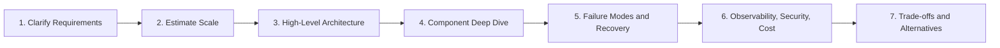

**Step 1 - Clarify requirements (3-5 minutes).** Treat the prompt as deliberately under-specified. Ask about data sources, volume, velocity, variety, freshness SLA, query patterns, retention, compliance, and budget. State your assumptions explicitly so the interviewer can correct them before you commit.

**Step 2 - Estimate scale (3-5 minutes).** Translate the requirements into concrete numbers - events per second, bytes per event, terabytes per day, peak-to-average ratio. These numbers will drive every downstream decision (partition counts, cluster sizes, storage choices). Round aggressively; precision is not the point.

**Step 3 - High-level architecture (5-8 minutes).** Draw five layers: ingestion, messaging, processing, storage, serving. Add an overlay for governance and observability. At this stage, use generic labels ("stream processor", "object store") rather than specific tools. The goal is to establish the data flow before fighting about Flink vs Spark.

**Step 4 - Component deep dive (10-15 minutes).** For each layer, choose specific technologies with justification. Cover partitioning strategy, state management, schema handling, and consistency guarantees. This is where you demonstrate technology depth.

**Step 5 - Failure modes and recovery (8-10 minutes).** Walk through what happens when each component fails: producer crash, broker outage, processing job restart, sink unavailable, late-arriving data, schema break. Describe the recovery mechanism and the customer-visible impact.

**Step 6 - Observability, security, cost (5-8 minutes).** Define the SLOs, the metrics that prove they are met, the alerts that fire when they are not, the security controls (PII, RBAC, encryption), and the cost levers.

**Step 7 - Trade-offs and alternatives (3-5 minutes).** Close by stating the alternative architectures you considered, why you did not choose them, and the conditions under which you would switch.

### 1.3 Clarifying Questions Checklist

Print this list mentally and use it for every prompt. Skipping these questions signals junior; asking them signals senior.

| Category | Questions to Ask |
|---|---|
| **Sources** | Where does data come from? OLTP DB, mobile app, IoT, third-party API, log files? Push or pull? Schema known or schema-on-read? |
| **Volume** | Events per second peak vs average? Bytes per event? Total daily volume? Year-over-year growth rate? |
| **Velocity** | Hard latency SLA from event to consumer visibility? Is "near real-time" 1 second or 15 minutes? |
| **Variety** | Structured, semi-structured, unstructured? Single schema or many? How often does schema change? |
| **Veracity** | Are duplicates acceptable? Is approximate counting acceptable? What is the cost of a wrong number? |
| **Query Patterns** | Dashboards, ad-hoc SQL, ML feature reads, exports, point lookups? Read concurrency? p95/p99 query latency? |
| **Retention** | Hot, warm, cold tiers? Right-to-be-forgotten? Audit retention? |
| **Compliance** | PII, PHI, PCI? GDPR/CCPA delete? Cross-border data residency? Audit log requirements? |
| **Reliability** | RTO and RPO? Multi-region? Acceptable downtime per quarter? |
| **Budget** | Greenfield or existing stack? Managed-only or self-host OK? Annual cloud budget? Team size? |
| **Consumers** | Who reads the output? Analysts, dashboards, ML models, operational systems, external customers? |

### 1.4 Back-of-Envelope Estimation - Worked Examples

The point of estimation is not arithmetic precision. It is anchoring every downstream decision in concrete numbers so that "use Kafka" becomes "use a 12-broker Kafka cluster with 200 partitions because we need 4 GB/sec ingestion and 7-day retention with replication factor 3."

**Useful base numbers to memorize:**

- 1 day = 86,400 seconds (round to 100,000 for mental math)
- 1 KB event = 100 KB/sec at 100 events/sec = 8.6 GB/day
- 1 KB event at 100,000 events/sec = 100 MB/sec = 8.6 TB/day
- Parquet compression typically achieves 4x to 8x over raw JSON
- Replication factor 3 means storage is 3x the raw size on the broker
- Network bandwidth: a typical NVMe broker can sustain ~100 MB/sec of write per partition

**Worked Example 1 - Clickstream pipeline.** Suppose 100,000 events per second peak, 1 KB per event, retention 7 days on the broker, replication factor 3.

```
Ingest rate         = 100,000 * 1 KB           = 100 MB/sec
Daily volume        = 100 MB/sec * 86,400      = ~8.6 TB/day
Broker storage      = 8.6 TB * 7 * 3           = ~180 TB across the cluster
Warehouse footprint = 8.6 TB / 6 (Parquet)     = ~1.4 TB/day
Per-event compute   = 2 ms                     = 100,000 * 0.002 = 200 cores worst case
Headroom factor     = 2x for failure tolerance = ~400 cores
```

**Worked Example 2 - CDC for an OLTP database.** Suppose 5,000 transactions per second, average row size 500 bytes, schema change every 2 weeks.

```
Ingest rate     = 5,000 * 0.5 KB     = 2.5 MB/sec
Daily volume    = ~216 GB/day
Daily warehouse = ~36 GB/day after compression
Schema events   = 26/year             = 0.5/week ; need automated schema evolution
```

**Worked Example 3 - IoT telemetry.** Suppose 1 million devices, sample every 5 seconds, 200 bytes per sample.

```
Events per second  = 1,000,000 / 5    = 200,000 events/sec
Ingest rate        = 200,000 * 0.2 KB = 40 MB/sec
Daily volume       = ~3.5 TB/day
State per device   = ~1 KB rolling stats
Total Flink state  = 1M * 1 KB        = 1 GB ; fits comfortably in RocksDB
```

### 1.5 Functional vs Non-Functional Requirements

**Functional requirements** describe what the system does: "ingest order events, compute hourly revenue per region, expose a dashboard with 1-second refresh." **Non-functional requirements** describe how well it does it: "99.9% pipeline uptime, 5-second p95 freshness, 7-year retention, GDPR-compliant deletion within 30 days."

Senior candidates intentionally separate the two. They restate the functional requirements after clarification, then list non-functional requirements as numbered SLOs that the design must meet. This forces every architectural decision later to point back to a specific requirement, which is exactly the structure interviewers grade on.

A common interview mistake is treating non-functional requirements as wishlist items rather than hard constraints. Latency, durability, and cost are constraints; you must show that your architecture meets them, not that you "considered" them.

### 1.6 Phrases That Signal Senior

These phrases come up consistently in interview feedback at senior+ levels. Internalize them and use them naturally.

- "The trade-off here is..." (always quantify both sides)
- "I'd default to X because..." (show you have a default)
- "At this scale that breaks because..." (show scale-awareness)
- "The failure mode I'd worry about is..." (proactive risk thinking)
- "I'd measure success with..." (operational mindset)
- "I'd revisit this decision when..." (show you know architecture is iterative)
- "Effectively-exactly-once via idempotent writes" (precise, not vague "exactly-once")
- "Watermark of N seconds; events later than that go to a side output" (precise lateness handling)
- "Partition by X and monitor for skew" (you anticipate skew, not just partition naively)

Phrases that signal junior:

- "I'd use Kafka and Spark" without explaining why
- "It depends" without saying what it depends on
- "Exactly-once" without qualifying the implementation
- "We can scale horizontally" without naming the bottleneck

---

## Part II - Terminology Glossary (Deep)

This part defines every term that appears in senior-level data engineering interviews, with enough depth to defend each definition under follow-up questioning. If you can explain each of these in two sentences plus an example, you will not be caught off guard mid-design.

### 2.1 Distributed Systems Fundamentals

**CAP theorem.** In any distributed system, when a network partition occurs, you must choose between **C**onsistency (every read returns the most recent write or an error) and **A**vailability (every request receives a non-error response, possibly stale). All real systems are partition-tolerant; the practical choice is between CP and AP. Senior framing: "CAP only governs behavior during a partition. Outside of partitions, you can have both."

**PACELC theorem.** Extends CAP: when there is no partition (Else), the trade-off is between **L**atency and **C**onsistency. PACELC explains why, even in a healthy cluster, strongly consistent reads cost more latency than eventually consistent reads. Most modern data systems are PA/EL (favor availability under partition, favor latency normally); strongly consistent systems like Spanner are PC/EC.

**Consistency models.** Ordered from strongest to weakest:
- **Linearizability**: operations appear instantaneous and ordered globally. Most expensive.
- **Sequential consistency**: operations appear in some global order consistent with each client's order.
- **Causal consistency**: operations causally related are seen by all in the same order.
- **Eventual consistency**: replicas eventually converge if writes stop.
- **Read-your-writes**, **monotonic reads**, **session consistency** are common pragmatic guarantees.

**Replication.** Copying data across machines for durability and read scaling.
- **Synchronous (sync)**: writer blocks until N replicas acknowledge. Strong durability, higher latency.
- **Asynchronous (async)**: writer returns immediately; replicas catch up. Low latency, risk of data loss on failover.
- **Leader-follower (single-leader)**: one replica accepts writes, others replicate. Simple, used by Kafka and most relational DBs.
- **Multi-leader**: multiple replicas accept writes, requires conflict resolution. Used in geo-distributed deployments.
- **Leaderless (Dynamo-style)**: any replica accepts writes; quorum reads/writes (R + W > N) provide consistency. Used by Cassandra, DynamoDB.

**Quorum.** A majority subset of replicas. Quorum reads (R) plus quorum writes (W) where R + W > N (total replicas) guarantees overlap and therefore consistency. A typical configuration is N=3, W=2, R=2.

**Partitioning (sharding).** Splitting a dataset across nodes so each node owns a subset.
- **Range partitioning**: contiguous ranges per node. Good for range scans but can hot-spot.
- **Hash partitioning**: hash(key) % N decides the node. Good distribution, bad for range scans.
- **Consistent hashing**: hash both keys and nodes onto a ring; only K/N keys move when a node is added or removed. Used by Cassandra, DynamoDB.
- **Composite key partitioning**: hash on the first part, range on the second. Cassandra's clustering keys work this way.

**Hot key / data skew.** When one key receives disproportionately more traffic, that partition becomes a bottleneck. Mitigations: salting (append `key + "_" + random[0..N]`), pre-aggregation, isolating the hot key onto a dedicated subtask, or two-phase aggregation (local agg then global agg).

**Consensus.** Agreement among distributed nodes on a single value despite failures. Key algorithms:
- **Paxos**: classic, hard to implement correctly.
- **Raft**: easier to understand, used in etcd, Kafka KRaft, MongoDB.
- **ZAB**: ZooKeeper's protocol.
- For interviews, knowing "leader election uses a majority quorum and a monotonic term/epoch" is enough at most levels.

**Two-phase commit (2PC).** Coordinator asks all participants to prepare; if all vote yes, coordinator commits. Used by Flink for exactly-once sinks. Drawback: blocking if coordinator fails after prepare.

**Idempotency.** An operation has the same effect whether executed once or many times. Critical for at-least-once delivery systems. Achieved by deterministic IDs, upserts keyed on the ID, or compare-and-swap.

### 2.2 Storage Models

**OLTP vs OLAP.**
- **OLTP** (Online Transaction Processing): row-oriented, optimized for many small transactions, ACID guarantees. Examples: PostgreSQL, MySQL, Oracle.
- **OLAP** (Online Analytical Processing): column-oriented, optimized for large scans and aggregations over historical data. Examples: Snowflake, BigQuery, Redshift, ClickHouse.
- **HTAP** (Hybrid): tries to serve both. Examples: TiDB, SingleStore. Usually a niche choice.

**ACID vs BASE.**
- **ACID**: Atomicity, Consistency, Isolation, Durability. Default in relational OLTP.
- **BASE**: Basically Available, Soft state, Eventual consistency. Default in many distributed NoSQL systems.

**Row-oriented vs columnar storage.**
- **Row stores** keep all fields of a record contiguously. Optimal for point reads and writes (`SELECT * FROM users WHERE id = 1`).
- **Column stores** keep all values of a field contiguously. Optimal for analytical scans (`SELECT AVG(price) FROM orders`). Compress 4-10x better than rows.

**B-tree vs LSM-tree.**
- **B-tree**: balanced tree of fixed-size pages. In-place updates. Good read performance, moderate write amplification. Used by Postgres, MySQL InnoDB.
- **LSM-tree (Log-Structured Merge)**: writes go to in-memory memtable, flushed as immutable SSTables, compacted in the background. Excellent write throughput, amplified read cost (resolved via bloom filters and tiered compaction). Used by Cassandra, RocksDB, HBase, LevelDB.

**File formats.**
- **CSV/TSV**: text, no schema, slow, no compression. Avoid in production.
- **JSON / JSONL**: text, schema-on-read, verbose. Acceptable as a Bronze-layer staging format.
- **Avro**: row-oriented binary, embeds schema or uses a registry. Excellent for streaming and schema evolution. Default for Kafka payloads.
- **Protobuf / Thrift**: row-oriented binary, schema-on-write, requires code generation. Common for service RPCs and event schemas.
- **Parquet**: columnar binary, predicate pushdown, dictionary encoding, run-length encoding. The default analytics format on object storage.
- **ORC**: columnar like Parquet, slightly better in some Hive workloads. Less common in cloud lakehouses.

**Compression algorithms.** Snappy (fast, default), LZ4 (fast), Zstandard (best ratio at moderate speed), Gzip (slow but widely supported), Brotli (best ratio for text).

### 2.3 Pipeline Vocabulary

**ETL vs ELT vs EtLT.**
- **ETL** (Extract, Transform, Load): transform before loading into the warehouse. Older pattern, heavier transform compute outside warehouse.
- **ELT** (Extract, Load, Transform): land raw into the warehouse, then transform with SQL/dbt. Modern default given cheap warehouse compute.
- **EtLT**: light transformation in flight (e.g., PII masking, format conversion) before loading, then heavy transformation in the warehouse. Best of both.

**CDC (Change Data Capture).** A pattern for capturing inserts, updates, and deletes from a source database.
- **Query-based CDC**: poll the source with `WHERE updated_at > last_seen`. Misses deletes, adds load to the source, latency = polling interval.
- **Trigger-based CDC**: install triggers that write to a change table. Adds source load, fragile.
- **Log-based CDC**: read the database's transaction log (MySQL binlog, Postgres WAL, Oracle redo logs). Captures all changes including deletes, near-zero source impact, sub-second latency. Debezium is the most common implementation.

**Idempotent writes.** Writes that, if repeated, produce the same final state. Critical for at-least-once delivery. Common implementations: upsert by event_id, MERGE statements, deterministic file naming.

**Deduplication strategies.**
- **In-stream dedup**: track seen event_ids in a state store (RocksDB) with TTL.
- **Sink dedup**: use a unique constraint or MERGE on event_id.
- **Late dedup**: ROW_NUMBER() OVER (PARTITION BY event_id ORDER BY processing_time) at read time.

**Fanout.** One source feeds many consumers. Kafka enables fanout via consumer groups; each group reads independently.

**Backpressure.** Downstream cannot keep up with upstream; buffers fill, latency rises, eventually data loss or job failure. Handle by scaling the bottleneck, batching writes, or shedding low-priority load.

### 2.4 Streaming Vocabulary

**Event time vs processing time vs ingestion time.**
- **Event time**: when the event actually occurred at source (embedded in the event). Authoritative for analytics.
- **Processing time**: when the stream processor handles the event. Depends on system load, latency, retries.
- **Ingestion time**: when the event entered the streaming system. Compromise between the two.

**Watermark.** A heuristic per-stream signal of "we believe all events with event_time <= T have arrived." Generated as `max(event_time) - allowed_lateness`. Once the watermark passes a window's end, the window can fire and emit results.

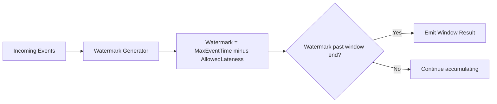

**Allowed lateness.** Configurable threshold beyond the watermark within which late events still update the window output. Beyond that, events go to a side output (DLQ or late-data stream).

**Window types.**
- **Tumbling**: fixed size, non-overlapping. `[12:00, 12:05), [12:05, 12:10)`. Use for periodic aggregates.
- **Sliding**: fixed size, overlapping with a slide step. 5-min window every 1 min. Use for smoothed metrics.
- **Session**: variable size, defined by a gap of inactivity. Use for user-behavior sessionization.
- **Global**: a single window, fired on a custom trigger. Use for unbounded counters.

**Delivery semantics.**
- **At-most-once**: every message delivered zero or one times. Loss possible.
- **At-least-once**: every message delivered one or more times. Duplicates possible.
- **Exactly-once**: every message has its effect applied exactly one time end-to-end. Achieved via transactions or idempotency.

**Checkpoint.** Periodic snapshot of a streaming job's state plus source offsets. On failure, the job restarts from the most recent checkpoint, replaying only events after that point. Frequency trades recovery time vs runtime overhead.

**Savepoint.** Manually-triggered checkpoint, usually for upgrades or migrations. In Flink, savepoints are not auto-deleted.

**State backend.** Where streaming state is stored.
- **Heap**: JVM heap, fastest, limited by RAM.
- **RocksDB**: embedded LSM store, larger state at the cost of disk I/O.
- **External**: Redis or another store, used when state must outlive the job or be queryable.

**Two-phase commit (2PC) sink.** Pattern Flink uses for exactly-once: pre-commit on checkpoint barrier, commit on checkpoint complete. Sink must support transactional writes (Kafka, JDBC, file system with rename semantics).

### 2.5 Data Modeling

**Kimball star schema.** A central **fact** table (transactional grain - one row per order, click, sensor reading) surrounded by **dimension** tables (one row per entity - customer, product, location). Optimized for slice-and-dice analytics. Default for BI.

**Inmon 3NF (Corporate Information Factory).** Central enterprise data warehouse in third normal form, with downstream dimensional marts. Higher modeling cost, better consistency across business areas.

**Data Vault.** A flexible modeling approach with **hubs** (business keys), **links** (relationships), and **satellites** (descriptive context). Excellent for auditability and historical tracking, lower BI usability.

**One Big Table (OBT).** Flatten everything into a single denormalized table. Fast reads, poor write efficiency, high storage. Common in modern analytics on cheap columnar engines.

**Slowly Changing Dimensions (SCD).**
- **Type 0**: never changes (e.g., date dimension).
- **Type 1**: overwrite, no history.
- **Type 2**: keep history with valid_from / valid_to / is_current. The standard for analytics requiring point-in-time joins.
- **Type 3**: keep limited history with current and previous columns.
- **Type 6**: hybrid (Type 1 + Type 2 + Type 3). Rare, complex.

**Conformed dimension.** A dimension shared by multiple fact tables with consistent definitions across the warehouse (e.g., the same customer dimension used by orders and clicks).

**Factless fact table.** A fact table with no measures, only foreign keys. Captures the occurrence of an event (e.g., student attendance: student_id + class_id + date).

**Surrogate key vs natural key.** Surrogate keys are warehouse-generated integers/UUIDs; natural keys come from the source system. Surrogate keys protect downstream models from source key changes and SCD2 churn.

### 2.6 Lakehouse Vocabulary

**Lakehouse.** Object storage (S3/ADLS/GCS) plus a table format (Iceberg, Delta, Hudi) that adds ACID, schema enforcement, and time travel. Combines lake economics with warehouse semantics.

**Snapshot.** An immutable view of a table at a point in time. Iceberg, Delta, Hudi all version their tables via snapshots.

**Time travel.** Querying a table as of a previous snapshot or timestamp. Implemented by retaining the metadata and data files for past snapshots.

**Partition evolution.** Changing the partitioning scheme of a table without rewriting historical data. Iceberg supports this; Delta requires rewrite.

**Hidden partitioning (Iceberg).** The partition columns are derived from data columns by transforms (e.g., `day(event_time)`). Queries do not need to know the partition expression, eliminating a major source of analyst error.

**Z-order / Liquid clustering.** Multi-dimensional clustering algorithms (space-filling curves) that co-locate rows similar across multiple dimensions, accelerating queries that filter on those dimensions. Liquid Clustering (Delta 3.x+) replaces traditional partitioning without data rewrites.

**Vacuum / cleanup.** Removing data files no longer referenced by any retained snapshot to reclaim storage.

**Compaction.** Merging many small files into fewer larger files to reduce metadata overhead and improve scan performance.

**Copy-on-Write (CoW) vs Merge-on-Read (MoR).**
- **CoW**: each update rewrites the affected file. Read fast, write slow. Default in Iceberg, Delta.
- **MoR**: updates append to delete/log files; readers merge at query time. Write fast, read slower until compacted. First-class in Hudi, partial in others via deletion vectors.

### 2.7 Governance Vocabulary

**Data catalog.** Searchable inventory of datasets with metadata: schema, owner, freshness, quality, sample. Examples: Apache Atlas, DataHub, OpenMetadata, Unity Catalog, AWS Glue Catalog.

**Data lineage.** A graph of where data came from and where it goes, at column granularity ideally. Powers impact analysis ("if I change column X, who breaks?") and root-cause analysis.

**Data contract.** A producer-consumer agreement on schema, semantics, freshness SLA, and quality guarantees. Versioned, code-reviewed, tested. The remedy for "the data team is the bottleneck" complaints.

**Semantic layer.** A unified definition of business metrics across consumers (Looker LookML, Cube, dbt Semantic Layer, AtScale). Replaces "every dashboard has its own definition of revenue."

**Data observability dimensions.** Freshness, volume, schema, distribution, lineage. Tools: Monte Carlo, Bigeye, Soda, Datadog Data Streams Monitoring, Anomalo, Lightup.

**Data quality dimensions.**
- **Completeness**: % of expected rows present.
- **Validity**: % of values matching expected types/ranges/regexes.
- **Uniqueness**: no unintended duplicates.
- **Timeliness / freshness**: data updated within SLA.
- **Consistency**: same data agrees across systems.
- **Accuracy**: data matches the real-world entity it describes.

---

## Part III - Architecture Patterns

This part presents the architectural patterns that account for ~95% of data engineering system design prompts. For each pattern: a mermaid diagram, when to use it, when to avoid it, and the dominant failure modes interviewers expect you to discuss.

### 3.1 End-to-End Reference Architecture

Every prompt - clickstream, CDC, IoT, fraud - is a specialization of this seven-layer reference. Drawing this first gives the interviewer a stable mental model to anchor your specific design.

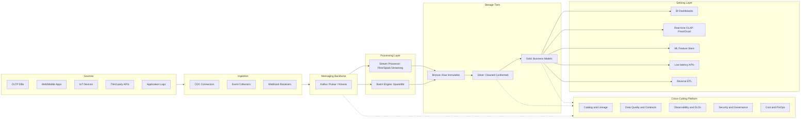

**Layer responsibilities (concise):**
- **Sources**: where data originates. You do not own these; minimize coupling.
- **Ingestion**: durable transport from source to bus, with retries and DLQ.
- **Messaging**: decouples producers and consumers, enables replay, fans out to many consumers.
- **Processing**: cleansing, joining, aggregating, deduplicating; stateful when needed.
- **Storage tiers (Medallion)**: progressive refinement from raw to consumer-ready.
- **Serving**: meets the latency/concurrency needs of each consumer type.
- **Platform**: cross-cutting concerns (catalog, quality, observability, security, cost) that apply to every layer.

### 3.2 Lambda Architecture

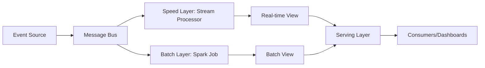

**How it works.** Two pipelines run in parallel. The **batch layer** reprocesses all historical data periodically (hourly, daily) for accuracy. The **speed layer** processes recent data in real time for low latency. The **serving layer** merges the outputs - typically by replacing speed-layer results with batch-layer results once batch catches up.

**When to use it.** When you genuinely need both sub-second freshness and full historical recomputation, and you have the engineering budget for two codebases.

**When to avoid.** Most teams. The dual-codebase maintenance is expensive, and the two layers' logic diverges over time, producing conflicting numbers that nobody trusts.

**Failure modes interviewers expect.**
- Logic divergence between batch and speed layers.
- Confusion about which view is "current" during the merge window.
- Doubling of compute and operational cost.

**Senior framing.** "Lambda made sense before stream processors had robust state and exactly-once semantics. With modern Flink and Spark Structured Streaming, Kappa or unified architectures are usually cleaner. I'd only choose Lambda when the historical reprocessing requirement is daily-or-larger and the speed-layer correctness budget is loose."

### 3.3 Kappa Architecture

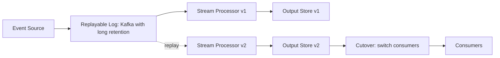

**How it works.** Single streaming pipeline; reprocessing is done by replaying the event log through a new instance of the same pipeline (often with a new version of the code), then cutting consumers over.

**When to use it.** When your retention window covers the longest reprocessing scenario you anticipate, and replay throughput is acceptable.

**When to avoid.** When you need to reprocess years of petabyte-scale data; replaying through a streaming engine is slower and more expensive than batch-on-Parquet.

**Failure modes.** Replay starvation (replay competes with real-time traffic for broker bandwidth), schema-version compatibility during replay, and stateful operator restoration cost.

**Senior framing.** "Kappa's appeal is one codebase. The hidden cost is operational - tiered storage in Kafka or a parallel S3 archive becomes mandatory once retention exceeds the broker's hot tier."

### 3.4 Medallion (Bronze / Silver / Gold)

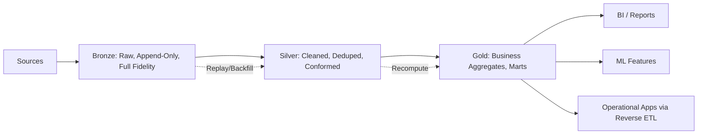

**How it works.**
- **Bronze**: raw, immutable, append-only. Every byte from the source is preserved with ingestion metadata. Used for replay, audit, schema-on-read exploration.
- **Silver**: cleaned, deduplicated, type-conformed, PII-masked, joined with reference data. The "conformed" layer that data engineers and scientists use.
- **Gold**: business-ready dimensional models or pre-aggregates. One Gold table typically serves one or two specific use cases.

**When to use it.** Almost always. The Medallion pattern is the default for lakehouses (Databricks, Iceberg-on-S3, Snowflake) because each layer has clear ownership, quality gates, and testability.

**Boundary discipline.** Boundary decisions are driven by *who reads each layer*. If analysts find themselves querying Bronze, you need a Silver. If dashboards join five Gold tables, your Gold is too granular.

**Failure modes.** Quality bleeding upward (no checks at Silver -> bad Gold), Silver becoming a dumping ground, Gold proliferating uncontrolled.

### 3.5 CDC (Change Data Capture) Architecture

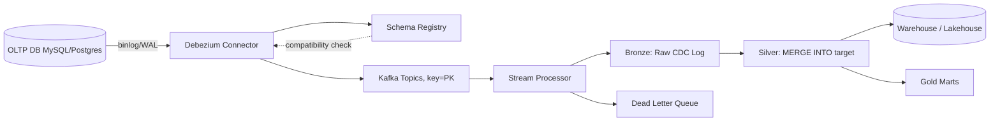

**How it works.** Debezium reads the source database's transaction log (MySQL binlog, Postgres WAL, Oracle redo logs), publishes change events to Kafka with the row's primary key as the message key (preserving per-row order), and a stream processor consumes these and applies upserts to the warehouse using MERGE / Snowpipe Streaming / Delta MERGE INTO.

**Key design choices.**
- **Topic-per-table** with PK as the partition key.
- **Schema registry** with backward-compatible Avro to survive source schema changes.
- **Tombstone records** signal deletes; downstream MERGE handles deletion semantics.
- **Initial snapshot** before incremental log reads to bootstrap the target.

**Monitoring.** Replication lag (connector metrics), Kafka consumer lag, row-count reconciliation source vs target every hour, schema-version drift alerts.

**Failure modes.** Schema breaks propagating downstream, source DB log retention expiring before the connector catches up, primary key ambiguity for tables without natural PKs, large transactions causing log floods.

### 3.6 Event-Driven, Event Sourcing, CQRS, Outbox

These four patterns are deeply related and frequently come together at senior interviews.

**Event-driven architecture (EDA).** Services communicate by publishing and subscribing to events on a bus. Producers do not know who consumes.

**Event sourcing.** State is derived from an immutable log of state-changing events. The current state is `fold(events)`. Replaying the log reconstructs any past state.

**CQRS (Command Query Responsibility Segregation).** Separate models for writes (commands) and reads (queries). Often paired with event sourcing.

**Outbox pattern.** Atomic database write + event publish in the same DB transaction by writing to an `outbox` table. A separate process polls / CDC-streams the outbox to the bus. Solves the dual-write problem (DB + Kafka).

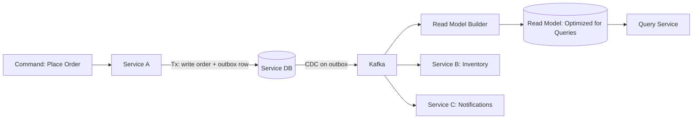

**When to use Event Sourcing + CQRS.** Financial systems (auditability is mandatory), collaborative editing, multi-step workflows (order processing). Avoid for simple CRUD where the complexity is not justified.

**Outbox is a near-universal pattern** whenever you publish to Kafka from a transactional service. Without it, you risk inconsistencies (DB committed but Kafka publish failed, or vice versa).

### 3.7 Data Mesh

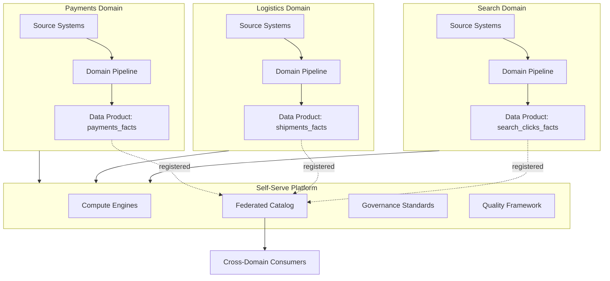

**The four principles of Data Mesh.**
1. **Domain ownership**: domains own their data, end-to-end.
2. **Data as a product**: each domain publishes data products with discoverability, addressability, trustworthiness, and SLOs.
3. **Self-serve platform**: a central platform team provides infra (compute, storage, catalog) so domains do not reinvent.
4. **Federated computational governance**: global rules (PII handling, schema standards) implemented as code that runs on every domain.

**When to adopt.** Large organizations (>200 engineers, >50 producing teams) where the central data team has become a bottleneck. Not for small teams - the overhead is huge.

**Failure modes.** Without strong governance, domains diverge (different formats, quality bars), making cross-domain queries unreliable. Without strong platform investment, domains rebuild the same infra.

### 3.8 Reverse ETL

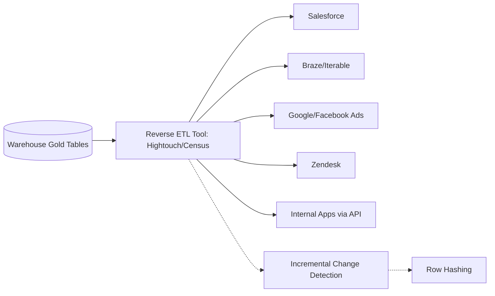

**How it works.** Pushes transformed data from the warehouse back into operational tools. Customer health scores from Snowflake to Salesforce; churn-risk segments to Braze; LTV to Google Ads for lookalike audiences.

**Design considerations.**
- **Sync frequency** vs API rate limits (most SaaS APIs cap at 100-1000 calls/sec).
- **Conflict resolution** when the SaaS tool allows manual overrides.
- **Incremental change detection** (row hashing or CDC on warehouse table) to avoid resyncing unchanged rows.

**Failure modes.** Burning API rate limits during full refreshes, overwriting user-edited fields, identity mismatch between warehouse keys and SaaS IDs.

### 3.9 Lakehouse Architecture

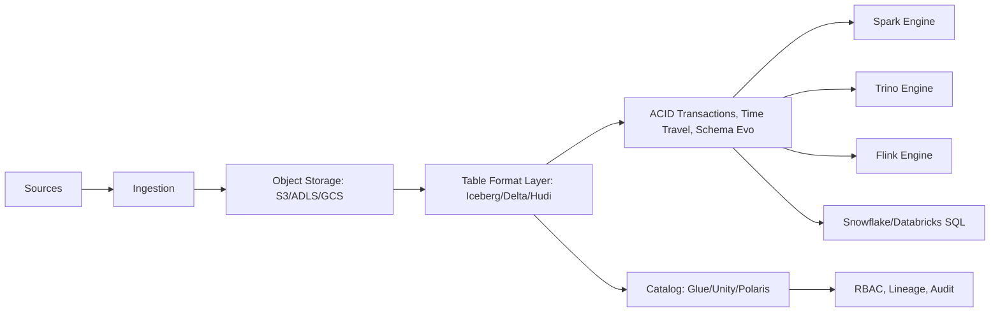

**Why it exists.** Replaces the warehouse-vs-lake either-or with a single store that supports BI, ML, and ad-hoc analytics. Open table formats (Iceberg, Delta, Hudi) provide ACID, schema enforcement, and time travel directly on object storage.

**When to use.** Modern analytics platforms greenfield builds in 2024+. The lakehouse is the new default.

**When to be cautious.** If you only have BI workloads and modest scale, a single managed warehouse (Snowflake/BigQuery) is operationally simpler. The lakehouse pays off when you have multi-engine access (Spark for ML, Trino for ad-hoc, Flink for streaming).

### 3.10 ML Feature Store Architecture

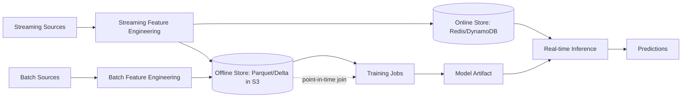

**Two paths must give consistent answers.**
- **Offline store** for training: typically a partitioned Parquet/Delta table, queried in bulk for historical feature vectors.
- **Online store** for inference: low-latency KV (Redis, DynamoDB), keyed by entity_id, serving the latest feature values.

**Point-in-time correctness.** When training, you must use the feature value as it was at the prediction time, not the current value. This requires asof joins on event_time. Failing at this causes train-serve skew - the model sees future information during training and underperforms in production.

**Common open-source/managed feature stores.** Feast, Tecton, Hopsworks, Vertex AI Feature Store, Databricks Feature Store.

---

## Part IV - Technology Deep Dives

This part covers the internals interviewers probe at senior level. For each technology: how it actually works under the hood, the interview gotchas that catch most candidates, and the production failure modes that distinguish "I read the docs" from "I have run this in production."

### 4.1 Apache Kafka Deep Dive

Kafka is the de-facto messaging backbone for data engineering. Senior interviews dig into partitioning, consumer groups, delivery semantics, and operational concerns.

**4.1.1 Architecture.**

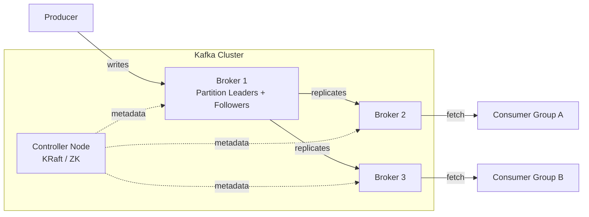

A Kafka cluster consists of brokers, each storing a subset of partitions. A topic is partitioned across brokers; each partition has one leader broker and N-1 followers. Producers write to the leader; followers replicate. The **In-Sync Replicas (ISR)** set is the followers that are caught up within `replica.lag.time.max.ms`. A partition can elect a new leader only from the ISR (unless `unclean.leader.election.enable=true`, which trades availability for durability).

**4.1.2 Producer guarantees.**

The producer's durability is controlled by `acks`:
- `acks=0`: fire-and-forget. Lowest latency, possible loss.
- `acks=1`: leader acknowledges after writing to its local log. Loss possible if leader crashes before replication.
- `acks=all` (also `-1`): leader waits until all ISR replicas acknowledge. Strongest durability. Combined with `min.insync.replicas=2` (for replication factor 3), you get durability against single-broker loss.

`enable.idempotence=true` makes the producer idempotent. The broker assigns each producer a **Producer ID (PID)** and an **epoch**. The producer attaches a monotonic sequence number to each record. The broker tracks the highest seen sequence number per (PID, partition) and discards duplicates. This prevents duplicates from producer retries within a single session.

**4.1.3 Transactions and exactly-once semantics (EOS).**

The transactional API extends idempotence to multi-partition atomic writes plus offset commits. Used to achieve consume-process-produce exactly-once for Kafka-to-Kafka pipelines.

- `transactional.id` survives restarts (the epoch increments to fence zombies).
- A **Transaction Coordinator** (one per `__transaction_state` partition) tracks transaction state.
- Two-phase commit: producer registers partitions with `AddPartitionsToTxn`, writes records with the in-transaction bit, calls `sendOffsetsToTransaction` to atomically commit consumer offsets, and finally `commitTransaction()` causes the coordinator to write commit markers to all involved partitions.
- Consumers must set `isolation.level=read_committed` to skip uncommitted records.

EOS is a Kafka-internal property. To get end-to-end EOS to a sink, the sink must support transactional or idempotent writes (Flink's 2PC sink, JDBC with primary key upsert, Iceberg/Delta MERGE, etc.).

**4.1.4 Consumers and consumer groups.**

A consumer group is a logical set of consumers sharing the work of consuming a topic; each partition is owned by exactly one consumer in the group at a time. The **group coordinator** broker manages membership and offsets in `__consumer_offsets`.

Rebalance protocols:
- **Eager rebalancing (legacy)**: stop-the-world; all consumers revoke partitions, then re-assign. Causes a "rebalance storm" when consumers come and go frequently.
- **Cooperative incremental rebalancing**: only the consumers that need to move release their partitions; others continue processing. Default in newer Kafka.
- **Static membership** (`group.instance.id`): treats short consumer absences (e.g., during a deploy) as transient instead of triggering rebalance.

**4.1.5 Partitioning and ordering.**

- Order is guaranteed within a partition only.
- Choose the partition key to align with downstream ordering needs (e.g., user_id for per-user clickstream order, account_id for per-account financial state).
- Hot keys cause partition skew; mitigations: salting + late aggregation, dedicated subtask, key-aware producer.

**4.1.6 Storage internals.**

Each partition is an append-only log split into segment files (`.log`) plus indexes (`.index`, `.timeindex`). Segments roll on size or time. Retention is by time (`retention.ms`) or size (`retention.bytes`). **Log compaction** retains the last value per key indefinitely - perfect for changelog topics.

**Tiered storage** (KIP-405, GA in newer Kafka and Confluent): cold segments offload to object storage, enabling effectively-infinite retention without overloading broker disks.

**4.1.7 KRaft (no ZooKeeper).**

Kafka 3.3+ supports KRaft (Kafka Raft) mode, replacing ZooKeeper with a Raft-based metadata quorum. Pros: simpler ops, faster controller failover, larger cluster size, faster transaction commits. ZooKeeper-based clusters are deprecated.

**4.1.8 Production failure modes interviewers probe.**

- **Producer running out of buffer memory** during a broker outage; tune `buffer.memory`, `linger.ms`, and have a fallback (DLQ to local disk).
- **Consumer lag spikes** from a slow downstream sink; address by scaling consumers or batching writes.
- **Rebalance storms** during rolling restarts; use cooperative rebalancing and static membership.
- **Disk full on broker**; segment rolling and retention enforcement matter, monitor disk pct.
- **Cross-DC replication** via MirrorMaker 2 or Confluent Replicator; mind the offset translation.

### 4.2 Apache Spark Deep Dive

Spark dominates batch processing in data engineering. Senior interviews probe the optimizer, execution model, and shuffle.

**4.2.1 Execution model.**

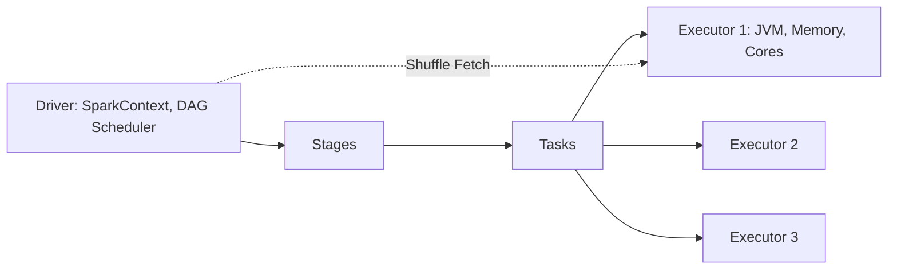

A Spark application has one **driver** (orchestrates) and many **executors** (run tasks). The driver builds a logical DAG from your transformations, divides it into **stages** at shuffle boundaries, and submits **tasks** (one per partition) to executors. Stages with **narrow dependencies** (map, filter) can pipeline; **wide dependencies** (groupByKey, join) require a shuffle.

**4.2.2 Catalyst Optimizer.**

Catalyst is the rule-based + cost-based optimizer for Spark SQL / DataFrame APIs. The pipeline:
1. **Parsed logical plan** from SQL / DSL.
2. **Analyzed logical plan** with resolved columns/types via the catalog.
3. **Optimized logical plan** after rule-based optimizations: predicate pushdown, projection pruning, constant folding, join reordering.
4. **Physical plan** with cost-based choices (e.g., broadcast vs sort-merge join).
5. **Selected physical plan** code-generated to JVM bytecode.

**4.2.3 Tungsten.**

Tungsten is Spark's execution engine optimization initiative.
- **Off-heap memory** with raw bytes (e.g., 4 bytes for an int) instead of boxed Java objects (16+ bytes), dramatically reducing GC pressure.
- **Whole-Stage Code Generation (WSCG)** compiles the entire physical plan stage into a single tight Java method - filter+project+aggregate becomes one for-loop with no virtual calls.
- **Cache-aware computation** via contiguous memory layout, exploiting CPU cache lines, SIMD, and pipelining.

**4.2.4 Joins.**

| Join | When Spark uses it | Cost |
|---|---|---|
| **Broadcast hash join** | One side fits in memory (~10MB default `spark.sql.autoBroadcastJoinThreshold`) | Ships small side to every executor; no shuffle of large side. Fastest. |
| **Sort-merge join** | Both sides large | Shuffle both, sort on join keys, stream-merge. Default for big-big joins. |
| **Shuffle hash join** | Both large but one fits per-partition | Shuffle both, build hash on smaller. Avoid sort. Less common. |

**4.2.5 Adaptive Query Execution (AQE) - the senior signal.**

AQE re-optimizes the plan at runtime using actual shuffle stats. Key features:
- **Dynamic coalescing of shuffle partitions** - merges small post-shuffle partitions into larger ones.
- **Dynamic switch from sort-merge to broadcast** when the runtime size of one side falls below the threshold.
- **Dynamic skew join handling** - splits skewed partitions into multiple smaller subtasks; the other side is replicated.

`spark.sql.adaptive.enabled=true` (default since 3.2). Mentioning AQE for skew handling in interviews is a strong senior signal.

**4.2.6 Dynamic partition pruning (DPP).**

When joining a partitioned fact table to a dimension, DPP pushes the filter from the dimension into the fact's partition reader, scanning only the relevant partitions. Massive speedup for star-schema queries.

**4.2.7 Shuffle.**

Shuffle is the redistribution of data across partitions during wide deps. Sort-based shuffle is the default: each map task writes one sorted file per reduce partition with an index. The reduce side fetches its partition's pieces from each mapper. Shuffle is the **single largest source of cost and latency** in Spark jobs. Avoid it via broadcast joins, partition-aware writes, and pre-shuffled bucketed tables.

**4.2.8 Structured Streaming.**

A streaming API on top of Spark SQL: input is treated as an unbounded table, queries write to output sinks at micro-batch (default) or continuous (low-latency, limited operators) trigger frequencies.

- **Watermarks** via `withWatermark("event_ts", "10 minutes")`.
- **Idempotent sinks** via `foreachBatch` + custom upsert.
- **Stateful operators** in HDFS/RocksDB state stores.
- **Checkpoint** to a reliable store; commits offsets atomically with state.

**4.2.9 Production gotchas.**

- **Small files problem**: many small Parquet files explode metadata. Use `coalesce()` / `repartition()` before write, or compaction jobs.
- **Skew without AQE**: one partition has 100x the data; that task takes 100x as long. AQE skew handling or salting fixes it.
- **Driver OOM** from `collect()` on a large DataFrame.
- **Out-of-order memory tuning**: increase `spark.executor.memoryOverhead` for off-heap pressure.

### 4.3 Apache Flink Deep Dive

Flink is the gold standard for stateful streaming. Senior streaming roles test it deeply.

**4.3.1 Architecture.**

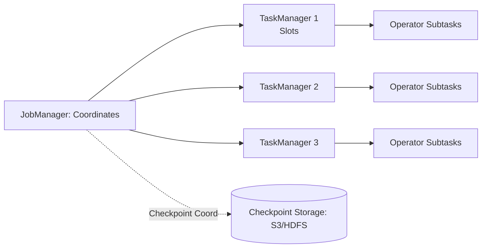

A Flink job has a **JobManager** (coordinator) and many **TaskManagers** (workers). Each TaskManager has slots; each slot runs one or more operator subtasks. The job graph is a DAG of operators connected by streams.

**4.3.2 State backends.**

- **Heap (HashMapStateBackend)**: fastest, limited by JVM heap. Good for small state and microservice-style streaming.
- **RocksDB (EmbeddedRocksDBStateBackend)**: state on local disk via an LSM tree. Bigger state, somewhat slower per-access. Default for production at scale.

**4.3.3 Checkpointing.**

Flink's checkpoint mechanism is **asynchronous and incremental** with RocksDB. The JobManager periodically inserts a checkpoint barrier into the source streams. As barriers flow through operators, each operator snapshots its state to durable storage and acknowledges. When all acks are received, the checkpoint is complete.

- **Aligned checkpoints**: an operator with multiple inputs waits for all barriers before snapshotting. Backpressure can cause long alignment delays.
- **Unaligned checkpoints** (Flink 1.11+): in-flight buffers are included in the checkpoint, removing alignment wait under backpressure.
- **Savepoints**: manually triggered, retained, used for upgrades and migrations.

**4.3.4 Exactly-once via 2PC sink.**

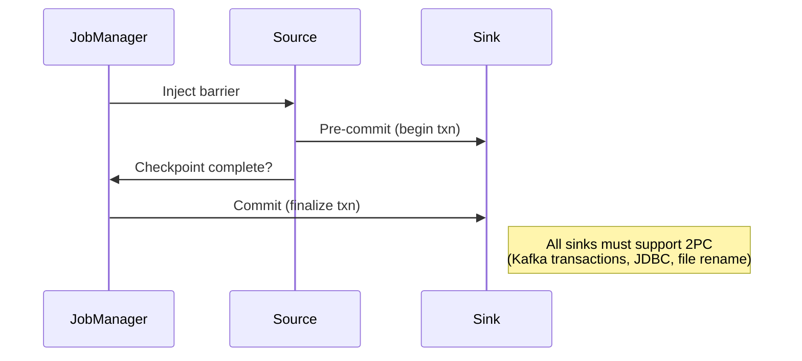

The sink implements `TwoPhaseCommitSinkFunction`: pre-commit on barrier, commit on checkpoint complete. Kafka, file system (with rename), and JDBC sinks support this.

**4.3.5 Watermarks and late data.**

`WatermarkStrategy.forBoundedOutOfOrderness(Duration.ofSeconds(60))` generates watermarks as `max_event_ts - 60s`. Window operators close when the watermark passes the window end. `allowedLateness(Duration.ofMinutes(10))` allows late events within 10 minutes to update results; later events go to a `OutputTag` side output.

**4.3.6 Async I/O.**

`AsyncFunction` enables concurrent enrichment lookups (e.g., calling Redis or a REST API) without blocking the operator's main thread. Critical for high-throughput stream-table joins where the dimension is external.

**4.3.7 Common state-size pitfalls.**

State size = N keys * size per key * retention. 100M users * 1 KB * 24 hours = 100 GB. Mitigations: TTL on state, compact field encoding, key-by-key offload to Redis, more parallelism (more TaskManagers). Always set `state.ttl` on long-lived state.

**4.3.8 Why Flink over alternatives.**

- vs **Kafka Streams**: Flink runs as a standalone cluster with bigger state and richer operators; Kafka Streams is embedded in JVM apps.
- vs **Spark Structured Streaming**: Flink is true event-at-a-time with fine-grained state; Spark is micro-batch by default. Flink wins on low-latency exactly-once stateful workloads.

### 4.4 Apache Airflow Deep Dive

Airflow is the dominant batch orchestrator. Senior questions focus on idempotency and operational scaling.

**4.4.1 Components.**

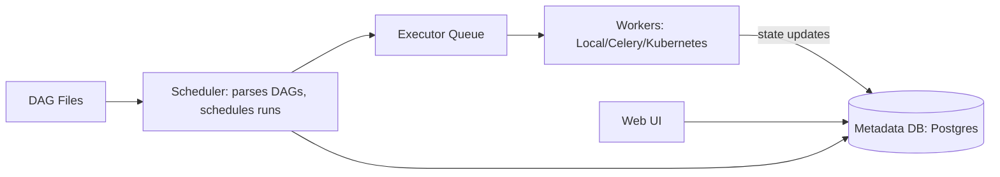

- **Scheduler**: parses DAG files, schedules task instances, dispatches to executors.
- **Executor**: LocalExecutor (single-machine), CeleryExecutor (distributed via Redis), KubernetesExecutor (one pod per task - the modern default).
- **Workers**: actually run tasks.
- **Metadata DB** (Postgres): state, run history.
- **Web UI**: monitoring and triggers.

**4.4.2 DAG concepts.**

- **DAG**: directed acyclic graph of tasks with schedule and dependencies.
- **Task instance**: a (task, execution_date) tuple - the unit of work tracked in metadata.
- **`execution_date` / `logical_date`**: the *interval start* the run represents, not when the run happens. A daily DAG scheduled at midnight on 2026-05-08 has `execution_date=2026-05-07T00:00:00` because it processes data *for* 2026-05-07.
- **Idempotent task**: re-running a task for the same `execution_date` produces the same final state. Achieved by deterministic file paths (`s3://bucket/dt={{ ds }}/`), upserts, and avoiding `NOW()` in transformations.

**4.4.3 Sensors and deferrable operators.**

- **Sensors** wait for an external condition (file arrival, partition, downstream job). Classic sensors hold a worker slot the whole time - expensive at scale.
- **Deferrable operators** (Triggerer process): the task suspends, freeing the slot, and resumes when the trigger fires. Critical for production at high concurrency.

**4.4.4 SLAs and alerting.**

`sla=timedelta(...)` on a task fires if the task does not complete within the SLA after `execution_date`. Combine with on-call hooks (PagerDuty, Slack) for tiered alerting.

**4.4.5 Production failure modes.**

- **Scheduler bottleneck** with thousands of DAGs: scale with multiple schedulers (Airflow 2.0+) sharing the metadata DB.
- **Metadata DB load** from frequent state updates; tune connection pool, vacuum aggressively.
- **DAG parse time**: keep DAG files lightweight; avoid imports of heavy libraries at module level.
- **Backfills**: use the `airflow dags backfill` CLI; ensure tasks are truly idempotent or you create duplicates.

**4.4.6 Alternatives to know.**

Prefect (Python-native), Dagster (asset-oriented, type-safe), Argo Workflows (Kubernetes-native), Temporal (workflow-as-code with durable execution).

### 4.5 dbt Deep Dive

dbt is the standard transformation layer for ELT. Senior questions focus on incremental models, testing, and lineage.

**4.5.1 Materializations.**

- **view**: query-time only, no storage cost, slow for downstream.
- **table**: rebuilt fully each run.
- **incremental**: only new or changed rows are processed; uses `is_incremental()` macro and a unique key.
- **ephemeral**: not persisted; inlined as a CTE in downstream models.
- **snapshot**: SCD2 implementation with `unique_key` and `updated_at`; tracks history.

**4.5.2 Incremental strategies.**

- `append`: insert new rows; risk of duplicates.
- `merge`: upsert on unique key; default on warehouses that support MERGE.
- `delete+insert`: delete matching keys then insert; alternative when MERGE is not available.
- `insert_overwrite`: replace partition data; preferred for partitioned warehouses (BigQuery, Snowflake with cluster keys).

**4.5.3 Testing.**

Built-in: `unique`, `not_null`, `accepted_values`, `relationships`. Custom data tests via SQL queries that should return zero rows. Generic tests via Jinja macros applied across models.

**4.5.4 Lineage and exposures.**

dbt generates a DAG from `ref()` and `source()` calls. `exposures` declare downstream consumers (BI tools, ML models) so lineage extends beyond dbt. The `dbt docs` site visualizes the entire dependency graph.

**4.5.5 Semantic layer.**

dbt Semantic Layer (post-Transform acquisition) provides a metric definition layer: define `MetricFlow` metrics once, query consistently across BI tools via SQL or GraphQL.

### 4.6 Cloud Warehouses

**4.6.1 Snowflake.**

- **Storage-compute separation**: storage in cloud object store, compute via "virtual warehouses" (clusters).
- **Micro-partitions**: 16 MB columnar segments, automatically managed; metadata-driven pruning.
- **Clustering keys**: optional sort to improve pruning on large tables.
- **Time travel**: query data as of N days ago (1-90 day retention).
- **Zero-copy cloning**: clone tables/databases at near-zero cost; metadata only.
- **Streams**: change tracking on tables; consumed by Tasks for incremental ELT.

**4.6.2 BigQuery.**

- **Fully serverless**: no clusters; pay per query (on-demand) or via slots (capacity).
- **Capacitor format**: BigQuery's columnar storage.
- **Partitioning**: by date or integer range; one partition column per table.
- **Clustering**: up to 4 clustering columns; co-locates similar rows in storage.
- **BI Engine**: in-memory cache for sub-second BI queries.

**4.6.3 Redshift.**

- **Cluster-based** (Provisioned) or serverless. RA3 nodes separate compute and managed storage.
- **Distribution styles**: KEY (hash), EVEN, ALL (broadcast small dimensions).
- **Sort keys**: sort data on disk; compound or interleaved.
- **Spectrum**: query S3 directly without loading.

**4.6.4 Databricks SQL.**

- **Lakehouse-native**: queries Delta tables on S3/ADLS via Photon engine (vectorized C++ execution).
- **Liquid clustering** (Delta 3.x): replaces partitioning, auto-clusters on chosen columns.
- **Unity Catalog**: cross-workspace governance.

**4.6.5 Common interview points.**

- **Why separate storage and compute?** Independent scaling, multi-cluster concurrency, cheap storage (S3) vs expensive compute (warehouse). All modern warehouses do this.
- **Cost model**: query-based (BQ on-demand) vs cluster-based (Snowflake / Redshift) - choose by workload predictability.
- **Right-sizing**: auto-suspend warehouses, separate workload (ETL vs BI) onto dedicated compute.

### 4.7 Lakehouse Table Formats: Iceberg vs Delta vs Hudi

A senior-level interview will not let you say "we'll use Iceberg" without pushing back. Know the trade-offs.

**4.7.1 Metadata architecture.**

| Aspect | Iceberg | Delta Lake | Hudi |
|---|---|---|---|
| Metadata layout | 3-level: metadata.json -> manifest list -> manifest files (with stats) | Append-only JSON transaction log in `_delta_log/` + Parquet checkpoints | Timeline in `.hoodie/` + per-file-group metadata |
| Catalog requirement | Yes (Glue, Hive, Polaris, Nessie, REST) | No (file-system based) | Optional (Hive Metastore) |
| Atomic commit | Catalog pointer swap | Append `00000N.json` to log | Timeline instant |

**4.7.2 Update semantics.**

- **Iceberg**: CoW by default; v2 spec supports MoR via positional/equality delete files.
- **Delta**: CoW default; **deletion vectors** (Delta 3.x) enable MoR-like updates without rewriting full files.
- **Hudi**: CoW or MoR as a first-class table type. MoR appends to log files; background compaction merges into Parquet later.

**4.7.3 Partition handling.**

- **Iceberg**: hidden partitioning via column transforms (`day(event_time)`, `bucket(16, user_id)`); partition evolution without rewrite.
- **Delta**: explicit partition columns; **liquid clustering** (Delta 3.2+) replaces traditional partitioning with space-filling curve clustering.
- **Hudi**: explicit partitioning; bucketing for record locality.

**4.7.4 Time travel and rollback.**

All three support time travel by snapshot ID or timestamp. All three retain old files until vacuum/cleanup.

**4.7.5 Indexing.**

- **Iceberg**: file-level min/max stats, Bloom filters (configurable).
- **Delta**: file-level stats, Z-order, Bloom filters.
- **Hudi**: pluggable indexes (Bloom, HBase, simple, bucketed) for fast record lookups by key. Best-in-class for high-frequency upserts.

**4.7.6 When to choose which.**

- **Iceberg**: open spec, multi-engine (Spark/Trino/Flink/Snowflake/BigQuery all support it), best for vendor-neutral lakehouse. Winning 2024-2026 adoptions.
- **Delta**: deepest Spark integration, simplest mental model, Databricks-native.
- **Hudi**: best when high-frequency upserts/deletes are the workload (CDC pipelines, GDPR delete-heavy datasets).

### 4.8 Real-Time OLAP: Pinot, Druid, ClickHouse

When a dashboard needs sub-second queries on freshly ingested data at high concurrency (think: Uber's surge map, LinkedIn's recruiter analytics), an OLAP serving layer separate from the warehouse is required.

**4.8.1 Apache Pinot.**

- **Architecture**: Servers, Brokers, Controllers, Minions. Real-time servers consume from Kafka; offline servers serve batch-loaded segments.
- **Segments**: immutable column-oriented files; support indexes (inverted, sorted, range, JSON, geo, text, star-tree).
- **Star-tree index**: pre-aggregates along dimension hierarchies; enables sub-100ms queries on billions of rows.
- **Used by**: LinkedIn, Uber, Stripe.

**4.8.2 Apache Druid.**

- **Architecture**: Coordinator, Overlord, Brokers, Historicals, MiddleManagers, Indexer.
- **Segments**: time-partitioned; stored in deep storage (S3) and cached on Historicals.
- **Best for**: time-series dashboards, log analytics, anomaly detection.

**4.8.3 ClickHouse.**

- **Architecture**: shared-nothing, columnar, MergeTree engine family.
- **MergeTree**: data parts merged in background; primary index is sparse (every 8K rows).
- **Materialized views**: incrementally maintained; very fast for pre-aggregations.
- **Best for**: log analytics, ad-tech, user-facing analytics with simple aggregations.

**4.8.4 Selection guide.**

- **High-concurrency, low-latency, complex aggregations**: Pinot or Druid.
- **Ad-hoc + dashboards on event data, smaller team**: ClickHouse.
- **Already on a warehouse, modest concurrency**: stay on the warehouse with a serving layer cache (Redis).

### 4.9 NoSQL and Key-Value Stores

**4.9.1 Cassandra.**

- **Architecture**: leaderless, partitioned by hash of partition key, replicated to N nodes via gossip.
- **Storage engine**: LSM-tree; SSTables compacted in background.
- **Tunable consistency**: `ONE`, `QUORUM`, `ALL` per request.
- **Best for**: high-write workloads, time-series, IoT, large multi-region deployments.

**4.9.2 DynamoDB.**

- **Managed leaderless KV**: partition key (hash) + sort key (range).
- **Auto-sharding** based on partition key; hot partitions are the dominant failure mode.
- **GSI / LSI**: secondary indexes for non-key access; GSI is async, LSI is sync.
- **Streams**: change capture for downstream pipelines.
- **Best for**: serverless apps with predictable access patterns; do not use it as an analytics store.

**4.9.3 HBase.**

- **Architecture**: HDFS-backed, region-server-per-shard, master coordinates.
- **Strong consistency** within a region.
- **Best for**: random reads/writes on big columnar data (e.g., Facebook Messages historically).

**4.9.4 Redis.**

- **In-memory KV** with rich data structures (strings, hashes, lists, sets, sorted sets, streams, JSON, search).
- **Persistence**: RDB snapshots + AOF append log; tradeoff durability vs speed.
- **Cluster mode**: hash-slot sharding (16384 slots) across nodes.
- **Senior-level uses**: feature store online layer, rate limiting, caching, leaderboards, distributed locks.

### 4.10 Search: Elasticsearch / OpenSearch

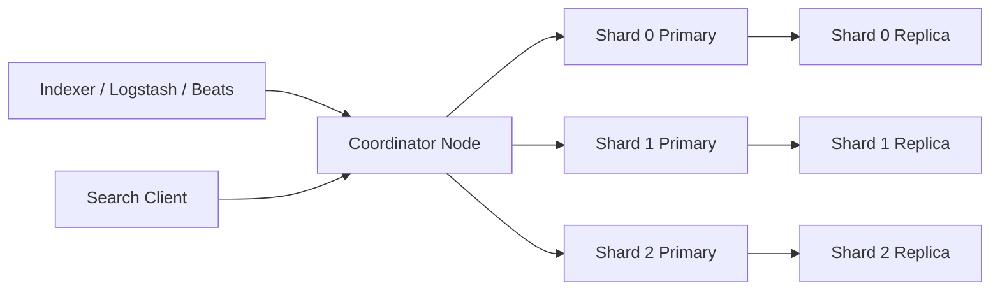

- **Indexing**: documents pass through analyzers (tokenization, lowercasing, stemming) into inverted indexes per shard.
- **Refresh interval**: how often new docs become searchable (1s default; tune up for write-heavy workloads).
- **Sharding**: `index.number_of_shards` is fixed at index creation - plan capacity carefully.
- **Best for**: full-text search, log aggregation (with some skepticism at very high volume due to cost), security analytics.
- **Limitations at extreme scale**: shard count explosion, cluster-wide rebalances, expensive aggregations. ClickHouse or Pinot often win for log analytics at >10TB/day.

---

## Part V - Processing Patterns

This part covers the processing patterns you must be fluent in. Each pattern is a building block; real designs combine several.

### 5.1 Batch Processing Patterns

**5.1.1 Full refresh.** Drop the target table, recompute from source, write back. Simplest, most expensive at scale. Use only for small dimensions or when incremental logic is impossible.

**5.1.2 Incremental load.** Process only new or changed rows since the last run. Drives down cost and runtime by 100-1000x compared to full refresh.

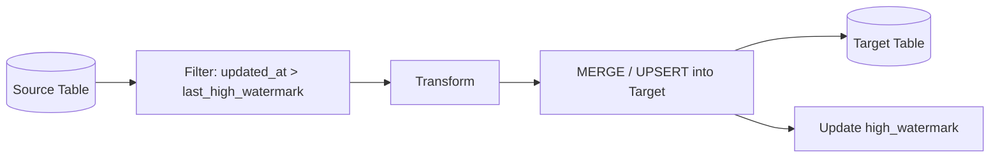

Two implementation strategies:
- **Append-only**: just insert new rows. Use when the source has an immutable event time (logs, clickstream).
- **Upsert (MERGE)**: insert or update by key. Use for mutable sources (orders, accounts).

**5.1.3 Late-arriving facts.** A fact arrives after its dimension has changed (e.g., an order arrives after the customer's region has updated). Resolutions:
- **As-of join** with SCD2 dimension to assign the dimension version that was current at fact's event time.
- **Default unknown row** for facts whose dimension does not yet exist; backfill when it arrives.

**5.1.4 SCD Type 2 implementation.**

```sql
-- Standard SCD2 MERGE pattern
MERGE INTO dim_customer AS target
USING (
  SELECT customer_id, name, region, address, current_timestamp() AS valid_from
  FROM staging_customer
) AS source
ON target.customer_id = source.customer_id AND target.is_current = TRUE
WHEN MATCHED AND (target.region <> source.region OR target.address <> source.address) THEN
  UPDATE SET is_current = FALSE, valid_to = source.valid_from
WHEN NOT MATCHED THEN
  INSERT (customer_id, name, region, address, valid_from, valid_to, is_current)
  VALUES (source.customer_id, source.name, source.region, source.address, source.valid_from, NULL, TRUE);

-- Then a second pass inserts the new "current" row for matched changes
```

The two-pass pattern (or a single MERGE WHEN MATCHED THEN UPDATE + INSERT) ensures we never lose history.

**5.1.5 Idempotent batch jobs.**

Idempotency principles:
- **Deterministic outputs**: given the same `execution_date`, the same input snapshot, and the same code, produce identical output.
- **Atomic writes**: stage to a temp location, then rename / swap pointer.
- **Watermark-based reads**: filter source by `[execution_date, execution_date + interval)`.
- **No `NOW()` or random** in transformations.

### 5.2 Stream Processing Patterns

**5.2.1 Stateless transforms.** Map, filter, projection, simple enrichment. No state; trivially parallel and recoverable.

**5.2.2 Stateful aggregations.**

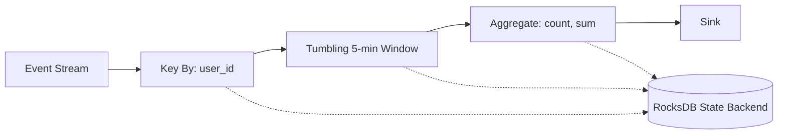

Key-by + window + aggregate is the canonical pattern. State is partitioned by key; each operator instance handles a subset of keys.

**5.2.3 Stream-stream joins.**

Joining two unbounded streams requires bounded state - typically a time-window:

```sql
-- Flink SQL: interval join
SELECT *
FROM clicks c
JOIN impressions i
  ON c.user_id = i.user_id
  AND c.event_time BETWEEN i.event_time AND i.event_time + INTERVAL '5' MINUTE
```

State retention is the join window; outside that, events are dropped.

**5.2.4 Stream-table joins (enrichment).**

Joining a stream against a slow-changing table (dimension): two approaches.
- **Broadcast / lookup**: keep the dimension in operator state (small dim) or fetch via async I/O (large dim, with cache).
- **Temporal table join (Flink SQL)**: join against the version of the dimension valid at the stream event's time.

**5.2.5 CEP (Complex Event Processing).**

Detect patterns across event sequences (e.g., "user views item -> adds to cart -> abandons within 10 minutes"). Flink's `CEP` library lets you declare patterns; runtime tracks NFA state per key.

**5.2.6 Sessionization.**

Group events into sessions defined by an inactivity gap. Standard pattern for clickstream analytics: a 30-minute gap closes the session.

### 5.3 Hybrid Batch + Streaming (Reconciliation)

Often the best architecture combines a fast streaming path with a slow batch reconciliation path:

```mermaid
flowchart LR
    Source[Event Source] --> Bus[Kafka]
    Bus --> Stream[Flink Streaming Job]
    Stream --> RealtimeStore[Real-time Store: Pinot]

    Bus --> Archive[S3 Archive: Iceberg/Delta]
    Archive --> Batch[Hourly Spark Batch]
    Batch --> WarehouseStore[Warehouse: Source of Truth]

    RealtimeStore --> Dashboard[Real-time Dashboard]
    WarehouseStore --> Reconcile[Daily Reconciliation Job]
    Reconcile -.-> RealtimeStore
```

The streaming layer gives sub-second freshness; the batch layer gives correctness (full reprocessing of late data, deduplication, schema fixes). The serving layer falls back to the warehouse when the real-time store disagrees.

### 5.4 Hot-Key Handling Strategies

A key receiving 100x the traffic of others creates partition skew. Without mitigation, that partition's processor becomes the bottleneck.

**5.4.1 Salting (key splitting).**

```python
salted_key = f"{user_id}_{random.randint(0, N-1)}"
# Aggregate per (user_id, salt), then aggregate again per user_id
```

Trade-off: extra shuffle stage and extra aggregation. Loses ordering within the hot key.

**5.4.2 Two-phase aggregation.**

Aggregate locally per task (combiner), then globally. Reduces shuffle volume drastically when the aggregation is associative + commutative.

**5.4.3 Asymmetric handling.**

Detect hot keys at runtime; route them to dedicated subtasks while normal keys take regular partitioning. Spark AQE skew join works this way: split the skewed partition into N sub-partitions; replicate the other side N times.

**5.4.4 Pre-aggregation at the source.**

If the source can pre-aggregate (e.g., client-side batching of same-user events), the downstream sees one event per batch instead of many.

### 5.5 Backfill Strategies

A backfill replays historical data through a pipeline (e.g., to fix a logic bug or onboard a new consumer).

**5.5.1 Three patterns.**

```mermaid
flowchart LR
    subgraph Pattern1 [Pattern 1 - Replay from Kafka]
        K[Kafka with N-day retention] --> ReplayJob[Replay-aware consumer]
    end

    subgraph Pattern2 [Pattern 2 - Re-ingest from Archive]
        S3[S3 Archive Iceberg] --> StreamSim[Streaming Job]
    end

    subgraph Pattern3 [Pattern 3 - Batch Side-Load]
        Archive2[Historical Files] --> SparkBatch[Spark Batch]
        SparkBatch --> SinkSame[Same Sink, Idempotent]
    end
```

- **Replay from Kafka**: works if retention covers the backfill window. Use a separate consumer group; isolate replay traffic if possible.
- **Re-ingest from S3 archive**: works for any horizon. Replay through the same streaming job (or a special "replay job" with relaxed watermarking).
- **Batch side-load**: compute the backfill in batch and write directly to the sink with the same idempotency guarantees as the streaming consumer. Fastest for large backfills; requires careful sink-idempotency design.

**5.5.2 Senior gotchas.**

- **Schema drift**: the schema in the archive may not match the current consumer; schema registry compatibility matters.
- **Side effects**: backfill should never trigger external actions (notifications, payments). Pipelines should separate "compute" from "trigger".
- **Time-bound watermarks**: replay through a streaming job needs an effective watermark strategy or it will hold all state forever.
- **Throttling**: a full-speed replay can starve real-time consumers.

### 5.6 Deduplication Patterns

**5.6.1 At-source dedup.** Producer attaches a unique event_id; consumer dedups in stream state with TTL.

```python
# Pseudocode for Flink stateful dedup
state = ValueState[Boolean]()  # keyed by event_id

def process(event):
    if state.value() is None:
        state.update(True)
        state.ttl(7 days)
        emit(event)
    # else: drop duplicate
```

**5.6.2 Sink dedup via MERGE.**

```sql
MERGE INTO target t
USING staging s ON t.event_id = s.event_id
WHEN NOT MATCHED THEN INSERT ...
```

Idempotent: re-processing the same event has no effect.

**5.6.3 Read-time dedup.**

```sql
SELECT ... FROM (
  SELECT *, ROW_NUMBER() OVER (PARTITION BY event_id ORDER BY processing_ts DESC) AS rn
  FROM events
) WHERE rn = 1
```

Acceptable for analytics where dedup at write was infeasible (e.g., raw Bronze layer kept dirty intentionally).

### 5.7 Late Data and Out-of-Order Handling

```mermaid
flowchart TD
    Event[Event arrives at processor] --> Compare{event_time vs watermark}
    Compare -->|"within watermark"| Normal[Normal window assignment]
    Compare -->|"slightly late, within allowed_lateness"| Update[Re-fire window with corrected output]
    Compare -->|"very late, beyond allowed_lateness"| Side[Route to side output / DLQ]
    Side --> Reconcile[Daily reconciliation batch job]
    Reconcile --> Backfill[Update affected partitions]
```

**Allowed lateness budget** is a business decision: if a financial dashboard's number is wrong for an hour because of a 10-minute-late event, that may be unacceptable; if a marketing dashboard is off by 2%, nobody cares.

**Senior framing.** "Watermarks are heuristics, not guarantees. I treat them as a freshness-vs-correctness lever; the business defines the lever's setpoint."

### 5.8 Window Semantics Edge Cases

**5.8.1 Allowed lateness with retractions.** When a late event updates a previously-emitted window result, the output must communicate the retraction. Flink emits an "update" or a "retract + insert" pair; downstream sinks must handle these (e.g., upsert by window key).

**5.8.2 Session windows on out-of-order events.** A late event arriving with a timestamp inside an already-closed session can split or merge sessions retroactively. Flink handles this by extending or merging session windows automatically when state retention permits.

**5.8.3 Tumbling window edge cases at midnight or DST.** Always work in UTC at the processor; convert to local time only at presentation. Otherwise DST changes cause windows of unequal length and missing data.

### 5.9 State Management

**5.9.1 State types in Flink.**
- `ValueState<T>`: a single value per key.
- `ListState<T>`: a list per key.
- `MapState<K, V>`: a map per key.
- `ReducingState<T>` / `AggregatingState<IN, OUT>`: incremental aggregation per key.
- **Operator state**: per-operator-instance, not keyed (e.g., source offsets).

**5.9.2 State TTL.** Always set TTL on state for unbounded keyspaces. Without TTL, a session-state job retains data forever and runs out of disk.

**5.9.3 Checkpoint vs savepoint.** Checkpoints are auto-managed for recovery; savepoints are manual for upgrades. Always test recovery from a savepoint before a major release.

### 5.10 Stream-to-Batch Transition Boundaries

**5.10.1 Why analytics often have both.** Streaming for low-latency dashboards and operational decisions; batch for accuracy, completeness, and complex SQL transformations. The interview signal is recognizing that these layers serve different SLAs and consumers, not forcing one or the other.

**5.10.2 The reconciliation discipline.** Whenever both layers exist, define which is source-of-truth at each time horizon: real-time wins for the last 1 hour; warehouse wins beyond.

---

## Part VI - Reliability, Quality, Governance

This part covers what separates "the pipeline runs" from "the pipeline runs and is trusted." At senior level, interviewers expect you to treat reliability and quality as first-class features.

### 6.1 Data Quality Framework

A data quality framework treats correctness as code that runs alongside the pipeline. The minimum viable framework has four layers.

```mermaid
flowchart LR
    Pipeline[Pipeline Stage] --> Tests[Quality Tests]
    Tests --> Decision{Pass?}
    Decision -->|Yes| Promote[Promote to next layer]
    Decision -->|No| CircuitBreak[Halt downstream / Quarantine]
    CircuitBreak --> Alert[Alert Owner + Page if P1]
    CircuitBreak --> Investigate[Investigate Root Cause]

    Pipeline -.-> Catalog[Data Catalog]
    Tests -.-> Catalog
    Catalog --> HealthScore[Table Health Score]
```

**6.1.1 Definition layer.** Each table has a quality contract - a YAML file in version control specifying:
- Column-level: `not_null`, `unique`, `accepted_values`, `regex`, `range`.
- Table-level: `freshness_sla`, `row_count_anomaly`, `referential_integrity`.

**6.1.2 Execution layer.** After each pipeline stage writes data, run the quality tests. Tools: dbt tests, Great Expectations, Soda, Anomalo. Tests run in the same compute as the transformation for cost and locality.

**6.1.3 Decision layer (circuit breaker).** Failures trigger one of:
- **Halt**: stop the pipeline; downstream consumers see last-known-good data. Default for Gold tables.
- **Warn-and-continue**: emit data + warning; tolerable for Bronze.
- **Quarantine**: route bad rows to a side table; continue with good rows.

**6.1.4 Monitoring layer.** Centralized dashboard showing pass rate, trends, and alerts. Quality results write to the catalog so analysts see a "health score" before querying.

### 6.2 Data Contracts

A **data contract** is a producer's commitment to a consumer about schema, semantics, freshness, and quality, expressed as a versioned, code-reviewed artifact.

**6.2.1 Anatomy of a contract.**

```yaml
dataset: orders.placed
producer: orders-service
schema_version: 2.3.0
schema_registry: confluent
schema_compatibility: BACKWARD
fields:
  - name: order_id
    type: string
    description: Globally unique order identifier (UUID v4)
    pii: false
  - name: user_id
    type: long
    pii: true
    masking: tokenize
  - name: amount_cents
    type: long
    semantics: |
      Amount in the smallest currency unit (cents for USD).
      MUST be positive; refunds are separate events.
freshness_sla: P0=5min, P1=1hr
quality_tests:
  - unique: order_id
  - not_null: [order_id, user_id, amount_cents, currency]
  - accepted_values: { currency: [USD, EUR, GBP, INR] }
  - row_count_anomaly: stddev=3, lookback=7d
breaking_change_policy: |
  Removals or renames require 90-day deprecation
  with both old and new fields published in parallel.
on_call: orders-team-pager
```

**6.2.2 Enforcement.** Contracts are tested in CI on every producer change. Violations block the deploy. Schema-registry compatibility checks are the runtime guardrail.

**6.2.3 The senior framing.** "Data contracts shift quality left from the consumer to the producer. They cost producer teams something - schema discipline, breaking-change overhead - but they're the only durable solution to the 'data team is the bottleneck' complaint."

### 6.3 Schema Evolution

Schema evolution is the silent killer of data pipelines: a single added column upstream can cascade failures through every downstream consumer.

**6.3.1 Compatibility modes (Confluent Schema Registry).**

| Mode | Allowed changes (latest schema vs prior) |
|---|---|
| **BACKWARD** | New schema can read data written with old schema. Add optional fields, delete fields with defaults. Most common. |
| **FORWARD** | Old schema can read data written with new schema. Add fields with defaults, no removals. |
| **FULL** | Both backward and forward. Most restrictive. |
| **NONE** | No checks. Avoid in production. |

**6.3.2 Safe evolution rules.**

- Always add new fields as **optional with defaults**.
- Never **rename** a field (semantic break); add new + deprecate old.
- Never **change the type** of an existing field; add a new field.
- Use a **deprecation window** (typically 90 days) before removing.
- Run **canary** producer/consumer pairs before global rollout.

**6.3.3 Schema-on-read mitigation.**

Parquet + Spark / Iceberg can tolerate added source columns gracefully (they map to NULL in older readers). Lakehouse table formats (Delta, Iceberg) support `mergeSchema` to add columns to the target without rewriting old data.

### 6.4 Observability and SLOs

**6.4.1 Five pillars of data observability.**

| Pillar | What to monitor |
|---|---|
| **Freshness** | Time since the table was last updated. Alert when SLA exceeded. |
| **Volume** | Row count and byte count per run; alert on anomalies (50% drop is almost always a bug). |
| **Schema** | Detected schema diffs; alert on breaking changes. |
| **Distribution** | Null %, value distribution, range of key columns; detect drift. |
| **Lineage** | Upstream-downstream graph; root cause analysis on failures. |

**6.4.2 SLOs (Service Level Objectives) for data.**

Define SLOs at the *dataset* level, not the pipeline level. Consumers care about the table being correct and fresh, not which job produced it.

```
Dataset: orders.fact_orders
Tier: P0 (revenue-critical)
SLO: 99.5% of days, freshness <= 30 min
SLO: 99.9% of days, completeness >= 99.99% (row count vs source)
Error budget: 0.5% of days = ~1.8 days/year of breach
Alerting: page on consumed budget rate (>2x burn = page)
```

**6.4.3 Tiering.**

- **P0**: revenue-critical, customer-facing. Tight SLOs, on-call paging, runbooks, postmortems.
- **P1**: internal operations. Standard SLOs, business-hours response.
- **P2**: experimental or exploratory. Best-effort.

**6.4.4 Anomaly detection.**

Static thresholds break under traffic seasonality. Use dynamic thresholds (mean +/- 3 stddev over rolling 14-day window) for row-count and freshness anomalies.

### 6.5 Disaster Recovery (DR)

**6.5.1 RTO and RPO.**

- **RTO (Recovery Time Objective)**: how long can the system be down? "Restore within 4 hours."
- **RPO (Recovery Point Objective)**: how much data can be lost? "At most 15 minutes of data."

These are business commitments. Design choices follow them, not the reverse.

**6.5.2 DR strategies.**

| Strategy | RTO | RPO | Cost |
|---|---|---|---|
| **Backup and restore** | Hours to days | Hours to a day | Lowest |
| **Pilot light** | Hours | Hours | Low |
| **Warm standby** | Minutes to hours | Minutes | Medium |
| **Multi-region active-active** | Seconds | Seconds (or zero) | Highest |

**6.5.3 Multi-region patterns.**

- **Active-passive**: primary region serves; secondary replicates and waits. Failover via DNS / control plane.
- **Active-active**: both regions serve. Requires conflict resolution (CRDTs, last-write-wins, or partitioned ownership).
- **Geo-partitioned**: each region owns a subset of users; cross-region queries are exceptional.

**6.5.4 What to replicate.**

- **Bronze** (raw) data: replicate via cross-region object storage replication or dual-write at ingest.
- **Silver/Gold**: typically rebuilt from Bronze + transformation code in the DR region.
- **Kafka**: MirrorMaker 2 or Confluent Cluster Linking for cross-cluster replication.
- **Warehouse**: native cross-region replication features (Snowflake Cross-Region replication, BigQuery cross-region datasets).

**6.5.5 Practice the recovery.**

Untested DR is decoration. Run quarterly DR drills: simulate primary outage, fail over, validate RTO/RPO, document.

### 6.6 Reliability Patterns

**6.6.1 Retry with exponential backoff and jitter.**

```python
attempt = 0
while attempt < max_retries:
    try:
        do_thing()
        break
    except RetryableError:
        sleep(min(base * 2**attempt, cap) + random.uniform(0, base))
        attempt += 1
```

Jitter prevents thundering-herd retries from all clients at once.

**6.6.2 Dead-letter queue (DLQ).**

```mermaid
flowchart LR
    Source[Source] --> Processor[Processor]
    Processor -->|success| Sink[Sink]
    Processor -->|poison event / N retries failed| DLQ[DLQ Topic / Table]
    DLQ --> Triage[Manual Triage / Replay Tooling]
```

DLQs are mandatory for production streaming. Without one, a single bad event halts the pipeline; with one, bad events are isolated and triage-able.

**6.6.3 Circuit breaker.**

When a downstream is failing, stop calling it for a while; fail fast instead. Implementations: Resilience4j, Hystrix (legacy), service mesh policies.

**6.6.4 Bulkheading.**

Isolate resources: separate Kafka consumer groups per consumer, separate warehouses per workload, separate Flink jobs per data domain. A failure in one bulkhead does not sink the ship.

**6.6.5 Fallback snapshots.**

When a real-time feed fails, fall back to the last-known-good snapshot. Customers see slightly stale data instead of an error.

---

## Part VII - Security and Compliance

Security and compliance are senior-level differentiators. Most candidates wait to be asked about them; senior candidates raise them proactively.

### 7.1 PII and Data Classification

**7.1.1 Classification taxonomy.**

| Class | Examples | Handling |
|---|---|---|
| **Public** | Marketing copy, public product catalog | No restriction |
| **Internal** | Internal docs, non-PII analytics | Employee access only |
| **Confidential** | Customer behavior, business metrics | Need-to-know access |
| **Restricted (PII/PHI/PCI)** | Names, emails, SSNs, health, payment | Strong access controls + masking + audit |

**7.1.2 PII handling techniques.**

- **Suppression**: drop the column from non-restricted tables.
- **Masking**: replace with a deterministic placeholder (e.g., `xxx@***.com`).
- **Hashing**: irreversible one-way hash. Useful for joins but lossy (cannot reverse for support).
- **Tokenization**: replace with a random token; mapping kept in a secured tokenization service. Reversible by privileged services.
- **Encryption with KMS**: column-level encryption; keys per data subject for "crypto-shredding."

**7.1.3 Where to apply.**

```mermaid
flowchart LR
    Source[Source: contains raw PII] --> Bronze[Bronze: encrypted at rest, restricted access]
    Bronze --> SilverPII[Silver PII Vault: tokenized, restricted]
    Bronze --> SilverGen[Silver General: PII masked / removed]
    SilverGen --> Gold[Gold: no PII]
    Gold --> Consumers[Most Consumers]
    SilverPII --> SpecialConsumers[Auditing, Customer Support]
```

The principle: separate a "PII vault" from the general analytics path. Most consumers see the masked path; only a few privileged services access the vault.

### 7.2 Right-to-be-Forgotten in Immutable Logs

GDPR Article 17 and CCPA give individuals the right to request deletion. This collides head-on with immutable event logs.

**7.2.1 The problem.**

Kafka topics, Iceberg snapshots, and S3 archives are immutable by design. Deleting a single user's data physically requires either:
- **Rewrite affected files** (Iceberg/Delta MERGE on user_id), which is feasible for warehouse tables but expensive in raw archives.
- **Crypto-shredding**: encrypt each user's data with a per-user key; delete the key to make the data unrecoverable.

**7.2.2 Crypto-shredding pattern.**

```mermaid
flowchart LR
    Event[Event with user_id] --> KMS[KMS: per-user data key]
    KMS --> Encrypt[Encrypt PII fields]
    Encrypt --> Storage[Encrypted Event in Kafka/S3]

    Delete[Delete request] --> KMSDelete[Delete per-user key]
    KMSDelete --> Inert[Stored data becomes unrecoverable]
```

Implementation: each user has an encryption key in KMS; PII fields are encrypted with the user's key at ingest. To "delete" a user, delete their KMS key. Stored ciphertext remains but is unrecoverable. Keep the key reference in a deletion-pending queue until the key TTL fully expires.

**7.2.3 Deletion workflow.**

1. Receive deletion request.
2. Identify all datasets containing the user (via lineage).
3. For warehouse tables: MERGE/DELETE by user_id.
4. For lake tables: rewrite affected partitions or use deletion vectors (Delta) / equality deletes (Iceberg).
5. For raw event logs: crypto-shred or wait for retention to expire.
6. Log every deletion in an audit table for compliance.
7. Confirm completion within the regulatory deadline (30 days GDPR, 45 days CCPA).

### 7.3 Access Control

**7.3.1 RBAC (Role-Based Access Control).**

Users get roles; roles get permissions. Standard for most warehouses (Snowflake, BigQuery, Redshift). Manageable but not fine-grained enough for some use cases.

**7.3.2 ABAC (Attribute-Based Access Control).**

Permissions are derived from attributes of the user, resource, and context (time, location, device). Used by AWS Lake Formation, Immuta, OneTrust. Powerful but complex to design.

**7.3.3 Row-level and column-level security.**

- **Row-level**: a policy filters rows based on user attributes (e.g., regional managers see only their region's rows). Implemented via Snowflake row-access policies, BigQuery row-level access, dbt-level WHERE clauses.
- **Column-level**: mask or hide columns based on user role. Snowflake masking policies, BigQuery dynamic data masking.

**7.3.4 Service accounts and least privilege.**

Production pipelines run as service accounts with the minimum permissions needed. Avoid shared "admin" credentials. Rotate keys regularly; prefer short-lived credentials (AWS STS, GCP service account impersonation).

### 7.4 Encryption

**7.4.1 At-rest encryption.**

- **Cloud-provider managed keys** (default for S3, GCS, ADLS): zero ops, encryption is on by default.
- **Customer-managed keys (CMK)**: you control rotation, audit, deletion. Required for many compliance regimes.
- **Customer-supplied keys**: you control everything; cloud only stores ciphertext. Highest control.

**7.4.2 In-transit encryption.**

TLS 1.2+ everywhere. Kafka with SASL/SSL, JDBC with SSL, HTTPS for APIs. Cross-region replication must use TLS.

**7.4.3 KMS key rotation.**

Annual rotation is standard. Cloud KMS handles ciphertext rewrap automatically for envelope encryption. Manual rotation requires re-encrypting affected data.

### 7.5 Audit Logging

Every access to restricted data must be logged:
- Who (user/service account)
- What (table/column queried)
- When (timestamp, time zone)
- How (query text, IP)
- Result (success / denied)

Logs go to a separate, immutable, write-once store with a longer retention (often 7 years for SOX / HIPAA). Detection rules flag anomalies (e.g., a service account accessing PII it has never accessed before).

### 7.6 Compliance Frameworks Quick Reference

| Framework | Scope | Key data engineering implication |
|---|---|---|
| **GDPR** (EU) | EU residents' personal data | RTBF, data minimization, lawful basis, DPO |
| **CCPA / CPRA** (California) | California residents' data | RTBF, opt-out of sale, sensitive PI handling |
| **HIPAA** (US) | Protected health information | Encryption mandatory, audit logs, BAA with vendors |
| **PCI-DSS** | Payment card data | Tokenization, network segmentation, no card data in analytics |
| **SOX** | Public-company financial reporting | Immutable audit trails, segregation of duties |
| **SOC 2** | Service-org security | Continuous controls, evidence collection, annual audit |

**Senior framing.** "I treat compliance as a forcing function for good data architecture: encryption everywhere, lineage for impact analysis, contracts for change management, audit logs for forensics. The compliance burden is mostly hygiene, not extra effort."

---

## Part VIII - Cost Optimization

Cost is a first-class non-functional requirement. At senior level, "we can scale by adding compute" is not an answer; you must explain how the system stays affordable at scale.

### 8.1 The Three Cost Levers

```mermaid
flowchart LR
    Cost[Total Cost] --> Storage[Storage]
    Cost --> Compute[Compute]
    Cost --> Egress[Network / Egress]

    Storage --> Tier[Tiering]
    Storage --> Format[Format and Compression]
    Storage --> FileSize[File Size Tuning]
    Storage --> Lifecycle[Lifecycle Policies]

    Compute --> Right[Right-Sizing]
    Compute --> Spot[Spot / Preemptible]
    Compute --> Auto[Autoscaling]
    Compute --> Workload[Workload Isolation]

    Egress --> Region[Region Co-location]
    Egress --> Compress[Compress Before Transfer]
    Egress --> Cache[CDN / Caching]
```

### 8.2 Storage Cost Levers

**8.2.1 Tiered storage.**

| Tier | Use case | Approx cost |
|---|---|---|
| **Hot** (S3 Standard, Snowflake active) | Last 7-30 days, queried frequently | $0.023/GB-month |
| **Warm** (S3 Standard-IA, Glacier IR) | 30-90 days, queried occasionally | $0.0125/GB-month |
| **Cold** (S3 Glacier Flexible, Deep Archive) | 90+ days, audit / replay only | $0.0036 to $0.00099/GB-month |

Lifecycle policies move data automatically. A 100 TB dataset with 90% in cold storage can cost 80% less than all-hot.

**8.2.2 Format and compression.**

- **Parquet** beats raw JSON 4-10x in size.
- **ZSTD** beats Snappy in ratio (30-50% less storage) at modest CPU cost. Use ZSTD for warm/cold tiers; Snappy or LZ4 for hot tiers where decompression latency matters.

**8.2.3 File size tuning.**

- **Too small** (kilobytes): metadata overhead crushes query planners. Listing 100k files takes seconds.
- **Too large** (multi-GB per file): no parallelism on read.
- **Sweet spot**: 128 MB to 1 GB per Parquet file.
- Run periodic compaction jobs (Iceberg `rewrite_data_files`, Delta `OPTIMIZE`, Hudi clustering).

**8.2.4 Partition pruning.**

A well-partitioned table with `WHERE event_date = '2026-05-07'` should read 1/N of the data, where N is the number of partitions. Always design partitions around the most common filter predicate.

### 8.3 Compute Cost Levers

**8.3.1 Right-sizing.**

- Profile actual resource usage (CPU, memory, network).
- Down-size where 50% headroom is unused.
- Use small warehouses for ad-hoc; reserve large warehouses for ETL.
- Auto-suspend idle warehouses (Snowflake's default 1-minute auto-suspend can save 90% on small workloads).

**8.3.2 Spot / preemptible instances.**

60-90% discount for interruptible compute. Use for batch jobs that can retry. Avoid for stateful streaming.

**8.3.3 Autoscaling.**

- **Streaming**: autoscale on consumer lag (Flink reactive mode, KEDA on Kubernetes).
- **Batch**: autoscale based on cluster queue depth.
- **Warehouse**: multi-cluster warehouses scale out under concurrency.

**8.3.4 Workload isolation.**

Separate ETL and BI compute so a runaway analyst query does not delay overnight loads. Use resource groups (Snowflake), reservations (BigQuery), or workload management queues (Redshift).

### 8.4 Query Cost Levers

**8.4.1 Partition pruning + clustering.**

A query reading the right partitions and clustering columns can scan 1% of the data. Train analysts (or use BI tools) to always include partition filters.

**8.4.2 Materialized views and aggregate tables.**

Pre-aggregated tables turn 10-second queries into 100-millisecond queries. Refresh them incrementally on a schedule.

**8.4.3 Result caching.**

Snowflake and BigQuery cache query results for 24 hours by default. Identical queries from the BI tool hit the cache for free.

**8.4.4 Query budgets and chargeback.**

Tag queries by team and dataset; bill teams for their usage. Behavioral economics solves what engineering cannot.

### 8.5 Network and Egress

**8.5.1 Region co-location.**

Keep producers, consumers, storage, and compute in the same region. Cross-region transfer is 10-100x more expensive than intra-region.

**8.5.2 Compress before transfer.**

Always compress payloads before cross-region replication. The CPU cost is dwarfed by the transfer cost saved.

**8.5.3 CDN for read-heavy egress.**

If you serve data downstream to many consumers (data products, public APIs), put a CDN in front. Single origin egress vs N-times CDN egress.

### 8.6 FinOps Discipline

**8.6.1 Visibility.**

- Tag every resource by team, dataset, environment.
- Build a daily cost dashboard with breakdown by tag.
- Alert on cost spikes (>50% day-over-day) immediately.

**8.6.2 Showback / chargeback.**

- **Showback**: each team sees their cost; no internal billing.
- **Chargeback**: each team pays their cost from their budget.
- Showback aligns incentives without political battles; chargeback enforces discipline.

**8.6.3 Cost as a code review concern.**

For new pipelines, require an estimated cost in the design doc. PRs that change query patterns or add new sinks should call out cost impact.

### 8.7 Real-World Cost Optimization Examples

- **Migrate from JSON to Parquet+ZSTD** in S3: 6-10x storage reduction, 5-20x query speedup. ROI: weeks.
- **Compact Delta tables daily**: 90% fewer files, 50% faster queries.
- **Auto-suspend Snowflake warehouses**: 60-80% cost reduction on small variable workloads.
- **Move logs from Elasticsearch to ClickHouse**: 50-90% cost reduction at large scale (>5 TB/day).
- **Replace one-pass full refresh with incremental MERGE**: 50-95% cost reduction depending on update density.

---

## Part IX - Real Company Case Studies

This part summarizes how leading tech companies have built their data platforms, with diagrams and key design decisions. Citing these in interviews shows you read the engineering blogs - a strong senior signal.

### 9.1 Netflix - Keystone and the Iceberg Lakehouse

**Scale.** Netflix processes ~1 trillion events per day across 1000+ microservices, supports ~15% of internet traffic during peak.

```mermaid
flowchart LR
    Services[Microservices] --> Keystone[Keystone Pipeline]
    Keystone --> Kafka[Kafka Tier]
    Kafka --> Flink[Flink Stream Processing]
    Kafka --> Spark[Spark Batch Processing]
    Flink --> Iceberg[(S3 + Iceberg)]
    Spark --> Iceberg
    Iceberg --> Trino[Trino for Ad-Hoc]
    Iceberg --> Druid[Druid for Real-Time Dashboards]
    Iceberg --> ML[ML Training and Features]
```

**Key decisions.**
- **Keystone**: an internal abstraction over Kafka that handles routing, schema management, and capacity for Netflix-scale event collection.
- **Iceberg as the lakehouse table format**: Netflix is the original creator of Iceberg. Hidden partitioning, partition evolution, and snapshot isolation address pain points from their Hive-based predecessor.
- **Multi-engine access**: Spark (ETL/ML), Trino (interactive), Flink (streaming) all read the same Iceberg tables.
- **Atlas (now Maestro)**: workflow orchestration for tens of thousands of jobs daily.

**Lessons for interviews.**
- Open table formats win when multiple engines need to coexist.
- Standardize the abstraction (Keystone) so application teams cannot accidentally bypass quality and governance.
- Invest in self-serve tooling - the data team cannot manually approve every change at this scale.

### 9.2 Uber - Real-Time Pricing and Surge

**Scale.** Tens of millions of rides per day; surge pricing requires sub-second decisions on supply-demand mismatches.

```mermaid
flowchart LR
    Rider[Rider App] --> KafkaR[Kafka: Rider Events]
    Driver[Driver App] --> KafkaD[Kafka: Driver Events]
    KafkaR --> Flink[Flink: Real-Time Aggregation]
    KafkaD --> Flink
    Flink --> Pinot[(Pinot: Real-Time OLAP)]
    Pinot --> SurgeService[Surge Pricing Service]
    SurgeService --> Pricing[Dynamic Pricing on App]

    Flink --> Hudi[(Hudi on S3)]
    Hudi --> Spark[Spark Batch ML]
    Spark --> Models[Pricing Models]
    Models -.-> SurgeService
```

**Key decisions.**
- **Flink for stateful streaming**: per-geo-grid demand and supply aggregations with 1-minute watermarks.
- **Pinot as serving layer**: sub-100ms aggregation queries at high concurrency for the surge pricing service.
- **Hudi for the lakehouse**: chosen for upsert-heavy CDC pipelines from operational databases (drivers, riders, trips).
- **Lambda-ish architecture**: real-time path for surge decisions; batch path for model retraining.

**Lessons for interviews.**
- High-concurrency serving needs a dedicated OLAP layer; don't query Hudi from the user-facing API.
- Upsert-heavy workloads (CDC) benefit from MoR table formats.
- Geo-spatial partitioning is a thing; H3 hex grids are common.

### 9.3 Airbnb - Minerva and the Data Platform

**Scale.** Hundreds of analysts; thousands of dashboards; central need for consistent metric definitions.

**Key contributions to the data engineering field.**
- **Airflow** was open-sourced from Airbnb (2015). Standard for batch orchestration since.
- **Minerva**: Airbnb's metric layer / semantic layer. Defines metrics in YAML once; consumed consistently across dashboards, A/B testing, ML.
- **Dataportal**: data discovery / catalog tool, with lineage and freshness.

```mermaid
flowchart LR
    Sources[Diverse Sources] --> Airflow[Airflow Orchestration]
    Airflow --> Spark[Spark Batch]
    Spark --> Hive[(Hive Metastore + S3)]
    Hive --> Druid[Druid for Dashboards]
    Hive --> Minerva[Minerva Semantic Layer]
    Minerva --> Tableau[Tableau / Superset]
    Minerva --> ABTest[A/B Testing Framework]
    Minerva --> ML[ML Feature Store]
```

**Lessons for interviews.**
- A semantic / metric layer is the single most under-invested-in piece at most data platforms.
- The cost of inconsistent metrics is enormous and invisible until your CEO sees three different numbers for revenue.

### 9.4 DoorDash - Iguazu (Unified Stream Processing)

**Context.** DoorDash had a legacy multi-hop pipeline (Snowflake -> Kafka -> Snowflake) with operational pain. They built Iguazu as a unified Kafka + Flink real-time event-processing platform.

```mermaid
flowchart LR
    Producers[~1000 Producer Services] --> Iguazu[Iguazu Platform]
    Iguazu --> Schema[Schema Registry: Strict Enforcement]
    Iguazu --> Kafka[Kafka with Tiered Storage]
    Kafka --> Flink[Flink Jobs]
    Flink --> Snowflake[Snowflake]
    Flink --> S3[S3 Iceberg]
    Flink --> ML[ML Online Features]

    Iguazu --> SelfServe[Self-Service UI]
    SelfServe --> NewProducer[New Producer Onboarding]
    SelfServe --> NewConsumer[New Consumer Onboarding]
```

**Key decisions.**
- **Schema enforcement at ingest**: producers cannot publish without a registered schema. Eliminated silent schema breakage.
- **Single source of truth for events**: replaced Snowflake-based ETL with Kafka-first events.
- **Self-service**: producer/consumer teams onboard themselves via UI; central platform team scales by leverage.
- **Tiered storage**: enabled long retention without overloading broker disks.

**Lessons for interviews.**
- The biggest cost of legacy pipelines is the marginal cost of every new producer/consumer. Self-service amortizes that cost.
- Schema enforcement at ingest is non-negotiable at scale.

### 9.5 Twitter / X - 400 Billion Events Per Day

**Scale.** ~400 billion events per day; Lambda architecture combining batch (Scalding) and stream (Heron) layers.

```mermaid
flowchart LR
    Source[Tweets, Likes, Follows] --> Pub[Event Publishers]
    Pub --> Kafka[Kafka]
    Kafka --> Heron[Heron Stream Processing]
    Kafka --> HDFSArchive[HDFS Archive]
    HDFSArchive --> Scalding[Scalding Batch]
    Heron --> RealtimeServing[Real-time Serving]
    Scalding --> BatchServing[Batch Serving]
    RealtimeServing --> Timeline[Timeline Service]
    BatchServing --> Timeline
```

**Key decisions.**
- **Heron** (Twitter's Storm successor) for stream processing.
- **Lambda architecture** for combining low-latency timeline updates with accurate historical aggregates.
- **Scalding** (Scala on Hadoop MapReduce) for batch jobs.

**Lessons for interviews.**
- Lambda still appears at extreme scale where reprocessing through streaming is impractical.
- Custom in-house stream processors usually lose to Flink over time, but they have historic momentum.

### 9.6 LinkedIn - The Stream-First Pioneer

**Context.** LinkedIn invented Kafka, Samza, Pinot, Brooklin, Voldemort. Their stream-first approach influenced the entire industry.

```mermaid
flowchart LR
    Source[OLTP DBs and Apps] --> Brooklin[Brooklin: CDC + Replication]
    Brooklin --> Kafka[Kafka: Central Nervous System]
    Kafka --> Samza[Samza: Stream Processing]
    Samza --> Pinot[(Pinot: Real-Time OLAP)]
    Samza --> Hadoop[(HDFS / Iceberg)]
    Pinot --> Recruiter[Recruiter Analytics]
    Pinot --> SponsoredContent[Sponsored Content]
    Hadoop --> ML[ML Training]
```

**Key decisions.**
- **Kafka as the central nervous system**: every important data movement goes through Kafka.
- **Brooklin**: managed CDC and cross-data-center replication. Generic enough to ingest from many sources, replicate Kafka across DCs.
- **Pinot for user-facing analytics**: sub-second latency at >100K QPS for "Who's Viewed Your Profile?", "Recruiter Search Analytics", etc.

**Lessons for interviews.**
- Real-time user-facing analytics needs a dedicated OLAP serving layer, not a warehouse.
- A central data movement abstraction (Kafka + Brooklin) reduces the N^2 integration cost of point-to-point pipelines.

### 9.7 Spotify - Event Delivery and Scio

**Scale.** Hundreds of millions of users; >100 billion events per day.

```mermaid
flowchart LR
    Clients[Mobile / Web / TV] --> Gateway[Event Delivery Gateway]
    Gateway --> PubSub[Google Pub/Sub]
    PubSub --> Dataflow[Dataflow / Beam]
    Dataflow --> BQ[(BigQuery Lake)]
    Dataflow --> GCS[(GCS Iceberg)]
    BQ --> Looker[Looker]
    GCS --> Scio[Scio Spark/Beam Jobs]
    Scio --> ML[ML Training]
```

**Key decisions.**
- **GCP-first** stack: Pub/Sub + Dataflow + BigQuery instead of Kafka + Flink + Snowflake.
- **Scio**: Scala API on Apache Beam, abstracts batch and streaming.
- **Event delivery is its own platform**: not just a Kafka client.

**Lessons for interviews.**
- The same patterns work on different stacks (AWS vs GCP vs Azure); know which patterns map to which managed services.
- Event delivery as a platform with SDKs, schema registry, and observability is a senior-level investment that pays dividends.

### 9.8 Stripe - Financial-Grade Data Engineering

**Context.** Stripe handles trillions of dollars in payments; correctness is non-negotiable.

```mermaid
flowchart LR
    Payments[Payment APIs] --> EventLog[Immutable Event Log]
    EventLog --> Kafka[Kafka]
    Kafka --> Flink[Flink: Stateful Processing]
    Flink --> Pinot[(Pinot)]
    Flink --> Snowflake[(Snowflake)]
    EventLog --> Reconcile[Reconciliation Service]
    Snowflake --> Reconcile
    Reconcile --> Alerts[Alerts on Discrepancy]
```

**Key decisions.**
- **Event sourcing**: every state change is an event in an immutable log. The current state is derived; corrections happen by appending compensating events, never by mutating history.
- **End-to-end exactly-once with idempotent processing**: every event has a unique ID; consumers dedup at ingest.
- **Continuous reconciliation**: separate jobs cross-check warehouse aggregates against the event log; alerts on any discrepancy.

**Lessons for interviews.**
- For financial systems, event sourcing is justified by audit and replay requirements alone.
- Reconciliation is not a checkbox; it is a continuous service.

### 9.9 Pattern Summary Across Companies

| Pattern | Companies | When to copy |
|---|---|---|
| **Iceberg / open lakehouse** | Netflix, Apple, Stripe | Multi-engine analytics |
| **Kafka + Flink + OLAP** | Uber, LinkedIn, DoorDash | Real-time analytics + serving |
| **Lambda** | Twitter | Petabyte-scale historical reprocessing |
| **Schema-first event delivery** | DoorDash, Spotify, Stripe | Many producers, governance pain |
| **Semantic layer** | Airbnb, Uber, Spotify | Metric inconsistency at scale |
| **Self-serve platform** | Netflix, DoorDash | Central team is the bottleneck |
| **Reconciliation as a service** | Stripe, banks | Financial-grade correctness |

---

## Part X - Fifteen Worked Design Problems

Each problem follows the same structure: prompt -> clarifying questions -> scale math -> architecture diagram -> end-to-end walkthrough -> failure modes -> monitoring -> trade-offs -> alternatives. Practice these out loud with a 45-minute timer.

### 10.1 Real-Time Clickstream Analytics at 200K Events/Sec

**Prompt.** Design a real-time clickstream analytics system for a large e-commerce site. Dashboards must update within 60 seconds. The data must also be queryable in the warehouse for ad-hoc analysis.

**Clarifying questions.** Average event size? Cardinality of users? Do we need session stitching across devices? Acceptable lateness for late events? Retention?

**Scale math (assumed).** 200,000 events/sec * 1 KB = 200 MB/sec = 17 TB/day raw, ~3 TB/day after Parquet+ZSTD. Kafka with replication factor 3 and 7-day retention: 17 * 7 * 3 = ~360 TB.

```mermaid
flowchart LR
    Web[Web SDK] --> Edge[Edge Collector]
    Mobile[Mobile SDK] --> Edge
    Edge --> Kafka[Kafka: 200 partitions, key=user_id]
    Kafka --> Flink[Flink: Sessionization + Aggregation]
    Kafka --> S3Raw[(S3 Bronze: Iceberg)]
    Flink --> Pinot[(Pinot: Real-Time Dashboards)]
    Flink --> S3Sessions[(S3 Silver: Sessions)]
    S3Raw --> Spark[Hourly Spark Batch]
    S3Sessions --> Spark
    Spark --> Snowflake[(Snowflake Gold)]
    Pinot --> Dashboard[Real-Time Dashboard]
    Snowflake --> BI[Ad-Hoc BI]
```

**End-to-end walkthrough.** A click event lands in the SDK -> sent to the edge collector -> produced to Kafka with `user_id` as the partition key (preserves per-user order). Flink consumes, sessionizes (30-min inactivity gap), enriches with GeoIP and user-agent parsing, and dual-writes: aggregates to Pinot for dashboards, full sessions to Iceberg Silver. Hourly Spark batch reads Bronze + Silver, joins reference data, and lands aggregates in Snowflake Gold.

**Failure modes.**
- **Late events**: Flink watermark = 60s; events later go to a side output and a daily batch reconciles into Snowflake.
- **Hot users (whales)**: salt the user_id key for the aggregation step, recombine in a second stage.
- **Edge collector outage**: SDKs buffer locally and retry; Kafka producer has its own buffer.
- **Pinot rebuild**: replay from Kafka if retention covers; otherwise re-ingest from S3 Bronze.

**Monitoring.** Producer error rate, Kafka consumer lag, Flink checkpoint duration, Pinot ingestion lag, freshness of Snowflake gold tables.

**Trade-offs.** Pinot adds operational complexity but gives sub-second dashboards. Without Pinot, dashboards would query Snowflake at 30-second-plus latency.

**Alternatives.** Replace Pinot with Druid (similar) or ClickHouse (cheaper, less concurrency). Replace Flink with Spark Structured Streaming if the team is Spark-centric.

### 10.2 CDC Pipeline: OLTP to Warehouse with <5 Min Lag

**Prompt.** Sync 1000 tables from an OLTP database (Postgres) to Snowflake with end-to-end latency under 5 minutes. Survive schema changes without downtime.

**Clarifying questions.** Avg row size? Update frequency per table? Are deletes important? Is there a tables-of-tables (some big, many tiny)? Retention of CDC log on the source?

**Scale math (assumed).** 1000 tables, average 5000 changes/sec total = 5K rows/sec. 500 bytes per row = 2.5 MB/sec, 216 GB/day. Topic count: 1000 (one per table).

```mermaid
flowchart LR
    Postgres[(Postgres WAL)] --> Debezium[Debezium Connector]
    Debezium --> Schema[Confluent Schema Registry]
    Debezium --> Kafka[Kafka: Topic Per Table, key=PK]
    Kafka --> Snowpipe[Snowpipe Streaming]
    Snowpipe --> Stage[Snowflake Stage Tables]
    Stage --> MergeTask[Snowflake Tasks: MERGE INTO]
    MergeTask --> Target[Target Tables]

    Kafka --> DLQ[Dead Letter Queue]
    Schema -.->|compatibility check| Debezium

    Recon[Reconciliation Job] -.-> Postgres
    Recon -.-> Target
```

**End-to-end walkthrough.** Postgres WAL -> Debezium reads logical replication slot -> serializes changes as Avro per Schema Registry -> publishes to a topic per table with PK as the message key -> Snowpipe Streaming ingests into stage tables in Snowflake -> Snowflake Tasks run MERGE INTO every minute to upsert into target tables.

**Failure modes.**
- **Replication slot bloat**: if Debezium falls behind, Postgres holds WAL until consumed; alert at 80% disk.
- **Schema break**: schema registry blocks incompatible changes at producer side; downstream MERGE handles new optional columns.
- **Tombstone (delete) handling**: MERGE WHEN MATCHED ... DELETE on `__deleted = true` field.
- **Large transactions**: a 1M-row transaction creates a flood; Debezium's transaction-level isolation flushes them as a batch.

**Monitoring.** Replication slot lag (bytes), Kafka consumer lag, Snowpipe ingestion lag, MERGE task duration, hourly row-count reconciliation between source and target.

**Trade-offs.** Snowpipe Streaming has per-file overhead; for very low-traffic tables, a hourly batch may be cheaper. Initial snapshot blocks the source briefly; consider parallel snapshot per table.

**Alternatives.** Replace Snowflake with Databricks Delta MERGE; replace Snowpipe with Kafka Connect Snowflake sink (slower but simpler).

### 10.3 Real-Time Fraud Detection at 50K TPS

**Prompt.** Score every payment transaction for fraud in <100 ms before authorization. Maintain feature consistency between training and inference.

**Clarifying questions.** What features are needed (behavioral, geo, velocity)? Acceptable false-positive rate? Are decisions reversible (block + manual review) or final?

**Scale math.** 50,000 TPS * 1 KB = 50 MB/sec, ~4.3 TB/day. Online feature reads: 50K reads/sec at p99 < 5 ms.

```mermaid
flowchart LR
    Txn[Transaction Event] --> Kafka[Kafka, key=card_id]
    Kafka --> Flink[Flink: Stateful Feature Computation]
    Flink --> Redis[(Redis: Online Features)]
    Flink --> Iceberg[(S3 Iceberg: Offline Features)]

    Auth[Authorization Service] --> ModelServe[Model Serving: ONNX/TF-Serving]
    ModelServe --> Redis
    ModelServe --> Decision[Block/Allow Decision]
    Decision --> AuditLog[Audit Log]

    Iceberg --> Train[Spark Training]
    Train --> ModelServe
    Decision --> ReviewQ[Manual Review Queue]
    ReviewQ --> Labels[Labels]
    Labels --> Iceberg
```

**End-to-end walkthrough.** Each transaction enters Kafka keyed by card_id (preserves per-card velocity calculations). Flink maintains stateful features per card (5-minute count, 1-hour amount sum, geo-distance from prior transaction). Features are dual-written to Redis (online) and Iceberg (offline). The authorization service calls model serving, which reads features from Redis, returns a fraud score, and the system makes a decision in <100 ms. Daily Spark training reads Iceberg, retrains the model, deploys to model serving.

**Failure modes.**
- **Redis down**: fall back to a default conservative score; the authorization API stays up.
- **Flink checkpoint lag**: features grow stale; alert if Redis writes lag by >5 seconds.
- **Model degradation**: monitor score distribution drift; auto-retrain trigger.
- **Train-serve skew**: enforce point-in-time joins in offline feature pipeline.

**Monitoring.** Decision latency p99, Redis read p99, Flink checkpoint duration, online-vs-offline feature value drift, false-positive rate by merchant, model AUC daily.

**Trade-offs.** Strict <100 ms budget rules out warehouse lookups; Redis is non-negotiable. Cost: Redis memory at scale is expensive; partition by region for cost.

**Alternatives.** DynamoDB for online features (auto-scaling, more durable, slightly higher latency). Kafka Streams instead of Flink for embedded simplicity at the cost of less powerful state.

### 10.4 Log Aggregation: 10K Servers, 250 GB/Sec

**Prompt.** Centralize logs from 10,000 servers, each producing 50,000 lines/sec at 500 bytes/line. Errors and warnings must be searchable within 1 minute; debug logs are nice-to-have for forensics.

**Scale math.** 10K * 50K = 500M lines/sec * 500 B = 250 GB/sec. Daily: ~21 PB/day. This is the scale that breaks naive Elasticsearch designs.

```mermaid
flowchart LR
    Hosts[10K Servers] --> FluentBit[Fluent Bit Agents]
    FluentBit --> Kafka[Kafka: Massive Cluster, partition by service]
    Kafka --> Flink[Flink: Parsing + Routing]
    Flink --> Hot[Hot: ClickHouse for Errors/Warnings 7 days]
    Flink --> Cold[Cold: S3 Parquet for Debug 30 days]

    Hot --> SearchUI[Search UI / Grafana]
    Cold --> Athena[Athena for Forensics]
```

**End-to-end walkthrough.** Fluent Bit (10x lower memory than Fluentd) on each server parses, batches, and ships to Kafka. Kafka topics are partitioned by service. Flink parses, enriches (hostname, region, deploy version), and routes by severity: errors and warnings to ClickHouse for fast search; debug logs to S3 Parquet partitioned by date and service.

**Failure modes.**
- **Kafka cluster overload**: at 250 GB/sec, you need 200+ brokers with NVMe; alert on disk pct, network saturation.
- **ClickHouse ingestion lag**: error logs not searchable within SLA; mitigate with backpressure to drop debug logs first.
- **Cardinality explosion**: 10K hostnames in ClickHouse skews many indexes. Use TTL aggressively.

**Monitoring.** Per-service log rate (alert on sudden drops), Kafka consumer lag, ClickHouse ingestion lag, search query p95, S3 partition file count.

**Trade-offs.** Indexing all logs in Elasticsearch would cost millions and break at this scale. Tiering by severity is mandatory. ClickHouse vs Loki vs OpenSearch: ClickHouse wins on cost at >5 TB/day.

**Alternatives.** Datadog Logs / Splunk if budget allows ($10M+ annually at this scale). Cribl Stream for upstream filtering and routing.

### 10.5 Real-Time Dashboard with 10-Sec SLA

**Prompt.** Build a business metrics dashboard (revenue per minute, active users, conversion rate) with <10 second freshness.

**Clarifying questions.** How many concurrent users on dashboards? How many metrics? How long-lived are metric definitions?

**Scale math.** 50K events/sec, ~50 metrics, 100 concurrent dashboard users.

```mermaid
flowchart LR
    Events[Click + Order + Auth Events] --> Kafka[Kafka]
    Kafka --> Flink[Flink: Sliding Window Aggregations]
    Flink --> Redis[(Redis: Metric Cache)]
    Flink --> Pinot[(Pinot: Multi-Dim Analysis)]
    Redis --> WS[WebSocket API]
    Pinot --> RestAPI[REST API for slicing]
    WS --> Dashboard[Dashboard]
    RestAPI --> Dashboard
```

**End-to-end walkthrough.** Events arrive in Kafka. Flink computes sliding-window aggregates (revenue per 1-min, active users in 10-sec window, conversion rate over 5-min). Hot metrics (point-lookup) in Redis; multi-dimensional slices in Pinot. WebSocket pushes metric updates to dashboard every 10 seconds.

**Failure modes.**
- **Late events**: small allowed lateness (1-2s) and side output for finance reconciliation; non-finance dashboards do not retract.
- **Dashboard reload spike**: WebSocket avoids re-running the query for every refresh; rate-limit reload.
- **Flink restart**: checkpoint recovery <30 seconds; dashboard shows "stale data" indicator during recovery.

**Monitoring.** WebSocket connection count, metric freshness lag, dashboard load latency.

**Trade-offs.** Pre-computing all dashboard queries at the streaming layer is faster than querying Pinot but less flexible.

**Alternatives.** Materialize for SQL streaming; Tinybird / Aerospike for the serving layer.

### 10.6 E-Commerce Warehouse: 2 Million Orders Per Day

**Prompt.** Build a data warehouse for an e-commerce company processing 2M orders/day. Dashboards refresh hourly; ad-hoc SQL is the dominant workload; ML reads features daily.

**Scale math.** 2M orders/day = 23 orders/sec - modest ingestion. Complexity is in modeling and query patterns.

```mermaid
flowchart LR
    Orders[Order Events] --> Kafka[Kafka]
    Inventory[Inventory CDC] --> Kafka
    Customer[Customer CDC] --> Kafka
    Click[Clickstream] --> Kafka

    Kafka --> Bronze[(Bronze: Iceberg on S3)]
    Bronze --> dbt[dbt Models on Snowflake]
    dbt --> Silver[Silver: Cleaned, SCD2 Dimensions]
    Silver --> Gold[Gold: Star Schema Marts]
    Gold --> BI[Looker / Tableau]
    Gold --> ML[ML Feature Store]
    Gold --> RETL[Reverse ETL to CRM]
```

**End-to-end walkthrough.** Kafka Connect lands raw events into Iceberg Bronze on S3. dbt jobs (orchestrated by Airflow or dbt Cloud) build Silver (deduped, type-cast, SCD2 customer/product dimensions) and Gold (fact_orders with daily/hourly grain, dim_customer, dim_product, conformed date dimension). Looker queries Gold; ML feature store reads daily snapshots.

**Failure modes.**
- **Late orders**: orders can update for days (refunds, status changes); SCD2 captures all states.
- **Schema changes upstream**: data contract + schema registry catch in CI.
- **dbt model failures**: fail fast on tests; alert on freshness.

**Monitoring.** dbt freshness checks, row-count anomalies, query cost per dashboard, daily reconciliation between source and warehouse.

**Trade-offs.** Snowflake vs Databricks: Snowflake simpler for SQL-heavy BI workloads, Databricks better when ML workloads are heavy. We assumed Snowflake.

**Alternatives.** BigQuery for serverless, Redshift for AWS-native, Databricks for unified BI+ML.

### 10.7 IoT Telemetry Platform: 1 Million Devices

**Prompt.** Ingest readings from 1M devices, every 5 sec, ~200 bytes per reading. Detect anomalies in real time. Allow drilling down on any device's last 30 days.

**Scale math.** 200K events/sec, 40 MB/sec, ~3.5 TB/day raw. Cardinality: 1M device IDs.

```mermaid
flowchart LR
    Devices[1M Devices] --> MQTT[MQTT Broker: EMQX/HiveMQ]
    MQTT --> Bridge[Kafka Bridge]
    Bridge --> Kafka[Kafka, key=device_id]
    Kafka --> Flink[Flink: Per-Device Stats + Anomaly]
    Flink --> Alerts[Alert Topic]
    Flink --> TSDB[(TimescaleDB: Last 30 days)]
    Kafka --> S3[(S3 Iceberg Cold Archive)]
    Alerts --> Notify[Notification Service]
    TSDB --> Console[Operations Console]
```

**End-to-end walkthrough.** Devices send via MQTT (constrained protocol, lightweight). MQTT bridge produces to Kafka keyed by device_id. Flink computes per-device rolling stats (1-hour mean, stddev), detects anomalies (>3 sigma), emits to alert topic. Hot data in TimescaleDB for the last 30 days; cold in S3 Iceberg partitioned by day and device-bucket.

**Failure modes.**
- **Network partition for fleet**: thousands of devices reconnect with backlog; MQTT broker must handle burst.
- **Hot device** (rare in IoT but possible): salt + late-stage reaggregation.
- **TimescaleDB capacity**: 1M devices * 200 bytes * 6 readings/min * 30 days = ~3.5 TB; partition by month, drop older chunks.

**Monitoring.** Device connectivity %, ingestion lag, anomaly rate, TSDB storage utilization.

**Trade-offs.** TimescaleDB scales to ~10s of TB; for larger fleets, switch to InfluxDB or ClickHouse.

**Alternatives.** AWS IoT Core + Kinesis for managed; Azure IoT Hub + Event Hubs.

### 10.8 Feature Store: Online + Offline

**Prompt.** Build a feature store serving batch training and real-time inference. Features must be consistent between training and serving (no train-serve skew).

**Scale.** 1000 features across 100 entities, 1M entity-feature reads/sec at <10ms p99, 10TB/day of feature computations.

```mermaid
flowchart LR
    Streams[Streaming Sources] --> StreamFE[Streaming Feature Pipeline: Flink]
    Batch[Batch Sources] --> BatchFE[Batch Feature Pipeline: Spark]

    StreamFE --> Online[(Online: DynamoDB / Redis)]
    StreamFE --> Offline[(Offline: Iceberg/Delta partitioned by entity)]
    BatchFE --> Offline

    Offline --> PIT[Point-in-Time Join Service]
    PIT --> Train[Training Jobs]
    Train --> Model[Model Artifact]

    Online --> Inference[Real-Time Inference]
    Model --> Inference
    Inference --> Predictions[Predictions]

    FeatureRegistry[Feature Registry: Definitions, Lineage] -.-> StreamFE
    FeatureRegistry -.-> BatchFE
```

**End-to-end walkthrough.** Streaming features (e.g., 5-min session count) computed in Flink and dual-written to online (DynamoDB, low-latency reads) and offline (Iceberg, partitioned by entity_id and event_time). Batch features (e.g., LTV) computed in Spark and written to both. Training pulls historical feature vectors via point-in-time join service - asof join on event_time to avoid lookahead bias. Inference reads online features by entity_id at <10ms p99.

**Failure modes.**
- **Train-serve skew**: enforce same code path between training and serving; integration tests on feature definitions.
- **Backfill consistency**: when a new feature is added, backfill offline first; only then enable online to keep skew zero.
- **Hot keys in online store**: DynamoDB partition key skew; salt or shard.
- **Schema evolution**: feature versioning - never delete, only deprecate.

**Monitoring.** Feature freshness lag (online vs offline), feature value distribution drift (online vs offline), inference p99, training pipeline duration.

**Trade-offs.** Two stores = double cost; the consistency guarantee is the value. Some teams use a single store (e.g., Aerospike) for both; trade-off is offline scan cost.

**Alternatives.** Feast (open source), Tecton (managed), Databricks Feature Store, Vertex AI Feature Store.

### 10.9 Data Quality Framework for 500 Tables and 200 Pipelines

**Prompt.** Build a data quality framework covering 500 tables and 200 daily pipelines. Failures must be detected within minutes; downstream consumers must not see corrupted data.

```mermaid
flowchart LR
    Pipeline[Pipeline Stage] --> Stage[Staging Table]
    Stage --> Tests[Quality Tests: dbt + custom SQL]
    Tests --> Result{Pass?}
    Result -->|Yes| Promote[MERGE/SWAP into Target]
    Result -->|No| Quarantine[Quarantine Table]
    Quarantine --> Alert[Page Owner]

    Promote --> Catalog[DataHub Catalog]
    Tests --> Metadata[Quality Metadata Store]
    Metadata --> Dashboard[Quality Dashboard]
    Metadata --> Anomaly[Anomaly Detection]

    Contract[Data Contracts in Git] -.->|generates| Tests
```

**End-to-end walkthrough.** Each table has a YAML contract in git. CI generates dbt tests from the contract. Pipelines write to a staging table; quality tests run against staging; pass swaps the pointer (atomic), fail quarantines. All test results stream to a metadata store. A dashboard shows pass rates, freshness violations. Anomaly detection (Monte Carlo / Anomalo) flags row-count and distribution drifts.

**Failure modes.**
- **False positives**: an anomaly fires on legitimate seasonal traffic; tune lookback window and stddev threshold.
- **Cascade halts**: one failed table halts 50 downstream; build dependency-aware halting (only stop the affected lineage subgraph).
- **Test runtime**: tests should not 3x the pipeline runtime; sample large tables, run heavy tests on a schedule.

**Monitoring.** Test pass rate per table, mean time to detect, quarantine rate, alert noise (false positive rate).

**Trade-offs.** Strict halting protects consumers but causes operational pain; warn-and-continue is operationally simpler but risks silent corruption.

**Alternatives.** Tools: dbt tests + Elementary, Great Expectations, Soda, Monte Carlo, Anomalo, Bigeye.

### 10.10 10 TB/Day Clickstream Pipeline (Web Analytics Product)

**Prompt.** Process 10 TB/day clickstream data for a web analytics product (think: Mixpanel-like). Sessionize, aggregate by funnel, support cohort analysis.

**Scale.** 10 TB/day = ~116 MB/sec sustained. Manageable on a 5-broker Kafka.

```mermaid
flowchart LR
    SDK[JavaScript Tracking SDK] --> Edge[Edge API Gateway]
    Edge --> Kafka[Kafka: Protobuf Events]
    Kafka --> Flink[Flink: Sessionization + Enrichment]
    Flink --> Lake[(Iceberg Silver: Sessions)]
    Lake --> Spark[Daily Spark Aggregations]
    Spark --> SnowGold[(Snowflake Gold: Funnels, Cohorts)]
    SnowGold --> Looker[Customer-Facing Dashboards]

    Identity[Identity Resolution Service] -.-> Flink
```

**End-to-end walkthrough.** SDK sends events to edge gateway which produces to Kafka in Protobuf (3-5x smaller than JSON). Flink sessionizes (30-min inactivity), enriches with GeoIP and identity resolution (cross-device user merging), writes sessions to Iceberg Silver. Daily Spark aggregations compute funnels, cohorts, retention. Gold tables in Snowflake serve customer-facing dashboards.

**Failure modes.**
- **Cross-device session stitching**: probabilistic + deterministic identity merging. Errors here propagate to all downstream metrics.
- **Bot traffic**: filter at the edge; flag in Bronze; don't attribute to user metrics.
- **Schema drift across customer SDKs**: contract enforcement.

**Monitoring.** Bot rate, session length distribution, daily aggregation runtime, Gold freshness.

**Trade-offs.** Spot instances for daily Spark batch save 60-70%; tolerable since the job retries.

**Alternatives.** ClickHouse for self-hosted analytics; Snowflake's Snowpipe Streaming for near-real-time.

### 10.11 Event-Driven Order Processing for Food Delivery

**Prompt.** Design the data side of a food delivery platform's order workflow: order placed -> restaurant accepted -> preparing -> driver assigned -> picked up -> delivered. Customer must see live status. Each transition must be exactly-once.

```mermaid
flowchart LR
    Customer[Customer App] --> OrderSvc[Order Service]
    OrderSvc -->|tx: write order + outbox| OrderDB[(Order DB)]
    OrderDB -->|CDC outbox| Kafka[Kafka: order_events]

    Kafka --> RestaurantSvc[Restaurant Service]
    Kafka --> DispatchSvc[Dispatch Service]
    Kafka --> DriverSvc[Driver Service]
    Kafka --> Notify[Notification Service]

    RestaurantSvc -->|outbox| RestaurantDB[(Restaurant DB)]
    DispatchSvc -->|outbox| DispatchDB[(Dispatch DB)]

    Kafka --> Flink[Flink: Materialize Current State]
    Flink --> Redis[(Redis: order_status by order_id)]
    Redis --> CustomerAPI[Customer Status API]

    Kafka --> Iceberg[(Iceberg: Audit Log)]
```

**End-to-end walkthrough.** Each microservice owns its DB. State changes write atomically to the DB and an `outbox` table in the same transaction. CDC tails the outbox to Kafka. Other services subscribe and react. Flink materializes the current state of every active order in Redis for the customer-facing status API. Iceberg holds the immutable audit log.

**Failure modes.**
- **Restaurant timeout**: a separate scheduler service publishes a `OrderTimeout` event after 3 minutes of no `OrderAccepted`; triggers cancellation and refund.
- **Driver app crash mid-delivery**: GPS heartbeat monitor detects gap, reassigns driver.
- **Outbox poller behind**: alert on outbox row count; auto-scale poller.
- **Replay**: events are idempotent; reprocessing the audit log rebuilds Redis state.

**Monitoring.** Outbox lag per service, end-to-end order state latency, timeout rate, redis hit rate.

**Trade-offs.** The Outbox pattern adds latency (CDC vs direct publish) but eliminates the dual-write inconsistency problem. Strongly recommended over direct Kafka publishing for transactional services.

**Alternatives.** Sagas with explicit compensations; Temporal for durable workflow execution.

### 10.12 Recommendation Pipeline (Netflix-Style)

**Prompt.** Design the data pipeline supporting a recommendation system: capture user interactions, compute features, train models daily, serve recommendations at low latency.

```mermaid
flowchart LR
    Apps[Apps: TV, Mobile, Web] --> Kafka[Kafka: Interaction Events]
    Kafka --> Flink[Flink: Real-Time Features]
    Flink --> Online[(Online: Cassandra/Redis)]
    Kafka --> Iceberg[(Iceberg: Bronze)]
    Iceberg --> SparkETL[Spark ETL]
    SparkETL --> Silver[Silver: User-Item Interactions]
    Silver --> SparkTrain[Spark: Train Embeddings]
    SparkTrain --> Models[(Model Registry)]
    Models --> ModelServe[Model Serving]
    Online --> RecSvc[Recommendation Service]
    ModelServe --> RecSvc
    RecSvc --> Apps
    RecSvc --> Logs[Recommendation Logs]
    Logs --> Iceberg
```

**End-to-end walkthrough.** User interactions (plays, clicks, searches) flow to Kafka and Bronze. Flink computes real-time features (last viewed, recency-weighted preferences) into Cassandra/Redis. Spark builds Silver (cleaned interactions), trains user/item embeddings nightly, registers models. Recommendation service combines online features with model predictions. Recommendation logs feed back into the loop for offline evaluation.

**Failure modes.**
- **Cold start for new users**: fall back to popularity-based recs.
- **Feedback loop bias**: monitor diversity / coverage of recs to avoid filter bubbles.
- **Model staleness**: shadow new models, A/B test before promoting.

**Monitoring.** Online feature freshness, model serving p99, recommendation engagement rate, A/B test stat sig.

**Trade-offs.** Real-time features improve recency relevance but add infrastructure cost; quantify via A/B test.

### 10.13 A/B Testing Experimentation Platform

**Prompt.** Design the data side of an A/B testing platform. Random assignment, exposure tracking, metric computation with statistical significance, sub-hour readout.

```mermaid
flowchart LR
    User[User Visit] --> Exp[Experimentation SDK]
    Exp --> Assign[Assignment Service]
    Assign --> Bucket[Variant Bucket]
    Bucket --> User
    User --> Track[Tracking SDK]
    Track --> Kafka[Kafka: Exposures + Metrics]
    Kafka --> Flink[Flink: Real-Time Metric Aggregation]
    Flink --> Pinot[(Pinot: Live Experiment Stats)]
    Pinot --> Dashboard[Experiment Dashboard]
    Kafka --> Iceberg[(Iceberg: Bronze Events)]
    Iceberg --> Spark[Daily Spark: Stat Sig Compute]
    Spark --> Snowflake[(Snowflake: Trustworthy Readouts)]
```

**End-to-end walkthrough.** Assignment service deterministically buckets users (hash of user_id mod 100). SDKs emit exposure events when a user enters an experiment and metric events when relevant actions happen. Flink + Pinot compute live aggregates per (experiment_id, variant_id) for the dashboard. Daily Spark computes statistical significance properly (sample ratio mismatch checks, multiple testing correction, novelty-effect adjustment).

**Failure modes.**
- **Sample ratio mismatch (SRM)**: 50/50 expected, 49/51 observed - automated SRM check halts experiment.
- **Selection bias**: monitor pre-experiment metrics; mismatch indicates assignment problem.
- **Peeking**: data scientists checking results too early. Enforce minimum sample size before declaring sig.

**Monitoring.** SRM detector, daily statistical computation runtime, experiment count, time-to-readout.

**Trade-offs.** Real-time dashboards encourage peeking; senior framing: real-time for exposure SRM checks, batch for trustworthy effect sizes.

### 10.14 Search Indexing Pipeline

**Prompt.** Index a 100M-document catalog (e.g., e-commerce products) for full-text search with sub-second update latency on inventory changes.

```mermaid
flowchart LR
    CatalogDB[(Catalog DB)] --> CDC[Debezium CDC]
    InventoryEvents[Inventory Events] --> Kafka[Kafka]
    CDC --> Kafka
    Kafka --> Flink[Flink: Enrichment + Doc Building]
    Flink --> ESQueue[Elasticsearch Bulk Queue]
    ESQueue --> ES[(Elasticsearch Cluster)]
    ES --> SearchAPI[Search API]
    Flink --> Iceberg[(Iceberg: Bronze for Reindex)]
    Iceberg --> Reindex[Periodic Reindex Job]
    Reindex --> ES
```

**End-to-end walkthrough.** CDC captures catalog changes. Kafka centralizes inventory and catalog events. Flink builds the full search document by joining catalog + inventory + price data. Bulk-write to Elasticsearch. Periodic full reindex from Iceberg keeps the index correct after schema changes or analyzer updates.

**Failure modes.**
- **ES cluster yellow/red**: search degrades; serve stale results from cache.
- **Reindex during peak**: do reindex at off-hours; use rolling alias swap to avoid downtime.
- **Document update conflicts**: use external versioning by event timestamp.

**Monitoring.** Indexing lag (CDC time -> searchable time), search p95, ES cluster health, alias status.

**Trade-offs.** ES is operational pain at scale; for very large catalogs, OpenSearch or Vespa.

### 10.15 Notification System (Data Engineering Side)

**Prompt.** Build the data pipeline supporting a notification system: identify which users get which notifications based on rules + ML, deliver, track engagement.

```mermaid
flowchart LR
    Triggers[Trigger Sources: New Match, Order Update] --> Kafka[Kafka]
    Rules[Rules Engine] --> Eval[Trigger Evaluator]
    ML[ML Send-Time Model] --> Eval
    Kafka --> Eval
    Eval --> Schedule[Scheduled Send Queue]
    Schedule --> Channels[Channel Adapters: Email, Push, SMS]
    Channels --> Engagement[Engagement Events]
    Engagement --> Kafka2[Kafka: Engagement Topic]
    Kafka2 --> Iceberg[(Iceberg: Engagement Logs)]
    Iceberg --> ML
    Iceberg --> Frequency[Frequency Capping Service]
    Frequency -.-> Eval
```

**End-to-end walkthrough.** Triggers (new content, transactions, scheduled campaigns) enter Kafka. Trigger evaluator combines rules with ML send-time optimization to decide whether and when to send. Channel adapters deliver. Engagement events feed back into Kafka -> Iceberg, used for ML retraining and frequency capping (don't spam users).

**Failure modes.**
- **Notification storm**: a bug sends millions of notifications; circuit breaker on send rate.
- **Frequency cap bypass**: ensure cap is checked synchronously, not eventually consistent.
- **Channel rate limits**: Apple APNs / Google FCM throttle; back off.

**Monitoring.** Send rate, delivery success per channel, engagement rate, complaint rate.

**Trade-offs.** Real-time send-time prediction adds latency; tier by importance (transactional immediate; promotional ML-optimized).

---

## Part XI - Sixty Plus Interview Questions and Detailed Answers

This part collects the most frequently asked questions in senior data engineering system design interviews, with paragraph-level answers, examples, and common follow-ups. Each answer is structured: short summary -> detailed explanation -> example -> likely follow-up the interviewer will ask.

### Category A - Framework and Estimation

#### Q1. How should you structure your answer in a data engineering system design interview?

**Short answer.** Clarify -> estimate -> high-level architecture -> deep dive -> failure modes -> observability/security/cost -> trade-offs and alternatives.

**Detailed answer.** Spend the first 3-5 minutes on requirements: data sources, volume, velocity, SLA, query patterns, retention, compliance. Restate them on the whiteboard. Spend 3 minutes on back-of-envelope math, translating events/sec into MB/sec, TB/day, broker storage, and cluster size. Draw the high-level architecture in five layers (ingestion, messaging, processing, storage, serving) without naming specific tools yet. Then justify each component with explicit trade-offs. Reserve 8-10 minutes near the end for failure modes and recovery, then close with observability and alternatives.

**Example.** Asked to "Design a real-time analytics pipeline for 2M events/sec," a senior candidate spends 5 minutes asking about event size, freshness SLA, retention, and compliance, then writes "200 MB/sec ingestion, 17 TB/day, 60 partitions, replication 3 = 360 TB across the cluster" before drawing a single arrow on the whiteboard.

**Common follow-up.** "What if the freshness SLA is now 30 seconds, not 60?" Senior answer: "We'd push more pre-aggregation into the streaming layer to avoid round-trips, tune Pinot upsert latency, and tighten the watermark."

#### Q2. How do you do back-of-envelope estimation under interview pressure?

**Short answer.** Memorize a few base numbers and round aggressively.

**Detailed answer.** Use 1 day = 100,000 seconds (close enough to 86,400). Multiply events/sec by event size for MB/sec; multiply by 100,000 for daily volume. Apply replication factor for broker storage; apply Parquet compression ratio (~6x) for warehouse footprint. State your math out loud so the interviewer can correct rounding mistakes. Precision is not the point; demonstrating that you anchor decisions in numbers is.

**Common follow-up.** "Where do those base numbers come from?" Senior answer: "Industry rule-of-thumb. NVMe brokers sustain ~100 MB/sec per partition write. Parquet+ZSTD compresses 4-10x over JSON. 24-hour Flink session state of 1 KB per user across 100M users = 100 GB - tight on heap, fine on RocksDB."

#### Q3. How do you choose between batch, streaming, or hybrid?

**Short answer.** Default to batch unless the business needs sub-5-minute decisions.

**Detailed answer.** Batch is simpler, cheaper, deterministic, easier to debug, and produces idempotent outputs by re-running. Streaming is justified when business decisions depend on freshness in seconds or minutes (fraud detection, real-time bidding, live ops dashboards) or when CDC requires immediate downstream sync. Hybrid (a streaming layer plus batch reconciliation) is common when you need both real-time freshness and end-of-day correctness.

**Example.** A daily revenue dashboard does not need streaming; an Airflow DAG running hourly is sufficient and 10x cheaper. A fraud detection system blocking transactions in 100 ms must stream.

**Common follow-up.** "When would you change a streaming pipeline to batch?" Senior answer: "When the latency SLA loosens, when state is becoming unmanageable, when the streaming engine cost is dominating, or when the use case turns out to actually be daily reporting in disguise."

#### Q4. How do you handle the "design this" problem when the prompt is very vague?

**Short answer.** Treat vagueness as a deliberate test of your scoping discipline.

**Detailed answer.** Ask 5-7 clarifying questions to narrow the problem (Q&A like a real product spec). Restate your scoped problem and the assumptions you made. Make explicit what is in scope and what is out (e.g., "I'll assume one region, one tenant; multi-tenancy is a follow-up"). State your top constraint - the one thing the design must absolutely guarantee - and design around it.

**Common follow-up.** "What if I told you cost is the dominant constraint?" Show that you'd switch from a stream-heavy architecture to a batch-heavy one with cheap object storage and ad-hoc warehouse compute.

#### Q5. How do you frame trade-offs in the interview?

**Short answer.** Pair every choice with what you give up.

**Detailed answer.** Use the structure: "I choose X because of property A. The trade-off is property B, which we accept because constraint C dominates here." Avoid "it depends" without finishing the sentence. Avoid presenting your choice as obviously right; senior candidates acknowledge real costs and downsides.

**Example.** "I choose Iceberg over Delta because we have multi-engine read paths (Spark, Trino, Flink). The trade-off is slightly more setup complexity around the catalog, which we accept because the alternative would require us to keep Spark in the loop for every query."

#### Q6. What is the single biggest mistake candidates make in DE system design rounds?

**Short answer.** Naming tools first.

**Detailed answer.** Junior candidates start with "I'd use Kafka and Spark." Senior candidates start with requirements and let the requirements drive the choice of tools. The interviewer cannot give you partial credit for choosing the right tool if you cannot explain why; conversely, "wrong" tool choices are often acceptable if the reasoning is sound. Tools are conclusions, not premises.

#### Q7. How do you scope your time in a 60-minute interview?

**Short answer.** 5 / 5 / 10 / 15 / 10 / 8 / 7 minutes for the seven steps.

**Detailed answer.** Roughly 5 minutes clarifying, 5 minutes estimation, 10 minutes high-level, 15 minutes deep dive, 10 minutes failure modes, 8 minutes observability/security/cost, 7 minutes alternatives and summary. Watch the clock; if you are still in deep dive at 40 minutes, deliberately pivot to failure modes - you will not be graded on the depth of one component but on the breadth of your treatment.

### Category B - Architecture Patterns

#### Q8. Explain the Lambda Architecture and when you would recommend it.

**Short answer.** Two pipelines (batch + speed), merged at the serving layer; recommend only when historical reprocessing and sub-second freshness are both hard requirements.

**Detailed answer.** Lambda runs a batch layer that periodically reprocesses all historical data for accuracy and a speed layer that processes recent data in real time for low latency. The serving layer merges them, typically by replacing speed-layer output with batch output once batch catches up. Recommend it only when you genuinely need both: real-time SLA (seconds) and full historical recomputation (years of data) on a regular cadence.

**Failure mode.** Code divergence between the batch and speed layers; numbers from the two layers disagree, eroding trust. Many teams have abandoned Lambda for this reason.

**Common follow-up.** "Why not just use Kappa instead?" Senior answer: "Kappa works when the retention window covers your reprocessing horizon. For petabyte-scale historical reprocessing, replaying through a stream engine is impractical compared to running Spark over Parquet. That's the case where Lambda still earns its complexity."

#### Q9. How does Kappa simplify Lambda, and what are its limitations?

**Short answer.** Kappa eliminates the batch layer; the limit is reprocessing cost at extreme scale.

**Detailed answer.** Kappa replays the event log through the same streaming pipeline (often a new instance with new code) for reprocessing. Single codebase removes Lambda's divergence risk. The limitation is cost: replaying 2 years of petabyte-scale data through Flink may take days and cost more than Spark on Parquet. Kappa shines when retention windows are bounded (30-90 days) and reprocessing is infrequent.

**Common follow-up.** "What infra makes Kappa practical?" Tiered storage in Kafka or a parallel S3 archive, plus stream-engine state restoration from savepoints.

#### Q10. Explain the Medallion Architecture and how to decide layer boundaries.

**Short answer.** Bronze (raw, immutable), Silver (cleaned, conformed), Gold (business marts); boundary is who reads each layer.

**Detailed answer.** Bronze holds raw, append-only ingested data with full fidelity, used for replay, audit, and exploration. Silver holds cleaned, deduplicated, type-conformed, PII-masked, joined-with-reference data; data engineers and scientists read it. Gold holds business-ready dimensional models or pre-aggregates; dashboards and executives read it. Drive the boundary by who reads each layer. If analysts query Bronze, your Silver is missing. If dashboards join 5 Gold tables, your Gold is too granular.

**Common follow-up.** "How do you handle quality across the layers?" Run quality tests at every layer transition; halt the pipeline at Gold on critical failure; warn-and-continue at Bronze.

#### Q11. CDC: query-based vs log-based. When would you choose log-based?

**Short answer.** Almost always log-based; query-based misses deletes and adds source load.

**Detailed answer.** Query-based polls with `WHERE updated_at > last_seen` - simple but cannot detect deletes, lags by the polling interval, and adds query load to the source. Log-based reads the database transaction log (MySQL binlog, Postgres WAL) - captures every change including deletes, sub-second latency, near-zero source impact. Choose log-based whenever the source supports it and the use case requires deletes or low latency.

**Failure mode.** Schema evolution: a column added to the source breaks the downstream pipeline unless you have a schema registry with backward-compatible Avro and downstream MERGE that handles new optional fields.

#### Q12. What is Event Sourcing and when is it worth the complexity?

**Short answer.** State derived from an immutable log of events; worth it for audit, replay, and time-travel needs.

**Detailed answer.** Traditional systems store current state ("balance = $500"). Event sourcing stores every state change ("deposit $200; withdraw $50; deposit $350"); current state is `fold(events)`. Pros: complete audit trail, ability to rebuild state at any past time, natural fit for streaming. Cons: read queries require materialized views, storage grows unbounded without snapshotting, schema evolution across millions of events is painful. Justified for financial systems (audit is mandatory), collaborative editing (conflict resolution needs history), and platforms where time-travel is a feature.

**Common follow-up.** "How do you snapshot to bound storage growth?" Periodically materialize the current state into a snapshot table; new event reads start from the snapshot plus delta.

#### Q13. What is CQRS and how does it relate to Event Sourcing?

**Short answer.** Command Query Responsibility Segregation: separate write and read models; often paired with event sourcing.

**Detailed answer.** The write side (command) accepts state changes, the read side (query) serves materialized views optimized for query patterns. They communicate through events. Event sourcing fits naturally: writes append to the event log; reads consume the log to build read models. CQRS without event sourcing is also possible (write to OLTP, async replicate to read-optimized stores). Senior framing: CQRS is a pattern for handling read/write scale mismatch and divergent latency requirements, not a magic bullet.

#### Q14. Explain the Outbox Pattern and why it matters.

**Short answer.** Atomic DB write + event publish via a transactional outbox table; solves the dual-write problem.

**Detailed answer.** When a service writes to its DB and then publishes to Kafka, the two operations are not atomic. If Kafka publish fails after DB commit, the system is inconsistent. The Outbox pattern writes the event to an `outbox` table in the same DB transaction; a separate process (typically CDC) tails the outbox and publishes to Kafka. Even if the publisher crashes, the event is durably stored and will be picked up. Adds latency (CDC delay) but eliminates inconsistency.

**Example.** Order service: in one transaction, INSERT into `orders` and INSERT into `outbox` (event_type='OrderPlaced', payload=...). Debezium streams the outbox to Kafka.

#### Q15. What is Data Mesh and when does it apply?

**Short answer.** Decentralized data ownership by domains; applies at large org scale.

**Detailed answer.** Data Mesh has four principles: domain ownership (domains own their data), data as a product (each domain publishes products with SLAs), self-serve platform (central team provides infra), and federated computational governance (global rules implemented as code). Applies when central data teams are bottlenecks at scale (>200 engineers, >50 data-producing teams). Avoid in small orgs - the overhead is huge.

**Failure mode.** Without strong governance and platform investment, domains diverge in formats and quality, making cross-domain queries unreliable.

#### Q16. Where does Reverse ETL fit, and what makes it operationally tricky?

**Short answer.** Pushes warehouse data to operational tools (CRM, marketing); tricky because of API rate limits and conflict resolution.

**Detailed answer.** Reverse ETL syncs Gold-layer derived data (customer health scores, churn segments, LTV) back into Salesforce, Braze, Google Ads. Tools: Hightouch, Census, Polytomic. Operational challenges: SaaS APIs cap at 100-1000 calls/sec - a full refresh of millions of rows blows the budget; conflict with manual edits in the SaaS tool requires a merge strategy; identity resolution between warehouse keys and SaaS IDs.

**Senior framing.** "I'd use incremental change detection - either CDC on the warehouse table or row hashing - to avoid resyncing unchanged rows."

#### Q17. Compare Lakehouse to traditional warehouse and when each is preferable.

**Short answer.** Lakehouse for multi-engine and ML; warehouse for pure SQL BI at moderate scale.

**Detailed answer.** A lakehouse (Iceberg/Delta/Hudi on S3) gives you ACID, schema enforcement, and time travel directly on object storage with multi-engine access (Spark for ML, Trino for ad-hoc, Flink for streaming, even BigQuery/Snowflake for SQL on the same files). Traditional warehouse (Snowflake, BigQuery) is simpler for SQL-only BI workloads at moderate scale. Choose lakehouse when ML, multi-engine, or open-format requirements dominate. Choose pure warehouse when those needs are absent and operational simplicity is the priority.

### Category C - Streaming Specific

#### Q18. Explain exactly-once semantics practically.

**Short answer.** End-to-end property achieved via idempotent writes plus at-least-once delivery; "true" exactly-once across heterogeneous systems is impractical.

**Detailed answer.** True exactly-once is theoretically impossible across arbitrary distributed systems (Two Generals' Problem). The practical pattern is "effectively exactly-once": (1) source assigns a deterministic unique event_id, (2) at-least-once delivery via Kafka with `acks=all` and offsets committed after processing, (3) sink is idempotent - MERGE/UPSERT keyed on event_id so reprocessing has no effect. For Kafka-to-Kafka, the transactional API (transactional producer + read_committed consumer) gives stronger guarantees by atomically committing output records and consumer offsets. For Kafka-to-database, store the offset in the same transaction as the data write.

**Senior framing.** "Effectively exactly-once via idempotent writes - the event may be delivered multiple times, but the final state reflects it only once. I never claim 'exactly-once' without naming the implementation."

**Common follow-up.** "What's Flink's mechanism?" Two-phase commit at the sink: pre-commit on checkpoint barrier, commit on checkpoint complete. Sink must support transactions (Kafka, JDBC, file rename).

#### Q19. Explain event time vs processing time and why it matters.

**Short answer.** Event time is when the event happened at source; processing time is when the engine handles it; analytics use event time.

**Detailed answer.** Event time is embedded in the event ("the click happened at 12:00:05 on user's device"). Processing time is when the stream processor sees it ("the click arrived at our cluster at 12:00:09"). The two diverge because of network latency, mobile retries, batch upload delays. Most analytics need event time: revenue per day means revenue per day in the user's timezone, not per day in the processor's clock. Event-time processing requires watermarks to handle out-of-order arrivals.

#### Q20. What is a watermark and how do you choose its lateness?

**Short answer.** A heuristic of "all events with event_time <= T have arrived"; choose lateness to balance freshness vs correctness.

**Detailed answer.** A watermark is generated as `max_event_time - allowed_lateness`. Window operators close when the watermark passes the window end. Choose lateness as a freshness-vs-correctness lever: tighter watermark closes windows faster but drops more late events; looser watermark is more correct but adds latency. Typical values: 30-120 seconds for clickstream; 5-15 minutes for cross-device or third-party data. Senior framing: "Watermarks are heuristics, not guarantees. The business decides the correctness budget."

**Common follow-up.** "What about events later than the watermark?" Two strategies: `allowedLateness` re-fires the window (with retraction), or side output to a DLQ for batch reconciliation.

#### Q21. How do you handle late-arriving data?

**Short answer.** Allowed lateness for slight delays; side output for very late; daily batch reconciliation for accuracy-critical metrics.

**Detailed answer.** Three layers: (1) `allowedLateness(N)` lets late events update the window output for N additional time, with retractions emitted to downstream; (2) events later than that go to a side output / DLQ, logged for analysis; (3) a periodic batch job (typically nightly) reads the raw event log and recomputes affected partitions, overwriting streaming output with corrected values. The choice depends on the business: financial systems need reprocessing for correctness; marketing dashboards usually don't.

#### Q22. What is backpressure and how do you handle it?

**Short answer.** Downstream cannot keep up with upstream; mitigate by scaling, batching, or shedding.

**Detailed answer.** Symptoms: rising consumer lag, growing operator queues, slow checkpoints. Causes: slow sink, undersized parallelism, hot key, GC pressure. Mitigations in priority order: (1) scale out the bottleneck (more sink parallelism, bigger DB instance), (2) batch sink writes to amortize per-call overhead, (3) optimize serialization (Avro instead of JSON), (4) shed low-priority load (drop debug events first), (5) apply explicit throttling at the producer if downstream truly cannot scale. The metric to watch is sustained consumer lag growth - a temporary spike is fine, sustained growth means throughput is below the rate.

#### Q23. Compare tumbling, sliding, and session windows.

**Short answer.** Tumbling = fixed non-overlapping; sliding = fixed overlapping; session = variable-size by inactivity gap.

**Detailed answer.** Tumbling [12:00,12:05) [12:05,12:10) for periodic aggregates (revenue per 5 minutes). Sliding 5-min window every 1 min for smoothed trend lines. Session closes after 30 min of no events for user-behavior analytics. Pick by use case; misuse is common (using tumbling where session is more accurate, or sliding when tumbling is sufficient and cheaper).

**Common follow-up.** "How does session windowing handle late events?" Late events can extend or merge sessions retroactively; Flink handles this if state retention permits.

#### Q24. Flink vs Spark Structured Streaming vs Kafka Streams - which do you choose?

**Short answer.** Flink for stateful exactly-once at low latency; Spark when the team is Spark-centric; Kafka Streams for embedded JVM apps.

**Detailed answer.** Flink is heaviest, most full-featured: true event-at-a-time, fine-grained state, 2PC sinks for exactly-once, watermarks first-class. Spark Structured Streaming uses micro-batch by default (continuous mode is limited); easier to operate for teams already on Spark; integrates seamlessly with Spark batch. Kafka Streams runs embedded in JVM apps - no cluster to operate - good for microservices doing simple streaming. Honest senior answer: "Flink if you can; Spark if your team is already Spark; Kafka Streams for embedded simple cases."

#### Q25. How do you backfill a streaming pipeline from historical events?

**Short answer.** Three patterns: replay from Kafka, re-ingest from S3 archive, or batch side-load with idempotent sink.

**Detailed answer.** (1) Replay from earliest offset works if Kafka retention covers the backfill window. Use a separate consumer group; isolate replay traffic if possible. (2) Re-ingest from S3 archive: replay through the same streaming job (or a "replay job" with relaxed watermarks) when broker retention is insufficient. (3) Batch side-load: compute the backfill in Spark and write directly to the sink with the same idempotency guarantees as the streaming consumer. Fastest for large backfills; requires careful sink-idempotency design. Always disable side effects (notifications, payments) during backfill.

#### Q26. How do you handle a hot key in a streaming join or aggregation?

**Short answer.** Salting plus two-phase aggregation for joins; AQE skew handling for batch.

**Detailed answer.** A hot key receives 100x the traffic of others, blocking that partition's processor. Mitigations: (1) **salting** - append `key + "_" + random[0..N]` so the hot key spreads across N sub-partitions; aggregate per (key, salt), then aggregate again per key. Costs an extra shuffle and aggregation step. (2) **Asymmetric handling** - detect hot keys at runtime, route to dedicated subtasks; non-hot keys take normal partitioning. (3) **Pre-aggregation at source** if the source can batch same-key events. (4) Spark AQE skew join optimization for batch.

**Trade-off.** Salting loses ordering within the hot key; asymmetric preserves ordering but requires hot-key detection logic.

#### Q27. How do you reason about state size in a Flink job?

**Short answer.** State = keys * size per key * retention; compare against state backend capacity and tune TTL.

**Detailed answer.** For a 24-hour session-state job with 100M users at 1 KB per session, state = 100 GB. Compare to TaskManager heap (10s of GB feasible) and RocksDB capacity (TBs feasible). Options when state is too large: (1) tighter TTL (12 hours instead of 24), (2) compact field encoding (Avro instead of strings, drop optional metadata), (3) offload long-lived state to Redis with async lookups, (4) more parallelism (more TaskManagers spreads state).

#### Q28. What is a checkpoint and how do you tune its frequency?

**Short answer.** Snapshot of state plus offsets; frequency trades recovery time vs runtime overhead.

**Detailed answer.** A checkpoint is an asynchronous snapshot of all operator state plus source offsets to durable storage. On failure, the job restarts from the most recent checkpoint, replaying only events after that point. Higher frequency = less rework on failure but more runtime overhead. Production Flink jobs typically checkpoint every 1-5 minutes. Use **incremental checkpoints** with RocksDB to minimize per-checkpoint cost. Use **unaligned checkpoints** under backpressure to avoid alignment delays.

#### Q29. Describe your end-to-end exactly-once architecture for a Kafka -> processing -> warehouse pipeline.

**Short answer.** Idempotent producer, transactional consume-process-produce, idempotent sink (MERGE on event_id).

**Detailed answer.** (1) Producer: `enable.idempotence=true`, `acks=all`, `transactional.id=...`. (2) Stream processor: read with `isolation.level=read_committed`, process with stateful operators, commit consumer offsets in the same transaction as producing output records (Flink does this via 2PC). (3) Sink: write to warehouse with MERGE on event_id, or use Iceberg/Delta MERGE INTO. The end-to-end guarantee is "every event has its effect applied exactly once at the warehouse, even under retry, replay, or partial failure."

### Category D - Storage and Modeling

#### Q30. Compare Iceberg vs Delta Lake vs Hudi.

**Short answer.** Iceberg for open multi-engine; Delta for Spark-centric; Hudi for upsert-heavy.

**Detailed answer.** **Iceberg**: open spec, multi-engine support (Spark/Trino/Flink/Snowflake/BigQuery), 3-level metadata (snapshot -> manifest list -> manifest), hidden partitioning, partition evolution. Winning 2024-2026 adoptions for vendor-neutrality. **Delta Lake**: Spark-native, simplest mental model (append-only JSON log), liquid clustering replaces partitioning, deletion vectors enable MoR-like updates. **Hudi**: built for upsert-heavy workloads, first-class MoR (updates append to log files, background compaction), pluggable indexes (Bloom, HBase, bucketed) for fast record lookups. Choose Hudi when CDC and high-frequency upserts dominate; Iceberg for open lakehouse; Delta when on Databricks.

**Common follow-up.** "Why is Iceberg preferred for new builds?" Open spec, partition evolution without rewrite, hidden partitioning prevents analyst error, multi-engine reads.

#### Q31. When do you use SCD Type 2 vs Type 1, and how do you implement Type 2?

**Short answer.** Type 2 when historical context affects analytics (e.g., region at order time); Type 1 when only current value matters.

**Detailed answer.** SCD Type 1 overwrites; you lose history. SCD Type 2 keeps history with `valid_from`, `valid_to`, `is_current`. Use Type 2 when you need to answer questions like "what region was this customer in when they placed the order?" Implement with a MERGE: when matched and any tracked attribute differs, set `is_current = false, valid_to = now()`; when not matched, insert; then a second pass inserts a new "current" row for changed customers. Surrogate keys (warehouse-generated) protect downstream models from natural key changes.

#### Q32. Star schema vs OBT (One Big Table) vs Data Vault?

**Short answer.** Star schema for BI; OBT for read-optimized columnar engines; Data Vault for auditability and flexibility.

**Detailed answer.** Star schema (Kimball) is a denormalized fact table surrounded by dimension tables. Excellent for BI - tools like Tableau/Looker generate efficient SQL on stars. OBT (One Big Table) flattens everything into a single table; on cheap columnar engines (BigQuery, Snowflake), this is fast and simple but loses dimension reuse. Data Vault uses hubs/links/satellites; verbose to query but excellent for tracking history and audit. Most teams: star schema for BI, OBT for ML feature tables, Data Vault for regulated industries.

#### Q33. How do you choose a partition key for a Kafka topic?

**Short answer.** Pick by ordering and parallelism needs; avoid hot keys.

**Detailed answer.** Order is guaranteed within a partition only. Pick a key that aligns with downstream ordering needs - user_id for clickstream (per-user order), account_id for financials (per-account state), device_id for IoT. The number of partitions caps consumer parallelism, so size for peak throughput. Watch for hot keys: a single user_id with 100x normal traffic creates a hot partition. Mitigations: salting at producer, two-phase aggregation in consumer.

#### Q34. How do you choose a partition strategy for a warehouse / lakehouse table?

**Short answer.** Partition by the most common filter column (usually date); avoid over-partitioning.

**Detailed answer.** A query's partition filter prunes scan volume - well-partitioned tables scan 1% of data. Choose the most common filter column, almost always date for fact tables. Avoid over-partitioning: 10,000+ partitions creates metadata overhead; 50-200 daily partitions is the sweet spot for most tables. For high-cardinality filters (user_id), use clustering / Z-ordering instead of partitioning. For Iceberg, hidden partitioning by `day(event_time)` is a strong default.

**Senior framing.** "Repartitioning terabytes is expensive and risky, so I spend time getting it right upfront and monitor for skew."

#### Q35. How do you handle the small files problem?

**Short answer.** Periodic compaction + tuning write batch size to target 128 MB - 1 GB files.

**Detailed answer.** Many small files explode metadata overhead. Listing 100K files takes seconds; query planners spend more time planning than executing. Solutions: (1) tune write batch size (`spark.sql.shuffle.partitions`, `coalesce()` before write) to produce 128 MB - 1 GB Parquet files. (2) Run periodic compaction: Iceberg `rewrite_data_files`, Delta `OPTIMIZE`, Hudi clustering. (3) For streaming sinks, use small intervals + nightly compaction or table format auto-optimize features.

#### Q36. When do you use Parquet vs Avro vs Protobuf?

**Short answer.** Parquet for analytics; Avro for messaging and schema evolution; Protobuf for service RPC and event schemas.

**Detailed answer.** **Parquet** is columnar - huge compression and predicate pushdown for analytics. Default for warehouse and lakehouse data. **Avro** is row-oriented binary with embedded or registry-managed schema; ideal for Kafka payloads because of its first-class support for schema evolution rules. **Protobuf** is row-oriented binary with code-generated schemas; common for service-to-service RPC and event schemas where strong typing across languages matters.

#### Q37. Compare Snowflake, BigQuery, Redshift, and Databricks for a senior interview.

**Short answer.** Snowflake = SQL-first multi-cloud; BigQuery = serverless GCP; Redshift = AWS native; Databricks = unified BI+ML lakehouse.

**Detailed answer.** **Snowflake** separates storage and compute, multi-cluster warehouses for concurrency, zero-copy clones, time travel up to 90 days. Pure SQL, simplest to operate. **BigQuery** is serverless (pay per query or via slots); deep GCP integration; partitioning + clustering; BI Engine for sub-second cache. **Redshift** is AWS-native; RA3 nodes separate compute and managed storage; Spectrum queries S3 directly; key distribution and sort keys are operationally non-trivial. **Databricks** is lakehouse-native with Photon engine, Unity Catalog for governance, deep Spark integration for ML. Choose by ecosystem fit and workload mix.

#### Q38. When do you use a real-time OLAP store like Pinot/Druid/ClickHouse?

**Short answer.** When you need sub-second queries on freshly ingested data at high concurrency.

**Detailed answer.** Warehouse query latency (5-30 seconds) is unacceptable for user-facing dashboards or operational decisions at high QPS. Real-time OLAP stores ingest from Kafka and serve sub-second aggregations at thousands of QPS. Pinot for high-concurrency complex aggregations (LinkedIn's "Who Viewed Your Profile"); Druid for time-series and log analytics; ClickHouse for log analytics and ad-hoc on event data, especially when budget is tight.

#### Q39. How do you handle schema evolution safely?

**Short answer.** Schema registry with backward compatibility; deprecate before remove; canary changes.

**Detailed answer.** (1) Use Avro/Protobuf with a schema registry (Confluent, Apicurio). Enforce compatibility rules: BACKWARD (new schema reads old data) is most common. (2) Always add new fields as optional with defaults; never rename or change types - add new + deprecate old. (3) Use a deprecation window (90 days) before removing. (4) Canary: deploy new schema to a small % of producers and consumers first, monitor, then roll forward. (5) Schema registry rejects incompatible changes at the producer side. (6) For Parquet, schema-on-read tolerates added columns gracefully.

### Category E - Pipeline Design

#### Q40. How do you design a partitioning strategy for a large-scale ingestion pipeline?

**Short answer.** Partition by entity key in messaging; partition by date in storage; monitor for skew.

**Detailed answer.** In messaging (Kafka), partition by the entity key that drives downstream consumer parallelism (user_id, device_id). In storage (Parquet/Iceberg), partition by the most common query filter (almost always date). Avoid over-partitioning storage (>10K partitions = metadata pain). Detect and handle skew: salting + two-phase aggregation for hot keys; AQE skew join for batch.

#### Q41. How do you design replay/backfill semantics for an analytics pipeline?

**Short answer.** Immutable Bronze; deterministic transforms; idempotent sinks; recompute affected partitions only.

**Detailed answer.** (1) Bronze layer must be immutable and complete - the source of truth for replay. (2) Transforms must be deterministic: same input + same code = same output. Avoid `NOW()`, random ordering, locale-dependent operations. (3) Sinks must be idempotent: MERGE on event_id, partition-overwrite, or pointer-swap to a new table. (4) Recompute only affected partitions, not the whole table. (5) For streaming, replay through a separate "replay job" with relaxed watermarks; do not let backfill traffic starve real-time consumers.

#### Q42. How do you support GDPR-style deletion in immutable analytics systems?

**Short answer.** Crypto-shredding for raw logs; MERGE/DELETE for warehouse tables; lineage to find all instances.

**Detailed answer.** Three pieces: (1) **Identification**: lineage tells you all tables containing the user. (2) **Warehouse deletion**: MERGE/DELETE by user_id in Silver and Gold. For lakehouse, rewrite affected partitions or use deletion vectors (Delta) / equality deletes (Iceberg). (3) **Raw logs**: encrypt PII at ingest with a per-user key from KMS; "delete" the user by deleting the key. The ciphertext remains but is unrecoverable. This is "crypto-shredding." (4) Maintain a deletion audit log for compliance evidence. (5) Confirm completion within the regulatory deadline (30 days GDPR).

#### Q43. How do you design a data quality framework that prevents bad data downstream?

**Short answer.** Tests as code, halt on failure for Gold, observability for trend detection.

**Detailed answer.** (1) Each table has a YAML quality contract in version control: not-null, unique, accepted_values, freshness_sla, row_count_anomaly. (2) Tests run after each pipeline stage; failure quarantines the staging table or halts the pipeline. (3) For Gold tables, halt on critical failure to protect consumers. For Bronze, warn-and-continue may be acceptable. (4) Centralized dashboard tracks pass rates, freshness, distribution. (5) Anomaly detection (Monte Carlo, Anomalo) catches subtle drifts the static rules miss.

**Common follow-up.** "What if a halt blocks 50 downstream pipelines?" Build dependency-aware halting: only stop the affected lineage subgraph, not the whole platform.

#### Q44. How do you handle late-arriving facts in a SCD2 dimensional model?

**Short answer.** As-of join on event_time picks the dimension version current at fact time.

**Detailed answer.** A late-arriving fact must be assigned the dimension version that was current at the fact's event time, not the dimension's current state. Implementation: SCD2 dimension has `valid_from` and `valid_to`; fact joins via `dim.valid_from <= fact.event_time AND (dim.valid_to IS NULL OR fact.event_time < dim.valid_to)`. Many warehouses provide `MATCH_RECOGNIZE` or temporal joins natively. Without this, late facts join with stale or future dimension state and produce incorrect analytics.

#### Q45. How do you design a CDC pipeline with exactly-once semantics into a warehouse?

**Short answer.** Log-based CDC + Kafka with PK key + idempotent MERGE in warehouse.

**Detailed answer.** Debezium reads source binlog/WAL, publishes to Kafka with PK as message key (preserves per-row order). Stream processor consumes, transforms, writes to a warehouse stage table. A MERGE INTO upserts by PK; replays of the same row have no effect (idempotent). Consumer offset committed only after MERGE completes. End-to-end: every source change is reflected in the warehouse exactly once, even under retries.

#### Q46. How do you design a feature store that prevents train-serve skew?

**Short answer.** Single feature definition source; offline + online dual-write; point-in-time joins for training.

**Detailed answer.** Train-serve skew - the model sees feature values in training that differ from inference - is the #1 cause of ML production failures. Prevention: (1) **Single source for feature definitions** (a feature registry); the same code computes online and offline features. (2) **Dual-write** from the streaming feature pipeline to both the offline store (Iceberg, partitioned by entity_id and event_time) and the online store (Redis/DynamoDB). (3) **Point-in-time joins** in training: asof join on event_time so the model sees only feature values that were available at prediction time. (4) **Drift monitoring**: compare online vs offline feature distributions daily.

#### Q47. How do you design a search indexing pipeline with sub-second update latency?

**Short answer.** CDC -> Kafka -> stream processor -> bulk write to ES with external versioning.

**Detailed answer.** Source DB CDC produces change events to Kafka. Stream processor (Flink) builds the full search document (joining catalog + inventory + price). Bulk-writes to Elasticsearch every 1 second with `external` versioning by event timestamp - newer wins, conflicts resolved deterministically. Periodic full reindex from Iceberg Bronze handles schema/analyzer changes via alias swap (no downtime).

#### Q48. How do you design an A/B testing platform's data pipeline?

**Short answer.** Deterministic assignment; exposure tracking; daily statistically rigorous batch readouts.

**Detailed answer.** (1) **Deterministic assignment**: hash(user_id, experiment_id) mod 100 maps to variant. Same user always gets same variant. (2) **Exposure events** when user enters experiment; **metric events** for key actions. (3) **Real-time pipeline** for SRM (sample ratio mismatch) detection: alert if observed split deviates significantly from expected. (4) **Daily batch** for trustworthy statistical readouts: stat sig with multiple-testing correction, novelty-effect adjustment, minimum sample size. (5) Discourage peeking by enforcing decision criteria before unblinding.

#### Q49. How do you optimize cloud costs for a 50 TB/day pipeline?

**Short answer.** Columnar formats, partition pruning, incremental transforms, lifecycle tiering, compute right-sizing.

**Detailed answer.** (1) **Storage**: Parquet+ZSTD (4-10x compression), partition by date for pruning, lifecycle to Glacier after 90 days. (2) **Ingestion**: Kafka tiered storage offloads cold segments. (3) **Transformation**: incremental MERGE, not full refresh; spot instances for batch (60-70% savings); auto-suspend warehouses (Snowflake 1-min default saves 80% on small workloads). (4) **Query layer**: pre-aggregate Gold tables; result caching; query budgets per team. (5) **Network**: keep producer/consumer/storage in same region; compress before cross-region transfer. At 50 TB/day, the difference between optimized and unoptimized is easily $500K+/year.

### Category F - Reliability and Operations

#### Q50. What metrics should a production data pipeline have?

**Short answer.** Five layers: pipeline health, freshness, volume, quality, infra.

**Detailed answer.** (1) **Pipeline health**: job status (running/failed), last successful run, execution duration trend. (2) **Freshness**: time since destination last updated; alert when SLA exceeded. (3) **Volume**: row count and byte count per run; row-count anomaly detection (50% drop is almost always a bug). (4) **Quality**: test pass/fail rates, null %, schema drift alerts. (5) **Infra**: Kafka consumer lag, Spark executor memory, checkpoint duration, cost per pipeline run. The most commonly missed metric is **silent failure** - the pipeline runs successfully but produces zero rows because a source API changed format. Row-count anomaly detection catches this.

#### Q51. Define SLOs for a data pipeline. How do they differ from software SLOs?

**Short answer.** Define at the dataset level (freshness, completeness); error budget enforced via burn-rate alerts.

**Detailed answer.** Data SLOs target the *consumer-visible* properties of a dataset, not the pipeline. Examples: "P0 dataset orders.fact_orders: 99.5% of days, freshness <= 30 min; 99.9% of days, completeness >= 99.99%." Differs from software SLOs (request latency, availability) because data freshness and completeness span hours and are measured per dataset. Use multi-window burn-rate alerts: a 2x burn over 1 hour pages on-call; a sustained 1x burn over 14 days creates a ticket. Tier datasets P0/P1/P2 with different SLOs.

#### Q52. What is your DR strategy for a critical data pipeline?

**Short answer.** Cross-region replication of Bronze; rebuild Silver/Gold from code; quarterly DR drills.

**Detailed answer.** (1) Define RTO/RPO with the business: "Restore within 4 hours; lose at most 15 min of data." (2) Replicate Bronze across regions (S3 cross-region replication, Kafka MirrorMaker 2). (3) Silver/Gold are deterministic transforms over Bronze; rebuild in DR region from the same code + Bronze. (4) Maintain warm or pilot-light infra in DR region (Kafka cluster ready, warehouse in shared metadata). (5) Practice quarterly DR drills - simulate primary outage, fail over, validate RTO/RPO. Untested DR is decoration.

#### Q53. How do you design a runbook for a production pipeline alert?

**Short answer.** Title, what it means, immediate diagnostics, recovery steps, owner, escalation.

**Detailed answer.** A senior runbook has: (1) **Title**: matches the alert exactly. (2) **What it means**: business impact, customer visibility. (3) **Immediate diagnostics**: dashboards to check, queries to run, recent deploys to consider. (4) **Recovery steps**: ranked by reversibility - try the safe thing first (restart, fail-over to backup), escalate to invasive only if needed. (5) **Owner and escalation policy**: who's on-call, who to page next, who has approval to declare incident. (6) **Postmortem template**: capture timeline, root cause, action items.

#### Q54. How do you handle a poison message in a streaming pipeline?

**Short answer.** Bounded retries, then route to DLQ for triage; never let one bad message halt the pipeline.

**Detailed answer.** (1) Wrap each message processing in a try-catch with categorized exceptions: transient (retryable) vs permanent (poison). (2) Transient: retry with exponential backoff + jitter, up to N attempts. (3) Permanent or N retries exceeded: route to a DLQ topic with the original message + error context. (4) DLQ has tooling to inspect, fix, and replay messages. (5) Alert on DLQ volume - a sudden spike means a systemic problem. Without a DLQ, a single bad message halts the pipeline; with a DLQ, bad messages are isolated.

#### Q55. How do you handle a downstream sink being unavailable for 2 hours?

**Short answer.** Buffer in the message bus, retry with backoff, alert; design retention to cover sink outages.

**Detailed answer.** The message bus (Kafka) acts as a durable buffer; consumer pauses or retries. Sink connector retries with exponential backoff. The key design decision is **retention**: Kafka retention must comfortably exceed worst-case sink outage. For a sink with 99.9% SLA (~9 hours/year of downtime), 7-day retention is comfortable. Once the sink recovers, the consumer drains the lag at full throughput. Monitor the lag closely; if it cannot drain within retention, you risk data loss.

#### Q56. How do you handle Kafka cluster overload during a traffic surge?

**Short answer.** Producer throttling + per-topic quotas + horizontal scale; isolate critical topics.

**Detailed answer.** (1) Producer throttling: the broker rejects or slows producers exceeding their quota. Configure per-client quotas (`client.id` quotas). (2) Per-topic quotas via Cruise Control or capacity plans. (3) Isolate critical topics (e.g., financial events) onto dedicated brokers or a separate cluster - bulkheading prevents a runaway clickstream from blocking financial flow. (4) Tiered storage offloads cold segments, freeing broker disk. (5) Horizontal scale: add brokers, rebalance partitions (Cruise Control automates this). The key signal is broker network saturation and disk pct.

#### Q57. How do you migrate a pipeline from one technology to another (e.g., Spark to Flink) without downtime?

**Short answer.** Dual-write, dual-read, comparison, cutover, decommission.

**Detailed answer.** (1) **Dual-write**: new and old pipelines run in parallel writing to separate tables. (2) **Comparison**: nightly job compares row counts and a sample of rows; investigate any divergence. (3) **Dual-read**: consumers read from old table; integration tests against new table; then specific consumers cut over. (4) **Cutover**: redirect production reads to the new table once divergence is acceptable; old pipeline still runs as backup. (5) **Decommission**: after a stability window (1-4 weeks), shut down the old pipeline. The same pattern works for warehouse migrations, table format migrations, schema redesigns.

### Category G - Senior Leadership and Behavioral

#### Q58. Tell me about a streaming pipeline you debugged at 2am.

**Short answer.** STAR-D: situation, task, action, result, decision (what process changed because of this).

**Detailed answer.** Choose a story with three properties: high stakes (revenue or customer-facing), distributed system complexity (multiple services involved), and a non-obvious root cause. Cover: how you noticed (alert vs customer report - alerts are better), how you triaged (current health metrics, lag, error rate, recent deploys), root cause investigation, immediate fix vs long-term mitigation, and what process changed afterwards (runbook, monitoring, prevention). The decision postmortem - what process changed - is what differentiates senior from mid-level. Common scenarios: Kafka lag spike from a slow sink, Flink TaskManager crash loop from RocksDB state explosion, downstream API rate limit hit during traffic surge.

#### Q59. Tell me about a time you made a major architectural decision and what trade-offs you accepted.

**Short answer.** Pick a decision with a clear trade-off; quantify both sides; explain how you validated it.

**Detailed answer.** Senior interviewers want to see decision discipline: how you scoped the problem, what alternatives you considered, what data you collected, how you validated the choice. Example: choosing Iceberg over a vendor-managed warehouse. Cost: open-format flexibility vs additional operational burden of managing a Trino cluster. Validation: 6-week proof-of-concept with both options, measured query latency, cost, dev productivity. Outcome: reasoning was right but the migration took 2 quarters longer than expected; what you learned about migration planning.

#### Q60. How do you handle disagreement with a senior peer on architecture?

**Short answer.** Steelman their position; quantify both sides; escalate via decision doc; commit and disagree.

**Detailed answer.** (1) Steelman: explain their position back to them more strongly than they did - this catches misunderstandings. (2) Quantify: turn opinions into numbers (cost, latency, dev hours). (3) Decision doc: a one-pager listing the decision, options considered, criteria, recommendation. Get a senior reviewer (engineering manager, principal). (4) Commit and disagree: once decided, commit to the chosen path even if you preferred the other. Bring it up again only with new data.

#### Q61. How do you decide what to build vs buy?

**Short answer.** Buy unless the capability is your competitive differentiator and you have the team to maintain it.

**Detailed answer.** Most data infrastructure is not a differentiator - building your own message bus is reinventing Kafka. Buy when: managed offerings exist, the cost is reasonable at your scale, and the differentiator is the data and analysis, not the infrastructure. Build when: the workload is unique enough that managed offerings cannot meet SLAs (LinkedIn's Pinot, Netflix's Iceberg origins), or when buying creates strategic vendor lock-in that compromises your roadmap. The hidden cost of build is the maintenance burden over years - estimate 10x the initial development effort.

#### Q62. How do you balance velocity and quality on a data team?

**Short answer.** Quality as code, not as gates; tier datasets so quality investment matches business value.

**Detailed answer.** Treating quality as a manual review gate slows velocity to a crawl. Treating it as code (tests, contracts, observability) preserves velocity. Tier datasets: P0 (revenue-critical) has strict quality gates, P1 has standard tests, P2 (experimental) has minimal checks. Invest in self-serve tooling so teams ship safely without central review. Measure velocity (deploys per week) and quality (production incidents, SLO breaches) together; if either is regressing, reset the trade-off.

---

## Part XII - Cross-Question Drill Bank

These are the questions interviewers throw mid-design to stress-test your architecture. Use them in self-practice: every time you complete a worked design (Part X), pick 5 of these and answer them out loud against your design.

### 12.1 Scale and Capacity

1. **What breaks first when traffic 10x's overnight?** Identify the bottleneck: typically Kafka partition count, Flink parallelism, or sink throughput. Have a scaling plan for each.
2. **What if data volume grows 10x but budget stays flat?** Lifecycle older data to cold storage, increase compression, switch to incremental from full refresh, drop low-value debug logs.
3. **What's your worst-case capacity?** Peak vs average factor (typically 2-5x); include burst headroom in capacity plans.
4. **What if the entire region goes down?** DR plan: cross-region replication of Bronze, ability to rebuild Silver/Gold in a secondary region, RTO/RPO commitment.

### 12.2 Failure and Recovery

5. **What if the sink is down for 2 hours?** Kafka retention buffers it; consumer drains the lag once sink recovers. Retention must exceed worst-case sink outage.
6. **What if a Kafka broker dies during a write?** ISR semantics with `acks=all` and `min.insync.replicas=2` mean no data loss for replicated topics.
7. **What if a Flink TaskManager crashes mid-job?** Checkpoint recovery; the job restarts from the last checkpoint, replaying only events since.
8. **What if a node loses its disk?** Stateless services restart on a new node; stateful services rebuild from replicas (Kafka) or checkpoint (Flink).
9. **What if the schema registry is down?** Cache schemas at producers/consumers; fail open for reads, halt for writes that need new schemas.

### 12.3 Correctness

10. **How do you ensure no duplicates in revenue tables?** Idempotent MERGE on event_id; reconciliation against source-of-truth event log.
11. **How do you guarantee at most one block per fraud decision?** Transactional sink that atomically writes the decision and commits the consumer offset.
12. **How do you handle a 3-day-late event?** Side output / DLQ during streaming; daily batch reconciliation overwrites affected partitions.
13. **What if two producers emit the same event_id with different payloads?** Deterministic conflict resolution: last-write-wins with explicit `processing_time`, or first-write-wins with a unique constraint.

### 12.4 Schema and Compatibility

14. **What happens if someone renames a column upstream?** Schema registry blocks it (BACKWARD compatibility violated); if it gets through, the column-not-found test halts the pipeline.
15. **How do you support a breaking schema change?** Dual-publish old and new fields for 90 days; consumers migrate; remove old field after.
16. **What if a new column type conflicts with the old type?** Add a new column with the new name; deprecate old; never reuse a column name with a different type.

### 12.5 Operational

17. **How do you debug a slow streaming job?** Check checkpoint duration first; then key skew via metrics; then sink throughput; then GC pressure on TaskManagers.
18. **How do you debug missing records in a warehouse?** Trace the lineage backward: warehouse table -> dbt model -> source table -> Kafka topic. Reconcile counts at each step.
19. **What's your deploy strategy for a streaming job?** Stop with savepoint, deploy new version, restart from savepoint. Test the upgrade path in staging.
20. **How do you handle a runaway query that blocks ETL?** Workload isolation - separate compute for ETL and BI. Kill the query, contact the user, build guardrails.

### 12.6 Governance and Compliance

21. **How do you support GDPR delete in immutable logs?** Crypto-shredding: encrypt PII at ingest with a per-user key; delete the key to make the data unrecoverable. Maintain audit log of deletion requests.
22. **How do you mask PII for analysts?** Column-level masking policies in the warehouse, role-based access, separate "vault" Silver layer for raw PII accessed by privileged services only.
23. **How do you enforce a data contract?** Tests in CI on every producer change; schema registry compatibility checks at runtime; contract violations halt the deploy or quarantine the data.
24. **How do you audit who accessed PII?** Audit log to a write-once store with 7-year retention; detection rules flag anomalies (service account accessing PII it has never accessed).

### 12.7 Cost

25. **Your Snowflake cost spiked 3x last week. What do you do?** Query history by warehouse/user; identify the runaway queries; auto-suspend warehouses; build per-user query budgets.
26. **How do you reduce Kafka cluster cost?** Tiered storage for cold segments, compression (LZ4 -> ZSTD on cold), right-size partitions, reduce replication factor on non-critical topics.
27. **Your S3 bill is dominated by request count, not storage. Why?** Many small files - listings and gets per file dominate. Compact to 128 MB - 1 GB Parquet files.
28. **You have a 50% over-provisioned Flink cluster. How do you right-size?** Profile slot utilization, reduce TaskManager count, enable reactive autoscaling on lag.

### 12.8 Senior-Level Strategic

29. **Why not use batch only?** Latency would violate SLA for real-time use cases (fraud, ops); explain the specific use case.
30. **Why not use streaming only?** Cost and complexity for batch-friendly workloads (daily reporting, ML training) outweigh benefits; explain the specific cases that don't need streaming.
31. **What would you do differently if you started over?** Senior signal: humility + concrete learning. Common answers: invest in data contracts earlier, choose Iceberg over Hive sooner, stop building custom orchestrators.
32. **What is your team's biggest technical debt?** Specific examples: orchestrator on EOL'd version, untested DR, no semantic layer, manual schema management. Prioritize by business impact and effort.
33. **How do you decide whether to add headcount vs improve tooling?** Calculate: per-engineer monthly cost vs the time tooling would save across the team. Tooling wins almost always when team size is >5.

### 12.9 Mid-Design Curveballs

34. **The interviewer suddenly says "the freshness SLA is now 1 second instead of 1 minute." Walk me through what changes.** Stream sliding windows tighter, pre-aggregate at producer, eliminate batch path, switch to in-memory state, may need to switch from micro-batch (Spark) to event-at-a-time (Flink).
35. **What if cost is the only thing that matters?** Cheapest viable architecture: batch-only, S3 + dbt + warehouse on-demand, no streaming, no Pinot, no real-time anything. Acknowledge the trade-offs explicitly.
36. **What if correctness is paramount and we can sacrifice freshness?** Add reconciliation as a service; switch to event sourcing; checkpoint everything; daily/hourly verification jobs.
37. **What if we need to support 100x more concurrent users on the dashboard?** Add caching (Redis, BI Engine), pre-aggregate, separate user-facing queries from analyst-facing, shard by tenant if multi-tenant.

---

## Part XIII - Sixty Minute Practice Template

This is the time-boxed walkthrough for a 60-minute interview. Print it; rehearse it; never skip a phase.

### 13.1 The Time Budget

```mermaid
gantt
    title 60-Minute Interview Time Budget
    dateFormat  X
    axisFormat %s

    section Phase
    Clarify Requirements          :a1, 0, 5
    Estimate Scale                :a2, 5, 5
    High-Level Architecture       :a3, 10, 10
    Component Deep Dive           :a4, 20, 15
    Failure Modes and Recovery    :a5, 35, 10
    Observability + Security + Cost :a6, 45, 8
    Trade-offs and Alternatives   :a7, 53, 7
```

### 13.2 Phase 1 - Minutes 0 to 5: Clarify

- Restate the prompt in your own words.
- Run through the clarifying questions checklist (Section 1.3).
- Write the requirements on the whiteboard for reference.
- Confirm with interviewer: "I'm going to assume X, Y, Z. Sound right?"

### 13.3 Phase 2 - Minutes 5 to 10: Estimate

- Translate requirements into events/sec, MB/sec, TB/day.
- Compute storage with replication.
- Compute compute (cores, memory) for streaming.
- State numbers out loud; round aggressively.

### 13.4 Phase 3 - Minutes 10 to 20: High-Level Architecture

- Draw five layers: ingestion, messaging, processing, storage, serving.
- Add governance + observability overlay.
- Use generic labels first (e.g., "stream processor"), then commit to tools at deep dive.
- Walk one record end-to-end.

### 13.5 Phase 4 - Minutes 20 to 35: Component Deep Dive

- For each component, name the technology and justify with trade-offs.
- Cover partitioning, state, schema, consistency.
- Be specific about config (acks=all, watermark=60s, partition count).

### 13.6 Phase 5 - Minutes 35 to 45: Failure Modes and Recovery

- For each component, what fails? What's the user impact? What's the recovery?
- Cover at minimum: producer crash, broker outage, processor restart, sink unavailable, late data, schema break, hot key, backfill.

### 13.7 Phase 6 - Minutes 45 to 53: Observability, Security, Cost

- Define SLOs: freshness, completeness, accuracy.
- Name the metrics and alerts.
- PII handling, encryption, access control.
- Cost levers (storage tiering, spot compute, query budgets).

### 13.8 Phase 7 - Minutes 53 to 60: Trade-offs and Alternatives

- Restate the dominant constraint.
- Name 2-3 alternative architectures and why you didn't choose them.
- "I'd revisit this decision when X happens."
- Take questions.

### 13.9 Speech Patterns to Use

- Start each phase with: "Now I'll cover X."
- End each phase with: "Any questions before I move on?"
- Throughout: "The trade-off here is...", "I'd default to X because...", "The failure mode I'd worry about is..."

---

## Part XIV - Anti-Patterns and Red Flags

These are the patterns that consistently land candidates in the "junior" or "no hire" bucket. Avoid them deliberately.

### 14.1 Naming Tools First

Saying "I'd use Kafka and Spark" before clarifying any requirement. This signals you have a hammer, not a methodology. Always start with requirements; tools come later.

### 14.2 Defaulting to Streaming

Choosing streaming because it sounds impressive. Most analytics workloads are better served by batch. Streaming pays a complexity tax (state, watermarks, exactly-once, on-call) that should only be paid when latency requirements demand it.

### 14.3 Vague "Exactly-Once"

Saying "we'll use exactly-once" without naming the implementation. Senior candidates say: "Effectively exactly-once via idempotent MERGE on event_id" or "Kafka transactions with read_committed consumers."

### 14.4 Ignoring Late Data

A streaming design that doesn't address late events is an incomplete design. Always discuss watermarks, allowed lateness, side outputs, and reconciliation.

### 14.5 SELECT * in Pipelines

Pipeline transformations that use `SELECT *` break on every upstream schema change. Always select columns by name; this is the cheapest insurance against schema drift.

### 14.6 One Giant Gold Table

A Gold layer that joins five Gold tables for a single dashboard means your Gold is too granular - or rather, your Silver-to-Gold boundary is wrong. Each Gold table should serve a small number of related use cases.

### 14.7 Over-Partitioning or Under-Partitioning

10,000 partitions in a Hive table = metadata overhead crushes query planners. One partition for the entire dataset = no pruning. Aim for 50-200 daily partitions for typical analytics tables.

### 14.8 No DLQ, No Replay Path

A streaming pipeline without a DLQ is one bad message away from total halt. A pipeline without a replay path means you cannot recover from any logic bug.

### 14.9 No Data Contract

If consumers depend on a producer's schema and there is no contract, every producer change is an undeclared breaking change. Contracts shift quality left.

### 14.10 No Observability

A pipeline that "ran successfully" but produced zero rows is a silent failure. Without row-count anomaly detection, freshness alerts, and quality tests, you discover problems via customer complaints.

### 14.11 Premature Optimization

Designing for billions when you have thousands. Senior framing: "I'd start with X for current scale; revisit when we hit threshold Y."

### 14.12 Solving the Wrong Problem

Building a real-time pipeline for a daily-cadence business question. Always confirm the user's actual decision frequency before committing to streaming.

### 14.13 Ignoring Cost

Designing a 10x-overprovisioned cluster because "scale is the priority." Cost is a non-functional requirement, not an afterthought.

### 14.14 Magic Wand Components

Drawing "ML model" or "analytics service" as a single box without explaining how it scales, fails, or is observed. Every component needs the same scrutiny.

### 14.15 Hand-Waving Failure Modes

"It'll retry" or "it'll heal itself" without explaining the mechanism. Senior candidates name the retry policy, the recovery latency, the customer-visible impact.

---

## Part XV - Final Checklist and Cheat Sheet

The 30-minute pre-interview recap. Read this on the way to the interview.

### 15.1 Three-Sentence Mental Model

1. Data engineering system design optimizes for **throughput, durability, correctness, and cost** - in that order.
2. Every architecture has **five layers** (ingestion, messaging, processing, storage, serving) plus **two cross-cutting concerns** (governance, observability).
3. Every component decision states **what you choose, why, and what you give up**.

### 15.2 Always Mention

- **Idempotency** - how the design tolerates retries.
- **Late data** - watermarks, allowed lateness, reconciliation.
- **Schema evolution** - schema registry, compatibility, deprecation.
- **Failure modes** - at least 3-5 per design.
- **Observability** - the metrics that prove the design works.
- **Cost** - the dominant lever and how you control it.

### 15.3 Common Anchor Numbers

- 1 day = 100,000 sec (mental math)
- 1 KB event @ 100K/sec = 100 MB/sec = 8.6 TB/day
- Parquet+ZSTD compresses 4-10x over JSON
- Replication factor 3 triples broker storage
- Sweet spot Parquet file size: 128 MB - 1 GB
- Kafka NVMe broker sustains ~100 MB/sec write per partition
- Flink RocksDB state scales to TBs per TaskManager

### 15.4 Default Choices (Tweak by Requirements)

- **Messaging**: Kafka (open) or Kinesis (managed AWS)
- **Stream processor**: Flink (low-latency, big state) or Spark Structured Streaming (Spark teams)
- **Batch**: Spark + dbt
- **Orchestrator**: Airflow (existing) or Dagster (greenfield, asset-aware)
- **Lakehouse format**: Iceberg (open, multi-engine)
- **Warehouse**: Snowflake (SQL-first), BigQuery (GCP, serverless), Databricks (lakehouse + ML)
- **Real-time OLAP**: Pinot (concurrent), ClickHouse (cheap)
- **Online KV**: DynamoDB (managed), Redis (low latency)
- **Catalog**: Unity (Databricks), Glue (AWS), DataHub (open source)
- **Quality**: dbt tests + Elementary or Great Expectations or Monte Carlo

### 15.5 Senior-Phrasing Cheat Sheet

- "I'd default to X because..."
- "The trade-off is..."
- "At this scale, that breaks because..."
- "The failure mode I'd worry about is..."
- "Effectively exactly-once via idempotent MERGE on event_id"
- "Watermark of N seconds; later events go to a side output"
- "Partition by X and monitor for skew"
- "I'd measure success with..."
- "I'd revisit this decision when..."

### 15.6 Final 5-Minute Checklist Before the Interview

1. Notebook open, pen ready, water within reach.
2. Three sample designs from Part X memorized.
3. Three real-world case studies (Part IX) ready as references.
4. Sleep, hydrate, breathe. The framework you have is sufficient.

---

## Closing Note

This handbook is your reference, not your script. The interviewer evaluates you on **how you think**, not on what you know. Use this handbook to expand the surface area of "what you know," then practice thinking out loud against the worked designs and cross-questions until the framework becomes muscle memory.

If you find any gap or error, your follow-up questions to your future interviewers will reveal it - those are the corrections worth making.

Good luck.


