# Data Ingestion Pipeline — Interview Preparation Guide

> **How to use this guide:** Read the Terminology section first (it defines the vocabulary interviewers use). Then study the Framework section (it gives you a repeatable mental model). Finally, work through each Case Study end-to-end before your interview.

---

## Table of Contents

1. [Critical Terminologies](#1-critical-terminologies)
2. [Questions to Ask the Interviewer Before Designing](#2-questions-to-ask-the-interviewer-before-designing)
3. [Universal Framework for Any Pipeline Design Question](#3-universal-framework-for-any-pipeline-design-question)
4. [Case Studies](#4-case-studies)
   - [Case 1 — Batch Ingestion: Daily Sales/Transactional Data](#case-1--batch-ingestion-daily-salestransactional-data)
   - [Case 2 — Real-Time Streaming: Clickstream / Event Data](#case-2--real-time-streaming-clickstream--event-data)
   - [Case 3 — CDC-Based Ingestion: OLTP to Analytics](#case-3--cdc-based-ingestion-oltp-to-analytics)
   - [Case 4 — API-Based Ingestion: Third-Party SaaS Data](#case-4--api-based-ingestion-third-party-saas-data)
   - [Case 5 — High-Throughput Ingestion: 2 Million Events/Second](#case-5--high-throughput-ingestion-2-million-eventssecond)
   - [Case 6 — Multi-Source Hybrid Pipeline (Batch + Stream)](#case-6--multi-source-hybrid-pipeline-batch--stream)
   - [Case 7 — Data Quality & Observability Pipeline](#case-7--data-quality--observability-pipeline)
   - [Case 8 — GDPR/PII-Aware Ingestion Pipeline](#case-8--gdprpii-aware-ingestion-pipeline)
   - [Case 9 — File-Based Ingestion: SFTP/FTP Flat Files](#case-9--file-based-ingestion-sftpftp-flat-files)
   - [Case 10 — Real-Time ML Feature Store Pipeline](#case-10--real-time-ml-feature-store-pipeline)
   - [Case 11 — Log Aggregation & Observability Pipeline](#case-11--log-aggregation--observability-pipeline)
   - [Case 12 — Data Mesh: Domain-Oriented Data Products](#case-12--data-mesh-domain-oriented-data-products)
5. [Tradeoff Cheat Sheet](#5-tradeoff-cheat-sheet)
6. [Technology Decision Trees](#6-technology-decision-trees)
7. [Capacity Estimation & Back-of-Envelope Calculations](#7-capacity-estimation--back-of-envelope-calculations)
8. [Common Anti-Patterns & How to Avoid Them](#8-common-anti-patterns--how-to-avoid-them)
9. [Common Cross-Questions by Topic](#9-common-cross-questions-by-topic)
10. [Interview Answer Templates](#10-interview-answer-templates)

---

## 1. Critical Terminologies

### Ingestion Patterns

| Term | Definition | When to Use | Example |
|---|---|---|---|
| **ETL** | Extract → Transform → Load. Transform happens *before* landing in the warehouse. | Legacy systems, compliance-heavy environments needing cleansed data before storage | Informatica extracting from Oracle, transforming, then loading to Teradata |
| **ELT** | Extract → Load → Transform. Raw data lands first; transformations run inside the warehouse (modern default). | Cloud-native architectures with powerful compute in the warehouse (Snowflake, BigQuery) | Fivetran loading raw JSON to Snowflake, dbt transforming inside Snowflake |
| **Full Load** | Copy the entire source table every run. Simple but expensive at scale. | Small reference tables (<100K rows), initial population, or when incremental is impossible | Country codes table, currency lookup, initial historical backfill |
| **Incremental Load** | Only copy rows that are new or changed since the last run, identified by a watermark (e.g., `updated_at`, `sequence_id`). | Large tables with a reliable change-tracking column | Daily order extraction using `WHERE updated_at > last_run_timestamp` |
| **CDC (Change Data Capture)** | Capture every INSERT / UPDATE / DELETE from the source database's transaction log in real time. Lowest latency, zero impact on source. | Need sub-minute latency, must capture hard deletes, can't add load to OLTP source | Debezium reading MySQL binlog, pushing to Kafka |
| **Idempotency** | Running a pipeline multiple times produces the same result as running it once. Critical for safe retries. | Every production pipeline must be idempotent | Writing to a date-partitioned S3 path (overwrite same partition on re-run) |
| **At-Least-Once Delivery** | Every event is guaranteed to be delivered, but may be delivered more than once. Requires deduplication downstream. | Most streaming systems by default (Kafka default setting) | Kafka consumer with auto-commit; may re-read on crash recovery |
| **Exactly-Once Semantics** | Each event is processed precisely once. Harder to achieve, often requires transactional writes or distributed locks. | Financial transactions, billing, critical inventory | Kafka transactions + idempotent producer + transactional consumer |
| **Backfill** | Re-ingesting historical data for a time range — either to fix a bug or to populate a new pipeline from scratch. | New table creation, bug fixes, schema changes requiring full rebuild | `airflow dags backfill --start-date 2024-01-01 --end-date 2024-06-30` |
| **Watermark** | A timestamp or offset that marks the last successfully processed record. Used to resume incremental loads. | Any incremental or streaming pipeline | Storing `max(updated_at) = 2024-05-09 23:59:59` in metadata table |
| **Micro-Batch** | Processing data in small, frequent batches (e.g., every 30 seconds) rather than record-by-record. Used in Spark Structured Streaming. | When you need near-real-time but can tolerate 10-60 second delay | Spark Structured Streaming with `trigger(processingTime="30 seconds")` |
| **Data Contract** | A formal agreement between source and consumer teams about schema, data types, SLAs, and breaking-change notification. | Multi-team environments, decoupled producer/consumer pipelines | YAML file specifying columns, types, freshness SLA, and owner |
| **Schema Registry** | A centralized service that stores and enforces schemas (Avro, Protobuf, JSON Schema) for data flowing through messaging systems. | Kafka-based pipelines needing schema enforcement across producers/consumers | Confluent Schema Registry validating Avro schemas on Kafka topics |

### Storage & Format

| Term | Definition | When to Use | Example |
|---|---|---|---|
| **Data Lake** | Low-cost object storage (S3, GCS, ADLS) holding raw/semi-processed data in open formats. Schema-on-read. | Raw data archival, exploration, ML model training | S3 bucket with raw JSON/Parquet files organized by date |
| **Data Warehouse** | Columnar, query-optimized storage (Snowflake, BigQuery, Redshift). Schema-on-write. Optimized for analytics. | BI reporting, structured analytics, dashboarding | Snowflake tables powering Tableau dashboards |
| **Data Lakehouse** | Combines the openness of a data lake with ACID + query performance of a warehouse (Delta Lake, Apache Iceberg, Hudi). | When you need both raw storage flexibility AND transactional guarantees | Databricks with Delta Lake — S3 storage + ACID + SQL queries |
| **Medallion Architecture** | Bronze (raw as-is) → Silver (cleaned, typed, deduplicated) → Gold (aggregated, business-ready). | Standard layering pattern for any data platform | Bronze: raw JSON from API. Silver: parsed, typed, deduped. Gold: daily revenue by region. |
| **Parquet** | Columnar binary format. Great compression, fast for analytical queries. | Default choice for analytical workloads in data lakes | `df.write.parquet("s3://bucket/table/")` |
| **ORC** | Optimized Row Columnar format. Similar to Parquet but optimized for Hive. | Hive-heavy ecosystems, MapReduce-based processing | Hive tables stored as ORC in HDFS |
| **Avro** | Row-based binary format with embedded schema. Great for streaming and schema evolution. | Kafka messages, event-driven architectures, data interchange | Kafka topic with Avro-serialized events + Schema Registry |
| **Delta Lake** | Open-source storage layer on Parquet that adds ACID transactions, schema enforcement, time travel, and MERGE. | Databricks environments, upsert-heavy workloads | `MERGE INTO silver.orders USING new_data ON id = id` |
| **Apache Iceberg** | Open table format with hidden partitioning, time travel, and multi-engine support. | Multi-engine environments (Trino + Spark + Flink) | Querying same Iceberg table from both Spark and Trino |
| **Apache Hudi** | Hadoop Upserts Deletes and Incrementals. Optimized for frequent record-level updates. | Write-heavy CDC workloads, frequent upserts | Streaming CDC from MySQL with record-level updates every minute |
| **Schema Evolution** | Ability to handle source schema changes (new columns, type changes) without breaking the pipeline. | Any pipeline that needs to handle production schema changes gracefully | Adding a new `loyalty_tier` column without breaking existing consumers |
| **Schema Drift** | Unplanned, unannounced source schema changes that can break downstream consumers. | A problem to defend against — detected via schema validation | Source team renames `email` to `email_address` without notice |
| **Small File Problem** | Hundreds/thousands of tiny files degrade query performance in Parquet/Delta. Solved with compaction (`OPTIMIZE`) or coalescing. | Any pipeline writing frequently to a data lake | 10,000 files of 1MB each instead of 10 files of 1GB — 100x slower queries |
| **Partitioning** | Organizing data on disk by a column (e.g., `date`, `region`) so queries skip irrelevant data (partition pruning). | Queries frequently filtered on a known column (date, region, etc.) | `s3://bucket/orders/year=2024/month=05/day=09/` |
| **Z-Ordering** | Co-locating related rows within Delta Lake files by a column to reduce data scanned per query. | When queries filter on columns that aren't the partition key | `OPTIMIZE orders ZORDER BY (customer_id)` for frequent customer lookups |
| **Bucketing** | Pre-sorting data into a fixed number of buckets by a column, avoiding shuffle on joins. | Frequent joins on the same key (e.g., user_id) | Bucketing both `orders` and `customers` by `customer_id` into 256 buckets |
| **Data Vault** | A modeling methodology (Hub, Link, Satellite) designed for auditability and agility in data warehousing. | Enterprise-scale warehouses needing full history and audit trails | Banks, insurance companies with regulatory audit requirements |
| **SCD (Slowly Changing Dimension)** | Patterns for tracking changes to dimension data. Type 1 = overwrite, Type 2 = historical rows, Type 3 = extra columns. | Dimensional modeling when you need change history | Customer address changes: Type 2 keeps both old and new address with validity dates |
| **Surrogate Key** | An artificial key (usually auto-increment integer or hash) assigned to dimension records, independent of source system keys. | Data warehouse dimension tables (decouple from source keys) | `dim_customer_sk = 1001` instead of relying on source `customer_id = "CUS-ABC-123"` |

### Streaming Concepts

| Term | Definition | When to Use | Example |
|---|---|---|---|
| **Kafka Offset** | A sequential integer that identifies the position of a message within a Kafka partition. Checkpointing offsets enables exactly-once-like recovery. | Every Kafka consumer must manage offsets | Partition 0, Offset 42,567 = the 42,567th message in that partition |
| **Consumer Group** | A set of Kafka consumers that share the work of reading from a topic. Each partition is assigned to exactly one consumer in the group. | Parallel consumption from Kafka topics | 4 consumers in group "analytics" each reading 5 of 20 partitions |
| **Lag** | The difference between the latest offset produced and the latest offset consumed. High lag = consumer falling behind. | Monitoring streaming pipeline health | Produced: offset 100,000. Consumed: offset 95,000. Lag = 5,000 messages |
| **Backpressure** | When a downstream system can't keep up with upstream data flow. Must be handled to avoid OOM or data loss. | Any streaming system under load | Spark executor queues filling up because sink (database) is slow |
| **Event Time vs. Processing Time** | Event time = when the event actually occurred. Processing time = when the system received it. Real-time systems must reason about both. | Windowed aggregations, late-data handling | Click at 14:00:00 (event time) arrives at system at 14:00:05 (processing time) |
| **Late-Arriving Data** | Events that arrive after their event-time window has closed. Watermarks define how long to wait before finalizing a window. | Mobile apps, IoT devices with intermittent connectivity | Mobile app offline for 2 hours sends batch of events when reconnected |
| **DLQ (Dead Letter Queue)** | A holding queue for messages that cannot be processed after all retries. Prevents one bad record from blocking the pipeline. | Poison pill protection in any streaming consumer | Malformed JSON event sent to `events-dlq` topic after 3 failed parse attempts |
| **Windowing** | Grouping streaming events by time (Tumbling, Sliding, Session windows) to compute aggregates. | Any streaming aggregation (counts, sums, averages) | "Count page views per 5-minute window" |
| **Tumbling Window** | Fixed-size, non-overlapping time intervals. E.g., every 5 minutes exactly. | Simple periodic aggregations (events per minute) | [00:00-00:05), [00:05-00:10), [00:10-00:15) — no overlap |
| **Sliding Window** | Fixed-size windows that overlap by a slide interval. E.g., 10-min window sliding every 1 min. | Moving averages, trend detection | 10-min window slides every 1 min = 10 overlapping windows active at once |
| **Session Window** | Dynamic windows that group events by activity with a gap timeout. | User session analysis (web sessions, gaming sessions) | Gap = 30 min: if no event for 30 min, session closes |
| **Kafka Partitioning Strategy** | How messages are distributed across partitions. Key-based (hash of key → partition) ensures ordering per entity. | When ordering by entity matters (e.g., all events for user X go to partition Y) | `key = user_id` ensures all events for user "U123" go to same partition |
| **Compacted Topic** | Kafka topic where only the latest value for each key is retained. Old values are garbage collected. | Stateful lookups, changelog topics, key-value stores | User profile topic: only latest profile per user_id kept |
| **Tombstone Record** | A null-valued Kafka message for a key — signals deletion in compacted topics. | GDPR right-to-erasure, CDC delete propagation | `key="user123", value=null` → user123's data is deleted on compaction |
| **Rebalancing** | When a Kafka consumer group redistributes partition assignments (e.g., a consumer joins or leaves). Can cause temporary processing pauses. | Managed automatically by Kafka; design for it to minimize impact | Consumer crashes → remaining consumers take over its partitions (brief pause) |

### Reliability & Operations

| Term | Definition | When to Use | Example |
|---|---|---|---|
| **SLA (Service Level Agreement)** | Agreed freshness/availability commitment. E.g., "data must be available in the warehouse within 2 hours of being generated." | External-facing commitments to business stakeholders | "Dashboard data will be no more than 1 hour stale" |
| **SLO (Service Level Objective)** | Internal target. E.g., "pipeline must succeed 99.5% of the time." | Internal team metrics; tighter than SLA | Target: 99.9% success rate (allows ~8 hours downtime/year) |
| **SLI (Service Level Indicator)** | The actual measurement used to evaluate SLOs. E.g., "% of runs completing within 2 hours." | Dashboards and alerting | `successful_runs / total_runs * 100 = 99.7%` |
| **RPO (Recovery Point Objective)** | Max acceptable data loss on failure. E.g., RPO = 1 hour means you can lose at most 1 hour of data. | Disaster recovery planning | RPO = 0: no data loss acceptable (use Kafka replication) |
| **RTO (Recovery Time Objective)** | Max acceptable downtime. E.g., RTO = 30 min means the pipeline must be back up in 30 minutes. | Disaster recovery planning | RTO = 15 min: auto-restart + health checks must recover within 15 min |
| **Checkpointing** | Persisting progress (offsets, watermarks, job state) so a pipeline can resume from where it left off after a crash. | Every streaming pipeline; long-running batch jobs | Spark saves offset 42,567 to S3; on restart, resumes from 42,567 |
| **Data Lineage** | The ability to trace a piece of data from its source through every transformation to its final destination. | Debugging, compliance audits, impact analysis | OpenLineage tracking: MySQL → Kafka → Spark → S3 → Snowflake |
| **Circuit Breaker** | A pattern that stops calling a failing downstream service after repeated failures, allowing it to recover. | API-based ingestion, external service calls | After 5 consecutive 503s, stop calling API for 5 min, then retry |
| **Bulkhead Pattern** | Isolating different parts of a system so that failure in one doesn't cascade to others. | Multi-tenant pipelines, shared infrastructure | Separate Kafka consumer groups per pipeline; one failing doesn't block others |
| **Canary Deployment** | Deploying pipeline changes to a small subset first to validate before full rollout. | Production pipeline code changes | Route 5% of traffic to new pipeline version; compare outputs before full deploy |

### Performance

| Term | Definition | When to Use | Example |
|---|---|---|---|
| **Throughput** | Amount of data processed per unit time (e.g., records/sec, GB/hour). | Sizing infrastructure, monitoring capacity | "Pipeline processes 50,000 records/sec at peak" |
| **Latency** | Time from data being generated at source to being available at sink. | Measuring freshness requirements | "End-to-end latency: 3 minutes from event to dashboard" |
| **Fan-Out** | One source feeding multiple downstream consumers/pipelines. | Kafka topics with multiple consumer groups | One Kafka topic read by analytics pipeline + ML pipeline + real-time dashboard |
| **Fan-In** | Multiple sources converging into one sink/pipeline. | Unified customer views, data consolidation | CRM + orders + clickstream → unified customer_360 table |
| **Data Skew** | Uneven distribution of data across partitions causing some tasks to run much slower than others. Solved with salting or AQE. | Any distributed processing (Spark, Flink) | 1 partition has 10M rows, others have 100K → one task takes 100× longer |
| **Broadcast Join** | Sending a small lookup table to all worker nodes to avoid a shuffle join. Use when one table is < a few hundred MB. | Enrichment joins with small dimension tables | Broadcasting 50MB country_codes table to avoid shuffling 500GB events table |
| **Compaction** | Merging many small files into fewer large files. `OPTIMIZE` in Delta Lake. | Regular maintenance on data lake tables | `OPTIMIZE delta.orders` merges 1000 small files into 10 optimal-size files |
| **Adaptive Query Execution (AQE)** | Spark 3.x feature that dynamically adjusts query plans at runtime based on actual data statistics. Handles skew and coalesces partitions. | Spark pipelines with variable data distributions | AQE detects skew at runtime and splits the hot partition automatically |
| **Predicate Pushdown** | Pushing filter conditions down to the storage layer so less data is read. | Optimizing reads from Parquet/Delta/Iceberg | `WHERE date = '2024-05-09'` pushed to Parquet reader — only reads that date's files |
| **Columnar Pruning** | Reading only the columns needed for a query, skipping unused columns. | Analytical queries on wide tables (100+ columns) | `SELECT name, email FROM users` reads only 2 of 50 columns in Parquet |
| **Spill to Disk** | When a Spark/Flink task runs out of memory, it writes intermediate data to disk. Slower but prevents OOM. | Large shuffles, joins on high-cardinality keys | Shuffle spill: 10GB data doesn't fit in 4GB executor memory → writes to local disk |

---

## 2. Questions to Ask the Interviewer Before Designing

> Asking these signals seniority. Interviewers reward this behavior. Never start designing without at least 5-6 of these answered.

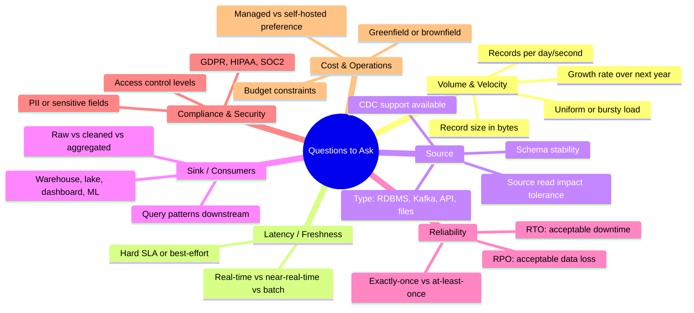

### Volume & Velocity
- How many records or events per day? Per second at peak?
- What is the size of a typical record (bytes)?
- Is the load uniform or bursty (e.g., 10x spike during business hours)?
- How fast is data volume expected to grow over the next year?

### Latency / Freshness
- How fresh does the data need to be at the sink — real-time (< 1 sec), near-real-time (< 5 min), hourly, or daily?
- Is this a hard SLA or a best-effort target?
- Is there a difference between operational freshness (dashboards) and analytical freshness (reports)?

### Source
- What is the source system? (RDBMS, Kafka, REST API, files, SaaS tool?)
- Does the source support CDC / log-based extraction, or only bulk export?
- Can the source handle the read load of extraction, or do we need to minimize its impact?
- Is the schema stable or does it change frequently?
- Is there a read replica available?
- What timezone is the source data in?

### Sink / Consumers
- Where does the data need to land — data warehouse, data lake, real-time dashboard, ML feature store?
- Who are the downstream consumers and what queries do they run?
- Do they need the raw data, cleaned data, or aggregated data?
- Are there multiple consumers with different freshness needs?

### Reliability & Correctness
- What is the acceptable data loss tolerance (RPO)? Can we re-ingest on failure?
- What is the acceptable downtime (RTO)?
- Must the pipeline be exactly-once, or is at-least-once with deduplication acceptable?
- Is there a backup or replay mechanism at the source?

### Compliance & Security
- Does the data contain PII or sensitive fields?
- Are there regulatory requirements (GDPR, HIPAA, SOC2)?
- Who should have access to raw vs. transformed data?
- Is data residency (geographic restriction) required?
- Are there encryption requirements (at-rest, in-transit)?

### Cost & Operations
- Is this a greenfield design or does it need to integrate with existing infrastructure?
- Is there a preference between managed cloud services vs. self-managed tools?
- Are there cost constraints (e.g., minimize egress, avoid premium services)?
- What is the team's skill set (Spark, Flink, cloud-native)?
- What monitoring/alerting infrastructure exists?

---

## 3. Universal Framework for Any Pipeline Design Question

Use this structure every time. It maps to how interviewers score your answers.

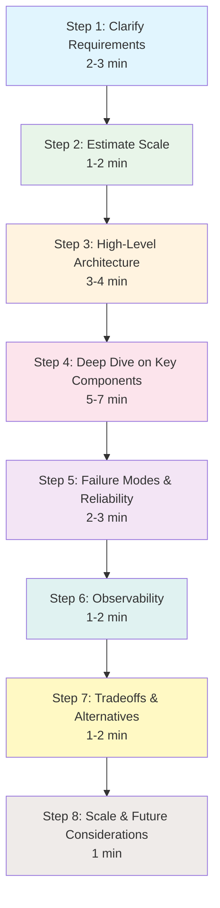

```
STEP 1 — Clarify Requirements (2-3 min)
         Ask the questions from Section 2. State your assumptions explicitly.

STEP 2 — Estimate Scale (1-2 min)
         Back-of-envelope: events/day x record size -> GB/day -> GB/month
         Derive: throughput (records/sec), storage, compute sizing.

STEP 3 — High-Level Architecture (3-4 min)
         Draw: Source -> Ingestion Layer -> Raw Storage -> Transform -> Sink -> Consumers
         Name each component and why you chose it.

STEP 4 — Deep Dive on Key Components (5-7 min)
         Ingestion method (batch/stream/CDC)
         Schema handling
         Partitioning & file format
         Orchestration (how does it trigger and retry?)

STEP 5 — Failure Modes & Reliability (2-3 min)
         What can break? How do you detect it? How do you recover?
         Idempotency, checkpointing, DLQ, alerting.

STEP 6 — Observability (1-2 min)
         Metrics: row counts, latency, error rate, lag
         Alerts, lineage, data quality checks.

STEP 7 — Tradeoffs & Alternatives (1-2 min)
         "I chose X over Y because... but if the requirement changes to Z, I'd switch to Y."

STEP 8 — Scale & Future Considerations (1 min)
         How does the design hold up at 10x volume? What breaks first?
```

### Framework Scoring Rubric (What Interviewers Look For)

| Dimension | Junior (L3-L4) | Mid (L5) | Senior (L6+) |
|---|---|---|---|
| Clarification | Asks 1-2 questions | Asks 5-6 targeted questions | Systematically covers all dimensions |
| Scale | Skips estimation | Basic math | Precise with units, considers growth |
| Architecture | Names tools only | Explains why each component | Discusses alternatives and tradeoffs |
| Failure modes | Mentions retries | DLQ + checkpointing | RPO/RTO quantified, graceful degradation |
| Observability | "We'd add monitoring" | Specific metrics | Ties metrics to SLOs, alerting thresholds |

---

## 4. Case Studies

---

### Case 1 — Batch Ingestion: Daily Sales/Transactional Data

**Prompt:**  
*"Design a pipeline to ingest daily sales transactions from a PostgreSQL OLTP database into a data warehouse for BI reporting. The table has ~10 million rows and grows by ~200K rows per day."*

---

#### Step 1 — Clarify & Assumptions

| Question | Assumed Answer |
|---|---|
| Full load or incremental? | Incremental (rows have `updated_at` column) |
| Freshness requirement? | Data available in warehouse by 6 AM daily |
| Deletes at source? | Soft deletes only (a `is_deleted` flag) |
| Downstream consumers? | Tableau dashboards, dbt models |
| Warehouse target? | Snowflake |

---

#### Step 2 — Scale Estimation

```
200,000 rows/day x 500 bytes/row = 100 MB/day
Compressed Parquet (~4:1): ~25 MB/day
Monthly: ~750 MB — very manageable

Peak extract window: 200K rows extracted in 30-min batch window
= ~110 rows/sec -> low pressure on source PostgreSQL
```

---

#### Step 3 — High-Level Architecture

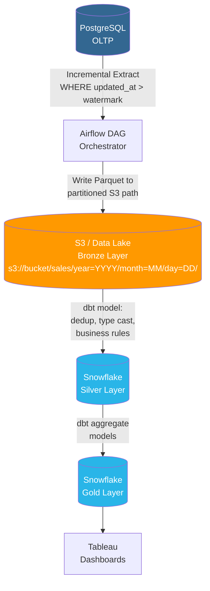

---

#### Step 4 — Key Design Decisions

**Incremental Strategy — Watermark on `updated_at`**
```sql
SELECT *
FROM sales_transactions
WHERE updated_at > '{{ prev_ds }} 00:00:00'
  AND updated_at <= '{{ ds }} 00:00:00'
```
- Store watermark in Airflow Variable or a metadata table
- Risk: rows updated exactly at boundary can be missed -> use `<=` on upper bound and overlap by 5 minutes to be safe

**Handling Soft Deletes**
- `is_deleted = true` rows are extracted normally in the incremental pull
- In the Silver layer dbt model, filter or flag deleted rows for downstream

**Idempotency**
- S3 path includes the date partition -> re-running the same day overwrites the same S3 path
- Snowflake COPY INTO is idempotent with file tracking (won't re-load the same file)

**Orchestration — Airflow DAG**

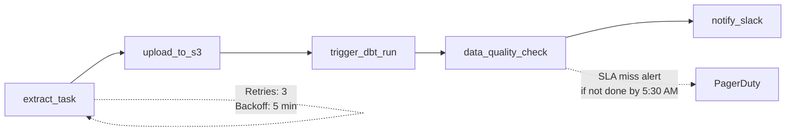

- Retries: 3 attempts, 5-minute backoff
- SLA miss alert if DAG hasn't completed by 5:30 AM

---

#### Step 5 — Failure Modes

| Failure | Detection | Recovery |
|---|---|---|
| PostgreSQL connection drops mid-extract | Airflow task fails, alerts fire | Retry with same watermark — idempotent |
| S3 upload partially completes | File size check in next task | Delete partial file, retry upload |
| dbt model fails on schema change | dbt compilation error | Alert on-call, investigate schema drift |
| Duplicate rows from boundary overlap | Row count anomaly alert | Dedup in Silver layer using `ROW_NUMBER()` on primary key |
| Snowflake is down during load window | Airflow task fails on connection | Retry; data is safe in S3 (buffer); load when Snowflake recovers |

---

#### Step 6 — Observability

- **Row count check**: compare extracted rows vs. expected ~200K +/- 20%
- **Freshness check**: alert if Gold table `max(updated_at)` is > 26 hours old
- **dbt tests**: `not_null`, `unique` on primary key, `accepted_values`
- **Pipeline duration**: alert if DAG takes > 2x historical p95

---

#### Step 7 — Tradeoffs

| Decision | Chosen | Alternative | Why not alternative |
|---|---|---|---|
| Ingestion tool | Custom Airflow + SQL | Fivetran / Airbyte | More control, no per-row pricing at this scale |
| Transform layer | dbt in Snowflake | Spark | Snowflake SQL is sufficient; no need for distributed compute |
| Incremental strategy | Watermark on `updated_at` | Full load nightly | Full load costs 50x more compute and time |
| File format | Parquet (S3 landing) | CSV | Parquet is 4x smaller and faster to load into Snowflake |

---

#### Cross-Questions for Case 1

- *"What if the source doesn't have an `updated_at` column?"* -> Fall back to full load + MERGE at sink, or use CDC (log-based)
- *"What if the BI team needs data refreshed every hour, not daily?"* -> Move to hourly micro-batch Airflow DAG or switch to CDC
- *"How do you handle a failed backfill spanning 3 months?"* -> Parameterize DAG with `start_date` + `end_date`, run with `airflow dags backfill`; ensure idempotency
- *"What happens if Snowflake is down during the load window?"* -> Airflow retries; data is safe in S3 (which becomes the buffer); load when Snowflake recovers
- *"How do you ensure no duplicate rows in the final Gold table?"* -> Dedup in Silver using `QUALIFY ROW_NUMBER() OVER (PARTITION BY id ORDER BY updated_at DESC) = 1`
- *"What if two Airflow DAGs run simultaneously due to a scheduler bug?"* -> Idempotent S3 paths prevent duplication; add `max_active_runs=1` on the DAG; use Airflow pool limits
- *"How would you handle a table with 500 million rows for initial load?"* -> Parallelize by range (e.g., split by ID modulo or date ranges); use COPY command with multiple threads

---

---

### Case 2 — Real-Time Streaming: Clickstream / Event Data

**Prompt:**  
*"Design a pipeline to capture user clickstream events from a web application (page views, button clicks, purchases) and make them available for real-time dashboards and daily analytics. Expect ~5,000 events/second on average, 20,000/sec at peak."*

---

#### Step 1 — Clarify & Assumptions

| Question | Assumed Answer |
|---|---|
| Latency for real-time dashboard? | < 5 minutes |
| Latency for analytics warehouse? | Hourly batch is acceptable |
| Event schema stable? | Core fields stable; custom attributes in a JSON blob |
| Deduplication needed? | Yes — mobile clients may retry on network failure |
| Data retention in streaming layer? | 7 days |

---

#### Step 2 — Scale Estimation

```
Average: 5,000 events/sec x 1 KB/event = 5 MB/sec = 18 GB/hour = 432 GB/day
Peak: 20,000 events/sec x 1 KB = 20 MB/sec

Kafka sizing:
  - 3 brokers, replication factor 3
  - Partitions: 20,000 / 1,000 (per-partition throughput safe ceiling) = 20 partitions
  - Storage: 432 GB/day x 7 days retention = ~3 TB

Daily Parquet (compressed ~5:1): 432 / 5 = 86 GB/day in S3
Monthly: ~2.6 TB in S3 — manageable
```

---

#### Step 3 — High-Level Architecture

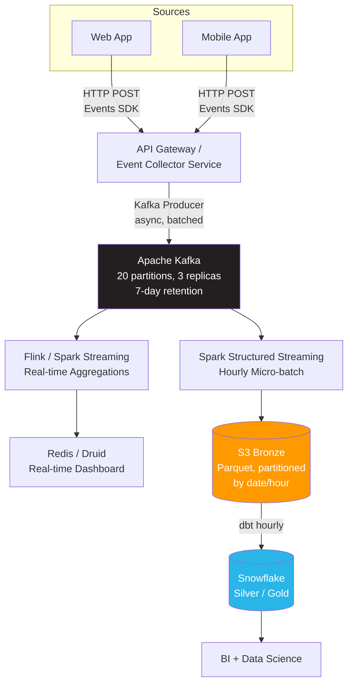

---

#### Step 4 — Key Design Decisions

**Why Kafka over direct-to-S3?**
- Decouples producers from consumers — multiple consumers (real-time + batch) read independently
- Absorbs spikes without losing data — acts as a durable buffer
- 7-day retention = built-in replay capability for backfills

**Deduplication**
- Client embeds a `event_id` (UUID v4) with each event
- At the Kafka consumer, use a sliding window dedup: check against a Redis SET with TTL = 24 hours
- Alternatively, in the Spark micro-batch: `MERGE INTO silver_events USING incoming ON event_id` -> skip if exists

**Schema Handling**
- Core fields (`user_id`, `event_type`, `timestamp`, `page_url`) are enforced with a JSON schema at the collector
- Custom attributes land in a `properties` JSON column — parsed downstream on-demand
- Use Schema Registry (Confluent) to version and enforce Avro schemas on Kafka topics

**Partitioning at S3**
```
s3://bucket/clickstream/year=YYYY/month=MM/day=DD/hour=HH/part-*.parquet
```
- Enables partition pruning for hourly/daily queries
- Spark writes with `trigger(processingTime="1 hour")` or `trigger(availableNow=True)` for micro-batch

**Checkpointing**
```python
# Spark Structured Streaming
df.writeStream \
  .format("delta") \
  .option("checkpointLocation", "s3://bucket/checkpoints/clickstream/") \
  .partitionBy("date", "hour") \
  .start("s3://bucket/clickstream/")
```

**Late-Arriving Data Strategy**
```python
# Allow events up to 2 hours late before dropping
df.withWatermark("event_time", "2 hours") \
  .groupBy(window("event_time", "5 minutes"), "page_url") \
  .count()
```

---

#### Step 5 — Failure Modes

| Failure | Detection | Recovery |
|---|---|---|
| API collector goes down | Health check -> alert | Events buffer in client SDK (retry queue); Kafka is the safety net |
| Kafka broker failure | Kafka under-replicated partitions alert | Replicas take over; replication factor 3 tolerates 2 broker failures |
| Spark consumer falls behind | Kafka consumer lag > 10 min -> alert | Scale up Spark executors; Kafka retains data for 7 days |
| Corrupt event payload | Schema validation at collector; DLQ topic | Route to `clickstream-dlq` Kafka topic; alert + manual review |
| Spark job crash mid-write | Checkpoint ensures restart from last committed offset | Restart job -> reads from checkpoint -> no data loss or duplication |
| Sudden traffic spike (10x) | Kafka producer queue full, latency increase | Auto-scale collectors; Kafka absorbs burst; consumers catch up post-spike |

---

#### Step 6 — Observability

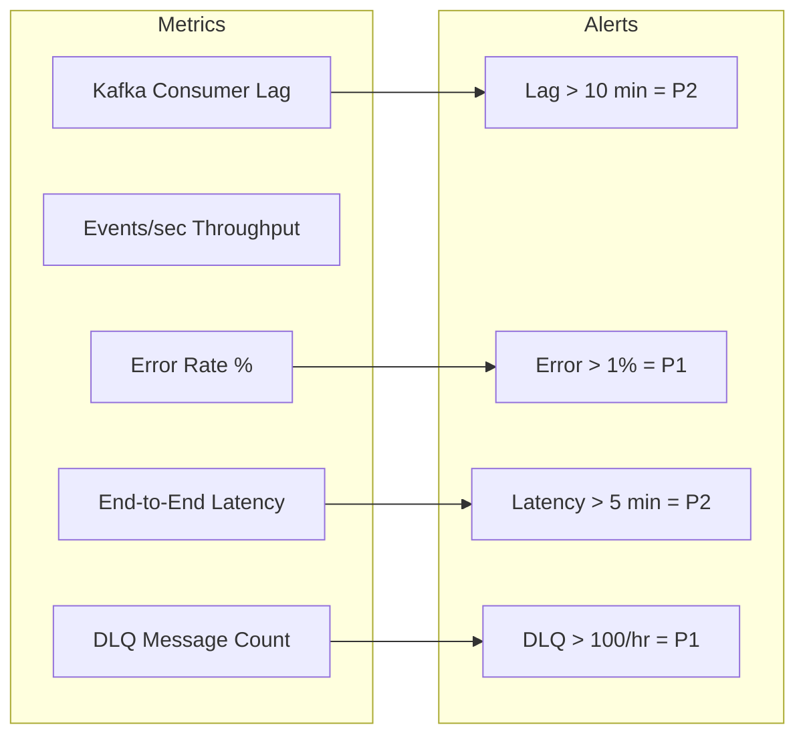

---

#### Step 7 — Tradeoffs

| Decision | Chosen | Alternative | Why not alternative |
|---|---|---|---|
| Message bus | Kafka | Kinesis | Kafka: open source, no per-shard cost, more ecosystem tools |
| Stream processor | Spark Structured Streaming | Flink | Spark: same engine as batch layer -> unified team skills |
| Real-time store | Druid / Redis | Push to Snowflake | Snowflake latency (~seconds) too high for sub-5-min dashboard |
| Dedup window | 24-hour Redis TTL | Exactly-once Kafka transactions | Redis is simpler; Kafka exactly-once adds significant complexity |

---

#### Cross-Questions for Case 2

- *"How do you handle late-arriving events (mobile app offline for 2 hours)?"* -> Set watermark to tolerate 2-hour lateness in Spark; events arriving after watermark go to a separate late-data partition
- *"How do you backfill 30 days of data if a new Silver table is needed?"* -> Re-consume from Kafka (within 7-day retention), or replay from S3 Bronze; for older data, always keep Bronze immutable
- *"What if Kafka goes down?"* -> Collector writes to a local buffer (disk or Redis queue) and replays when Kafka recovers; configure producer with `acks=all` and `retries=INT_MAX`
- *"How would you scale to 10x volume (200K events/sec)?"* -> Add Kafka partitions (scale to 200), add Spark workers, use auto-scaling; S3 and Snowflake are effectively elastic
- *"What is the cost of 7-day Kafka retention at this scale?"* -> 3 TB x 3 replicas = 9 TB on Kafka brokers -> ~$900/month on EBS; vs. $0.023/GB in S3 = $69/month. For cost savings at 10x scale, consider tiered Kafka storage (offload to S3 after 24 hours)
- *"How do you guarantee ordering of events for a single user?"* -> Partition Kafka by `user_id` — all events for a user go to the same partition -> guaranteed ordering within partition
- *"What if the schema of events changes (new event types)?"* -> Schema Registry enforces backward compatibility; new event types are added as new values in `event_type` field; custom properties go in the JSON blob

---

---

### Case 3 — CDC-Based Ingestion: OLTP to Analytics

**Prompt:**  
*"An e-commerce company has an orders table in MySQL that receives 5,000 INSERTs and 2,000 UPDATEs per minute. They want this data in their data warehouse with < 10 minutes of latency, without impacting the production database."*

---

#### Step 1 — Clarify & Assumptions

| Question | Assumed Answer |
|---|---|
| Can we read the MySQL binlog? | Yes — binlog format is ROW |
| Is there a replica we can read from? | Yes — a read replica exists |
| Deletes need to be propagated? | Yes (hard deletes happen) |
| Target warehouse? | Snowflake |
| History / SCD needed? | Append full history for auditing |

---

#### Step 2 — Scale Estimation

```
5,000 INSERTs + 2,000 UPDATEs = 7,000 ops/minute = ~117 ops/second

Average order row: 2 KB
CDC event: ~2-4 KB (includes before + after image for UPDATEs)

Throughput: 117 x 3 KB = ~350 KB/sec = ~21 MB/min = 1.2 GB/hour

Kafka topic: 2 partitions sufficient (well under 1 MB/sec/partition limit)
Daily S3 landing: 1.2 GB x 24 = 29 GB/day (uncompressed)
Compressed Parquet: ~7 GB/day
```

---

#### Step 3 — High-Level Architecture

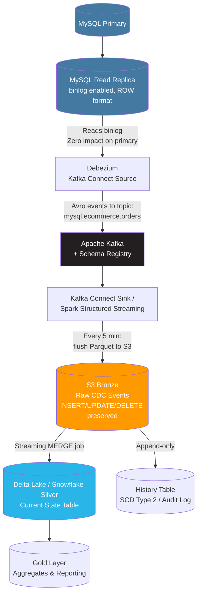

---

#### CDC Pipeline — End-to-End Sequence

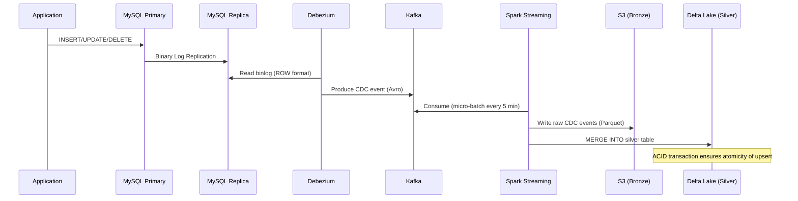

---

#### Step 4 — Key Design Decisions

**Why CDC over Polling?**

| | Polling (WHERE updated_at >) | CDC (Binlog) |
|---|---|---|
| Source impact | SELECT queries load the DB | Reads log file only — near zero impact |
| Latency | Minimum = poll interval (1 min) | Sub-second |
| Captures DELETEs? | No (hard deletes invisible) | Yes |
| Requires schema change? | Yes (need `updated_at` column) | No |
| Complexity | Low | Medium |
| Ordering guarantee | No (concurrent updates) | Yes (binlog is ordered) |

**Debezium Event Structure**
```json
{
  "op": "u",
  "before": { "order_id": 123, "status": "pending", "amount": 99.99 },
  "after":  { "order_id": 123, "status": "shipped", "amount": 99.99 },
  "source": { "db": "ecommerce", "table": "orders", "ts_ms": 1715000000000 },
  "ts_ms": 1715000000100
}
```
- `op` values: `c` = create, `u` = update, `d` = delete, `r` = snapshot read
- `before` image: state before the change (null for inserts)
- `after` image: state after the change (null for deletes)
- `source.ts_ms`: timestamp of the change in the source database

**MERGE at Silver Layer (Delta Lake)**
```sql
MERGE INTO silver.orders AS target
USING cdc_batch AS source
ON target.order_id = source.order_id
WHEN MATCHED AND source.op = 'd' THEN
  UPDATE SET target.is_deleted = true, target.deleted_at = source.ts
WHEN MATCHED AND source.op IN ('u','c') THEN
  UPDATE SET *
WHEN NOT MATCHED AND source.op != 'd' THEN
  INSERT *
```

**SCD Type 2 for History (Audit Requirements)**
```sql
-- Close existing record
UPDATE silver.orders_history
SET valid_to = source.ts, is_current = false
WHERE order_id = source.order_id AND is_current = true;

-- Insert new version
INSERT INTO silver.orders_history
SELECT *, source.ts AS valid_from, NULL AS valid_to, true AS is_current
FROM cdc_batch;
```

**Initial Snapshot**
- Debezium performs an initial snapshot of the full table (reads all rows as `op=r`) before switching to binlog streaming
- This can be resource-intensive — run during off-peak hours or read from replica
- Snapshot modes: `initial` (full), `schema_only` (no data), `when_needed` (if no offset found)

---

#### Step 5 — Failure Modes

| Failure | Detection | Recovery |
|---|---|---|
| Debezium loses binlog position | Kafka consumer lag, connector status | If within binlog retention window: resume from last offset. If binlog rotated: full re-snapshot |
| MySQL replica lag | Replica lag > 30 sec -> alert | Debezium reads stale data; tolerable if replica lag < freshness SLA |
| Schema change on source table (new column) | Debezium schema evolution detection | With Schema Registry: auto-schema evolution if backward-compatible; alert if breaking change |
| MERGE job fails mid-batch | Delta Lake transaction rollback (ACID) | Retry the batch; Delta ensures atomicity |
| Out-of-order events from multiple partitions | Ordering anomaly in Silver | Use single Kafka partition per table (sacrifice parallelism for ordering) or handle out-of-order with `ts_ms` ordering in MERGE |

---

#### Cross-Questions for Case 3

- *"What if the MySQL binlog isn't enabled?"* -> Enable it (requires MySQL restart); alternatively, use trigger-based CDC or a polling approach with an `updated_at` column (but lose DELETE capture)
- *"How does Debezium handle MySQL failover to a new primary?"* -> Debezium can be configured with GTID-based replication — it reconnects and continues from the last GTID automatically
- *"How do you handle schema changes without breaking consumers?"* -> Schema Registry with forward/backward compatibility rules; any breaking change triggers an alert and pipeline pause
- *"How would you build SCD Type 2 on top of CDC events?"* -> Keep Bronze as an append-only CDC log; in Silver, write a MERGE that closes the previous row's `valid_to` date and inserts a new row
- *"What about multi-table CDC with foreign key relationships?"* -> Use a single Kafka Connect cluster with connectors for all tables; consume all into the same Spark job; process in FK order to maintain referential integrity
- *"How do you handle the initial snapshot for a 500GB table?"* -> Use Debezium's `snapshot.mode=initial` with `snapshot.fetch.size` tuning; or pre-load via a bulk export and start Debezium with `snapshot.mode=schema_only`

---


### Case 4 — API-Based Ingestion: Third-Party SaaS Data

**Prompt:**  
*"Design a pipeline to ingest data from a CRM (Salesforce) and a marketing platform (HubSpot) into your data warehouse daily. Each has REST APIs with rate limits."*

---

#### Step 1 — Clarify & Assumptions

| Question | Assumed Answer |
|---|---|
| Salesforce API limit? | 15,000 requests/24 hours (Enterprise edition) |
| HubSpot API limit? | 150 requests/10 seconds |
| Volume per API call? | Up to 2,000 records per page |
| Freshness needed? | Daily refresh; data available by 7 AM |
| Objects to ingest? | Leads, Contacts, Opportunities, Activities |

---

#### Step 2 — Scale Estimation

```
Salesforce Contacts: 500,000 records / 2,000 per page = 250 API calls
Salesforce Opportunities: 100,000 / 2,000 = 50 calls
Activities (incremental): ~5,000/day / 2,000 = 3 calls
Total Salesforce: ~310 calls/day -> well within 15,000 limit

HubSpot rate limit: 150 req/10 sec = 15 req/sec
With exponential backoff on 429 responses -> throttle to 10 req/sec

Data volume: ~2 GB/day total across both sources (JSON)
Compressed in S3: ~500 MB/day
```

---

#### Step 3 — High-Level Architecture

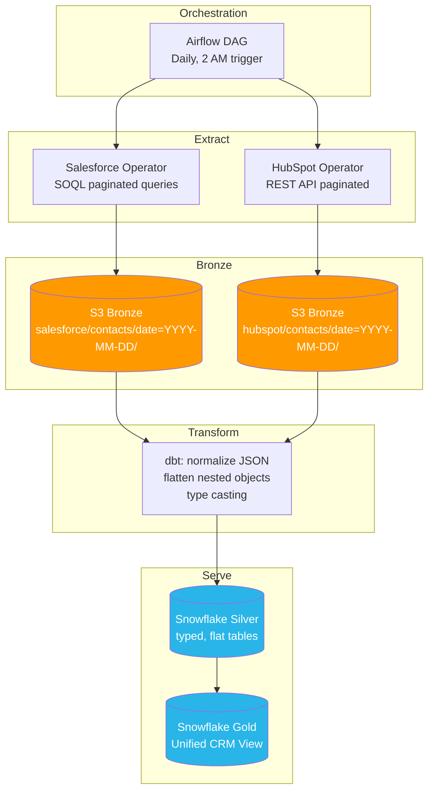

---

#### Step 4 — Key Design Decisions

**Incremental vs. Full Load**
- Contacts/Leads: incremental using `SystemModstamp > {watermark}` (Salesforce) or `lastModifiedDate` (HubSpot)
- Full load monthly for reference tables (picklists, lookup tables)

**Rate Limit Handling**
```python
import time
from requests.exceptions import HTTPError

def api_get_with_retry(url, headers, max_retries=5):
    for attempt in range(max_retries):
        response = requests.get(url, headers=headers)
        if response.status_code == 429:
            retry_after = int(response.headers.get("Retry-After", 10))
            time.sleep(retry_after * (2 ** attempt))  # exponential backoff
        elif response.ok:
            return response.json()
        else:
            raise HTTPError(f"API error: {response.status_code}")
    raise Exception("Max retries exceeded")
```

**Pagination Pattern**
```python
def paginate_salesforce(query, session):
    """Handle Salesforce cursor-based pagination."""
    url = f"{base_url}/query?q={query}"
    all_records = []
    
    while url:
        response = api_get_with_retry(url, session.headers)
        all_records.extend(response["records"])
        url = response.get("nextRecordsUrl")  # None when done
        if url:
            url = f"{base_url}{url}"
    
    return all_records
```

**Idempotency**
- S3 path: `s3://bucket/salesforce/contacts/date=YYYY-MM-DD/`
- Re-running the DAG overwrites the same date partition
- Snowflake MERGE on primary key ensures no duplicates

**Secrets Management**
- API keys stored in AWS Secrets Manager
- Airflow retrieves via `{{ conn.salesforce.password }}` or `boto3.client('secretsmanager')`
- OAuth tokens auto-refreshed before expiry

---

#### Step 5 — Failure Modes

| Failure | Detection | Recovery |
|---|---|---|
| API rate limit exceeded | 429 response -> exponential backoff | Retry with backoff; split into smaller batches if persistent |
| API token expired | 401 response | Auto-refresh OAuth token; alert if refresh fails |
| API schema change (new/removed field) | JSON parse error or schema drift alert | Add schema validation; alert if unexpected fields appear |
| Partial extraction (mid-pagination failure) | Row count check vs. last run | Re-run from page 1 (idempotent path) or resume from cursor if API supports it |
| API downtime (503) | Connection error | Circuit breaker pattern: retry 3x -> backoff 30 min -> retry 3x -> alert on-call |

---

#### Step 6 — Observability

| Metric | Alert Threshold |
|---|---|
| API calls remaining (daily quota) | < 20% remaining -> warning |
| Extraction row count vs. expected | +/- 30% of yesterday -> investigate |
| API response time p95 | > 5 seconds -> throttle concurrency |
| OAuth token expiry | < 1 hour until expiry -> auto-refresh |

---

#### Cross-Questions for Case 4

- *"What if we need data every hour, not daily?"* -> Switch to Fivetran or Airbyte (managed connectors) which handle pagination, rate limits, and incremental sync automatically; or build a streaming webhook receiver if the SaaS supports webhooks
- *"How would you unify Salesforce and HubSpot contacts who represent the same person?"* -> Identity resolution in Gold layer: match on email address + phone number, assign a canonical `customer_id`
- *"Salesforce changed a field name in their API. How do you detect and handle this?"* -> Validate API response schema against a stored JSON Schema; alert on unexpected field changes; use a tolerant parser that writes unknown fields to a `_extra` JSON column
- *"Build vs. Buy for API connectors?"* -> At <5 connectors, custom code gives more control. At 10+, Fivetran/Airbyte saves engineering time. Evaluate: cost per connector x maintenance burden vs. managed service pricing
- *"How do you handle API versioning (v1 -> v2)?"* -> Abstract API version behind a connector class; swap implementation without changing downstream logic; test v2 output against v1 schema before switching

---

---

### Case 5 — High-Throughput Ingestion: 2 Million Events/Second

**Prompt:**  
*"Design a data ingestion system capable of handling 2 million events per second — think IoT sensor data or a global gaming telemetry platform."*

---

#### Step 1 — Clarify & Assumptions

| Question | Assumed Answer |
|---|---|
| Event size? | ~200 bytes each |
| Latency for downstream analytics? | < 1 minute for operational dashboards |
| Geographic distribution? | Global — events from Asia, EU, Americas |
| Durability requirement? | No event loss; at-least-once |
| Schema? | Fixed schema — sensor_id, metric, value, timestamp |

---

#### Step 2 — Scale Estimation

```
2,000,000 events/sec x 200 bytes = 400 MB/sec = 1.44 TB/hour = 34.5 TB/day

Compressed Parquet (10:1 for this type of data): 3.45 TB/day in S3

Kafka sizing:
  - Safe throughput per partition: ~10 MB/sec
  - Required: 400 MB/sec / 10 MB/sec = 40 partitions minimum
  - Use 100 partitions for headroom (supports 10x growth before repartitioning)
  - Brokers: 20 brokers with replication factor 3
  - 7-day retention: 34.5 TB x 7 = 242 TB on Kafka (use tiered storage -> S3 after 1 day)

Kafka network: 400 MB/sec x 3 replicas = 1.2 GB/sec total broker ingest bandwidth

Cost estimation:
  - S3 storage (30 days): 3.45 TB x 30 = 103.5 TB x $0.023/GB = ~$2,380/month
  - Kafka brokers (20 x i3.2xlarge): 20 x $0.624/hr x 730 hr = ~$9,110/month
  - Flink cluster (auto-scaling): ~$5,000/month
  - Total infrastructure: ~$16,500/month
```

---

#### Step 3 — High-Level Architecture

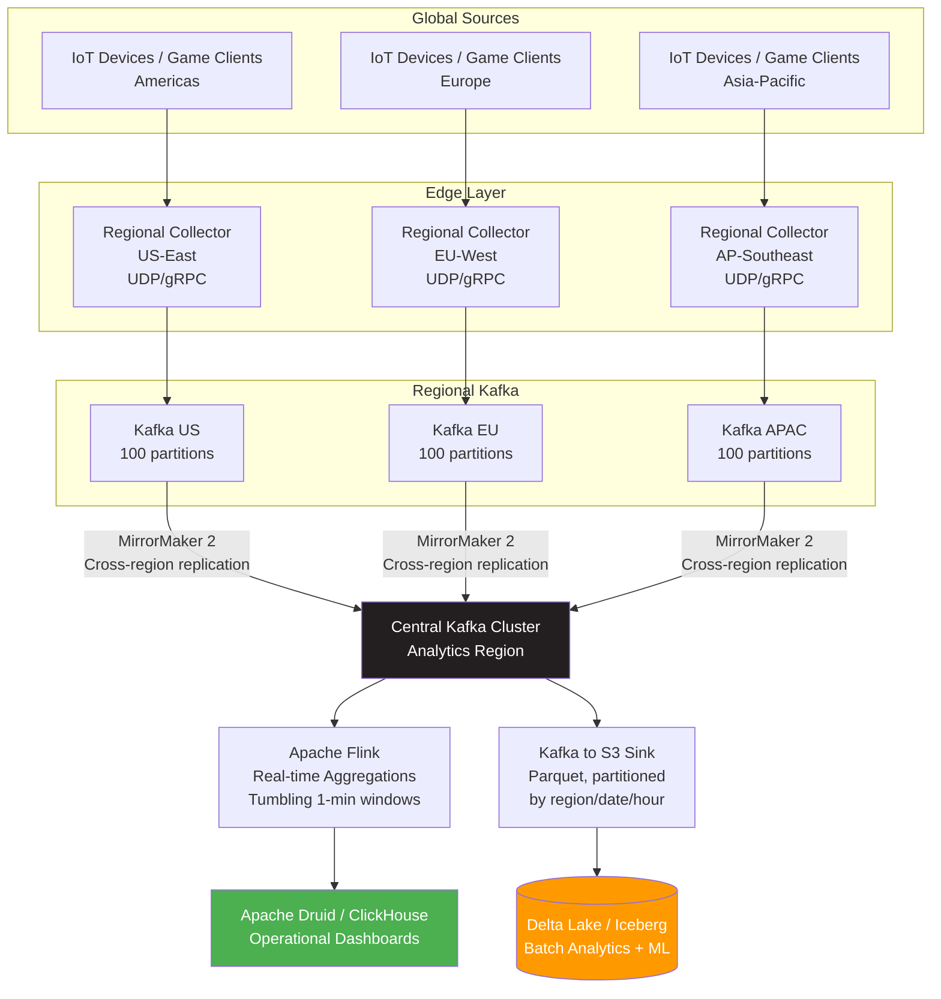

---

#### Step 4 — Key Design Decisions

**Regional Edge Collectors**
- Deploy lightweight stateless collectors in each region to minimize cross-continental latency
- Use UDP for non-critical metrics (accept some loss for < 1% of events), TCP/gRPC for critical events
- Batch 1,000 events per Kafka message to reduce producer overhead

**Kafka Tiered Storage**
- Hot tier: local broker disks -> 24 hours of data (~34.5 TB raw)
- Cold tier: auto-offload to S3 after 24 hours (Confluent Tiered Storage or Apache Kafka 3.6+ native)
- Consumer reads transparently from either tier

**Flink for Real-Time Aggregations**
```java
// Tumbling window: 1-minute buckets per sensor_id
DataStream<SensorReading> readings = env
    .addSource(kafkaConsumer)
    .keyBy(SensorReading::getSensorId)
    .window(TumblingEventTimeWindows.of(Time.minutes(1)))
    .aggregate(new StatsAggregator());  // min, max, avg, p99
    
// Output to Druid for sub-second dashboard queries
readings.addSink(druidSink);
```

**Back-pressure Handling**

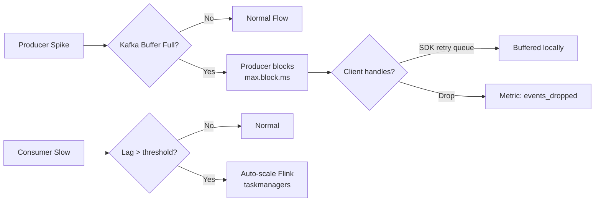

- Kafka acts as the primary buffer absorbing producer spikes
- Flink consumers set `max.poll.records` and have bounded queues
- If Flink consumer lag exceeds 5 minutes -> auto-scale Flink task managers

---

#### Step 5 — Failure Modes

| Failure | Detection | Recovery |
|---|---|---|
| Regional collector crash | Health check + client-side retry queue | Clients retry with exponential backoff; missed events < RTO = 30 sec |
| Kafka broker failure | Under-replicated partitions alert | Replication factor 3 -> tolerates 2 failures; re-election in seconds |
| Central cluster unreachable | MirrorMaker lag alert | Regional clusters continue independently; replicate when central recovers |
| Flink job fails | Flink job manager alerts | Restart from checkpoint (every 30 sec) -> minimal data re-processing |
| Network partition between regions | Cross-region latency spike | Regional clusters serve local dashboards; sync when restored |

---

#### Cross-Questions for Case 5

- *"How do you handle clock skew between IoT devices sending events with wrong timestamps?"* -> Use processing time as primary key for operational dashboards; store both `event_time` and `ingest_time`; apply late-data handling with 60-second watermark tolerance
- *"How do you control costs at this scale?"* -> S3 for cold storage (~$0.023/GB), spot instances for Flink workers (60-70% savings), Kafka tiered storage reduces broker disk costs by 80%
- *"How would you replay 3 days of events to a new analytics table?"* -> Re-consume from Kafka (7-day retention) or replay from S3 Bronze using a Flink batch job or Spark
- *"What happens if one region generates 80% of the traffic?"* -> Auto-scale regional collectors independently; Kafka partitions handle skew via key-based routing; monitor per-region throughput
- *"How do you ensure the system handles a Black Friday 10x spike?"* -> Pre-provision Kafka partitions and brokers; auto-scaling groups for collectors and Flink; load test at 15x before the event

---

---

### Case 6 — Multi-Source Hybrid Pipeline (Batch + Stream)

**Prompt:**  
*"Design a unified pipeline for an e-commerce platform that needs to combine: (1) order events from Kafka (real-time), (2) product catalog from a PostgreSQL DB (daily batch), and (3) customer profiles from a CRM API (daily). The goal is a unified customer 360 view refreshed every hour."*

---

#### Architecture

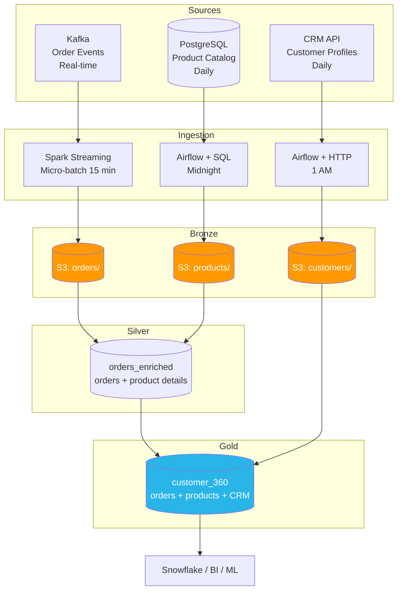

---

**Key Challenge — Different Refresh Frequencies**

| Source | Frequency | Strategy |
|---|---|---|
| Orders (Kafka) | Real-time | Micro-batch every 15 min to S3 |
| Product catalog | Daily | Airflow DAG at midnight |
| CRM profiles | Daily | Airflow DAG at 1 AM |
| Customer 360 | Hourly | dbt model runs at :00 of each hour after batch sources land |

**Dependency Management in Airflow**

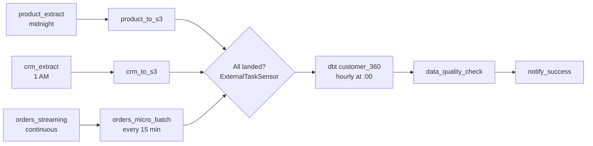

```python
# Gold dbt model waits for Silver orders AND CRM batch to complete
customer_360_task.set_upstream([orders_silver_task, crm_batch_task])

# Use ExternalTaskSensor for cross-DAG dependencies
wait_for_crm = ExternalTaskSensor(
    task_id="wait_for_crm",
    external_dag_id="crm_daily_ingest",
    external_task_id="crm_to_s3",
    timeout=3600,  # 1 hour max wait
    mode="reschedule",
)
```

**Handling Stale Data Gracefully**
```python
# If CRM data is stale, use previous day's data with a staleness flag
if not check_crm_freshness():
    log.warning("CRM data stale - using yesterday's snapshot")
    add_metadata_flag("crm_staleness_warning", execution_date)
```

---

#### Cross-Questions for Case 6

- *"What if the CRM API is down and the hourly dbt run is triggered?"* -> Use Airflow sensors to check if CRM data landed in S3 before triggering dbt; if not landed within SLA, use the previous day's CRM data and flag the staleness
- *"How do you handle schema mismatches between the three sources during a join?"* -> Normalize field names and types in Silver models (dbt `source` mappings); use explicit casts; fail early with dbt tests
- *"How do you handle late orders that arrive after the hourly aggregation?"* -> Orders from the streaming layer continuously update Bronze; hourly dbt re-processes the last 2 hours of orders to catch late arrivals
- *"What if the product catalog changes mid-day (price update) but you only refresh daily?"* -> For Gold analytics, accept daily freshness for product data; for real-time pricing, add a separate streaming CDC from PostgreSQL for the price column

---

---

### Case 7 — Data Quality & Observability Pipeline

**Prompt:**  
*"Your team's pipelines are unreliable — dashboards show wrong numbers, data is stale, and nobody notices until a business user complains. Design a data quality and observability layer."*

---

#### Architecture

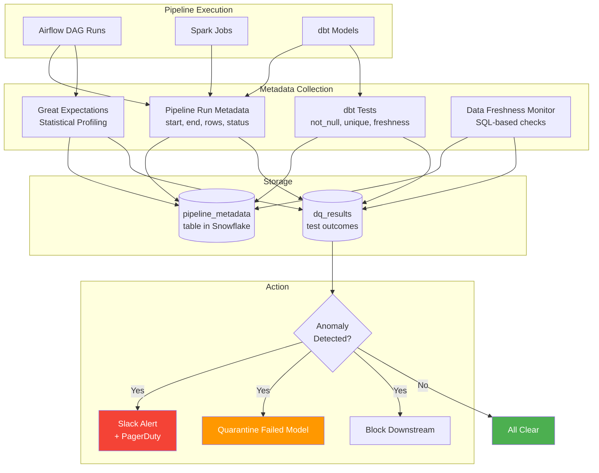

---

**Observability Layers**

```mermaid
flowchart LR
    subgraph L1["Layer 1: Pipeline Health"]
        A["DAG success/failure"]
        B["Run duration"]
        C["Task retries"]
    end
    
    subgraph L2["Layer 2: Data Quality"]
        D["Row counts"]
        E["Null rates"]
        F["Uniqueness"]
        G["Referential integrity"]
    end
    
    subgraph L3["Layer 3: Data Freshness"]
        H["Table last updated"]
        I["Max event timestamp"]
        J["Staleness vs SLA"]
    end
    
    subgraph L4["Layer 4: Business Logic"]
        K["Revenue != negative"]
        L["Order count correlates with revenue"]
        M["No future dates"]
    end
    
    L1 --> L2 --> L3 --> L4
```

---

**Implementation Details**

```sql
-- Pipeline metadata table
CREATE TABLE pipeline_metadata (
    pipeline_name STRING,
    run_id STRING,
    start_time TIMESTAMP,
    end_time TIMESTAMP,
    rows_extracted INT,
    rows_loaded INT,
    rows_rejected INT,
    status STRING,  -- SUCCESS, FAILED, PARTIAL
    error_message STRING
);

-- Data freshness monitor
SELECT 
    table_name,
    MAX(updated_at) AS last_updated,
    DATEDIFF('hour', MAX(updated_at), CURRENT_TIMESTAMP()) AS hours_stale,
    CASE 
        WHEN hours_stale > sla_hours THEN 'BREACHED'
        WHEN hours_stale > sla_hours * 0.8 THEN 'WARNING'
        ELSE 'OK'
    END AS freshness_status
FROM information_schema.tables_freshness
GROUP BY table_name;
```

**Great Expectations / Elementary (dbt package)**
```yaml
# dbt schema.yml test definitions
models:
  - name: orders_silver
    columns:
      - name: order_id
        tests:
          - unique
          - not_null
      - name: order_total
        tests:
          - not_null
          - dbt_expectations.expect_column_values_to_be_between:
              min_value: 0
              max_value: 100000
      - name: order_date
        tests:
          - dbt_expectations.expect_column_values_to_be_between:
              min_value: "2020-01-01"
              max_value: "{{ modules.datetime.date.today() }}"
    tests:
      - dbt_expectations.expect_table_row_count_to_be_between:
          min_value: 180000
          max_value: 250000
```

---

#### Key Metrics to Track

| Metric | Alert Threshold | Severity |
|---|---|---|
| Row count vs. yesterday (% change) | > +/-30% -> warning | P2 |
| Null rate per column | > 5% on non-nullable fields | P1 |
| Freshness | Data older than 2x the expected refresh window | P1 |
| Pipeline run duration | > 2x the p95 historical duration | P3 |
| Duplicate rate | > 0.01% on primary key | P1 |
| Kafka consumer lag | > 10 minutes | P2 |
| Schema drift detected | Any unexpected column change | P2 |
| dbt test failure | Any test fails in production | P1 |

---

#### Cross-Questions for Case 7

- *"How do you distinguish a legitimate spike in row count (e.g., a big sale day) from a data quality issue?"* -> Use rolling 7-day average as baseline, not yesterday's count; also cross-validate with business metrics (revenue should correlate with order count); mark known business events in a calendar table
- *"What do you do when a dbt test fails in production?"* -> Quarantine the failed model; send alert; block downstream Gold models from running; keep previous day's Gold data for BI until fixed
- *"How do you handle alert fatigue?"* -> Tier alerts (P1 = PagerDuty, P2 = Slack channel, P3 = daily digest); tune thresholds monthly; require acknowledged+resolved workflow
- *"What is the cost of NOT having data quality checks?"* -> Lost trust from business users, incorrect decisions, hours of debugging, potential regulatory fines (wrong financial reporting)

---

---

### Case 8 — GDPR/PII-Aware Ingestion Pipeline

**Prompt:**  
*"Design a pipeline that ingests user data containing PII (names, emails, addresses) while complying with GDPR — including the right to erasure."*

---

#### Architecture

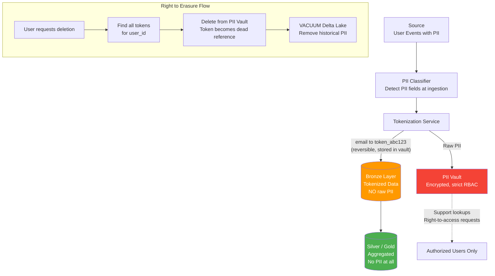

---

**Key GDPR Concepts for Data Engineers**

| GDPR Principle | Implementation |
|---|---|
| **Data Minimization** | Only ingest PII fields that are strictly necessary |
| **Purpose Limitation** | Document why each PII field is collected |
| **Storage Limitation** | Auto-delete PII after retention period (e.g., 2 years) |
| **Right to Access** | Ability to export all data for a user on request |
| **Right to Erasure** | Delete or anonymize all user data within 30 days |
| **Data Portability** | Export user data in machine-readable format (JSON/CSV) |
| **Pseudonymization** | Replace direct identifiers with tokens; reversible only with key |
| **Anonymization** | Irreversible — data can never be linked back to individual |

---

**Tokenization vs. Encryption vs. Hashing**

| Approach | Reversible? | Use Case | GDPR Erasure |
|---|---|---|---|
| **Tokenization** | Yes (with vault lookup) | Need to occasionally reveal PII (support, user access requests) | Delete vault entry |
| **Encryption** (AES-256) | Yes (with key) | Data at rest/in transit; key management overhead | Delete encryption key (crypto-shredding) |
| **Hashing** (SHA-256 + salt) | No | Analytics that need consistency (join on hashed email) but never reveal PII | Data already irreversible |
| **Crypto-Shredding** | Encrypt with per-user key; delete key = data unreadable | Kafka messages with PII; elegant GDPR erasure | Delete the user's key |

---

**Right to Erasure (GDPR Article 17)**
```sql
-- 1. Find all tokens linked to deleted user
SELECT token FROM pii_vault WHERE user_id = 'user_xyz';

-- 2. Delete from PII vault (token is now a dead reference)
DELETE FROM pii_vault WHERE user_id = 'user_xyz';

-- 3. In Bronze/Silver: token remains but PII is gone
--    (pseudonymization achieved -- GDPR compliant)

-- 4. Delta Lake time travel: vacuum old versions after 30 days
--    to remove PII from historical snapshots
VACUUM delta.`s3://bucket/bronze/events/` RETAIN 720 HOURS;

-- 5. Log the deletion for audit trail
INSERT INTO gdpr_deletion_log 
VALUES ('user_xyz', CURRENT_TIMESTAMP(), 'completed', 'tokens_deleted=47');
```

**Crypto-Shredding Pattern for Kafka**
```python
# Each user has a unique encryption key
user_key = key_management_service.get_key(user_id)

# Encrypt PII fields before producing to Kafka
encrypted_email = encrypt(email, user_key)
kafka_producer.send("user_events", {
    "user_id": user_id,
    "email": encrypted_email,  # Encrypted, not plaintext
    "event_type": "page_view",
    "timestamp": ts
})

# GDPR deletion = delete the key
# All historical messages become unreadable
key_management_service.delete_key(user_id)
```

---

#### Cross-Questions for Case 8

- *"What about GDPR in Kafka — messages containing PII?"* -> Use Kafka log compaction with tombstone records (null-value message for a key) to delete events for a user; or use crypto-shredding (encrypt with user-specific key, delete key = data unreadable)
- *"How do you prove GDPR compliance to auditors?"* -> Data lineage tools (OpenLineage) show where PII flows; audit logs on PII vault access; data classification catalog (Collibra, Alation) labels all PII fields
- *"What about PII in log files and backups?"* -> Log sanitization pipeline strips PII before writing; backups encrypted and auto-deleted after retention period; S3 lifecycle policies enforce deletion
- *"How do you handle a GDPR request across multiple systems (Snowflake, S3, Redis, Kafka)?"* -> Build a "Deletion Orchestrator" service that triggers deletion across all stores; maintain a registry of all systems containing user data; track deletion status per system

---


### Case 9 — File-Based Ingestion: SFTP/FTP Flat Files

**Prompt:**  
*"A partner company sends daily CSV files via SFTP containing inventory data. Files arrive between 2 AM and 4 AM, contain ~500K rows, and occasionally have formatting issues (missing columns, wrong delimiters, encoding problems). Design a reliable ingestion pipeline."*

---

#### Step 1 — Clarify & Assumptions

| Question | Assumed Answer |
|---|---|
| File format? | CSV, pipe-delimited, UTF-8 (sometimes Latin-1) |
| Arrival time guarantee? | Between 2-4 AM; sometimes late by hours |
| File naming convention? | `inventory_YYYYMMDD.csv` |
| Duplicate files possible? | Yes — partner sometimes re-sends |
| Downstream consumers? | Inventory dashboard, supply chain analytics |

---

#### Step 2 — Scale Estimation

```
500,000 rows x 500 bytes/row = 250 MB per file (uncompressed CSV)
Compressed Parquet: ~50 MB
Monthly storage: 50 MB x 30 = 1.5 GB -- trivial

Processing time: Spark can handle 250 MB in < 30 seconds
Challenge is NOT scale -- it's reliability and data quality
```

---

#### Step 3 — Architecture

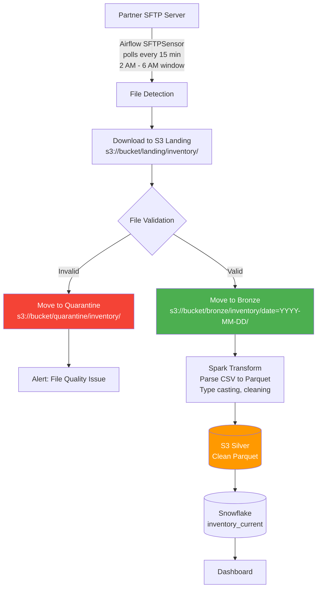

---

#### Step 4 — Key Design Decisions

**File Detection & Arrival Handling**
```python
# Airflow SFTPSensor with timeout
sftp_sensor = SFTPSensor(
    task_id="wait_for_file",
    path=f"/outbound/inventory_{ds_nodash}.csv",
    sftp_conn_id="partner_sftp",
    timeout=14400,  # 4 hours max wait (2 AM - 6 AM)
    poke_interval=900,  # Check every 15 min
    mode="reschedule",  # Don't hold a worker slot while waiting
)
```

**File Validation Checks**
```python
def validate_file(filepath):
    """Multi-layer file validation before processing."""
    checks = {
        "file_not_empty": os.path.getsize(filepath) > 0,
        "header_matches": check_header(filepath, EXPECTED_COLUMNS),
        "row_count_reasonable": 100_000 < count_rows(filepath) < 1_000_000,
        "delimiter_consistent": check_delimiter(filepath, "|"),
        "encoding_valid": check_encoding(filepath, "utf-8"),
        "no_binary_characters": not has_binary(filepath),
    }
    
    failed = [k for k, v in checks.items() if not v]
    if failed:
        raise FileValidationError(f"Failed checks: {failed}")
    return True
```

**Handling Common File Issues**

| Issue | Detection | Resolution |
|---|---|---|
| Wrong encoding (Latin-1 instead of UTF-8) | `chardet` library detection | Auto-convert with `iconv` or Python `codecs` |
| Missing header row | First row doesn't match expected columns | Apply expected schema; alert partner |
| Extra/missing columns | Column count mismatch | Strict mode: reject. Tolerant mode: fill NULLs for missing, ignore extra |
| Duplicate file (re-sent) | MD5 hash matches previously processed file | Skip processing; log as duplicate |
| Partial file (truncated) | Row count < 80% of expected; no EOF marker | Reject; wait for re-send |
| Mixed delimiters | Statistical analysis of delimiter frequency | Attempt auto-detection; quarantine if ambiguous |

**Idempotency**
- Track processed files in a metadata table: `(filename, md5_hash, processed_at, status)`
- If same filename arrives again, check MD5: if same hash -> skip; if different -> process as correction

---

#### Step 5 — Failure Modes

| Failure | Detection | Recovery |
|---|---|---|
| File never arrives | SFTPSensor timeout at 6 AM | Alert on-call; contact partner; use previous day's data (flagged stale) |
| SFTP connection fails | Connection error in sensor | Retry with exponential backoff; alert if persists > 1 hour |
| Corrupted file content | Validation checks fail | Move to quarantine; alert; contact partner for re-send |
| Partner changes file format | Header validation fails | Quarantine; manual review; update parser if legitimate change |
| Duplicate processing | MD5 check in metadata table | Skip; log as duplicate |

---

#### Cross-Questions for Case 9

- *"What if the partner can't guarantee a specific arrival time?"* -> Use event-driven: S3 event notification triggers Lambda/Airflow when file lands; remove fixed schedule dependency
- *"How do you handle a file with 10% bad rows but 90% good rows?"* -> Process good rows; write bad rows to a separate `_rejected` table with error details; alert if rejection rate > threshold
- *"What if you need to support 50 different partners with different file formats?"* -> Build a metadata-driven framework: configuration table defines per-partner schema, delimiter, encoding, validation rules; single DAG parameterized by partner_id
- *"How do you handle files larger than memory?"* -> Stream processing: read CSV line by line (don't load into memory); or use Spark which handles large files natively via distributed reading

---

---

### Case 10 — Real-Time ML Feature Store Pipeline

**Prompt:**  
*"Design a feature store pipeline that computes ML features in real-time (e.g., 'user's purchase count in last 30 minutes') and serves them to a fraud detection model with < 10ms latency."*

---

#### Step 1 — Clarify & Assumptions

| Question | Assumed Answer |
|---|---|
| Feature freshness? | Real-time features: < 1 second. Batch features: hourly. |
| Serving latency? | < 10ms p99 for model inference |
| Number of features? | ~200 features per entity (user) |
| Entities? | ~50 million users, ~1 million active at any time |
| Feature types? | Aggregations (count, sum, avg over windows), lookups, embeddings |

---

#### Step 2 — Scale Estimation

```
Real-time feature computation:
  - 10,000 transactions/sec (peak)
  - Each triggers feature update for 1 user
  - Feature vector: 200 features x 8 bytes = 1.6 KB per entity

Online store sizing:
  - 1 million active users x 1.6 KB = 1.6 GB in Redis
  - Full store: 50M users x 1.6 KB = 80 GB (manageable in Redis cluster)

Feature serving:
  - 10,000 inference requests/sec x 1.6 KB response = 16 MB/sec read throughput
  - Redis can handle 100K+ ops/sec easily
```

---

#### Step 3 — Architecture

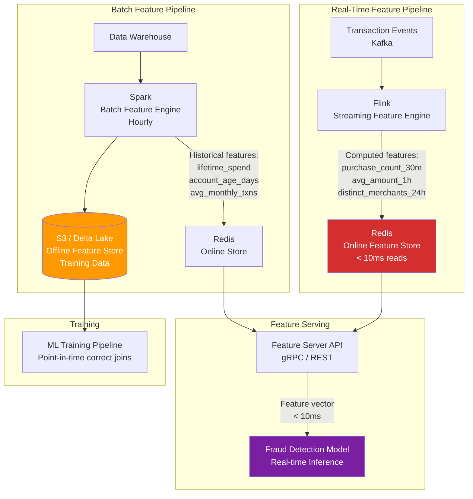

---

#### Step 4 — Key Design Decisions

**Real-Time Feature Computation (Flink)**
```python
# Sliding window aggregations
features = (
    transactions
    .key_by("user_id")
    .window(SlidingEventTimeWindows.of(
        Time.minutes(30),  # window size
        Time.minutes(1)    # slide interval
    ))
    .aggregate(
        PurchaseCountAggregator(),       # count
        AvgAmountAggregator(),           # average
        DistinctMerchantsAggregator()    # distinct count
    )
)

# Write to Redis online store
features.add_sink(RedisSink(
    key_template="user:{user_id}:features",
    ttl=86400  # 24-hour TTL for inactive users
))
```

**Point-in-Time Correctness for Training**
```sql
-- WRONG: Using current feature values for historical training data
-- This causes "feature leakage" (future information leaks into training)

-- CORRECT: Point-in-time join
SELECT 
    t.transaction_id,
    t.timestamp,
    f.purchase_count_30m,  -- As of t.timestamp, NOT current value
    f.avg_amount_1h,
    t.is_fraud  -- Label
FROM transactions t
ASOF JOIN feature_snapshots f
ON t.user_id = f.user_id
AND f.snapshot_time <= t.timestamp
```

**Online vs. Offline Store**

| | Online Store (Redis) | Offline Store (Delta Lake) |
|---|---|---|
| Purpose | Real-time serving | Training data, backfills |
| Latency | < 10ms | Seconds to minutes |
| Freshness | Sub-second | Hourly |
| History | Latest value only | Full history (point-in-time) |
| Size | Active entities only | All entities, all time |
| Cost | $$$ (memory) | $ (object storage) |

**Feature Registry / Catalog**
```yaml
# Feature definition (e.g., Feast or Tecton format)
- name: purchase_count_30m
  entity: user_id
  value_type: INT64
  description: "Number of purchases by user in the last 30 minutes"
  owner: fraud-team
  tags: [real-time, fraud]
  freshness: 1_minute
  source: kafka.transactions
  aggregation: count
  window: 30_minutes
```

---

#### Cross-Questions for Case 10

- *"How do you prevent training-serving skew?"* -> Use the same feature computation code for both batch (training) and streaming (serving); feature store framework (Feast, Tecton) ensures consistency
- *"What if Redis goes down?"* -> Fallback to pre-computed default features (population averages); alert immediately; Redis cluster with replicas provides HA
- *"How do you handle feature drift?"* -> Monitor feature distributions over time; alert if distribution shifts significantly (KS test, PSI); retrain model when drift exceeds threshold
- *"How do you add a new feature without retraining the model?"* -> Feature store decouples feature computation from model; add feature to store first; retrain model when ready; old model ignores new feature until updated

---

---

### Case 11 — Log Aggregation & Observability Pipeline

**Prompt:**  
*"Design a pipeline to collect application logs from 500 microservices, make them searchable within 30 seconds, and store them for 90-day retention. Volume: ~50 GB/day of logs."*

---

#### Step 1 — Clarify & Assumptions

| Question | Assumed Answer |
|---|---|
| Log format? | JSON structured logs (some services emit plain text) |
| Search latency? | < 30 seconds from emission to searchable |
| Retention? | Hot: 7 days (fast search). Warm: 30 days. Cold: 90 days (archive) |
| Alert integration? | Trigger alerts on error rate spikes, specific log patterns |
| Volume? | 50 GB/day uncompressed; ~10 GB compressed |

---

#### Step 2 — Scale Estimation

```
50 GB/day = ~600 KB/sec average
Peak (2x average): ~1.2 MB/sec

Log events: 50 GB / 1 KB avg event = 50 million log events/day
= ~580 events/sec average

Storage (90 days):
  - Hot (7 days, Elasticsearch): 50 GB x 7 = 350 GB
  - Warm (30 days, reduced replicas): 50 GB x 23 = 1.15 TB  
  - Cold (90 days, S3 compressed): 10 GB x 60 = 600 GB in S3
```

---

#### Step 3 — Architecture

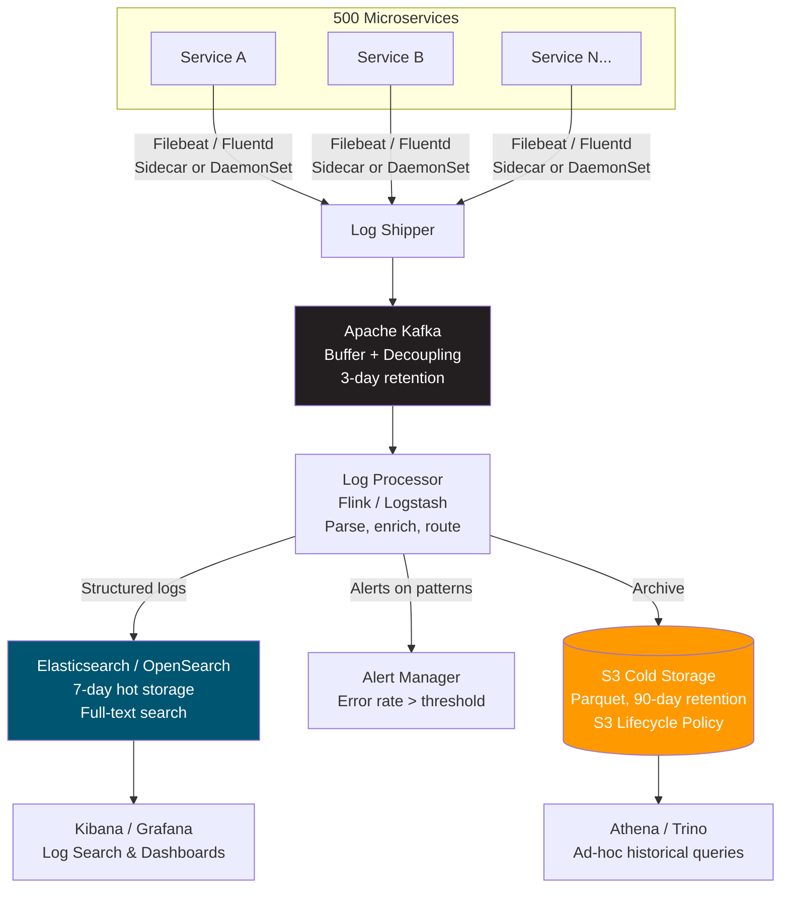

---

#### Step 4 — Key Design Decisions

**Log Enrichment Pipeline**
```python
# Add context to every log event
def enrich_log(event):
    return {
        **event,
        "service_team": lookup_team(event["service_name"]),
        "environment": detect_env(event["hostname"]),
        "log_level_numeric": level_to_int(event["level"]),
        "request_id": extract_request_id(event["message"]),
        # Geo enrichment for access logs
        "geo": geoip_lookup(event.get("client_ip")),
    }
```

**Tiered Retention with ILM (Index Lifecycle Management)**
```json
{
  "policy": {
    "phases": {
      "hot":    { "actions": { "rollover": { "max_size": "50gb", "max_age": "1d" }}},
      "warm":   { "min_age": "7d", "actions": { "shrink": { "number_of_shards": 1 }}},
      "cold":   { "min_age": "30d", "actions": { "freeze": {} }},
      "delete": { "min_age": "90d", "actions": { "delete": {} }}
    }
  }
}
```

**Alert Rules (Pattern Matching)**
```yaml
# Alert on error rate spike
- name: error_rate_spike
  condition: "count(level='ERROR') in 5min > 3x rolling_7day_avg"
  severity: P1
  notify: [pagerduty, slack_oncall]

# Alert on specific patterns
- name: oom_killer
  condition: "message CONTAINS 'OutOfMemoryError'"
  severity: P1
  notify: [pagerduty]

# Alert on missing logs (dead service)
- name: service_silent
  condition: "count(*) WHERE service=X in 10min = 0"
  severity: P2
  notify: [slack_team]
```

---

#### Cross-Questions for Case 11

- *"How do you handle a logging storm (one service emitting 100x normal volume)?"* -> Rate limiting per service in Kafka (quotas); Flink drops/samples beyond threshold; alert on abnormal volume
- *"How do you correlate logs across microservices for a single request?"* -> Distributed tracing with `request_id` / `trace_id` propagated via headers; search by trace_id in Elasticsearch
- *"What if Elasticsearch can't keep up with indexing?"* -> Kafka buffers the backlog; Elasticsearch catches up; scale horizontally by adding data nodes; consider sampling for high-volume debug logs
- *"How do you control costs as log volume grows?"* -> Sampling (keep 10% of DEBUG logs); tiered storage; auto-delete after retention; encourage structured logging to reduce event size

---

---

### Case 12 — Data Mesh: Domain-Oriented Data Products

**Prompt:**  
*"Your company has 20 engineering teams, each owning different domains (Payments, Inventory, Marketing, etc.). The central data team has become a bottleneck. Design a data mesh architecture where each domain team owns their data products."*

---

#### Architecture

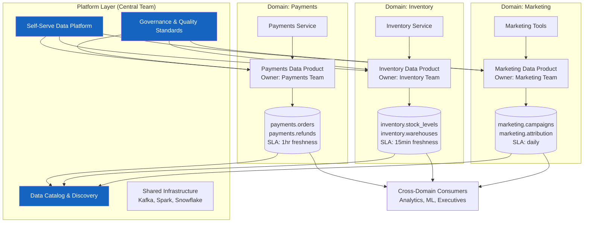

---

**Data Mesh Principles**

```mermaid
flowchart LR
    A["Domain Ownership\nEach team owns their\ndata end-to-end"] --> B["Data as a Product\nSLAs, docs, versioning\nquality guarantees"]
    B --> C["Self-Serve Platform\nCentral team provides\ninfra + templates"]
    C --> D["Federated Governance\nGlobal standards\nenforced via automation"]
    D --> A
```

| Principle | Implementation |
|---|---|
| **Domain Ownership** | Each team owns their data pipeline end-to-end (extract -> transform -> serve) |
| **Data as a Product** | Published datasets have SLAs, documentation, versioning, quality guarantees |
| **Self-Serve Platform** | Central team provides infrastructure (templates, CI/CD, monitoring) — not pipelines |
| **Federated Governance** | Global standards (naming, quality, security) enforced via automation, not gatekeeping |

**Data Product Contract (YAML)**
```yaml
# payments/data_product.yaml
name: payments.orders
owner: payments-team@company.com
domain: payments
description: "All completed and pending orders with payment status"
sla:
  freshness: 1_hour
  availability: 99.9%
schema:
  version: 3
  columns:
    - name: order_id
      type: STRING
      pii: false
      description: "Unique order identifier"
    - name: customer_email
      type: STRING
      pii: true
      classification: CONFIDENTIAL
quality_tests:
  - unique: order_id
  - not_null: [order_id, order_date, total_amount]
  - freshness: max_hours=1
consumers:
  - marketing-team (attribution model)
  - finance-team (revenue reporting)
breaking_change_policy: "7-day deprecation notice via Slack + email"
```

---

**Data Mesh vs. Centralized Data Team**

| Dimension | Centralized | Data Mesh |
|---|---|---|
| Pipeline ownership | Central data team builds all | Domain teams build their own |
| Bottleneck | Central team backlog | None (distributed) |
| Domain knowledge | Central team lacks context | Domain experts build their own pipelines |
| Consistency | High (one team controls all) | Requires governance automation |
| Speed of delivery | Slow (queue for central team) | Fast (teams are autonomous) |
| Team size to start | 3-5 data engineers | 20+ total engineers across domains |

---

#### Cross-Questions for Case 12

- *"How do you prevent data quality issues when 20 teams own their own pipelines?"* -> Automated quality gates enforced by the platform (tests must pass before publishing); central catalog monitors SLA breaches; global standards defined but locally enforced
- *"How do you handle cross-domain queries (join Payments + Inventory)?"* -> Consumers query published data products; cross-domain joins happen in the consumer's own workspace; shared dimension tables (customers, products) are published by one domain
- *"What does the central platform team actually build?"* -> Templates (Airflow DAGs, dbt projects, Terraform), CI/CD pipelines for data, monitoring/alerting infrastructure, access control automation, the data catalog
- *"How do you prevent this from becoming chaos?"* -> Governance automation: linting checks on data product contracts, automated SLA monitoring, mandatory documentation, standardized naming conventions
- *"When should you NOT use data mesh?"* -> Small teams (< 10 engineers total), single domain companies, teams without data engineering skills, early-stage startups

---

## 5. Tradeoff Cheat Sheet

### Batch vs. Streaming

| Dimension | Batch | Streaming |
|---|---|---|
| Latency | Hours to daily | Seconds to minutes |
| Complexity | Low | High |
| Cost | Lower (scheduled compute) | Higher (always-on infrastructure) |
| Fault tolerance | Simple retry | Checkpointing, DLQ needed |
| Debugging | Easy (rerun batch) | Hard (stateful, time-dependent) |
| Exactly-once | Easy (transactional writes) | Requires careful design |
| Testing | Standard unit/integration tests | Need time-based test frameworks |
| State management | Stateless (each batch independent) | Complex (windows, aggregations) |
| Use when | Freshness > 1 hour acceptable | Freshness < 1 hour required |

### CDC vs. Polling Incremental

| Dimension | CDC (Debezium) | Polling (watermark) |
|---|---|---|
| Source impact | Near zero | Adds SELECT load |
| Captures DELETEs | Yes | No |
| Latency | Sub-second | Minimum = poll interval |
| Complexity | Medium-High | Low |
| Requires binlog/WAL | Yes | No |
| Schema changes | Handled by Debezium | Manual adjustment needed |
| Initial setup cost | Higher (Kafka, Debezium, Schema Registry) | Lower (simple SQL query) |
| Operational burden | Kafka cluster management | Minimal |
| Use when | Need deletes, low latency, zero DB load | Simple RDBMS, soft deletes only |

### Kafka vs. Kinesis vs. Pub/Sub

| | Kafka | Kinesis | GCP Pub/Sub |
|---|---|---|---|
| Pricing | Infrastructure cost | Per-shard + per-GB | Per-message |
| Retention | Configurable (7 days+) | 24 hours-365 days | 7 days default |
| Ecosystem | Largest (Kafka Connect, ksqlDB) | AWS-native | GCP-native |
| Ordering | Per-partition | Per-shard | Per-ordering-key |
| Max throughput | Virtually unlimited (add partitions) | 1 MB/sec per shard | Auto-scales |
| Multi-cloud | Yes | AWS-only | GCP-only |
| Exactly-once | Producer: idempotent + transactional | Dedup at consumer | Dedup by message_id |
| Operational burden | High (self-managed) or Moderate (Confluent) | Low (fully managed) | Low (fully managed) |
| Use when | On-prem or multi-cloud, large scale | AWS-only, managed preference | GCP-native stacks |

### Delta Lake vs. Iceberg vs. Hudi

| | Delta Lake | Apache Iceberg | Apache Hudi |
|---|---|---|---|
| ACID | Yes | Yes | Yes |
| Best engine | Spark / Databricks | Multi-engine (Trino, Spark, Flink) | Spark |
| Time travel | Yes | Yes | Yes |
| Upserts (MERGE) | Excellent | Good | Excellent |
| Hidden partitioning | No | Yes (huge advantage) | No |
| Partition evolution | Limited | Excellent (no rewrite needed) | Limited |
| Schema evolution | Good | Excellent | Good |
| Community | Databricks-led | Netflix, Apple, Airbnb | Uber-led |
| Catalog | Unity Catalog | HMS, Nessie, REST Catalog | HMS |
| Use when | Databricks shop | Multi-engine, open interoperability | Frequent upserts, Hive integration |

### Spark vs. Flink

| Dimension | Apache Spark | Apache Flink |
|---|---|---|
| Processing model | Micro-batch (+ continuous experimental) | True event-at-a-time streaming |
| Latency | 100ms - seconds | Milliseconds |
| State management | Limited (in-memory mapState) | Advanced (RocksDB state backend, queryable state) |
| Batch processing | Excellent | Good |
| Ecosystem | Massive (MLlib, GraphX, SQL) | Growing |
| Exactly-once | Checkpointing + idempotent sinks | Checkpointing + 2-phase commit |
| Windowing | Basic (tumbling, sliding) | Advanced (session, custom triggers) |
| Backpressure | Bounded (micro-batch natural) | Credit-based (sophisticated) |
| Use when | Unified batch + stream; team knows Spark | Ultra-low-latency; complex event processing |

### Managed vs. Self-Hosted

| | Managed (Confluent, MSK, Fivetran) | Self-Hosted (open source) |
|---|---|---|
| Operational burden | Low | High (patching, scaling, monitoring) |
| Cost | Higher $$ at scale | Lower $$ but more engineering hours |
| Customization | Limited | Full control |
| Time to production | Days-weeks | Weeks-months |
| Vendor lock-in | Yes | No |
| SLA | Vendor-provided SLA | You own the SLA |
| Upgrades | Automatic / managed | Manual, risky |
| Use when | Small team, fast delivery, budget available | Large team, specific requirements, cost-sensitive at scale |

### ELT vs. ETL

| Dimension | ELT | ETL |
|---|---|---|
| Transform location | Inside the warehouse | Before loading |
| Raw data preserved? | Yes (Bronze layer) | No (only transformed data lands) |
| Flexibility | High (re-transform anytime) | Low (must re-extract to change logic) |
| Warehouse cost | Higher (compute for transforms) | Lower (pre-processed data) |
| Data freshness for transforms | Immediate (run SQL) | Delayed (extract -> transform -> load) |
| Tool examples | dbt, Snowflake SQL, BigQuery | Informatica, Talend, SSIS |
| Use when | Cloud warehouse, iterative development | Legacy systems, compliance requiring cleansed data |

---

## 6. Technology Decision Trees

### Choosing an Ingestion Pattern

```mermaid
flowchart TD
    A{"What is your\nfreshness requirement?"} -->|"> 1 hour"| B{"Data volume?"}
    A -->|"1 min - 1 hour"| C{"Source supports CDC?"}
    A -->|"< 1 minute"| D["Streaming\nKafka + Flink/Spark"]
    
    B -->|"< 100 GB/day"| E["Simple Batch\nAirflow + SQL + dbt"]
    B -->|"> 100 GB/day"| F["Distributed Batch\nAirflow + Spark + dbt"]
    
    C -->|Yes| G["CDC\nDebezium + Kafka"]
    C -->|No| H{"Can you poll\nevery few minutes?"}
    H -->|Yes| I["Micro-batch Polling\nAirflow + frequent schedule"]
    H -->|No| J["Streaming via\nAPI webhooks/events"]
    
    style D fill:#e91e63,color:#fff
    style E fill:#4caf50,color:#fff
    style F fill:#ff9800,color:#fff
    style G fill:#9c27b0,color:#fff
```

### Choosing a Storage Format

```mermaid
flowchart TD
    A{"Primary use case?"} -->|"Analytics\n(read-heavy)"| B{"Need ACID/MERGE?"}
    A -->|"Streaming\n(write-heavy)"| C["Avro\nRow-based, schema evolution"]
    A -->|"Data interchange\n(compatibility)"| D["JSON / CSV\nHuman readable"]
    
    B -->|Yes| E{"Multi-engine needed?"}
    B -->|No| F["Parquet\nColumnar, compressed"]
    
    E -->|"Databricks only"| G["Delta Lake"]
    E -->|"Multi-engine\n(Trino, Spark, Flink)"| H["Apache Iceberg"]
    E -->|"Heavy CDC/Upserts"| I["Apache Hudi"]
    
    style F fill:#4caf50,color:#fff
    style G fill:#ff5722,color:#fff
    style H fill:#2196f3,color:#fff
    style I fill:#ff9800,color:#fff
```

### Choosing an Orchestrator

```mermaid
flowchart TD
    A{"Team size &\ncomplexity?"} -->|"Small team\nsimple DAGs"| B{"Cloud preference?"}
    A -->|"Large team\ncomplex dependencies"| C{"Existing infra?"}
    
    B -->|AWS| D["AWS Step Functions /\nMWAA"]
    B -->|GCP| E["Cloud Composer\n/ Workflows"]
    B -->|"Any / Self-host"| F["Apache Airflow"]
    
    C -->|"Databricks shop"| G["Databricks Workflows"]
    C -->|"dbt-centric"| H["dbt Cloud + Airflow"]
    C -->|"Event-driven"| I["Dagster / Prefect"]
    C -->|"Enterprise"| J["Apache Airflow\nwith custom operators"]
    
    style F fill:#017cee,color:#fff
    style G fill:#ff3621,color:#fff
    style I fill:#4f46e5,color:#fff
```

### Choosing a Real-Time Processing Engine

```mermaid
flowchart TD
    A{"Latency requirement?"} -->|"< 100ms\nevent-at-a-time"| B["Apache Flink"]
    A -->|"100ms - 5sec\nmicro-batch OK"| C{"Team expertise?"}
    A -->|"> 5sec\nnear-real-time"| D["Spark Structured Streaming\nor frequent batch"]
    
    C -->|"Already knows Spark"| E["Spark Structured Streaming"]
    C -->|"Needs complex CEP"| F["Apache Flink"]
    C -->|"Simple transforms"| G["ksqlDB / Kafka Streams"]
    
    style B fill:#e91e63,color:#fff
    style E fill:#ff9800,color:#fff
    style G fill:#231f20,color:#fff
```

### When to Use Which Database for Analytics

```mermaid
flowchart TD
    A{"Query pattern?"} -->|"Ad-hoc SQL\nBI dashboards"| B{"Data volume?"}
    A -->|"Real-time aggregations\nsub-second"| C["ClickHouse / Druid"]
    A -->|"Full-text search\nlogs"| D["Elasticsearch / OpenSearch"]
    A -->|"Key-value lookups\n< 10ms"| E["Redis / DynamoDB"]
    
    B -->|"< 10 TB"| F{"Cloud preference?"}
    B -->|"> 10 TB"| G["Snowflake / BigQuery\n(auto-scaling)"]
    
    F -->|"AWS"| H["Redshift / Snowflake"]
    F -->|"GCP"| I["BigQuery"]
    F -->|"Multi-cloud"| J["Snowflake / Databricks SQL"]
    
    style C fill:#4caf50,color:#fff
    style G fill:#29b5e8,color:#fff
    style E fill:#d32f2f,color:#fff
```

---

## 7. Capacity Estimation & Back-of-Envelope Calculations

### Memory Cards

```
1 KB   = 1,000 bytes      (a single log line, a small JSON event)
1 MB   = 10^6 bytes       (a small CSV file, a high-res photo)
1 GB   = 10^9 bytes       (1 hour of moderate streaming)
1 TB   = 10^12 bytes      (a day of high-volume streaming)
1 PB   = 10^15 bytes      (enterprise data lake)

Time conversions:
  1 day  = 86,400 seconds
  1 hour = 3,600 seconds
  1 year = 31,536,000 seconds (~31.5 million)

Useful rates:
  SSD sequential read:      500 MB/sec
  HDD sequential read:      100 MB/sec
  Network (1 GbE):          125 MB/sec
  Network (10 GbE):         1.25 GB/sec
  S3 throughput (per req):  ~50-100 MB/sec (multi-part upload)
  S3 GET latency:           ~50-100ms first byte
  S3 LIST latency:          ~100-200ms
  Redis read latency:       < 1ms
  Kafka throughput/partition: ~10 MB/sec write
  Snowflake query startup:  ~2-5 seconds
  
Compression ratios (approximate):
  JSON -> Parquet:           5-10x
  CSV -> Parquet:            3-5x
  Repetitive numerics:       10-20x
  High-cardinality strings:  2-3x
  Avro -> Parquet:           2-4x
```

### Cost Reference Card (2025/2026 Pricing)

```
Storage:
  AWS S3 Standard:           $0.023/GB/month
  AWS S3 Infrequent Access:  $0.0125/GB/month
  AWS S3 Glacier:            $0.004/GB/month
  AWS EBS (gp3):             $0.08/GB/month
  GCS Standard:              $0.020/GB/month
  ADLS Gen2:                 $0.018/GB/month

Compute:
  Snowflake (XS warehouse):  ~$2/credit (~$2/hour)
  Snowflake (XL warehouse):  ~$128/hour
  BigQuery:                  $5/TB scanned (on-demand)
  Databricks DBU:            ~$0.07-0.55/DBU depending on tier
  AWS EMR (m5.xlarge):       ~$0.23/hour + EC2 cost
  
Networking:
  Data transfer (same region): Free
  Data transfer (cross-region): $0.02/GB
  Data transfer (internet egress): $0.09/GB
  
Streaming:
  Kafka (Confluent Cloud):   $0.11/GB ingress + $0.11/GB egress
  AWS Kinesis:               $0.015/shard/hour + $0.014/million PUT
  
Managed Services:
  Fivetran:                  $1-5/MAR (monthly active row)
  Airbyte Cloud:             $10/credit (1 credit ~ 10K rows synced)
```

### Standard Estimation Template

```
GIVEN:
  N events/sec
  S bytes/event

COMPUTE:
  Throughput:       N x S bytes/sec
  Per hour:         N x S x 3,600 bytes
  Per day:          N x S x 86,400 bytes -> convert to GB
  Per month:        daily GB x 30
  Compressed:       raw / compression_ratio (3x for JSON, 10x for repetitive numerics)

KAFKA PARTITIONS:
  Max safe per partition: ~10 MB/sec write
  Partitions needed = ceil(throughput_MB_sec / 10)
  Add 50-100% headroom for growth

KAFKA BROKER SIZING:
  Disk per broker = (daily_raw_GB x retention_days x replication_factor) / num_brokers
  Network per broker = throughput x replication_factor / num_brokers

SPARK CLUSTER SIZING:
  Processing rate: ~10-50 GB/hour per executor (depends on complexity)
  Executors needed = daily_volume / (target_hours x throughput_per_executor)
  Memory: 4-8 GB per executor for typical ETL

SNOWFLAKE WAREHOUSE SIZING:
  XS: ~10 GB/hour scanning
  S:  ~20 GB/hour
  M:  ~40 GB/hour
  L:  ~80 GB/hour
  Choose based on: data_volume / acceptable_query_time
```

### Worked Examples

**Example 1: Small-Scale E-Commerce (DON'T OVER-ENGINEER)**
```
Case: 50,000 orders/day, 2 KB per order

Daily data: 50,000 x 2 KB = 100 MB/day raw
Parquet (4x compression): 25 MB/day
Monthly: 750 MB -> basically free to store

Throughput: 50,000 / 86,400 = 0.58 orders/sec
-> A single Airflow task with PostgreSQL query handles this easily
-> No Kafka, no Spark needed -- don't over-engineer!
-> Total cost: ~$50/month (Airflow + S3 + Snowflake XS)
```

**Example 2: Medium-Scale SaaS Analytics**
```
Case: 500,000 events/day, 1 KB per event, hourly refresh needed

Daily data: 500,000 x 1 KB = 500 MB/day
Hourly micro-batch: 500 MB / 24 = ~21 MB/hour
Parquet: ~100 MB/day

Throughput: 500,000 / 86,400 = ~6 events/sec
-> Spark Structured Streaming is overkill
-> Use: Airflow hourly DAG + Python/SQL extraction
-> Kafka not needed at this scale
-> Total cost: ~$200/month
```

**Example 3: High-Scale Sensor Platform**
```
Case: 1 million sensor readings/sec, 500 bytes each

Throughput: 1,000,000 x 500 B = 500 MB/sec

Daily:  500 MB/sec x 86,400 sec = 43.2 TB/day raw
        Compressed (10x): 4.32 TB/day in S3

Monthly in S3: 4.32 x 30 = 129.6 TB -> ~$3,000/month at $0.023/GB

Kafka partitions: 500 MB/sec / 10 MB/sec = 50 partitions (use 80 for headroom)
Kafka brokers (7-day retention, RF=3):
  Total data = 43.2 TB x 7 days x 3 replicas = 907 TB
  At 20 TB/broker: 907 / 20 = ~46 brokers
  -> Use Kafka Tiered Storage: only keep 1 day on brokers (43.2 x 3 = 130 TB -> 7 brokers)
    Older data auto-offloads to S3
    
Total monthly cost: ~$20,000-30,000
```

**Example 4: API-Based SaaS Ingestion**
```
Case: Salesforce with 2 million contacts, HubSpot with 500K contacts

Salesforce:
  - 2,000,000 records / 2,000 per page = 1,000 API calls
  - At 5 calls/sec = 200 seconds = ~3.5 minutes
  - Data volume: 2M x 1 KB = 2 GB raw JSON

HubSpot:
  - 500,000 / 100 per page = 5,000 API calls  
  - Rate limit: 10 req/sec -> 500 seconds = ~8.5 minutes
  - Data volume: 500K x 1.5 KB = 750 MB raw JSON

Total daily: ~2.75 GB raw -> ~600 MB compressed
Cost: negligible storage; main cost is compute time (~$0.50/day)
```

---

## 8. Common Anti-Patterns & How to Avoid Them

### Pipeline Design Anti-Patterns

```mermaid
flowchart TD
    subgraph "Anti-Patterns"
        A["Over-Engineering\nUsing Kafka + Flink\nfor 1000 events/day"]
        B["Under-Engineering\nCron job + shell script\nfor critical pipeline"]
        C["God Pipeline\nOne DAG does everything"]
        D["No Idempotency\nDuplicates on retry"]
        E["Tight Coupling\nSource schema = sink schema"]
    end
    
    subgraph "Correct Patterns"
        F["Right-Size:\nSimple tools for simple problems"]
        G["Production-Grade:\nOrchestrator + monitoring"]
        H["Single Responsibility:\nDecomposed, reusable tasks"]
        I["Safe Retries:\nOverwrite partitions, MERGE"]
        J["Decoupled:\nBronze absorbs changes"]
    end
    
    A --> F
    B --> G
    C --> H
    D --> I
    E --> J
```

| Anti-Pattern | Description | Impact | Solution |
|---|---|---|---|
| **Big Ball of Mud** | Single monolithic pipeline doing extract + transform + load + quality in one script | Can't retry individual steps; debugging nightmare | Decompose into discrete tasks with clear contracts between them |
| **No DLQ** | Bad records kill the entire pipeline | One poison pill blocks all processing | Route unparseable records to DLQ; alert; continue processing valid records |
| **Watermark in Code** | Hardcoding the incremental cursor in source code | Can't backfill; can't recover from failures | Store watermarks in a metadata table or use orchestrator state |
| **Missing Schema Validation** | Blindly trusting source data format | Silent data corruption; wrong downstream results | Validate schema at ingestion; reject or quarantine non-conforming data |
| **Full Load When Incremental Exists** | Loading entire table daily when a watermark column exists | 50-100x more compute and time; source impact | Always check for incremental capability first |
| **Ignoring Backpressure** | Not handling what happens when consumer is slower than producer | OOM errors, data loss, cascading failures | Use Kafka as buffer; implement rate limiting; auto-scale consumers |
| **Shared Mutable State** | Multiple pipelines writing to the same table without coordination | Race conditions, inconsistent data | Use Delta Lake MERGE (ACID); or assign single writer per table |
| **Alert Fatigue** | Alerting on every minor anomaly | Team ignores all alerts including critical ones | Tier alerts (P1-P3); tune thresholds; require acknowledgment |
| **No Data Lineage** | Can't trace where data came from or what transformed it | Hours of debugging; can't assess impact of changes | Implement OpenLineage or use dbt's built-in lineage |
| **Premature Optimization** | Partitioning by 5 columns, Z-ordering everything, compacting hourly | Complexity without measurable benefit | Profile first; optimize when you have evidence of a bottleneck |
| **Copy-Paste Pipelines** | Duplicating entire DAGs for each new source | Maintenance nightmare; bugs fixed in one copy but not others | Build parameterized, config-driven pipelines |
| **No Backfill Strategy** | Pipeline can't re-process historical data | Can't fix bugs; can't add new tables | Design for backfill from day 1: parameterize by date range |
| **Ignoring Data Skew** | Default partitioning on a hot key | 1 task takes 100x longer than others; pipeline SLA breached | Salt hot keys; use AQE; repartition before joins |
| **No Circuit Breaker** | Keep hammering a failing external API | API gets overloaded; your pipeline fills retry queues | Implement circuit breaker: fail fast after N consecutive failures |
| **Testing in Production** | No staging environment for data pipelines | Bugs discovered by business users | Create a dev/staging tier with sampled data; test before promoting |

### When NOT to Use Each Technology

| Technology | Don't Use When | Use Instead |
|---|---|---|
| Kafka | < 1000 events/sec, single consumer, no replay needed | Direct API calls, SQS, simple database queue |
| Spark | < 10 GB of data, simple transforms | Pandas, DuckDB, SQL in warehouse |
| Flink | Team doesn't have streaming expertise; latency > 1 sec OK | Spark Structured Streaming (simpler) |
| Airflow | Single, simple cron job; event-driven triggers needed | cron + monitoring; Dagster/Prefect for event-driven |
| dbt | No SQL-based warehouse; need Python transforms | Spark/Pandas transformations directly |
| Data Lake | All data is structured and < 1 TB total | Go directly to warehouse |
| Microservices for data | Team of < 3 engineers | Monolithic pipeline is fine |
| Data Mesh | < 5 teams; < 20 engineers total | Centralized data team |
| Kubernetes for pipelines | < 10 pipelines; no existing K8s | Managed services (MWAA, Cloud Composer) |
| Real-time dashboard | Hourly freshness is acceptable | Scheduled batch refresh |

---

## 9. Common Cross-Questions by Topic

### On Idempotency
- "How do you ensure your pipeline is idempotent?"
- "What happens if the pipeline runs twice for the same day?"
- "How does your MERGE statement handle re-runs without creating duplicates?"
- "What if two DAG runs execute simultaneously due to a scheduler bug?"

**Model Answer:** "My pipeline is idempotent through three mechanisms: (1) S3 paths include the execution date — re-running overwrites the same partition, (2) the MERGE statement uses ON on the primary key — upserts don't create duplicates, (3) I set `max_active_runs=1` on the DAG to prevent concurrent executions. For streaming, checkpointing ensures we resume from the last committed offset, not reprocess."

### On Schema Evolution
- "What happens if the source adds a new column?"
- "What happens if the source renames a column or changes a data type?"
- "How do you communicate breaking schema changes to downstream consumers?"
- "What is a data contract and have you ever enforced one?"

**Model Answer:** "I handle schema evolution in layers: (1) Bronze accepts anything — new columns land in a `_extra` JSON column or are auto-added via schema evolution, (2) Silver has explicit column selection — new columns require a dbt model update, (3) For breaking changes, we use data contracts: the source team must notify consumers 7 days before, validated via Schema Registry compatibility checks. Backward-compatible changes (adding nullable columns) are auto-promoted; incompatible changes (renaming, type change) require coordination."

### On Failure Recovery
- "Walk me through what happens step by step when your pipeline fails at 3 AM."
- "How do you backfill 6 months of data for a new table?"
- "What is your RPO and RTO for this pipeline?"
- "How do you know if data is missing vs. the pipeline is just slow?"
- "What's the difference between a retry and a backfill?"

**Model Answer:** "When a pipeline fails at 3 AM: (1) Airflow retries 3x with exponential backoff, (2) if all retries fail, PagerDuty alerts the on-call engineer, (3) the engineer checks Airflow logs and Spark UI to diagnose, (4) once fixed, they clear the task and re-run — idempotent design means safe to retry. RPO = 0 (data is in Kafka/S3 and never lost). RTO = 30 min (time to page, diagnose, and restart). The distinction: a retry reprocesses the failed run; a backfill creates runs for historical date ranges that never ran."

### On Performance
- "This pipeline takes 4 hours to run daily. How do you optimize it?"
- "You have data skew — 90% of data lands in one partition. How do you fix it?"
- "How do you avoid the small files problem?"
- "When would you choose a broadcast join over a sort-merge join?"
- "What's the difference between partition pruning and predicate pushdown?"

**Model Answer for Optimization:** "I'd investigate systematically: (1) Check Spark UI for bottlenecks — which stage takes longest? (2) If it's a shuffle, look for data skew — salt the key or use AQE, (3) If it's I/O bound, check if partition pruning is working — are we reading unnecessary data? (4) If it's a join, check if one side is small enough for broadcast (<200MB), (5) Check for the small files problem — add compaction step. I'd measure before/after to validate the improvement."

### On Cost
- "How would you reduce the cost of this pipeline by 50%?"
- "What is the cost of storing 1 TB of data in S3 per month?"
- "Is it cheaper to use Kinesis or Kafka at 100K events/sec?"
- "How do you prevent runaway Snowflake costs?"

**Model Answer:** "To reduce cost by 50%: (1) Move from full load to incremental — process 1% of the data, (2) Use spot/preemptible instances for Spark — 60-70% savings, (3) Compress data (Parquet instead of CSV — 4x smaller), (4) Add S3 lifecycle policies — move old data to Glacier after 90 days, (5) Right-size Snowflake warehouse — auto-suspend after 1 min idle; use XS for most queries, (6) Schedule during off-peak hours for lower on-demand pricing. 1 TB in S3 Standard = $23/month."

### On Observability
- "How do you know if your pipeline succeeded?"
- "A business user says yesterday's report has wrong numbers. How do you debug it?"
- "What metrics do you track for pipeline health?"
- "How do you handle alert fatigue?"

**Model Answer for Debugging:** "When a user reports wrong numbers: (1) Check data freshness — is the pipeline even running? Look at `max(updated_at)` in the Gold table, (2) Check row counts in Gold vs Silver vs Bronze — where did data get lost? (3) Check dbt test results — did quality checks pass? (4) Use data lineage to trace the affected metric back to source, (5) Check for schema changes or source-side data issues, (6) Once root cause found, fix + backfill + post-mortem document."

### On Security
- "How do you ensure PII doesn't leak into the data lake?"
- "How do you manage database credentials in production?"
- "Who should have access to the raw Bronze layer vs. the Gold layer?"
- "How do you implement column-level access control?"

**Model Answer:** "PII protection: (1) Classify all fields at ingestion using automated PII detection (regex + NLP models), (2) Tokenize PII before writing to Bronze — raw PII never enters the lake, (3) Store token-to-PII mapping in an encrypted vault with strict RBAC, (4) Gold layer contains only anonymized/aggregated data, (5) Access audit logs track who accessed what and when. Credentials: stored in AWS Secrets Manager or HashiCorp Vault, rotated quarterly, accessed via IAM roles — never in code, config files, or environment variables in plain text."

### On Streaming Specifics
- "What is consumer lag and why does it matter?"
- "How do you handle late-arriving events in Spark Structured Streaming?"
- "Explain exactly-once semantics. Is it really possible in practice?"
- "What is a DLQ and when would you use one?"
- "How do you choose between Kafka and Kinesis?"
- "What is Kafka rebalancing and how does it affect your pipeline?"

**Model Answer on Exactly-Once:** "True exactly-once end-to-end requires: (1) Idempotent producer (Kafka producer with `enable.idempotence=true`), (2) Transactional producer + consumer (read-process-write in a single Kafka transaction), (3) Idempotent sink (MERGE with primary key, or S3 path overwrite). In practice, most systems use 'effectively-once' = at-least-once delivery + idempotent processing. True exactly-once across distributed systems (Kafka -> Spark -> Snowflake) requires careful design at each boundary. The practical approach: design every stage to be idempotent, then at-least-once delivery gives you effectively-once."

### On Architecture Decisions
- "Why did you choose Kafka over a direct connection?"
- "Why not just use Fivetran/Airbyte for everything?"
- "How would you design this differently if budget was unlimited?"
- "What would break first if volume increases 100x?"
- "Why Snowflake over BigQuery/Redshift?"

**Model Answer on Build vs. Buy:** "I'd choose Fivetran/Airbyte when: (1) standard SaaS connectors (Salesforce, HubSpot) where pagination/rate-limits are well-known, (2) team is < 3 engineers with limited bandwidth for maintenance, (3) > 10 connectors needed quickly. I'd build custom when: (1) non-standard sources or complex business logic in extraction, (2) scale makes per-row pricing expensive (> $5K/month on managed), (3) need fine-grained control over retry logic, schema handling, or scheduling."

---

## 10. Interview Answer Templates

### Template: "Design a pipeline for X"

```
"Let me start by clarifying a few things about the requirements..."
[Ask 5-6 questions from Section 2]

"Based on those assumptions, let me estimate the scale..."
[Back-of-envelope: events/day, GB/day, storage/month]

"Here's my high-level architecture..."
[Draw: Source -> Ingest -> Bronze -> Transform -> Silver -> Gold -> Consumers]

"Let me deep dive into the key design decisions..."
[Ingestion pattern, idempotency, schema handling, partitioning]

"For failure handling..."
[What breaks, how to detect, how to recover, RPO/RTO]

"For observability, I'd track..."
[Specific metrics with specific thresholds]

"The key tradeoff I made was choosing X over Y because..."
[Show you considered alternatives]
```

### Template: "How would you handle X failure?"

```
"First, let me describe how I'd detect the failure..."
[Monitoring, alerts, metrics]

"The immediate impact would be..."
[What breaks downstream, who is affected]

"For recovery, I'd..."
[Specific steps: retry, backfill, manual intervention]

"To prevent this in the future, I'd add..."
[Prevention: better monitoring, circuit breakers, redundancy]
```

### Template: "Optimize this slow pipeline"

```
"I'd start by identifying the bottleneck..."
[Spark UI, query plan, profiling]

"The most common causes at this scale are..."
[Data skew, small files, unnecessary shuffles, wrong join type]

"My optimization approach would be..."
[Specific fix: AQE, broadcast join, partitioning, caching]

"I'd measure improvement by..."
[Before/after: duration, data scanned, cost]
```

### Template: "Compare X vs Y technology"

```
"It depends on the requirements. Let me compare them across key dimensions..."
[Latency, throughput, complexity, cost, team expertise]

"For this specific scenario, I'd choose X because..."
[Tie back to stated requirements]

"However, if [requirement] changed, I'd switch to Y because..."
[Show awareness of alternatives]
```

### Template: "What happens when volume grows 10x?"

```
"Let me identify what breaks first..."
[Bottleneck analysis: compute, storage, network]

"The first thing I'd do is..."
[Quick wins: partitioning, caching, compression]

"For sustained growth, I'd need to..."
[Architecture changes: horizontal scaling, sharding, tiering]

"The cost implications would be..."
[Rough estimate of infrastructure cost at 10x]
```

---

## Quick Reference: The 5 Things Every Pipeline Must Have

```mermaid
flowchart LR
    A["1. Idempotency\nSafe to retry"] --> B["2. Observability\nKnow when it breaks"]
    B --> C["3. Schema Handling\nSurvive source changes"]
    C --> D["4. Backfill Capability\nRe-process history"]
    D --> E["5. Documentation\nNext engineer can debug it"]
```

| # | Must-Have | Implementation |
|---|---|---|
| 1 | **Idempotency** | Date-partitioned paths + MERGE + max_active_runs=1 |
| 2 | **Observability** | Row counts, freshness, duration, error rate + tiered alerts |
| 3 | **Schema Handling** | Bronze accepts all; Silver validates; Registry enforces |
| 4 | **Backfill** | Parameterized by date range; idempotent; documented runbook |
| 5 | **Documentation** | README per pipeline; data contract YAML; runbook for incidents |

---

*Last updated: May 2026*
